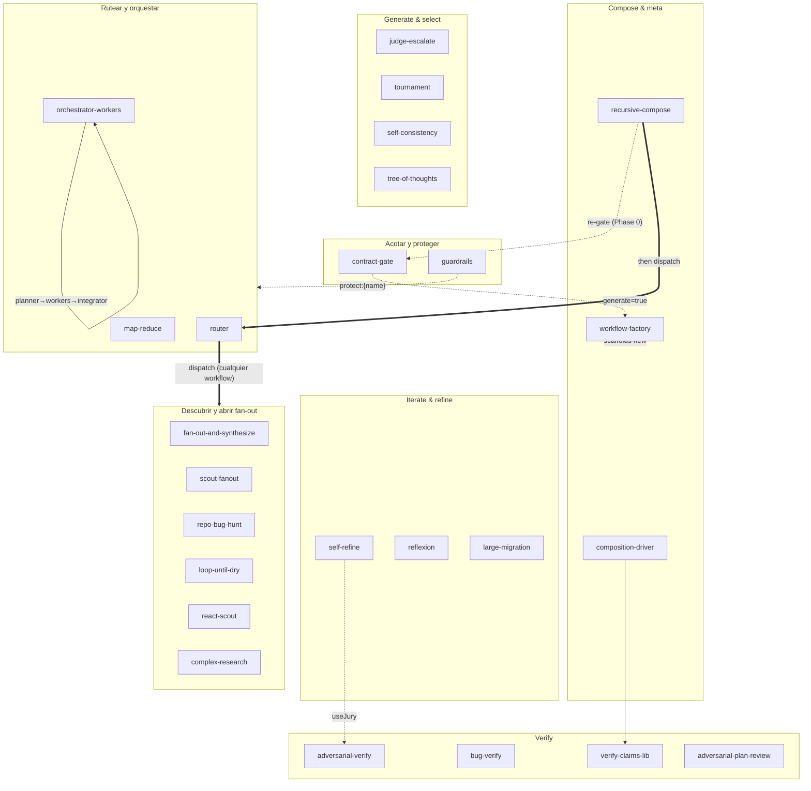
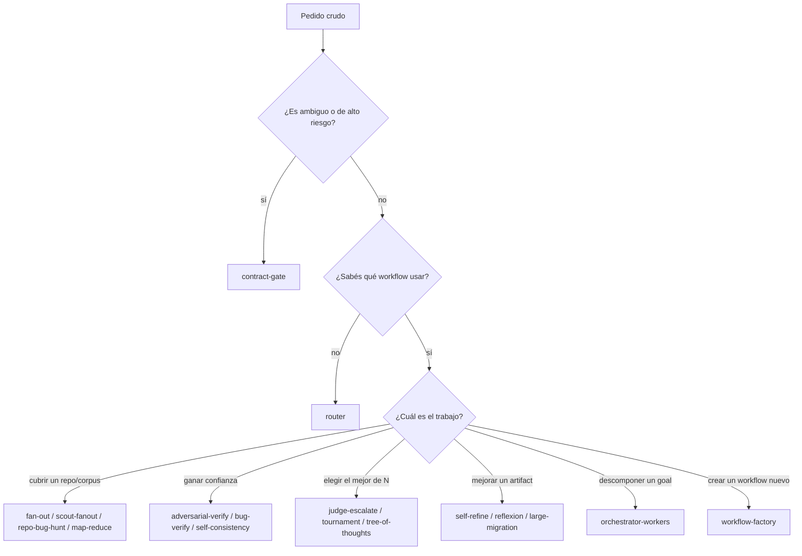
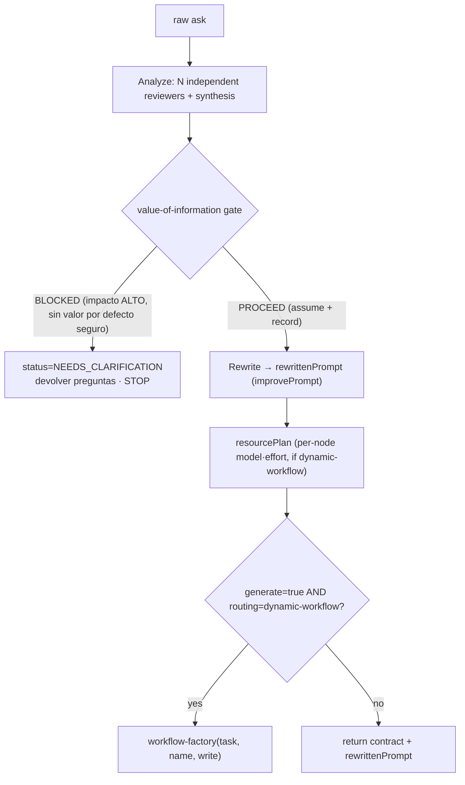
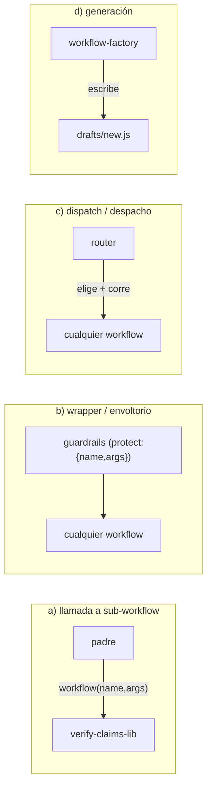
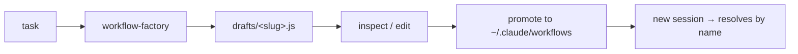

<!-- GENERATED by scripts/sync-scaffold-catalog.mjs from reference/catalog-prose.es.md — no editar a mano. -->

# `~/.claude/workflows` — el catálogo de workflows

**Qué es esto.** Cada archivo `*.js` de acá es un **script de orquestación** que ejecuta la **Workflow tool**. Un script es JavaScript plano que llama a algunos **helper-globals** inyectados (`agent`, `parallel`, `pipeline`, `workflow`, `phase`, `log`, más `args`) para abrir subagentes, iterar, verificar y componer; no hay `import`, `require` ni `ctx.*`. Le pasás un objeto JSON `args`; el script devuelve un valor. Este catálogo tiene **25** workflows.

> **Regla de oro: empezá simple.** Una sola llamada a `agent` le gana a un workflow en casi todo. Usá un workflow solo cuando necesites una de estas tres cosas: **exhaustividad** (cubrir un repo/corpus entero), **confianza** (verificar antes de confiar) o **escala** (más de una ventana de contexto). Como dice Anthropic: *"add complexity only when it delivers measurable value."*

```text
one agent  ──good enough?──>  ✅ done
     │ no (need coverage / confidence / scale)
     ▼
 a workflow
```

---

## 1. Inicio rápido

Podés invocar un workflow de dos maneras:

| Forma | Cuándo | Ejemplo |
|---|---|---|
| `name` | El workflow ya estaba presente al iniciar la sesión | `{ name: 'self-consistency', args: {...} }` |
| `scriptPath` (absoluto) | Archivo nuevo, archivo en `drafts/` o cualquier cosa en una subcarpeta | `{ scriptPath: '/Users/you/.claude/workflows/router.js', args: {...} }` |

> **La advertencia de 2 líneas.** El descubrimiento por nombre es un **snapshot del inicio de la sesión** y **NO** recorre subcarpetas. Un workflow creado en mitad de la sesión, o ubicado bajo `drafts/`, no va a resolver por `name`. Solución: llamalo por `scriptPath` absoluto, o hacé un symlink dentro de `~/.claude/workflows/` e iniciá una sesión nueva.

**Copy-paste mínimo:**

```js
Workflow({ name: 'complex-research', args: {
  question: '¿Cuáles son los tradeoffs entre WASM y NAPI para Node FFI en 2026?'
} });
```

---

## 2. Mapa del catálogo

Los 25 workflows agrupados por **familia**. Las flechas muestran **composición** (un workflow llama a otro vía `workflow()`).



**Cómo leerlo.** `contract-gate` puede derivar en `workflow-factory`; `router` despacha a *cualquier* workflow del catálogo; `guardrails` envuelve *cualquier* workflow; `composition-driver` llama a `verify-claims-lib`; `self-refine` puede usar `adversarial-verify` como crítico; `orchestrator-workers` internamente sigue planner→workers→integrator; `reflexion`/`react-scout`/`bug-verify` son workflows *grounded* (anclados en evidencia: ejecutan comandos u observaciones reales).

---

## 3. Cómo elegir un workflow

Empezá arriba y tomá la primera fila que aplique.

| Si querés… | Usá |
|---|---|
| **Acotar un pedido vago** antes de hacer nada (preguntar vs seguir) | `contract-gate` |
| **Que elija por mí** el workflow correcto y lo ejecute | `router` |
| **Cobertura amplia e independiente** de una work-list / repo | `fan-out-and-synthesize`, `scout-fanout`, `repo-bug-hunt` |
| **Encontrar bugs en un repo** (pistas, no confirmaciones) | `repo-bug-hunt`, `scout-fanout` |
| **Converger en una respuesta** a partir de muchos caminos de razonamiento | `self-consistency` |
| **Descubrir un conjunto de tamaño desconocido** (seguir hasta secarse) | `loop-until-dry` |
| **Anclar cada paso en observaciones reales** antes de abrir fan-out | `react-scout` |
| **Verificar claims / findings** (podar los falsos) | `adversarial-verify`, `verify-claims-lib` |
| **Confirmar bugs de código ejecutándolos** | `bug-verify` |
| **Best of N** candidatos | `judge-escalate`, `tournament` |
| **Iterar hasta llegar a calidad** sobre un artifact | `self-refine`, `reflexion` |
| **Explorar un espacio de soluciones** con pasos intermedios | `tree-of-thoughts` |
| **Descomponer un goal abierto** en un grafo de subtareas | `orchestrator-workers` |
| **Procesar un corpus enorme** que excede una ventana de contexto | `map-reduce` |
| **Imponer límites duros** alrededor de una corrida (tripwire) | `guardrails` |
| **Investigar una pregunta** con citas | `complex-research` |
| **Revisar un plan** antes de construir | `adversarial-plan-review` |
| **Aplicar una migración grande de código** con seguridad | `large-migration` |
| **Generar un workflow NUEVO** para una tarea | `workflow-factory` |
| **Componer un workflow padre + uno reutilizable** | `composition-driver` (+ `verify-claims-lib`) |



---

## 4. Fase 0 — `contract-gate`

> **Cuándo/por qué.** Corré esto **primero**, antes de rutear o construir, siempre que el pedido sea vago, de alto riesgo o pueda significar dos cosas distintas. Convierte “hacé X” en un **contrato** inspeccionable y decide la única pregunta humana que importa: **¿preguntar ahora o seguir con una suposición registrada?** Una spec limpia es la palanca más grande sobre la calidad aguas abajo.



**Parámetros** (`request` requerido; aliases `task`/`text`/`question`):

| Parámetro | Por defecto | Significado |
|---|---|---|
| `reviewers` | `3` (clamp 1..5) | Revisores independientes del contrato + síntesis; 1 = un único análisis barato |
| `improvePrompt` | `true` | Reescribe el contrato como un `rewrittenPrompt` limpio y autocontenido; `false` reenvía el pedido crudo + el contrato |
| `generate` | `false` | En PROCEED **y** con `routing=dynamic-workflow`, deriva a `workflow-factory` |
| `planResources` | `true` | Emite `resourcePlan` (sugerencia de model·effort por nodo para el workflow recomendado, escalada según el riesgo) |
| `maxQuestions` | `4` → clamped a **1..3** | Tope de preguntas bloqueantes |
| `context` | `""` | Contexto extra opcional que se adjunta al análisis + rewrite |
| `name`, `write` | — / `true` | Se pasan a `workflow-factory` en el handoff |

**Devuelve:** `{ status, verdict, contract, rewrittenPrompt, questions?, routing, resourcePlan?, generated? }`, donde `verdict ∈ {PROCEED, BLOCKED}` y `status` lo refleja (`PROCEED` / `NEEDS_CLARIFICATION`).

**Ejemplo A — pedido claro → PROCEED:**
```js
Workflow({ name: 'contract-gate', args: {
  request: 'Audit packages/coding-agent/src/core for null-deref bugs and produce a cited, prioritized list.'
} });
// → { status:'PROCEED', verdict:'PROCEED', contract:{...},
//     rewrittenPrompt:'<clean self-contained spec>', routing:{ shape:'dynamic-workflow', pattern:'repo-bug-hunt', ... },
//     resourcePlan:{ tier:'balanced', pattern:'repo-bug-hunt', models:{...}, efforts:{...} } }
```

**Ejemplo B — pedido ambiguo → NEEDS_CLARIFICATION:**
```js
Workflow({ name: 'contract-gate', args: { request: 'Make the streaming faster.' } });
// → { status:'NEEDS_CLARIFICATION', verdict:'BLOCKED',
//     questions:[ { question:'Which provider path (Anthropic / OpenAI / Ollama)?', rationale:'...' },
//                 { question:'Faster by what metric — TTFB, throughput, or total latency?', rationale:'...' },
//                 { question:'What is the acceptance bar / target?', rationale:'...' } ] }   // STOP — no rewrite, no handoff
```

**Cómo pasar `rewrittenPrompt` aguas abajo** — es el artifact durable del handoff:
```js
const gate = Workflow({ name: 'contract-gate', args: { request: rawAsk } });
if (gate.status === 'PROCEED') {
  Workflow({ name: 'router',           args: { request: gate.rewrittenPrompt } });        // dejar que router elija + corra
  // or: Workflow({ name: 'workflow-factory', args: { task: gate.rewrittenPrompt } });    // generar un workflow nuevo
  // o pasar rewrittenPrompt a cualquier workflow específico que ya hayas elegido
}
```

---

## 5. Cómo componer

Hay exactamente **cuatro costuras de composición**. Todo lo demás es solo una llamada a `agent()`.



| Costura | Cómo | Ejemplo canónico |
|---|---|---|
| **a) sub-workflow** | `workflow(name, args)` dentro de un padre | `composition-driver` → `verify-claims-lib` |
| **b) wrapper** | `guardrails` con `protect:{ name, args }` | tripwire IN/OUT alrededor de cualquier corrida |
| **c) dispatch** | `router` lee el catálogo, elige uno y lo ejecuta | dale una tarea cruda |
| **d) generation** | `workflow-factory` planifica→genera→escribe un archivo nuevo | scaffold de un workflow específico para la tarea |

**Ejemplo completo** (acotar → rutear → proteger la corrida elegida):
```js
// 1) ACOTAR el pedido.
const gate = Workflow({ name: 'contract-gate', args: { request: rawAsk } });
if (gate.status !== 'PROCEED') return gate.questions;     // preguntarle al humano y frenar

// 2) RUTEAR: solo recomendación, para poder envolver la elección en vez de correrla en crudo.
const pick = Workflow({ name: 'router', args: {
  request: gate.rewrittenPrompt, runSelected: false       // → { selected, suggestedArgs, ... }
} });

// 3) PROTEGER: ejecutar el workflow elegido detrás de tripwires de input/output.
Workflow({ name: 'guardrails', args: {
  inputRules:  ['must stay within packages/coding-agent', 'read-only — no file writes'],
  outputRules: ['every finding cites a file:line'],
  protect: { name: pick.selected, args: pick.suggestedArgs }
} });
```

### Recursión y profundidad (el anidamiento es acotado)

La composición puede **recursar**: un workflow compuesto puede a su vez componer otro, e incluso un nodo puede llamar a la **Fase 0** (`workflow('contract-gate', …)`) para volver a acotar una subtarea antes de profundizar. Pero el runtime **limita la profundidad**:

| Runtime | Profundidad máxima | Notas |
|---|---|---|
| **Claude Code Workflow tool** | **depth-1** | el `workflow()` de un hijo lanza error: solo el **nivel superior** compone. Llamar a Phase-0 desde dentro de un nodo sería depth-2 → acá no está permitido. |
| **pi** | **depth 2 (por defecto), configurable** | podés subirlo con `PI_DYNAMIC_WORKFLOWS_MAX_DEPTH` (por ejemplo `3`) → más libertad; Phase-0-from-inside funciona. |

Más allá del límite, el runtime rechaza la ejecución con un **recursion guard**. Diseñá dentro de ese presupuesto de profundidad; para ir más hondo, dejá que el orquestador ejecute los sub-workflows.

> **Referencia trabajada — `recursive-compose.js`.** Encadena exactamente esto: `contract-gate` (re-acotar, depth 1) → dispatch de `router` (depth 2) → la sub-llamada propia del scaffold elegido (depth 3). Es **solo para pi** y queda topeado en depth 3, así que `PI_DYNAMIC_WORKFLOWS_MAX_DEPTH>=3` lo cubre; en el runtime depth-1 de Claude Code devuelve `DEPTH_BLOCKED` en vez de romper. También propaga el `resourcePlan` del gate (model/effort por nodo) hacia la corrida despachada.

---

## 6. Los 25 workflows por familia

Cada entrada incluye: **propósito** · **usar cuando** · **parámetros clave (valores por defecto)** · **ejemplo** · **casos de uso**.

### Acotar y proteger

**`contract-gate`** — gate de contrato de Fase 0 (detalle completo en §4).
- *Usar cuando:* el pedido es vago o de alto riesgo y querés decidir primero preguntar-vs-seguir.
- *Parámetros:* `request` (req) · `reviewers=3` · `improvePrompt=true` · `generate=false` · `maxQuestions=4→1..3`.
- *Casos de uso:* acotar un ticket borroso; poner un gate antes de una corrida multiagente costosa.

**`guardrails`** — tripwire barato de input/output que **se detiene** ante una violación clara.
- *Usar cuando:* necesitás imponer límites duros con bajo costo alrededor de una corrida, o validar un artifact.
- *Parámetros:* `inputRules[]` / `outputRules[]` (o `rules[]`) · `content` (modo validator) · `protect:{name,args}` (modo wrapper) · `strict=false` (fail-closed: si el guard crashea, cuenta como disparado).
- *Ejemplo:*
  ```js
  Workflow({ name:'guardrails', args:{ outputRules:['no secrets in output'], content: draft } });
  ```
- *Casos de uso:* gate de alcance/seguridad antes de correr un agente; chequeo de PII/secrets sobre una salida.

### Rutear y orquestar

**`router`** — clasifica un pedido y hace **dispatch** al mejor workflow único del catálogo.
- *Usar cuando:* no querés nombrar vos el workflow.
- *Parámetros:* `request` (req; aliases `task`/`text`) · `candidates?[]` · `runSelected=true` · `args?` · `context?` · `maxCandidates=60` (clamp 1..200).
- *Ejemplo:*
  ```js
  Workflow({ name:'router', args:{ request:'Auditá ./src/auth en busca de IDOR y controles faltantes; entregá un informe con citas.' } });
  // → { selected:'repo-bug-hunt', why, dispatched:true, output:<that workflow's result>, candidates:[...] }
  ```
- *Casos de uso:* una única puerta de entrada para tareas crudas; modo recomendación (`runSelected:false`) para previsualizar la elección.

**`orchestrator-workers`** — un **planner** descompone un goal abierto en un grafo de subtareas `dependsOn`, los **workers** lo ejecutan nivel por nivel (topológico, con fallas parciales visibles) y un **integrator** fusiona resultados.
- *Usar cuando:* el goal es abierto y sus subtareas o su forma no se conocen de antemano.
- *Parámetros:* `goal` (req; aliases `task`/`text`) · `context?` · `maxSubtasks=8` (clamp 1..30) · `concurrency?`.
- *Ejemplo:*
  ```js
  Workflow({ name:'orchestrator-workers', args:{
    goal:'Prepará un brief de launch readiness: evaluá la paridad de SSE, enumerá triggers de rollback, redactá la secuencia de rollout y escribí el resumen ejecutivo.',
    maxSubtasks:6, concurrency:3, efforts:{ planner:'xhigh', integrator:'high' } } });
  // → { result, plan:{ subtasks:[{id,description,dependsOn}], schedule, ... }, workers:[{id,status,output}] }
  ```
- *Casos de uso:* entregables multiparte; goals de investigación/construcción con interdependencias.

**`map-reduce`** — map-reduce jerárquico (recursivo): **map** por chunk bajo un contrato de evidencia → **reduce** en lotes acotados hasta que queda un único summary-of-summaries.
- *Usar cuando:* el input es más grande que una ventana de contexto.
- *Parámetros:* `instruction` (req) · `items?[]` **o** `content?` (uno requerido; `items` gana) · `chunkChars=8000` (500..200000) · `reduceBatch=5` (2..20) · `maxChunks=400` (1..2000) · `maxRounds` adaptativo.
- *Ejemplo:*
  ```js
  Workflow({ name:'map-reduce', args:{
    instruction:'Extract every breaking API change with affected symbol + one-line migration note; cite the span.',
    content: veryLongChangelog, chunkChars:6000, reduceBatch:4 } });
  // → { result, chunks, mapCount, reduceRounds }
  ```
- *Casos de uso:* resumir un doc/log enorme; consolidar cientos de tickets.

### Descubrir y abrir fan-out

**`fan-out-and-synthesize`** — patrón base scatter-gather: scout de una work-list → un reviewer por ítem (paralelo, settle) → síntesis-como-juez con notas de cobertura/fallas.
- *Usar cuando:* necesitás cobertura amplia e independiente de una work-list más o menos conocida.
- *Parámetros:* `limit=12` · `pattern='code'` (preset `code|docs|web|config` o regex cruda) · `lens='code'` (preset `code|security|prose` o texto libre) · `files?[]`.
- *Ejemplo:* `Workflow({ name:'fan-out-and-synthesize', args:{ lens:'security', limit:20 } });`
- *Casos de uso:* repartir review entre muchos archivos; síntesis multiángulo.

**`scout-fanout`** — scout → pipeline de **profundidad adaptativa**: clasifica barato el riesgo de *cada* archivo y hace deep-review solo sobre los de riesgo alto/medio; los de riesgo bajo cortan temprano.
- *Usar cuando:* querés cobertura, pero solo querés pagar por los ítems riesgosos.
- *Parámetros:* `pattern='code'` · `lens='code'` · `maxFiles=40` (clamp 1..200) · `files?[]`.
- *Ejemplo:* `Workflow({ name:'scout-fanout', args:{ pattern:'config', lens:'security' } });`
- *Casos de uso:* triage-y-review sobre un árbol grande; pasadas de clasificar-y-actuar.

**`repo-bug-hunt`** — scout de archivos de código → reviewers de bugs por archivo → juez que deduplica y prioriza con citas. **Los findings son pistas, no bugs confirmados.**
- *Usar cuando:* querés una lista priorizada y citada de bugs sospechados en un repo.
- *Parámetros:* `files?[]` · `maxFiles=40` · `concurrency=6` · `pattern='code'` · `lens='code'`.
- *Ejemplo:* `Workflow({ name:'repo-bug-hunt', args:{ maxFiles:30, lens:'security' } });`
- *Casos de uso:* auditoría de repo; pasada previa a review (después confirmar con `bug-verify`).

**`loop-until-dry`** — sigue abriendo fan-out de finders hasta **K rondas consecutivas en silencio** o `maxRounds`.
- *Usar cuando:* el conjunto que estás descubriendo tiene tamaño desconocido y querés exhaustividad.
- *Parámetros:* `target`/`scope`/`task` (req) · `quietRounds=2` · `maxRounds=8` · `finders=3` (clamp 1..6).
- *Ejemplo:* `Workflow({ name:'loop-until-dry', args:{ target:'all places we parse SSE chunks', quietRounds:2 } });`
- *Casos de uso:* enumerar todos los call-sites/casos borde; “encontrá todo lo que…”.

**`react-scout`** — loop ReAct reason→act→observe: cada paso ancla un pensamiento en una **observación real de solo lectura** antes del siguiente.
- *Usar cuando:* necesitás un scout basado en evidencia antes de comprometerte o abrir fan-out.
- *Parámetros:* `question` (req; aliases `q`/`text`/`topic`) · `maxSteps=6` (clamp 1..50) · `tools=['read','grep','find','ls','web_search']`.
- *Ejemplo:* `Workflow({ name:'react-scout', args:{ question:'Where does the WASM decoder get fed bytes?' } });`
- *Casos de uso:* investigación anclada en evidencia; producir `result.trace` para dárselo a un fan-out.

**`complex-research`** — ángulos de investigación independientes (cada uno corre web search) → síntesis-como-juez con citas y huecos de cobertura.
- *Usar cuando:* necesitás una respuesta citada a una pregunta externa.
- *Parámetros:* `question` (req; aliases `q`/`text`) · `angles?[]` (por defecto 4: fuentes primarias / opciones y tradeoffs / riesgos y migración / mejor recomendación).
- *Ejemplo:* `Workflow({ name:'complex-research', args:{ question:'WASM vs NAPI FFI for Node in 2026?' } });`
- *Casos de uso:* comparaciones tecnológicas; barridos de literatura/panorama. *Conviene emparejarlo con un paso de verify si la respuesta tiene consecuencias.*

### Verify

**`adversarial-verify`** — **jury escéptico** por finding que poda por refutación mayoritaria; duda por defecto.
- *Usar cuando:* ya tenés findings/claims y querés quedarte solo con los que sobreviven la refutación.
- *Parámetros:* `findings?[]` (si no, se descubren desde `topic`) · `skeptics=3` (clamp 1..99) · `maxFindings=8`.
- *Ejemplo:* `Workflow({ name:'adversarial-verify', args:{ topic:'security claims about our token flow', skeptics:5 } });`
- *Casos de uso:* podar una lista ruidosa de findings; sanity-check de claims antes de actuar.

**`bug-verify`** — confirma bugs sospechados por **REPRODUCTION**: un bug es real solo si una corrida falla de verdad sobre el código actual; opcionalmente chequea FAIL→PASS tras un fix y hace minimización.
- *Usar cuando:* necesitás *probar* un bug, no solo argumentarlo. Corre **en secuencia** sobre el working tree.
- *Parámetros:* `bugs?[]` **o** `topic` · `verifyCmd` (por ejemplo, `"npm test"`) · `attemptFix=false` · `minimize=false` · `maxBugs=12`.
- *Ejemplo:* `Workflow({ name:'bug-verify', args:{ topic:'SSE decoder drops final chunk', verifyCmd:'npm test', attemptFix:true } });`
- *Casos de uso:* confirmar pistas de `repo-bug-hunt`; loop de reproducir-y-arreglar.

**`verify-claims-lib`** — **sub-workflow** reutilizable: verifica `{claims, skeptics?}` con juries escépticos.
- *Usar cuando:* un workflow padre necesita verificación como bloque de construcción.
- *Parámetros:* `claims[]` (req) · `skeptics=3` (clamp 1..64) · `topic?`.
- *Devuelve:* `{ verified, dropped, votes, coverage }`.
- *Casos de uso:* lo llama `composition-driver`; útil para cualquier padre que primero descubre y después verifica.

**`adversarial-plan-review`** — N reviewers de ángulos fijos (correctness, security, maintainability, scope) → sintetizan un plan revisado.
- *Usar cuando:* querés stress-testear un plan antes de construir.
- *Parámetros:* `plan`/`text` (req). El fan-out queda topeado en 4 reviewers; si todos fallan → `INSUFFICIENT_EVIDENCE`.
- *Ejemplo:* `Workflow({ name:'adversarial-plan-review', args:{ plan: theImplementationPlan } });`
- *Casos de uso:* review de diseño/RFC; gate previo a implementación.

### Generate & select

**`judge-escalate`** — genera candidatos desde ángulos distintos → juez tipado → **escala solo cuando la confianza es baja**.
- *Usar cuando:* querés best-of-N y preferís profundizar antes que comprometerte con un ganador débil.
- *Parámetros:* `question` (req; aliases `q`/`text`) · `angles=['risk-first','simplicity-first','user-first']` (máx. 8) · `maxEscalations=2`.
- *Ejemplo:* `Workflow({ name:'judge-escalate', args:{ question:'Best rollback strategy for the gate?' } });`
- *Casos de uso:* decisiones con ganador claro la mayoría de las veces; gasto adaptativo.

**`tournament`** — bracket de eliminación simple: rondas de juez por pares hasta que sobrevive uno (`ceil(log2 n)` rondas; si el campo es impar, alguien pasa con bye).
- *Usar cuando:* el scoring absoluto no es confiable, pero la comparación de a pares sí.
- *Parámetros:* `candidates?[]` (si no, se generan desde `angles`) · `topic?` · `angles=['risk-first','simplicity-first','user-first','cost-first']`.
- *Ejemplo:* `Workflow({ name:'tournament', args:{ candidates:[a,b,c,d] } });`
- *Casos de uso:* elegir el mejor entre varios drafts/diseños mediante enfrentamientos head-to-head.

**`self-consistency`** — muestrea N caminos de razonamiento independientes → elige la respuesta por **consensus** (voto), y desempata con un juez que pondera evidencia.
- *Usar cuando:* una sola cadena podría estar mal y la señal que más confiás es el acuerdo.
- *Parámetros:* `question` (req; aliases `q`/`text`) · `samples=5` (clamp 2..20). Los samplers corren con `cache:false` para que la independencia sea real.
- *Ejemplo:* `Workflow({ name:'self-consistency', args:{ question:'Does this code path leak the handle?', samples:7 } });`
- *Casos de uso:* razonamiento/matemática/juicio de alta varianza; conviene reportar el margen de consenso.

**`tree-of-thoughts`** — beam-search sobre soluciones parciales: expandir K thoughts → juez puntúa → poda al top-B → recursa hasta la profundidad → commit.
- *Usar cuando:* el problema tiene **pasos intermedios** que vale la pena explorar, no solo candidatos finales.
- *Parámetros:* `problem` (req; aliases `question`/`text`/`task`) · `branching=3` (clamp 2..8) · `beam=2` (clamp 1..16) · `depth=3`.
- *Ejemplo:* `Workflow({ name:'tree-of-thoughts', args:{ problem:'Design the gate rollout in 4 staged steps.' } });`
- *Casos de uso:* búsqueda de diseño/planificación multi-step; `judge-escalate` equivale a esto con depth=1 y beam=1.

### Iterate & refine

**`self-refine`** — loop acotado generate→critique→refine in-place con memoria verbal; corta en silencio cuando el crítico queda satisfecho.
- *Usar cuando:* querés pulir **un** artifact y la crítica puede ser intrínseca.
- *Parámetros:* `task` (req; aliases `question`/`text`) · `maxRounds=4` · `useJury=false` (reemplaza el crítico por el jury de `adversarial-verify`, una señal independiente más fuerte) · `skeptics=3` (tamaño del jury cuando `useJury`).
- *Ejemplo:* `Workflow({ name:'self-refine', args:{ task:'Write the migration guide section.', useJury:true } });`
- *Casos de uso:* pulido de docs/specs/código donde el retorno cae rápido.

**`reflexion`** — loop externo de verbal-RL **por intento**: vuelve a intentar la tarea completa en cada trial y arrastra un buffer acotado de self-reflections; el evaluator puede estar **anclado externamente** (ejecuta `verifyCmd`).
- *Usar cuando:* conviene más volver a intentar desde cero que editar in-place, y además tenés un oráculo objetivo.
- *Parámetros:* `task` (req; aliases `question`/`text`) · `verifyCmd?` (ancla el evaluator) · `maxTrials=3` · `memoryCap=3` · `actorModel?` / `evaluatorModel?`.
- *Ejemplo:* `Workflow({ name:'reflexion', args:{ task:'Make the failing decoder test pass.', verifyCmd:'npm test -- decoder' } });`
- *Casos de uso:* código-con-tests; tareas con señal pass/fail. (Distinto de `self-refine`: reset y reintento vs edición in-place.)

**`large-migration`** — un **applier** real: gate de baseline verde → por archivo hace apply→verify→repair acotado → **rollback on failure**. Recorre el working tree en secuencia.
- *Usar cuando:* vas a mutar muchos archivos y no podés dejar ninguno roto.
- *Parámetros:* `instruction` (req; aliases `task`/`text`) · `files?[]` **o** `pattern` (por defecto: extensiones de código) · `verifyCmd` · `maxRepairs=2` · `maxFiles=50` · `triage=true` · `dryRun=false`.
- *Ejemplo:* `Workflow({ name:'large-migration', args:{ instruction:'Replace X(...) with Y(...)', verifyCmd:'npm run build && npm test', dryRun:true } });`
- *Casos de uso:* rollouts de API/codemod; upgrades de framework.

### Compose & meta

**`composition-driver`** — workflow padre: descubre claims → delega la verificación a `verify-claims-lib` → sintetiza.
- *Usar cuando:* querés un ejemplo trabajado de workflow padre + sub-workflow reutilizable, o exactamente ese flujo descubrir→verificar.
- *Parámetros:* `topic` (req; aliases `question`/`text`) · `maxClaims=8` (clamp 1..20) · `skeptics=3`.
- *Ejemplo:* `Workflow({ name:'composition-driver', args:{ topic:'claims in our SSE parity doc' } });`
- *Casos de uso:* fact-check de un documento; referencia canónica de composición.

**`workflow-factory`** — meta: catálogo → plan → generate → review → refine → **write** `.claude/workflows/drafts/<slug>.js`.
- *Usar cuando:* ningún workflow existente encaja y querés scaffoldear uno específico para la tarea.
- *Parámetros:* `task` (req; aliases `request`/`text`) · `name?` (slug) · `write=true` (`false` devuelve solo el JS).
- *Ejemplo:* `Workflow({ name:'workflow-factory', args:{ task:'Audit GraphQL resolvers for N+1 queries and emit a cited report.' } });`
- *Casos de uso:* bootstrap de un patrón nuevo; especializar el scaffold existente más cercano. **La salida es un draft: inspeccionala antes de confiarle trabajo costoso o mutante.**

**`recursive-compose`** — REFERENCIA (pi, depth≤3): un nodo re-acota una subtarea vía la Fase 0 `contract-gate` y luego despacha el scaffold recomendado vía `router`: composición recursiva acotada.
- *Usar cuando:* querés el patrón trabajado de **Phase-0-from-inside** + dispatch recursivo.
- *Parámetros:* `task` (req; aliases `request`/`text`) · `context?` · `args?` (se reenvían al workflow elegido).
- *Ejemplo:* `Workflow({ name:'recursive-compose', args:{ task:'audit + fix the SSE decoder' } });` *(pi; en el runtime depth-1 de Claude Code el dispatch anidado devuelve `DEPTH_BLOCKED`)*
- *Casos de uso:* pipelines auto-semejantes de gate→compose; llevar el presupuesto `resourcePlan` del gate a una corrida más profunda.

---

## 7. Model, effort, tools y skills por nodo

> **Cuándo/por qué.** Cada workflow enruta cada llamada a `agent` (“nodo”) a través de un helper `node(role, extra)`, así que podés definir **model**, **reasoning effort**, **tools** y **skills** por nodo desde el input, sin tocar el código. Gastá presupuesto donde paga (judges/verifiers/synthesis), mantené baratos los scouts y dale a cada nodo solo las tools/skills que necesita.

- `model` / `effort`: **valores por defecto globales** aplicados a todos los nodos (por ejemplo `{ "effort": "low" }`).
- `models` / `efforts`: **overrides por rol** indexados por el nombre del rol (por ejemplo `{ "models": { "synthesis": "opus" } }`).
- `tools` / `skills`: allowlists **globales**, y `excludeTools` una denylist **global** (arrays) aplicadas a todos los nodos.
- `toolsByRole` / `skillsByRole` / `excludeByRole`: **overrides por rol** (mapas `role → array`).
- **Precedencia (todos los knobs):** override por rol > valor por defecto global > valor por defecto del call-site horneado en el archivo.
- `effort ∈ low | medium | high | xhigh | max`; `model ∈ haiku | sonnet | opus | fable` o un id completo de modelo.

```json
{ "models": { "scout": "haiku", "synthesis": "opus" }, "efforts": { "scout": "low", "synthesis": "high" },
  "tools": ["read", "grep", "find", "ls"], "toolsByRole": { "migrate": ["read", "edit", "bash"] },
  "skillsByRole": { "synthesis": ["/path/to/skill"] } }
```

El helper es byte-idéntico en todos los archivos:
```js
const node = (role, extra = {}) => {
  const o = { label: role, ...extra };
  const m = models[role] ?? input?.model;        if (m != null) o.model = m;
  const e = efforts[role] ?? input?.effort;      if (e != null) o.effort = e;
  const t = toolsByRole[role] ?? input?.tools;          if (Array.isArray(t)) o.tools = t;
  const s = skillsByRole[role] ?? input?.skills;        if (Array.isArray(s)) o.skills = s;
  const x = excludeByRole[role] ?? input?.excludeTools; if (Array.isArray(x)) o.excludeTools = x;
  return o;
};
```

> **Nota de runtime para `tools`/`skills`/`excludeTools`.** El scoping de tools/skills por agente **se hace cumplir en el runtime de pi** (donde es una opción documentada del agente); ahí sí aísla cada nodo de verdad. En el **runtime Workflow de Claude Code es advisory / no enforced** (verificado: un subagente scopeado igual conservó acceso completo a archivos), aunque `model`/`effort` **sí** se respetan. Así que tratá tools/skills como intención + enforcement en pi, no como frontera de seguridad en Claude Code.

### Claves de rol por workflow — `role → valor sugerido (model · effort)`

| Workflow | Roles → valor sugerido |
|---|---|
| `adversarial-plan-review` | `reviewer` (sonnet·medium), `plan-synthesis` (opus·high) |
| `adversarial-verify` | `finder` (haiku·low), `skeptic` (opus·high) |
| `bug-verify` | `finder` (haiku·low), `tree-baseline` (haiku·low), `repro` (sonnet·medium), `tree-check` (haiku·low) |
| `complex-research` | `research` (haiku·low), `research-synthesis` (opus·high) |
| `composition-driver` | `claim-finder` (haiku·low), `composition-synthesis` (opus·high) |
| `contract-gate` | `analyze` (sonnet·medium), `analyze-contract` (sonnet·medium), `analyze-synthesis` (opus·high), `rewrite-prompt` (sonnet·medium), `resource-plan` (sonnet·medium) |
| `fan-out-and-synthesize` | `scout` (haiku·low), `review` (sonnet·medium), `synthesis` (opus·high) |
| `guardrails` | `input-guard` (haiku·low), `output-guard` (haiku·low) |
| `judge-escalate` | `cand` (sonnet·medium), `judge` (opus·high), `synthesis` (opus·high) |
| `large-migration` | `scout` (haiku·low), `baseline` (haiku·low), `recheck` (haiku·low), `migrate` (sonnet·medium), `final-verify` (haiku·low) |
| `loop-until-dry` | `finder` (haiku·low), `synthesis` (opus·high) |
| `map-reduce` | `mapper` (haiku·low), `reducer` (sonnet·medium) |
| `orchestrator-workers` | `planner` (opus·high), `worker` (sonnet·medium), `integrator` (opus·high) |
| `react-scout` | `reason` (sonnet·medium), `observe` (haiku·low), `answer` (opus·high) |
| `recursive-compose` | *(sin claves de rol propias: composición recursiva acotada; delega a `contract-gate`/`router`, cuyas filas aplican)* |
| `reflexion` | `actor` (sonnet·medium), `evaluator` (opus·high), `reflection` (opus·high) — además `actorModel`/`evaluatorModel` |
| `repo-bug-hunt` | `scout` (haiku·low), `bug-hunt` (sonnet·medium), `synthesis` (opus·high) |
| `router` | `catalog-scan` (haiku·low), `route` (opus·high) |
| `scout-fanout` | `scout` (haiku·low), `classify` (haiku·low), `deep` (sonnet·medium), `synthesis` (opus·high) |
| `self-consistency` | `sample` (haiku·low), `tiebreak` (opus·high) |
| `self-refine` | `draft` (sonnet·medium), `critique` (opus·high), `refine` (sonnet·medium) |
| `tournament` | `seed` (sonnet·medium), `match` (opus·high) |
| `tree-of-thoughts` | `expand` (sonnet·medium), `score` (opus·high), `commit` (opus·high) |
| `verify-claims-lib` | `skeptic` (opus·high) |
| `workflow-factory` | `catalog-scan` (haiku·low), `workflow-plan` (opus·high), `workflow-codegen` (sonnet·medium), `workflow-review` (sonnet·medium), `workflow-refine` (sonnet·medium), `write-file` (haiku·low) |

> `contract-gate` también puede **sugerir** esta tabla completa para el workflow recomendado vía `resourcePlan` (`{ tier, models, efforts }`): podés splattearla en la corrida aguas abajo o sobreescribirla.

### Modelos y effort cross-provider (Codex / OpenAI)

Los valores de arriba corresponden al **runtime Workflow de Claude Code**, donde `model` es solo Claude (`haiku | sonnet | opus | fable`). El **runtime de pi** resuelve `provider/id[:thinking]`, así que esos mismos knobs también pueden apuntar a **OpenAI Codex**:

```json
{ "models": { "synthesis": "openai-codex/gpt-5.6-sol", "judge": "openai-codex/gpt-5.6-sol" },
  "efforts": { "synthesis": "xhigh", "judge": "high" } }
```

| Modelo Codex (mediados de 2026) | Notas |
|---|---|
| `gpt-5.6-sol` | modelo de frontera para síntesis, juicio y coding agéntico complejo |
| `gpt-5.6-terra` | tier equilibrado para workers de razonamiento normal |
| `gpt-5.6-luna` | tier económico para scouting, extracción y alto volumen |
| `gpt-5.3-codex-spark` | opción especializada disponible en el selector de Codex |

**Esfuerzo de razonamiento** (Codex `low · medium · high · xhigh`) se alinea 1:1 con nuestro `effort`. *medium* es el caballo de batalla diario; *xhigh* piensa más tiempo.

> **Advertencia de runtime:** los nombres de modelo de Claude (`haiku`/`sonnet`/`opus`/`fable`) aplican bajo el runtime de Claude Code; los nombres `provider/id` como los ids de Codex aplican solo cuando corre bajo **pi**.

---

## 8. Convenciones de runtime y authoring

> **Cuándo/por qué.** Leé esto antes de editar o escribir un workflow: el runtime inyecta helpers y hace cumplir unas pocas reglas duras.

**Checklist de convenciones:**
- ✅ Solo helper-globals: `agent`, `parallel`, `pipeline`, `workflow`, `phase`, `log`, `args`. **No** `import` / `require` / `ctx.*` / globals de Node.
- ✅ `agent(promptString, opts)`: **primero string**, después opciones (`{ label, phase, effort, schema, cache, model, tools, skills, excludeTools }`). Nunca `agent({ prompt })`.
- ✅ Con `{ schema }` devuelve el **objeto parseado**; sin eso devuelve el **string de texto**.
- ✅ `args` llega **JSON-stringified**: parsealo de forma defensiva con `typeof args === "string" ? JSON.parse(args) : (args || {})`.
- ✅ El tipo de nivel superior de `agent({ schema })` **DEBE ser `object`**: envolvé los arrays dentro de un objeto.
- ✅ Enrutá cada llamada a `agent` a través de `node(role, extra)`; mantené estables los nombres de rol (son las keys de `models`/`efforts`).
- ✅ `parallel([thunks])` es una barrera; usá semántica de **settle** para que una rama que crashea resuelva a `null` en vez de hundir toda la ronda.
- ✅ Todo loop es **acotado por los dos lados** (tope duro + condición de parada por silencio/satisfacción). **No** pongas topes silenciosos: hacé `log()` cada vez que hagas clamp o drop.
- ✅ `meta.name` debe ser igual al nombre del archivo; mantené `meta` como un literal puro.
- ✅ **Basalo en el scaffold existente más cercano y declaralo en la procedencia**: `meta.basedOn` es un array literal de `{ name, role }`, uno por cada scaffold reutilizado/especializado/compuesto (por ejemplo `meta.basedOn = [{ name: 'fan-out-and-synthesize', role: 'scatter-gather base' }]`). Esto llena la pestaña **Based-on** del artifact (lee `meta.basedOn` como string o como array `[{name, role?, desc?}]`; si no, busca un comentario inicial `Paper:/Based on:/Source:`); usá `[]` solo si de verdad se construyó desde cero.

**Cómo crear uno nuevo.** **Basalo en el scaffold existente más cercano; no reinventes, y registralo en `meta.basedOn`.** No lo hagas a mano: corré **`workflow-factory`** con un `task`. Lee el catálogo, prioriza reutilizar/especializar el scaffold más cercano, compone subpasos reutilizables vía `workflow()` y escribe un draft en `.claude/workflows/drafts/<slug>.js`. Inspeccioná/editá el draft y después creá un symlink o renombralo dentro de `~/.claude/workflows/`; por último, iniciá una sesión nueva para que resuelva por `name`.


