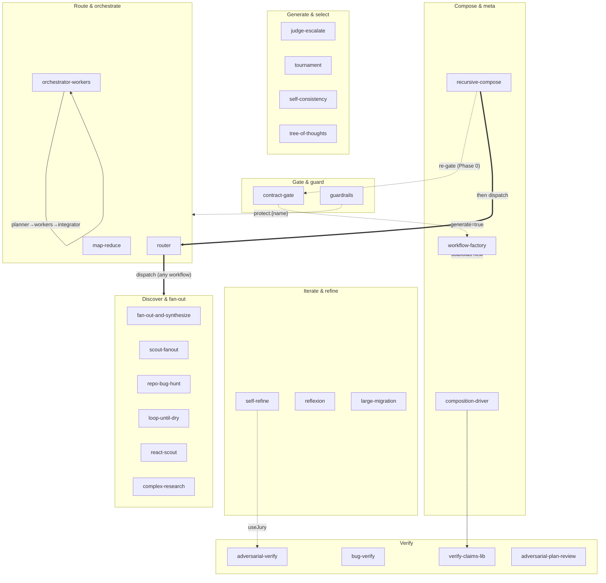
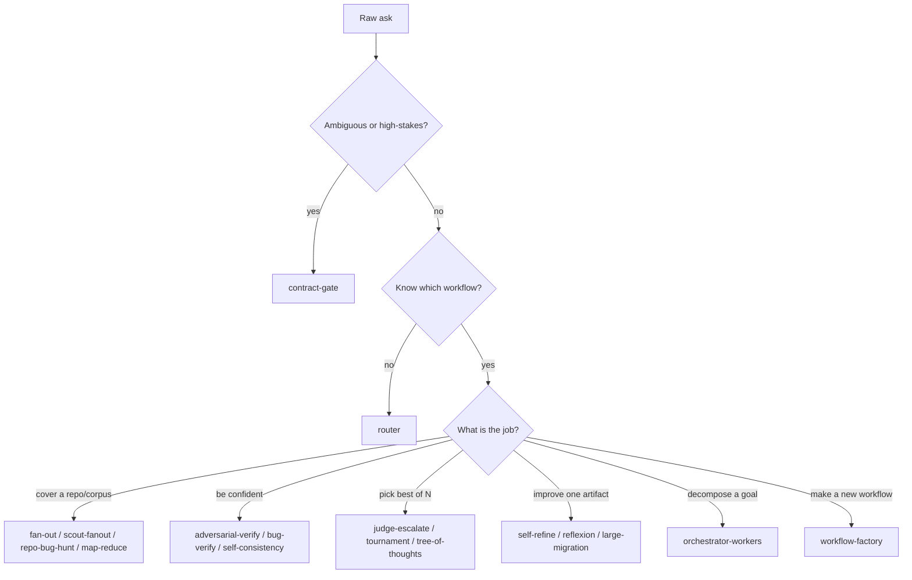
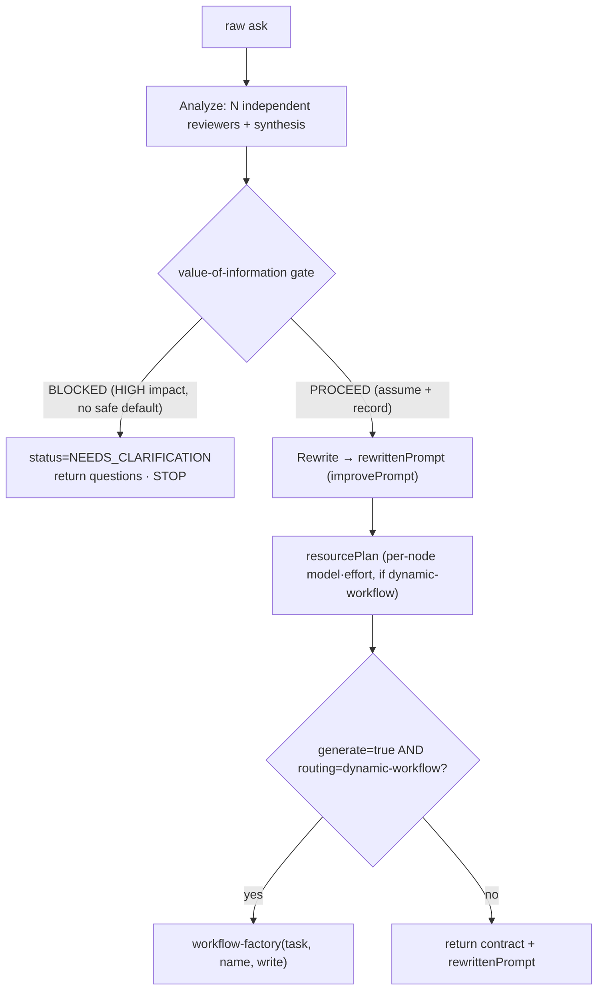
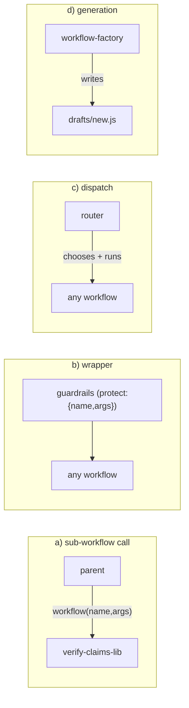
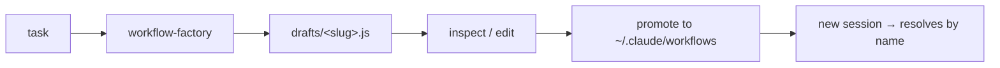

# `~/.claude/workflows` — the workflow catalog

> **Provenance.** The `*.js` files here are **generated artifacts** — do NOT
> hand-edit them. `.claude/scripts/generate-claude-workflows.mjs` produces them
> from the canonical pi scaffolds (`extensions/pandi-dynamic-workflows/scaffolds/`),
> byte-identical to the repo's `.claude/workflows/` catalog, and the
> `claude-parity` test gates both destinations against drift. The copy lives
> inside the skill so it stays self-contained when the skill is installed
> standalone. pi does **not** load these: pi's own scaffolds are read from disk
> on demand (served by `dynamic_workflow action=scaffold`). These use Claude
> paths and the top-level-`return` form.

**What these are.** Each `*.js` file here is an **orchestration script** run by the **Workflow tool**. A script is plain JavaScript that calls a few injected **helper-globals** (`agent`, `parallel`, `pipeline`, `workflow`, `phase`, `log`, plus `args`) to fan out subagents, loop, verify, and compose — there is no `import`, no `require`, no `ctx.*`. You pass a JSON `args` object; the script returns a value. This catalog has **25** workflows.

> **Golden rule — start simple.** A single agent call beats a workflow for almost everything. Reach for a workflow only when you need one of three things: **exhaustiveness** (cover a whole repo/corpus), **confidence** (verify before you trust), or **scale** (more than one context window). As Anthropic puts it: *"add complexity only when it delivers measurable value."*

```
one agent  ──good enough?──>  ✅ done
     │ no (need coverage / confidence / scale)
     ▼
 a workflow
```

---

## 1. Quickstart

You invoke a workflow two ways:

| Way | When | Example |
|---|---|---|
| `name` | The workflow was present at session start | `{ name: 'self-consistency', args: {...} }` |
| `scriptPath` (absolute) | New file, a `drafts/` file, or anything in a subfolder | `{ scriptPath: '/Users/you/.claude/workflows/router.js', args: {...} }` |

> **The 2-line caveat.** Name discovery is a **session-start snapshot** and is **NOT recursive** into subfolders. A workflow created mid-session, or living under `drafts/`, won't resolve by `name`. Fix: call it by absolute `scriptPath`, or symlink it into `~/.claude/workflows/` and start a new session.

**Minimal copy-paste:**

```js
Workflow({ name: 'complex-research', args: {
  question: 'What are the tradeoffs of WASM vs NAPI for Node FFI in 2026?'
} });
```

---

## 2. Catalog map

The 25 workflows by **family**. Arrows show **composition** (one workflow calling another via `workflow()`).



**Reading it:** `contract-gate` may hand off to `workflow-factory`; `router` dispatches to *any* catalog workflow; `guardrails` wraps *any* workflow; `composition-driver` calls `verify-claims-lib`; `self-refine` can use `adversarial-verify` as its critic; `orchestrator-workers` is internally planner→workers→integrator; `reflexion`/`react-scout`/`bug-verify` are *grounded* (they run real commands/observations).

---

## 3. Choosing a workflow

Start at the top; take the first row that matches.

| If you want to… | Use |
|---|---|
| **Scope a vague ask** before doing anything (ask vs proceed) | `contract-gate` |
| **Pick the right workflow** for me and run it | `router` |
| **Broad independent coverage** of a work-list / repo | `fan-out-and-synthesize`, `scout-fanout`, `repo-bug-hunt` |
| **Find bugs across a repo** (leads, not confirmed) | `repo-bug-hunt`, `scout-fanout` |
| **Agree on one answer** across many reasoning paths | `self-consistency` |
| **Discover an unknown-size set** (keep going till dry) | `loop-until-dry` |
| **Ground each step in real observations** before fanning out | `react-scout` |
| **Verify claims / findings** (prune false ones) | `adversarial-verify`, `verify-claims-lib` |
| **Confirm code bugs by running them** | `bug-verify` |
| **Best of N** candidates | `judge-escalate`, `tournament` |
| **Iterate to quality** on one artifact | `self-refine`, `reflexion` |
| **Explore a solution space** with intermediate steps | `tree-of-thoughts` |
| **Decompose an open goal** into a subtask graph | `orchestrator-workers` |
| **Process a huge corpus** past one context window | `map-reduce` |
| **Enforce hard limits** around a run (tripwire) | `guardrails` |
| **Research a question** with citations | `complex-research` |
| **Review a plan** before building | `adversarial-plan-review` |
| **Apply a large code migration** safely | `large-migration` |
| **Generate a NEW workflow** for a task | `workflow-factory` |
| **Compose a parent + reusable sub-workflow** | `composition-driver` (+ `verify-claims-lib`) |



---

## 4. Phase 0 — `contract-gate`

> **When/why.** Run this **first**, before routing or building, whenever an ask is vague, high-stakes, or could mean two different things. It turns "do X" into an inspectable **contract** and decides the one human question that matters: **ask now, or proceed on a recorded assumption?** A clean spec is the biggest lever on downstream quality.



**Params** (`request` required; aliases `task`/`text`/`question`):

| Param | Default | Meaning |
|---|---|---|
| `reviewers` | `3` (clamp 1..5) | Independent contract reviewers + synthesis; 1 = single cheap analyze |
| `improvePrompt` | `true` | Rewrite the contract into a clean, self-contained `rewrittenPrompt`; `false` forwards raw request + contract |
| `generate` | `false` | On PROCEED **and** `routing=dynamic-workflow`, hand off to `workflow-factory` |
| `planResources` | `true` | Emit `resourcePlan` (suggested per-node model·effort for the recommended workflow, scaled to stakes) |
| `maxQuestions` | `4` → clamped to **1..3** | Cap on blocking questions |
| `context` | `""` | Optional extra context attached to the analysis + rewrite |
| `name`, `write` | — / `true` | Passed to `workflow-factory` on handoff |

**Returns:** `{ status, verdict, contract, rewrittenPrompt, questions?, routing, resourcePlan?, generated? }` where `verdict ∈ {PROCEED, BLOCKED}` and `status` mirrors it (`PROCEED` / `NEEDS_CLARIFICATION`).

**Example A — clear ask → PROCEED:**
```js
Workflow({ name: 'contract-gate', args: {
  request: 'Audit packages/coding-agent/src/core for null-deref bugs and produce a cited, prioritized list.'
} });
// → { status:'PROCEED', verdict:'PROCEED', contract:{...},
//     rewrittenPrompt:'<clean self-contained spec>', routing:{ shape:'dynamic-workflow', pattern:'repo-bug-hunt', ... },
//     resourcePlan:{ tier:'balanced', pattern:'repo-bug-hunt', models:{...}, efforts:{...} } }
```

**Example B — ambiguous ask → NEEDS_CLARIFICATION:**
```js
Workflow({ name: 'contract-gate', args: { request: 'Make the streaming faster.' } });
// → { status:'NEEDS_CLARIFICATION', verdict:'BLOCKED',
//     questions:[ { question:'Which provider path (Anthropic / OpenAI / Ollama)?', rationale:'...' },
//                 { question:'Faster by what metric — TTFB, throughput, or total latency?', rationale:'...' },
//                 { question:'What is the acceptance bar / target?', rationale:'...' } ] }   // STOP — no rewrite, no handoff
```

**Feeding `rewrittenPrompt` downstream** — it's the durable handoff artifact:
```js
const gate = Workflow({ name: 'contract-gate', args: { request: rawAsk } });
if (gate.status === 'PROCEED') {
  Workflow({ name: 'router',           args: { request: gate.rewrittenPrompt } });        // let router pick + run
  // or: Workflow({ name: 'workflow-factory', args: { task: gate.rewrittenPrompt } });    // generate a new workflow
  // or hand rewrittenPrompt to any specific workflow you already chose
}
```

---

## 5. How to compose

There are exactly **four composition seams**. Everything else is just an `agent()` call.



| Seam | How | Canonical example |
|---|---|---|
| **a) sub-workflow** | `workflow(name, args)` inside a parent | `composition-driver` → `verify-claims-lib` |
| **b) wrapper** | `guardrails` with `protect:{ name, args }` | tripwire IN/OUT around any run |
| **c) dispatch** | `router` reads the catalog, picks one, runs it | hand it a raw task |
| **d) generation** | `workflow-factory` plans→generates→writes a new file | scaffold a task-specific workflow |

**End-to-end worked example** (scope → route → guard the chosen run):
```js
// 1) SCOPE the ask.
const gate = Workflow({ name: 'contract-gate', args: { request: rawAsk } });
if (gate.status !== 'PROCEED') return gate.questions;     // ask the human, stop

// 2) ROUTE: recommend-only, so we can wrap the choice rather than run it raw.
const pick = Workflow({ name: 'router', args: {
  request: gate.rewrittenPrompt, runSelected: false       // → { selected, suggestedArgs, ... }
} });

// 3) GUARD: run the chosen workflow behind input/output tripwires.
Workflow({ name: 'guardrails', args: {
  inputRules:  ['must stay within packages/coding-agent', 'read-only — no file writes'],
  outputRules: ['every finding cites a file:line'],
  protect: { name: pick.selected, args: pick.suggestedArgs }
} });
```

### Recursion & depth (nesting is bounded)

Composition can **recurse**: a composed workflow may itself compose another — and a node can even call the **Phase-0 gate** (`workflow('contract-gate', …)`) to re-scope a sub-task before going deeper. But nesting is **depth-limited by the runtime**:

| Runtime | Max nesting | Notes |
|---|---|---|
| **Claude Code Workflow tool** | **depth-1** | a child's `workflow()` throws — only the **top level** composes. Calling Phase-0 from inside a node is depth-2 → not allowed here. |
| **pi** | **depth 2 (default), configurable** | raise via `PI_DYNAMIC_WORKFLOWS_MAX_DEPTH` (e.g. `3`) → more freedom; Phase-0-from-inside works. |

Beyond the limit the runtime refuses with a **recursion guard**. Design within the depth budget; for deeper work, let the orchestrator run the sub-workflows.

> **Worked reference — `recursive-compose.js`.** Chains exactly this: `contract-gate` (re-scope, depth 1) → `router` dispatch (depth 2) → the chosen scaffold's own sub-call (depth 3). It's **pi-only** and caps at depth 3, so `PI_DYNAMIC_WORKFLOWS_MAX_DEPTH>=3` covers it; on the Claude Code depth-1 runtime it returns `DEPTH_BLOCKED` instead of crashing. It also forwards the gate's `resourcePlan` (per-node model/effort) into the dispatched run.

---

## 6. The 25 workflows by family

Each entry: **purpose** · **use when** · **key params (defaults)** · **example** · **use cases**.

### Gate & guard

**`contract-gate`** — Phase-0 contract gate (full detail in §4).
- *Use when:* the ask is vague or high-stakes and you want ask-vs-proceed decided first.
- *Params:* `request` (req) · `reviewers=3` · `improvePrompt=true` · `generate=false` · `maxQuestions=4→1..3`.
- *Use cases:* scoping a fuzzy ticket; gating before a costly multi-agent run.

**`guardrails`** — cheap input/output tripwire that **HALTS** on a clear violation.
- *Use when:* you must enforce hard limits cheaply around a run, or validate one artifact.
- *Params:* `inputRules[]` / `outputRules[]` (or `rules[]`) · `content` (validator mode) · `protect:{name,args}` (wrapper mode) · `strict=false` (fail-closed: a crashed guard counts as tripped).
- *Example:*
  ```js
  Workflow({ name:'guardrails', args:{ outputRules:['no secrets in output'], content: draft } });
  ```
- *Use cases:* scope/safety gate before running an agent; PII/secret check on an output.

### Route & orchestrate

**`router`** — classify a request and **dispatch** to the single best catalog workflow.
- *Use when:* you don't want to name the workflow yourself.
- *Params:* `request` (req; aliases `task`/`text`) · `candidates?[]` · `runSelected=true` · `args?` · `context?` · `maxCandidates=60` (clamp 1..200).
- *Example:*
  ```js
  Workflow({ name:'router', args:{ request:'Audit ./src/auth for IDOR and missing checks; cited report.' } });
  // → { selected:'repo-bug-hunt', why, dispatched:true, output:<that workflow's result>, candidates:[...] }
  ```
- *Use cases:* a single front door for raw tasks; recommend-only (`runSelected:false`) to preview the pick.

**`orchestrator-workers`** — a **planner** decomposes an open goal into a `dependsOn` subtask graph, **workers** execute it level-by-level (topological, partial-failure visible), an **integrator** merges results.
- *Use when:* the goal is open-ended and its subtasks/shape aren't known up front.
- *Params:* `goal` (req; aliases `task`/`text`) · `context?` · `maxSubtasks=8` (clamp 1..30) · `concurrency?`.
- *Example:*
  ```js
  Workflow({ name:'orchestrator-workers', args:{
    goal:'Produce a launch-readiness brief: assess SSE parity, enumerate rollback triggers, draft the rollout sequence, write the exec summary.',
    maxSubtasks:6, concurrency:3, efforts:{ planner:'xhigh', integrator:'high' } } });
  // → { result, plan:{ subtasks:[{id,description,dependsOn}], schedule, ... }, workers:[{id,status,output}] }
  ```
- *Use cases:* multi-part deliverables; research/build goals with interdependencies.

**`map-reduce`** — hierarchical (recursive) map-reduce: per-chunk **map** under an evidence contract → **reduce** in bounded batches until one summary-of-summaries remains.
- *Use when:* the input is bigger than one context window.
- *Params:* `instruction` (req) · `items?[]` **or** `content?` (one required; `items` wins) · `chunkChars=8000` (500..200000) · `reduceBatch=5` (2..20) · `maxChunks=400` (1..2000) · adaptive `maxRounds`.
- *Example:*
  ```js
  Workflow({ name:'map-reduce', args:{
    instruction:'Extract every breaking API change with affected symbol + one-line migration note; cite the span.',
    content: veryLongChangelog, chunkChars:6000, reduceBatch:4 } });
  // → { result, chunks, mapCount, reduceRounds }
  ```
- *Use cases:* summarize a huge doc/log; roll up hundreds of tickets.

### Discover & fan-out

**`fan-out-and-synthesize`** — scatter-gather base pattern: scout a work-list → one reviewer per item (parallel, settle) → synthesize-as-judge with coverage/failure notes.
- *Use when:* you need broad independent coverage of a known-ish work-list.
- *Params:* `limit=12` · `pattern='code'` (preset `code|docs|web|config` or raw regex) · `lens='code'` (preset `code|security|prose` or free text) · `files?[]`.
- *Example:* `Workflow({ name:'fan-out-and-synthesize', args:{ lens:'security', limit:20 } });`
- *Use cases:* spread review across many files; multi-angle synthesis.

**`scout-fanout`** — scout → **adaptive-depth** pipeline: cheaply risk-classify *every* file, deep-review only high/medium; low-risk short-circuits.
- *Use when:* you want coverage but only want to pay for the risky items.
- *Params:* `pattern='code'` · `lens='code'` · `maxFiles=40` (clamp 1..200) · `files?[]`.
- *Example:* `Workflow({ name:'scout-fanout', args:{ pattern:'config', lens:'security' } });`
- *Use cases:* triage-then-review a large tree; classify-and-act passes.

**`repo-bug-hunt`** — scout code files → per-file bug reviewers → judge dedupes + prioritizes with citations. **Findings are leads, not confirmed bugs.**
- *Use when:* you want a prioritized, cited list of suspected bugs across a repo.
- *Params:* `files?[]` · `maxFiles=40` · `concurrency=6` · `pattern='code'` · `lens='code'`.
- *Example:* `Workflow({ name:'repo-bug-hunt', args:{ maxFiles:30, lens:'security' } });`
- *Use cases:* repo audit; pre-review sweep (then confirm with `bug-verify`).

**`loop-until-dry`** — keep fanning out finders until **K consecutive quiet rounds** or `maxRounds`.
- *Use when:* the set you're discovering is unknown-size and you want exhaustiveness.
- *Params:* `target`/`scope`/`task` (req) · `quietRounds=2` · `maxRounds=8` · `finders=3` (clamp 1..6).
- *Example:* `Workflow({ name:'loop-until-dry', args:{ target:'all places we parse SSE chunks', quietRounds:2 } });`
- *Use cases:* enumerate all call-sites/edge-cases; "find everything that…".

**`react-scout`** — ReAct reason→act→observe loop: each step grounds a thought in a **real read-only observation** before the next.
- *Use when:* you need an evidence-grounded scout before committing or fanning out.
- *Params:* `question` (req; aliases `q`/`text`/`topic`) · `maxSteps=6` (clamp 1..50) · `tools=['read','grep','find','ls','web_search']`.
- *Example:* `Workflow({ name:'react-scout', args:{ question:'Where does the WASM decoder get fed bytes?' } });`
- *Use cases:* grounded investigation; produce `result.trace` to hand to a fan-out.

**`complex-research`** — independent research angles (each runs web search) → synthesis-as-judge with citations and coverage gaps.
- *Use when:* you need a cited answer to an external question.
- *Params:* `question` (req; aliases `q`/`text`) · `angles?[]` (default 4: primary sources / options & tradeoffs / risks & migration / best recommendation).
- *Example:* `Workflow({ name:'complex-research', args:{ question:'WASM vs NAPI FFI for Node in 2026?' } });`
- *Use cases:* technology comparisons; literature/landscape scans. *Pair with a verify step for consequential answers.*

### Verify

**`adversarial-verify`** — per-finding **skeptic jury** that prunes by majority refutation; default-to-doubt.
- *Use when:* you have findings/claims and want only the ones that survive refutation.
- *Params:* `findings?[]` (else discovered from `topic`) · `skeptics=3` (clamp 1..99) · `maxFindings=8`.
- *Example:* `Workflow({ name:'adversarial-verify', args:{ topic:'security claims about our token flow', skeptics:5 } });`
- *Use cases:* prune a noisy findings list; sanity-check claims before acting.

**`bug-verify`** — confirm suspected bugs by **REPRODUCTION**: a bug is real only if a run actually fails on current code; optional FAIL→PASS fix check and minimization.
- *Use when:* you must *prove* a bug, not just argue it. Runs **sequentially** on the working tree.
- *Params:* `bugs?[]` **or** `topic` · `verifyCmd` (e.g. `"npm test"`) · `attemptFix=false` · `minimize=false` · `maxBugs=12`.
- *Example:* `Workflow({ name:'bug-verify', args:{ topic:'SSE decoder drops final chunk', verifyCmd:'npm test', attemptFix:true } });`
- *Use cases:* confirm `repo-bug-hunt` leads; reproduce-and-fix loop.

**`verify-claims-lib`** — reusable **sub-workflow**: verify `{claims, skeptics?}` with skeptic juries.
- *Use when:* a parent workflow needs verification as a building block.
- *Params:* `claims[]` (req) · `skeptics=3` (clamp 1..64) · `topic?`.
- *Returns:* `{ verified, dropped, votes, coverage }`.
- *Use cases:* called by `composition-driver`; any parent that discovers then verifies.

**`adversarial-plan-review`** — N fixed-angle reviewers (correctness, security, maintainability, scope) → synthesize a revised plan.
- *Use when:* you want a plan stress-tested before building.
- *Params:* `plan`/`text` (req). Fan-out capped at 4 reviewers; all-fail → `INSUFFICIENT_EVIDENCE`.
- *Example:* `Workflow({ name:'adversarial-plan-review', args:{ plan: theImplementationPlan } });`
- *Use cases:* design/RFC review; pre-implementation gate.

### Generate & select

**`judge-escalate`** — generate candidates from distinct angles → typed judge → **escalate only when confidence is low**.
- *Use when:* best-of-N where you'd rather deepen than commit to a weak winner.
- *Params:* `question` (req; aliases `q`/`text`) · `angles=['risk-first','simplicity-first','user-first']` (max 8) · `maxEscalations=2`.
- *Example:* `Workflow({ name:'judge-escalate', args:{ question:'Best rollback strategy for the gate?' } });`
- *Use cases:* decisions with a clear winner most of the time; adaptive spend.

**`tournament`** — single-elimination bracket: pairwise judge rounds until one survives (`ceil(log2 n)` rounds; odd field gets a bye).
- *Use when:* absolute scoring is unreliable but pairwise comparison is easy.
- *Params:* `candidates?[]` (else generated from `angles`) · `topic?` · `angles=['risk-first','simplicity-first','user-first','cost-first']`.
- *Example:* `Workflow({ name:'tournament', args:{ candidates:[a,b,c,d] } });`
- *Use cases:* pick the best of several drafts/designs by head-to-head.

**`self-consistency`** — sample N independent reasoning paths → pick the answer by **consensus** (vote), tie-broken by an evidence-weighing judge.
- *Use when:* a single chain might be wrong and agreement is the signal you trust.
- *Params:* `question` (req; aliases `q`/`text`) · `samples=5` (clamp 2..20). Samplers run `cache:false` for genuine independence.
- *Example:* `Workflow({ name:'self-consistency', args:{ question:'Does this code path leak the handle?', samples:7 } });`
- *Use cases:* high-variance reasoning/math/judgment; report the consensus margin.

**`tree-of-thoughts`** — beam-search over partial solutions: expand K thoughts → judge-score → prune to top-B → recurse to depth → commit.
- *Use when:* the problem has **intermediate steps** worth exploring, not just final candidates.
- *Params:* `problem` (req; aliases `question`/`text`/`task`) · `branching=3` (clamp 2..8) · `beam=2` (clamp 1..16) · `depth=3`.
- *Example:* `Workflow({ name:'tree-of-thoughts', args:{ problem:'Design the gate rollout in 4 staged steps.' } });`
- *Use cases:* multi-step planning/design search; `judge-escalate` is this at depth=1, beam=1.

### Iterate & refine

**`self-refine`** — bounded in-place generate→critique→refine with verbal memory; quiet-stop when the critic is satisfied.
- *Use when:* you want to polish **one** artifact and the critique can be intrinsic.
- *Params:* `task` (req; aliases `question`/`text`) · `maxRounds=4` · `useJury=false` (swap the critic for the `adversarial-verify` jury — a stronger independent signal) · `skeptics=3` (jury size, used when `useJury`).
- *Example:* `Workflow({ name:'self-refine', args:{ task:'Write the migration guide section.', useJury:true } });`
- *Use cases:* doc/spec/code polish where returns diminish fast.

**`reflexion`** — verbal-RL **outer trial loop**: re-attempt the whole task each trial, carrying a bounded buffer of self-reflections; the evaluator can be **externally grounded** (runs `verifyCmd`).
- *Use when:* a fresh re-attempt beats editing in place, and you have an objective oracle.
- *Params:* `task` (req; aliases `question`/`text`) · `verifyCmd?` (grounds the evaluator) · `maxTrials=3` · `memoryCap=3` · `actorModel?` / `evaluatorModel?`.
- *Example:* `Workflow({ name:'reflexion', args:{ task:'Make the failing decoder test pass.', verifyCmd:'npm test -- decoder' } });`
- *Use cases:* code-with-tests; tasks with a pass/fail signal. (Distinct from `self-refine`: reset & re-attempt vs edit-in-place.)

**`large-migration`** — a real **applier**: green-baseline gate → per-file apply→verify→bounded-repair → **rollback on failure**. Sequential over the working tree.
- *Use when:* you're mutating many files and must never leave a broken one behind.
- *Params:* `instruction` (req; aliases `task`/`text`) · `files?[]` **or** `pattern` (default code exts) · `verifyCmd` · `maxRepairs=2` · `maxFiles=50` · `triage=true` · `dryRun=false`.
- *Example:* `Workflow({ name:'large-migration', args:{ instruction:'Replace X(...) with Y(...)', verifyCmd:'npm run build && npm test', dryRun:true } });`
- *Use cases:* API/codemod rollouts; framework upgrades.

### Compose & meta

**`composition-driver`** — parent: discover claims → delegate verification to `verify-claims-lib` → synthesize.
- *Use when:* you want a worked example of parent + reusable sub-workflow, or that exact discover→verify flow.
- *Params:* `topic` (req; aliases `question`/`text`) · `maxClaims=8` (clamp 1..20) · `skeptics=3`.
- *Example:* `Workflow({ name:'composition-driver', args:{ topic:'claims in our SSE parity doc' } });`
- *Use cases:* fact-check a document; the canonical composition reference.

**`workflow-factory`** — meta: catalog → plan → generate → review → refine → **write** `.claude/workflows/drafts/<slug>.js`.
- *Use when:* no existing workflow fits and you want a task-specific one scaffolded.
- *Params:* `task` (req; aliases `request`/`text`) · `name?` (slug) · `write=true` (`false` returns the JS only).
- *Example:* `Workflow({ name:'workflow-factory', args:{ task:'Audit GraphQL resolvers for N+1 queries and emit a cited report.' } });`
- *Use cases:* bootstrap a new pattern; specialize the closest existing scaffold. **Output is a draft — inspect before trusting it for costly/mutating work.**

**`recursive-compose`** — REFERENCE (pi, depth≤3): a node re-gates a sub-task via Phase-0 `contract-gate`, then dispatches the recommended scaffold via `router` — bounded recursive composition.
- *Use when:* you want the worked pattern for **Phase-0-from-inside** + recursive dispatch.
- *Params:* `task` (req; aliases `request`/`text`) · `context?` · `args?` (forwarded to the chosen workflow).
- *Example:* `Workflow({ name:'recursive-compose', args:{ task:'audit + fix the SSE decoder' } });` *(pi; on Claude Code's depth-1 runtime the nested dispatch returns `DEPTH_BLOCKED`)*
- *Use cases:* self-similar gate→compose pipelines; carry the gate's `resourcePlan` budget into a deeper run.

---

## 7. Per-node model, effort, tools & skills

> **When/why.** Every workflow routes each agent call ("node") through a `node(role, extra)` helper, so you can set the **model**, **reasoning effort**, **tools** and **skills** per node from the input — no code edits. Spend the budget where it pays (judges/verifiers/synthesis), keep scouts cheap, and scope each node to only the tools/skills it needs.

- `model` / `effort` — **global defaults** applied to every node (e.g. `{ "effort": "low" }`).
- `models` / `efforts` — **per-role overrides** keyed by the role name (e.g. `{ "models": { "synthesis": "opus" } }`).
- `tools` / `skills` — **global** allowlists, and `excludeTools` a **global** denylist (arrays) applied to every node.
- `toolsByRole` / `skillsByRole` / `excludeByRole` — **per-role overrides** (maps `role → array`).
- **Precedence (all knobs):** per-role override > global default > the call-site default baked into the file.
- `effort ∈ low | medium | high | xhigh | max`; `model ∈ haiku | sonnet | opus | fable` or a full model id.

```json
{ "models": { "scout": "haiku", "synthesis": "opus" }, "efforts": { "scout": "low", "synthesis": "high" },
  "tools": ["read", "grep", "find", "ls"], "toolsByRole": { "migrate": ["read", "edit", "bash"] },
  "skillsByRole": { "synthesis": ["/path/to/skill"] } }
```

The helper is byte-identical across all files:
```js
const node = (role, extra = {}) => {
  const o = { label: role, ...extra };
  const m = models[role] ?? input?.model;        if (m != null) o.model = m;
  const e = efforts[role] ?? input?.effort;      if (e != null) o.effort = e;
  const t = toolsByRole[role] ?? input?.tools;          if (Array.isArray(t)) o.tools = t;
  const s = skillsByRole[role] ?? input?.skills;        if (Array.isArray(s)) o.skills = s;
  const x = excludeByRole[role] ?? input?.excludeTools; if (Array.isArray(x)) o.excludeTools = x;
  return o;
};
```

> **⚠️ Runtime caveat for `tools`/`skills`/`excludeTools`.** Per-agent **tool/skill scoping is enforced under the pi runtime** (where it's a documented agent option) — there it genuinely sandboxes each node. Under the **Claude Code Workflow runtime it is advisory/not enforced** (verified: a scoped subagent still kept full file access), though `model`/`effort` **are** honored. So treat tools/skills as intent + pi-enforcement, not a security boundary on Claude Code.

### Role keys per workflow — `role → suggested default (model · effort)`

| Workflow | Roles → suggested default |
|---|---|
| `adversarial-plan-review` | `reviewer` (sonnet·medium), `plan-synthesis` (opus·high) |
| `adversarial-verify` | `finder` (haiku·low), `skeptic` (opus·high) |
| `bug-verify` | `finder` (haiku·low), `tree-baseline` (haiku·low), `repro` (sonnet·medium), `tree-check` (haiku·low) |
| `complex-research` | `research` (haiku·low), `research-synthesis` (opus·high) |
| `composition-driver` | `claim-finder` (haiku·low), `composition-synthesis` (opus·high) |
| `contract-gate` | `analyze` (sonnet·medium), `analyze-contract` (sonnet·medium), `analyze-synthesis` (opus·high), `rewrite-prompt` (sonnet·medium), `resource-plan` (sonnet·medium) |
| `fan-out-and-synthesize` | `scout` (haiku·low), `review` (sonnet·medium), `synthesis` (opus·high) |
| `guardrails` | `input-guard` (haiku·low), `output-guard` (haiku·low) |
| `judge-escalate` | `cand` (sonnet·medium), `judge` (opus·high), `synthesis` (opus·high) |
| `large-migration` | `scout` (haiku·low), `baseline` (haiku·low), `recheck` (haiku·low), `migrate` (sonnet·medium), `final-verify` (haiku·low) |
| `loop-until-dry` | `finder` (haiku·low), `synthesis` (opus·high) |
| `map-reduce` | `mapper` (haiku·low), `reducer` (sonnet·medium) |
| `orchestrator-workers` | `planner` (opus·high), `worker` (sonnet·medium), `integrator` (opus·high) |
| `react-scout` | `reason` (sonnet·medium), `observe` (haiku·low), `answer` (opus·high) |
| `recursive-compose` | *(no own role keys — bounded recursive composition; delegates to `contract-gate`/`router`, whose rows apply)* |
| `reflexion` | `actor` (sonnet·medium), `evaluator` (opus·high), `reflection` (opus·high) — also `actorModel`/`evaluatorModel` |
| `repo-bug-hunt` | `scout` (haiku·low), `bug-hunt` (sonnet·medium), `synthesis` (opus·high) |
| `router` | `catalog-scan` (haiku·low), `route` (opus·high) |
| `scout-fanout` | `scout` (haiku·low), `classify` (haiku·low), `deep` (sonnet·medium), `synthesis` (opus·high) |
| `self-consistency` | `sample` (haiku·low), `tiebreak` (opus·high) |
| `self-refine` | `draft` (sonnet·medium), `critique` (opus·high), `refine` (sonnet·medium) |
| `tournament` | `seed` (sonnet·medium), `match` (opus·high) |
| `tree-of-thoughts` | `expand` (sonnet·medium), `score` (opus·high), `commit` (opus·high) |
| `verify-claims-lib` | `skeptic` (opus·high) |
| `workflow-factory` | `catalog-scan` (haiku·low), `workflow-plan` (opus·high), `workflow-codegen` (sonnet·medium), `workflow-review` (sonnet·medium), `workflow-refine` (sonnet·medium), `write-file` (haiku·low) |

> `contract-gate` can also **suggest** this whole table for the recommended workflow via `resourcePlan` (`{ tier, models, efforts }`) — splat it into the downstream run or override it.

### Cross-provider models & effort (Codex / OpenAI)

The values above are for the **Claude Code Workflow runtime**, where `model` is Claude-only (`haiku | sonnet | opus | fable`). The **pi runtime** resolves `provider/id[:thinking]`, so the same knobs can target **OpenAI Codex**:

```json
{ "models": { "synthesis": "openai/gpt-5.3-codex", "judge": "openai/gpt-5.3-codex" },
  "efforts": { "synthesis": "xhigh", "judge": "high" } }
```

| Codex model (mid-2026) | Notes |
|---|---|
| `gpt-5.3-codex` | most capable agentic coding model; ~25% faster |
| `gpt-5.2-codex` | SOTA on SWE-Bench Pro / Terminal-Bench 2.0 |
| `gpt-5.1-codex-max` | trained across multiple context windows via compaction |
| `gpt-5.5` / `gpt-5.4` | general frontier; strong agentic coding |

**Reasoning effort** (Codex `low · medium · high · xhigh`) lines up 1:1 with our `effort`. *medium* is the daily driver; *xhigh* thinks longer.

> **Runtime caveat:** Claude model names (`haiku`/`sonnet`/`opus`/`fable`) apply under the Claude Code runtime; `provider/id` model names like the Codex ids apply only when running under **pi**.

---

## 8. Runtime conventions & authoring

> **When/why.** Read this before editing or writing a workflow — the runtime injects helpers and enforces a few hard rules.

**Conventions checklist:**
- ✅ Helper-globals only: `agent`, `parallel`, `pipeline`, `workflow`, `phase`, `log`, `args`. **No** `import` / `require` / `ctx.*` / Node globals.
- ✅ `agent(promptString, opts)` — **string first**, then options (`{ label, phase, effort, schema, cache, model, tools, skills, excludeTools }`). Never `agent({ prompt })`.
- ✅ With `{ schema }` → returns the **parsed object**; without → the **text string**.
- ✅ `args` arrives **JSON-stringified** — parse it defensively: `typeof args === "string" ? JSON.parse(args) : (args || {})`.
- ✅ `agent({ schema })` top-level type **MUST be `object`** — wrap arrays in an object.
- ✅ Route every agent call through `node(role, extra)`; keep role names stable (they're the `models`/`efforts` keys).
- ✅ `parallel([thunks])` is a barrier; use **settle** semantics so one crashed branch resolves to `null` instead of sinking the round.
- ✅ Every loop is **bounded on both ends** (hard cap + a quiet/satisfied stop). **No silent caps** — `log()` whenever you clamp or drop.
- ✅ `meta.name` must equal the filename; keep `meta` a pure literal.
- ✅ **Base it on the closest scaffold(s) and declare that provenance** — `meta.basedOn` is an array of `{ name, role }` literals, one per scaffold reused/specialized/composed (e.g. `meta.basedOn = [{ name: 'fan-out-and-synthesize', role: 'scatter-gather base' }]`). This fills the artifact **Based-on** tab (it reads `meta.basedOn` as a string or `[{name, role?, desc?}]` array, else a leading `Paper:/Based on:/Source:` comment); set `[]` only if truly built from scratch.

**Authoring a new one:** **base it on the closest existing scaffold(s) — never reinvent — and record that in `meta.basedOn`.** Don't hand-roll it — run **`workflow-factory`** with a `task`. It reads the catalog, prefers reusing/specializing the closest scaffold, composes reusable sub-steps via `workflow()`, and writes a draft to `.claude/workflows/drafts/<slug>.js`. Inspect/edit the draft, then symlink or rename it into `~/.claude/workflows/` and start a new session so it resolves by `name`.


