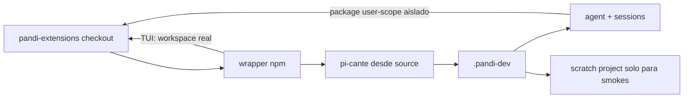

# Desarrollar y probar extensiones en pi

Fecha: 2026-07-12

Una extensión de pi es un módulo TypeScript que agrega comandos, tools o manejadores de eventos al agente. Esta guía
explica cómo escribir una extensión de este repo y probarla sin romper la sesión activa. Usala cuando quieras crear una
extensión nueva, modificar una existente o decidir entre un comando, un tool o un event handler.

## En 30 segundos

El loop recomendado usa un checkout sibling de `pi-cante`. Desde este repo:

```bash
# feedback primario
node --test extensions/pandi-<ext>/tests/integration/<algo>.test.mjs

# inspección y smokes aislados, sin instalar la suite globalmente
npm run dev:picante -- status
npm run smoke:picante
npm run smoke:picante:tui

# TUI interactiva contra los edits actuales
npm run dev:picante
```

El wrapper registra este checkout como package user-scope dentro del agent descartable `pi-cante/.pandi-dev/` y abre la
TUI en este repo como workspace real. Los smokes fuerzan un proyecto scratch separado. Deshabilita las copias bundled de
Pandi, no usa ni modifica perfiles reales y no carga sus packages; `/doctor` sí puede inspeccionarlos en modo read-only.
Si los repos no son siblings, definí `PI_CANTE_ROOT=/ruta/a/pi-cante`.

## Anatomía mínima de una extensión

Una extensión exporta una función default que recibe `pi: ExtensionAPI`:

```typescript
// extensions/pandi-hello/index.ts
import type { ExtensionAPI } from "@earendil-works/pi-coding-agent";

export default function (pi: ExtensionAPI) {
  pi.on("session_start", async (_event, ctx) => {
    if (ctx.hasUI) ctx.ui.notify("pandi-hello cargada", "info");
  });

  pi.registerCommand("hello", {
    description: "Saluda",
    handler: async (args, ctx) => ctx.ui.notify(`Hola ${args || "mundo"}!`, "info"),
  });
}
```

Cada extensión de este repo vive en su propio `extensions/pandi-<nombre>/index.ts` (o un único `.ts`) y es
**self-contained**: nada de imports runtime cruzados a otra extensión (`../shared/` solo existe para el harness de
tests, nunca para código que corre en producción — ver `AGENTS.md`). Si dos extensiones necesitan la misma utilidad
chica (un `notify.ts`, un parser de flags), se duplica a propósito: así cada una se puede instalar sola vía
`pi install`.

## ¿Comando, tool o event handler?

Los tres primitivos conviven en la misma extensión; la pregunta es **quién dispara el código**:

| Primitivo                                                  | Quién lo dispara                                         | Usalo cuando                                                                                                     | Ejemplo en este repo                                                                                                               |
| ---------------------------------------------------------- | -------------------------------------------------------- | ---------------------------------------------------------------------------------------------------------------- | ---------------------------------------------------------------------------------------------------------------------------------- |
| **Comando** — `pi.registerCommand("nombre", {...})`        | El usuario, tipeando `/nombre`                           | La acción es explícita y el usuario decide el momento                                                            | `/plan`, `/loop`, `/goal`                                                                                                          |
| **Tool** — `pi.registerTool({...})`                        | El LLM, cuando decide que la necesita dentro de un turno | Es una capacidad que el modelo debe poder invocar por su cuenta                                                  | `dynamic_workflow` (pandi-dynamic-workflows)                                                                                       |
| **Event handler** — `pi.on("evento", (event, ctx) => ...)` | El runtime de pi, en cada punto del lifecycle            | Necesitás reaccionar o interceptar sin que nadie lo pida (bloquear un tool, inyectar contexto, persistir estado) | `pi.on("tool_call")` bloqueando mutaciones en `pandi-plan`/`pandi-loop`; `pi.on("session_before_compact")` en `pandi-auto-compact` |

Ver la referencia completa de eventos y `ExtensionAPI` en el
[`extensions.md`](https://github.com/earendil-works/pi/blob/main/packages/coding-agent/docs/extensions.md) de pi
upstream (o `docs/extensions.md` de tu instalación local del paquete).

## Topología aislada de Picante

Este repo sigue siendo auto-hospedado — Picante ejecuta el TypeScript actual desde disco — pero el proceso de prueba ya
no comparte perfil con la sesión de autoría:



Al ejecutar `npm run dev:picante`, el wrapper:

1. encuentra `../pi-cante` o la ruta indicada por `PI_CANTE_ROOT`;
2. crea o reutiliza `pi-cante/.pandi-dev/`;
3. instala este checkout por ruta local con alcance de usuario dentro del agent descartable, nunca en un home real;
4. abre la TUI interactiva en este repo, donde el estado Picante vive en `.picante/` (gitignored);
5. reserva el proyecto scratch para los smokes RPC y TUI;
6. fuerza los directorios de agent y sesiones de todas las distros y deshabilita el bundle duplicado;
7. hace que Dynamic Workflows, Goal y Rename ejecuten el `pi-test.sh` de ese mismo checkout.

Por eso un edit aparece en el siguiente arranque sin publicar ni hacer `pi install ./` global. También evita que una
copia instalada en `~/.pi` se mezcle con la local. El aislamiento cubre configuración, estado y selección de packages;
**no es un sandbox del sistema operativo**: las extensiones conservan acceso al filesystem, procesos, red y credenciales
del usuario que lanzó Picante.

Para razonar sobre las pruebas conviene separar **tres ejes ortogonales**. Cada uno tiene una herramienta distinta.

### Eje 1 — Corrección: ¿mi edit funciona?

**Loop primario. Sin riesgo para tu sesión. Es TDD (la vía Farley).**

Los tests de integración **no cargan la extensión en tu sesión**: el harness compartido
(`extensions/shared/test/harness.mjs`) hace un esbuild-bundle de la extensión a un directorio temporal y la importa
dinámicamente con un `ctx` mockeado. Es aislado y rápido.

```bash
# una suite puntual (segundos) — el loop de desarrollo
node --test extensions/pandi-<ext>/tests/integration/<algo>.test.mjs

# todo el gate antes de commitear (typecheck + biome + markdownlint + suites)
npm test
```

- `scripts/test/run-all.mjs` **auto-descubre** toda suite `extensions/<ext>/tests/integration/*.test.mjs` (no hay
  manifest hardcodeado); para excluir una suite todavía-no-verde se usa su denylist `ignoredDraftSuites`.
- Escribí el test **antes** que la implementación (Red → Green → Refactor → Commit). Si un comportamiento "solo se puede
  ver en vivo", suele faltar cubrirlo con un test aislado.

Este eje debería ser ~90% de tu dev-test. Los ejes 2 y 3 son complementos, no sustitutos.

### Eje 2 — Seguridad de sesión: ¿un edit roto me tumba la sesión?

Picante convierte la segunda instancia aislada en un comando repetible. Usá cada entrada según el riesgo que querés
cubrir:

| Comando                         | Qué comprueba                                                                                         | Modelo                   |
| ------------------------------- | ----------------------------------------------------------------------------------------------------- | ------------------------ |
| `npm run dev:picante -- status` | Rutas efectivas, perfil aislado, bundle deshabilitado y única fuente local.                           | No                       |
| `npm run smoke:picante`         | Carga RPC, cero errores de extensión e inventario exacto del manifiesto resuelto en este checkout.    | No                       |
| `npm run smoke:picante:tui`     | Startup real en tmux, dashboard `/workflows` y reporte `/doctor`; siempre elimina la sesión temporal. | No                       |
| `npm run dev:picante`           | TUI interactiva para una exploración manual después de los checks.                                    | Solo si enviás un prompt |

El mecanismo in-place sigue siendo `/reload` (comando) o `ctx.reload()` desde un handler: recarga extensions, skills,
prompts y themes leyendo el source actual. Dentro del perfil `.pandi-dev` es útil; en una sesión estable vuelve a tener
el riesgo de cargar edits sin commitear. Para el patrón de reload seguro, ver el ejemplo upstream
`packages/coding-agent/examples/extensions/reload-runtime.ts`.

> Regla relacionada: **no hagas busy-poll de un run en background** — el harness lo trackea y avisa al terminar. (Ver la
> guía del tool `dynamic_workflow` y el skill `ultracode`.)

### Compatibilidad opcional con Pi vanilla

Solo cuando necesites validar el host vanilla, podés cargar un entry point explícito sin instalarlo:

```bash
pi --no-extensions -e ./extensions/pandi-<ext>/index.ts
```

Ese comando requiere el Pi CLI global y queda fuera del loop normal de contribución. Para probar específicamente la
semántica de instalación, usá `pi install -l ./` dentro de un proyecto scratch; no apuntes el perfil global al checkout
de trabajo.

### Eje 3 — Aislamiento de ejecución: ¿el código bajo prueba puede dañar el host?

Eje aparte, **opt-in**. Nada que ver con `/reload`: acá aislás la _ejecución_ de tools/`!`-commands, no el ciclo de
recarga.

- **Gondolin (micro-VM Linux):** ver [`gondolin-isolation.md`](./gondolin-isolation.md). Aísla los tools built-in y `!`
  en una micro-VM; **no** aísla los subagentes de dynamic-workflows (spawnean `pi`/`codex` en el host).
- **Contenedor / Docker:** para aislar el orquestador entero, correr todo `pi` dentro de un contenedor, o usar la
  extensión [`pandi-container`](../extensions/pandi-container/README.md) para correr comandos puntuales en micro-VMs de
  Apple `container`.

No uses el eje 3 para resolver el eje 2: un edit roto no es un problema de seguridad de ejecución, es de cuándo
recargás.

## Checklist de referencia

1. Escribí/actualizá el test aislado primero (eje 1, Red).
2. Implementá hasta verde: `node --test <suite>`; refactor con la red de tests.
3. Corré `npm run dev:picante -- status` y `npm run smoke:picante` para validar la topología y el runtime local.
4. Si tocaste startup o TUI, corré `npm run smoke:picante:tui`.
5. Corré `npm test` completo antes de commitear (gate del repo).
6. Hacé un commit atómico con Conventional Commits + scope (ej. `feat(pandi-goal): …`).

## Ver también

- [`README.md`](../README.md) — consumo estable y desarrollo aislado con Picante.
- [`setup.md`](./setup.md) — requisitos y topología de los dos caminos.
- Skill `init-pandi-extensions` — onboarding desde un clon fresco.
- [`README.md#verificación`](../README.md#verificación) — cómo correr `npm test` (harness de tests, lint, typecheck).
- [`gondolin-isolation.md`](./gondolin-isolation.md) — aislamiento por micro-VM (eje 3).
