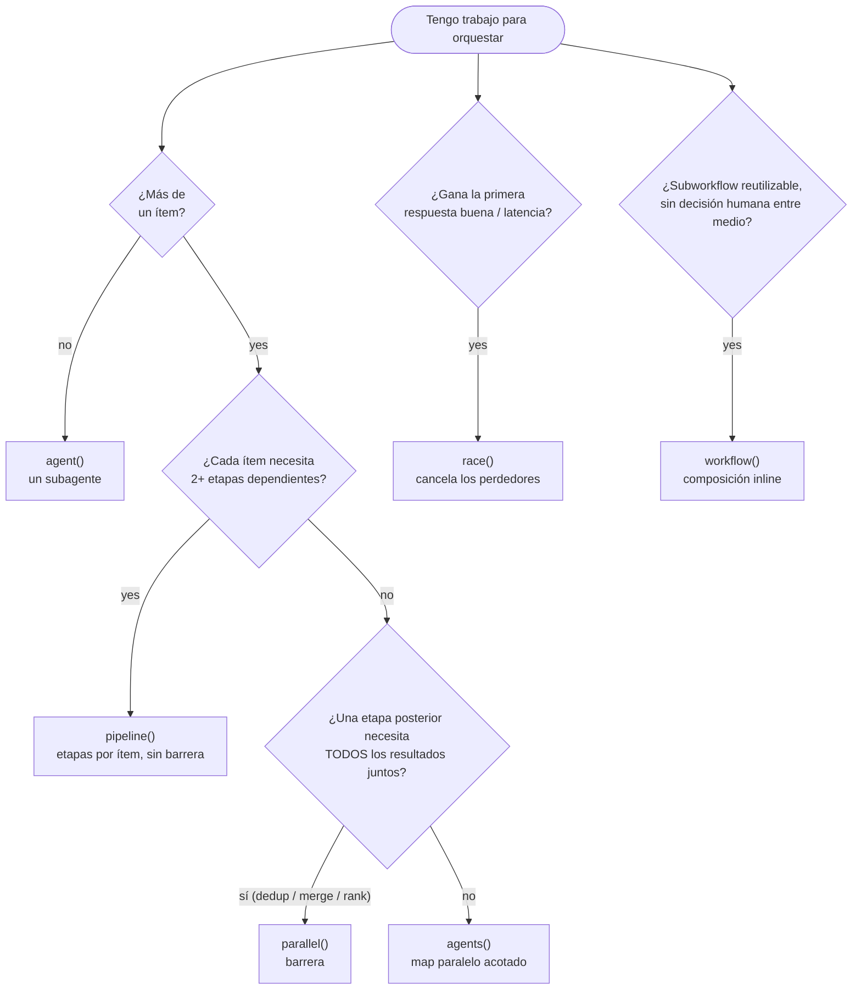
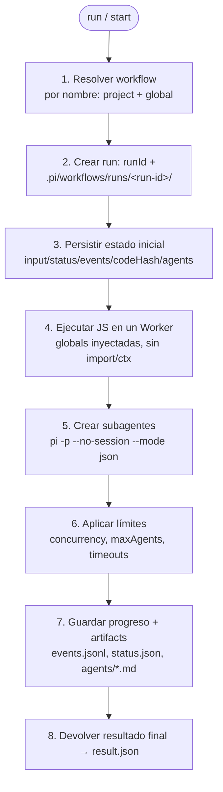

# Dynamic Workflows — guía completa

Un Dynamic Workflow es un **script JavaScript confiable** que Pi ejecuta para orquestar trabajo grande entre muchos subagentes. Conviene cuando una sola conversación no alcanza: necesitás repartir trabajo en paralelo con varios agentes `pi -p`, cubrir muchos ítems independientes o pedir verificación adversarial antes de decidir. Pensalo como **MapReduce con agentes**: `map` ejecuta muchos subagentes en paralelo sobre unidades independientes, y `reduce` hace la síntesis final para combinar resultados, resolver contradicciones y priorizar.

Esta es la referencia profunda de la extensión `pandi-dynamic-workflows`. El [`README.md`](../README.md) raíz tiene el resumen corto, y [`extensions/pandi-dynamic-workflows/README.md`](../extensions/pandi-dynamic-workflows/README.md) documenta el paquete instalable.

## En 30 segundos

Un workflow es un módulo JS cuyo export por defecto es una función `async`. Lee su entrada desde la global `args` y llama helpers inyectados (`agent`, `agents`, `log`, `writeArtifact`, …): no usa `import`/`require`, ni `ctx`.

```js
// .pi/workflows/drafts/review-two-files.js
// El export default NO debe llamarse `workflow` (pisaría la global de composición).
// Usá `main` — o un script top-level que termine en `return`.
export default async function main() {
  await log("start", { args });

  const items = [
    { label: "a", prompt: "Revisá src/a.ts en busca de bugs", tools: ["read", "grep", "find", "ls"], agentType: "reviewer" },
    { label: "b", prompt: "Revisá src/b.ts en busca de bugs", tools: ["read", "grep", "find", "ls"], agentType: "reviewer" },
  ];

  const reviews = await agents(items, { concurrency: 2, settle: true }); // fan-out; fallas → null
  const ok = reviews.filter(Boolean);
  await log("done", { total: reviews.length, failed: reviews.length - ok.length });

  await writeArtifact("reviews.json", reviews); // persistir fuera del chat
  return compact(ok, 20000); // resumen truncado → result.json
}
```

Ejecutalo (en una sesión TUI/RPC persistente esto arranca en **background** y devuelve `runId` al instante):

```text
/workflow run review-two-files
/workflow view latest
```

Ese es todo el ciclo — **explorar → fan out → sintetizar → persistir artifacts**. El resto de esta guía solo completa los conceptos, la referencia de primitivas y los detalles operativos.

## La forma típica

- **Exploración barata**: primero descubrí la lista real de trabajo (`git ls-files`, diff, grep, glob, etc.).
- **Fan-out controlado**: distribuí archivos, temas, hipótesis o perspectivas entre subagentes en paralelo.
- **Evidencia obligatoria**: cada rama debe devolver datos verificables — archivo/línea, URL, comando observado o `NO_FINDINGS` / `INSUFFICIENT_EVIDENCE`.
- **Artifacts fuera del chat**: persistí los resultados intermedios en el directorio del run en lugar de depender del contexto conversacional.
- **Síntesis como juez**: un agente final deduplica, descarta afirmaciones sin respaldo, preserva la incertidumbre y devuelve una conclusión priorizada.

## Cuándo usarlos

Usá un workflow solo cuando haya una razón real de orquestación; una edición chica, una pregunta simple o unos pocos tool calls directos son mejor como single-agent.

| Motivo | Usá un workflow cuando… |
| --- | --- |
| **Exhaustividad** | hay muchos archivos o ítems independientes que cubrir |
| **Confianza** | necesitás revisión adversarial, múltiples perspectivas o verificación antes de decidir |
| **Escala** | hay más contexto del que una sola conversación debería cargar |
| **Tarea trivial** | ❌ hacelo single-agent en su lugar |

## Qué primitiva uso?

Todo se compone desde `agent()` (una unidad de trabajo del modelo). Elegí la primitiva de mayor nivel según la forma del trabajo:



- **`race` vs un juez**: `race` optimiza la *latencia* (gana la primera respuesta aceptada). Elegir la *mejor por calidad* es un juez (`tournament`, `judge-escalate`) que necesita ver todos los candidatos.
- **`parallel` vs `pipeline`**: usá `parallel` solo para una barrera real (dedup/merge global, early-exit con total cero, ranking cruzado entre ramas). `parallel → transform-with-no-cross-item-dependency → parallel` debería ser UN `pipeline`.
- **`workflow` vs corridas secuenciadas**: si entre dos subpasos no hay una decisión humana/externa, componé con `workflow()` en una sola corrida; si tenés que leer resultados y decidir la fase siguiente, encadená corridas separadas (`action=start/run` + `action=view`).

## Ciclo de ejecución

Cuando lanzás un workflow (`/workflow run`/`start` o `dynamic_workflow action=run`/`start`), la extensión ejecuta este ciclo:



Detalles de cada paso:

1. **Resuelve el workflow** por nombre, buscando workflows del proyecto y globales.
2. **Crea una corrida** con un `runId` y su propio directorio bajo `.pi/workflows/runs/<run-id>/` (o el root global equivalente).
3. **Persiste el estado inicial**: `input.json`, `status.json`, `events.jsonl`, `codeHash` y una carpeta `agents/`.
4. **Ejecuta el JS en un Worker** con **globals inyectadas** (sin `ctx`, sin `import`/`require`). El workflow nunca importa Pi: llama helpers como `agent`, `agents`, `bash`, `writeArtifact` y `log`, y lee su entrada desde la global `args`.
5. **Crea subagentes**: cada `agent()` ejecuta un proceso `pi -p --no-session --mode json` con prompt, tools, skills, extensions, keys/env, model, effort y timeouts configurables.
6. **Aplica límites**: `concurrency` limita cuántos subagentes corren a la vez; `maxAgents` limita el total de subagentes que un run puede gastar; los timeouts matan agentes o workflows colgados.
7. **Guarda progreso y artifacts**: logs en `events.jsonl`, estado en `status.json`, salidas de subagentes en `agents/*.md`, más los artifacts definidos por el workflow.
8. **Devuelve el resultado final**: el valor de retorno del workflow se guarda en `result.json` y se muestra como resumen.

## API de globals inyectadas

Estas globals son toda la interfaz de autoría. Las más importantes:

| Global | Qué hace | Devuelve |
| --- | --- | --- |
| `agent(prompt, opts)` | un subagente (`pi -p --no-session`); la unidad cara, cacheada por defecto | texto sin envolver; objeto parseado con `{ schema }`; `null` si falla |
| `agents(items, opts)` | fan-out paralelo acotado (map) | `SubagentResult[]` (`.output`/`.data`/`.ok`); `null` por rama con `settle` |
| `pipeline(items, ...stages)` | etapas dependientes por ítem, sin barrera | array alineado con los ítems; `null` para un ítem fallido |
| `parallel([thunks])` | barrera explícita con concurrencia local acotada | array alineado con los thunks; `null` por thunk fallido |
| `race(thunks, { accept? })` | gana el primer valor aceptado; envía SIGTERM a los perdedores | `{ winner, index, status }` (`"won"`/`"empty"`) |
| `workflow(name, args)` | sub-workflow reutilizable inline (profundidad 1) | el valor de retorno del sub-workflow |
| `ask(question, opts?)` | pausa una rama para preguntarle a una persona vía la UI de Pi | la respuesta (`string`/`boolean`) |

Más sobre las claves:

- `agent(prompt, opts)` — **desenvuelve** el resultado: texto plano sin schema, el objeto parseado con `{ schema }`, o `null` si la rama falla. Cachea por defecto para resume; podés desactivarlo por llamada con `{ cache: false }`.
- `agent(prompt, { schema })` — pide JSON validado y **devuelve directamente el objeto parseado** (o `null` si falla o nunca valida); reintenta con `schemaRetries` (default `2`). Para el envelope completo (`output`/`data`/`schemaOk`) usá el plural `agents([...])`.
- `agent(prompt, { agentType: "reviewer" })` — aplica defaults de persona (`explore`, `reviewer`, `planner`, `architect`, `implementer`, `researcher`); las opciones explícitas ganan.
- `agents(items, { concurrency, settle: true })` — una rama fallida no hunde el batch; devuelve `Array<SubagentResult | null>` con `null` para las ramas fallidas.
- `pipeline(items, ...stages)` — flujo multi-etapa por ítem sin barrera global; cada etapa recibe `(prev, item, index)` y los ítems fallidos devuelven `null`.
- `parallel([async () => ...])` — barrera explícita con concurrencia local acotada; cada thunk fallido devuelve `null`. Usalo solo cuando una etapa posterior necesite todos los resultados juntos.
- `race(thunks, { accept? })` — abre N ramas y, en cuanto una produce un valor aceptado (por defecto `!= null`), **cancela los perdedores en vuelo** (SIGTERM real al subproceso, vía el `AbortSignal` que recibe cada thunk); devuelve `{ winner, index, status }` (`status: "won" | "empty"`). Forma típica: `race(items.map((s) => (signal) => agent(prompt, { signal })))`.
- `ask(question, opts?)` — pausa una rama para preguntarle a una persona (`kind: "input" | "confirm" | "select"`, inferido desde `choices`/`default`). **Seguro para resume**: la respuesta queda journaled y se reutiliza al reanudar sin volver a preguntar. En modo headless (`hasUI=false`) devuelve `opts.default` o lanza un error claro; nunca queda colgado. Se puede cancelar dentro de `race()` con `{ signal }`.
- `workflow(name, args)` — compone un sub-workflow reutilizable inline (profundidad 1), compartiendo el mismo run, límites, abort y cache/journal; emite eventos `workflow` para auditabilidad. Usalo para bibliotecas como `lib/verify-claims`, no para fases que necesitan una decisión humana en el medio.

Helpers de apoyo:

- `bash(command, opts)` — ejecuta shell desde el cwd del workflow; solo cacheable con `{ cache: true }` (comandos determinísticos only).
- `readFile/writeFile/appendFile/listFiles` — helpers de archivos confinados al cwd del workflow.
- `writeArtifact/appendArtifact` — persiste datos del run fuera del chat (idempotente; no cacheado, reescrito al resume).
- `log(message, details)` — registra progreso visible en el dashboard, la status line y `events.jsonl`.
- `sleep(ms)` — pausa la rama actual durante `ms` milisegundos, por ejemplo para backoff entre probes de polling; abortable (resuelve antes/rechaza si el run/rama se aborta) y nunca cacheado, así que siempre se re-ejecuta al resume.
- `phase(label)` — define una etiqueta liviana para las llamadas que siguen, visible en el dashboard como `P<phase> 1/n`, `P<phase> 2/n`, etc. en los agentes lanzados por la misma llamada a `agents(...)`; llamá `phase(null)` para limpiarla.
- `compact(value, maxChars)` — serializa y trunca resultados grandes para pasárselos a una síntesis. `json(value, maxChars)` es un alias (misma serialización/truncado).
- `args` — la entrada del workflow; `limits` — límites efectivos de solo lectura del run (`concurrency`, `maxAgents`, timeouts).

### Opciones comunes de subagentes

```js
{
  label: "review-auth",
  tools: ["read", "grep", "find", "ls"],
  skills: ["/path/to/skill"],
  extensions: ["/path/to/extension.ts"],
  keys: ["GITHUB_TOKEN"], // values redacted; missing keys stay visible in dashboard/artifacts
  timeoutMs: 300000,
  effort: "high",
  agentType: "reviewer",
  schema: { type: "object", required: ["verdict"], properties: { verdict: { type: "string" } } },
  schemaOnInvalid: "throw"
}
```

### Acceso por agente

`tools`/`excludeTools` limitan las tools de Pi; por defecto, los allowlists explícitos también reciben `web_search` cuando el paquete `pi-codex-web-search` está disponible (opt out: `includeExtensions: false` o `excludeTools: ["web_search"]`). `skills: ["path/to/skill"]` carga skills explícitas (`includeSkills: true` las agrega al discovery, `includeSkills: false` lo desactiva); el discovery normal mantiene `context7-cli` disponible, y si pasás una lista explícita de skills, Dynamic Workflows agrega `context7-cli` cuando lo encuentra (opt out: `includeSkills: false`). `extensions: ["path/to/ext.ts"]` carga extensiones explícitas (`includeExtensions: true` habilita discovery). `keys: ["GITHUB_TOKEN"]` expone solo esas variables de entorno al agente en un entorno aislado (los valores se redacted en artifacts/dashboard). Usá `env: { NAME: "value" }` solo para inyectar un valor explícito; nunca escribas secretos en prompts.

## Concurrencia

`concurrency` controla cuántos subagentes corren `pi -p` al mismo tiempo — no el total de trabajo. Un bug hunt de 40 archivos con `concurrency: 4` corre en olas de hasta 4 agentes simultáneos hasta terminar la lista.

Límites relacionados:

- `concurrency` = máximo de subagentes simultáneos (normalizado entre `1` y `16`; si no se setea, default `4`).
- `maxAgents` = máximo total de subagentes para el run.
- `maxFiles`, `angles`, `rounds`, etc. = límites específicos del workflow sobre la lista de trabajo.

### Por qué el default es 4

`4` es un punto seguro entre velocidad, costo y estabilidad: reduce mucho el tiempo total frente a serial sin multiplicar agresivamente el costo instantáneo, los rate limits o el ruido; protege al provider y a la máquina local de demasiados procesos `pi -p` simultáneos saturando CPU/I-O/terminales/logs; reduce fallas correlacionadas (timeouts, errores de rate limit) que crecen con el fan-out; y mantiene logs, artifacts y dashboard legibles. Es un **default conservador, no una recomendación fija** — los workflows largos deberían pasar límites explícitos según la tarea, el modelo y el presupuesto.

### Elegir concurrencia dinámicamente

Que el default sea `4` no significa que los workflows deban hardcodear 4. Los workflows primero exploran, descubren la lista real de trabajo y recién entonces eligen el paralelismo. La decisión está por capas:

- **Usuario/agente al lanzar** puede pasar `concurrency` explícito cuando conoce presupuesto, provider o urgencia.
- **Runtime** hace cumplir el límite efectivo (`limits.concurrency`) y el hard cap global.
- **Workflow** elige una concurrencia local a partir del tamaño de la lista, el riesgo, el costo y el tipo de tarea, sin superar nunca `limits.concurrency`.

| Situación | Concurrencia |
| --- | --- |
| Modelos caros, rate limits estrictos, debugging, side effects/writes | `1–2` |
| Revisión/investigación solo lectura (default seguro) | `4` |
| Muchas ramas independientes, el provider responde bien | `6–8` |
| Barridos grandes solo lectura con `maxAgents` + timeout explícitos | `12–16` |
| 1–2 ítems | `1–2` (igual al conteo) |

```js
function chooseConcurrency(items, opts = {}) {
  if (Number.isFinite(args?.concurrency)) {
    return Math.min(Math.max(Math.floor(args.concurrency), 1), limits.concurrency);
  }
  const count = items.length;
  if (count <= 1) return 1;
  if (opts.sideEffects) return Math.min(2, count, limits.concurrency);
  if (opts.expensiveModel) return Math.min(2, count, limits.concurrency);
  if (opts.readOnlyAudit && count >= 30) return Math.min(8, count, limits.concurrency);
  return Math.min(4, count, limits.concurrency);
}
```

Cómo se aplica:

```js
const concurrency = Math.min(args?.concurrency ?? limits.concurrency, limits.concurrency);
const reviews = await agents(items, { concurrency, settle: true });
```

- `limits.concurrency` es el límite efectivo del run y es de solo lectura.
- `agents(..., { concurrency })` vuelve a clamplear, así nunca supera el límite del run; `pipeline()` y `parallel()` también usan `limits.concurrency` como su límite local.
- Las llamadas cacheadas al reanudar (`journal.jsonl` HIT) no ejecutan `pi -p`, así que no consumen slots de concurrencia ni cuentan contra `maxAgents`.

## Corridas en background

En una sesión TUI/RPC persistente, todos los workflows arrancan en background por defecto (`run`, `start` y `resume`):

```text
/workflow start bug-hunt {"maxFiles":40,"concurrency":4,"maxAgents":20}
/workflow runs
/workflow view <runId>
/workflow cancel <runId>
```

Desde la herramienta del modelo:

```json
{ "action": "start", "name": "bug-hunt", "input": { "maxFiles": 40 }, "concurrency": 4, "maxAgents": 20 }
```

Notas:

- `run`/`start` devuelven enseguida el `runId`, `status.json` y el directorio de artifacts en TUI/RPC.
- Al completar o fallar, el workflow en background despierta al agente con un follow-up automático para inspeccionar `dynamic_workflow action=view name=<runId>` y continuar la tarea.
- En `/reload`, Pi interrumpe de forma controlada las corridas background activas y la instancia nueva las reanuda automáticamente con el mismo `runId` y los límites originales (`concurrency`, `maxAgents`, timeouts). Las llamadas ya journaled no se reejecutan; lo que estaba in-flight o no cacheado puede volver a correr, igual que en un resume manual.
- Si el proceso Pi se reinicia o muere, no hay handoff in-memory: una corrida incompleta aparece como `stale`. Reanudala con `/workflow resume <runId>` (ver "Corridas reanudables").
- Monitoreá con `/workflow runs`, `/workflow view <runId>` o la pestaña `Monitor` del dashboard; cancelá con `/workflow cancel <runId>` o `dynamic_workflow action=cancel` (el dashboard solo cancela corridas activas en esta sesión).
- Las corridas en background siguen gastando llamadas al modelo: usá límites explícitos.
- **Fallback en foreground**: en modo print/json no hay una sesión persistente para sostener una corrida en background, así que `run` bloquea hasta completar.

## Corridas reanudables (idempotentes)

Cuando una corrida se interrumpe (la sesión de Pi murió y aparece `stale`, o terminó `failed`/`cancelled`), podés reanudarla sin volver a ejecutar los subagentes que ya terminaron (cada subagente es un `pi -p` caro):

```text
/workflow resume latest              # background por defecto en TUI/RPC
/workflow resume <runId>              # background por defecto en TUI/RPC
/workflow resume <runId> --force       # incluso si el run ya está completed
```

Desde la herramienta del modelo:

```json
{ "action": "resume", "name": "<runId>", "force": false }
```

Cómo funciona:

- La corrida se reanuda **en el mismo lugar**: mismo `runId`, mismo directorio. Estados reanudables: `stale`, `failed`, `cancelled`. Una corrida `completed` requiere `force:true`.
- Cada corrida mantiene un `journal.jsonl` host-side con las llamadas completadas. La cache key es **content-addressed**: `sha256(method + normalized args)` con un contador por key; es correcta bajo concurrencia (`agents`) porque no depende de ids no determinísticos del host.
- `agent()` se cachea **por defecto**; desactivá por llamada con `agent(prompt, { cache: false })`.
- Para evitar filtrar secretos, la cache registra solo los nombres de `keys` y `env` redacted (`[set]`), nunca los valores; si un resultado depende del valor exacto/rotado de una credencial, usá `{ cache: false }`.
- `bash()` se cachea solo **opt-in** con `bash(cmd, { cache: true })` (solo comandos determinísticos y sin side effects).
- `writeArtifact`/`writeFile` no se cachean: se reejecutan, y reescribir es idempotente. `log`/`sleep` nunca se cachean.
- Una llamada cacheada (HIT) no gasta un `pi -p` y no cuenta contra `maxAgents`.
- Una llamada que estaba **in flight** cuando murió la sesión no tiene registro en el journal: se reejecuta (costo: una llamada). Una llamada completada nunca se duplica.
- **Determinismo**: la cache de una llamada depende exactamente de sus argumentos. Si construís el prompt o el comando con `Date.now()` o `Math.random()`, esa llamada cambia argumentos en cada intento y se reejecuta al resume (cache miss). Es una degradación segura: nunca da un resultado incorrecto, solo una reejecución.
- Un `codeHash` del workflow (sobre el código transformado) se guarda en `status.json`/`result.json` y en cada registro del journal. Si el código cambió desde la corrida original, `/workflow view` y resume avisan: las llamadas cuyos argumentos cambiaron se reejecutan (miss); el resto queda cacheado.
- `/workflow runs` marca las corridas reanudables con `resumable` y muestra `cached:N`; `/workflow view <runId>` agrega una línea `Resume: /workflow resume <runId>`, el `codeHash`, el conteo de llamadas cacheadas y el aviso de cambio de código.
- Atomicidad: `status.json`/`result.json` se escriben con temp+rename para que un crash no los corrompa.

## Catálogo de patrones y casos de uso

La pestaña `Patterns` y `/workflow patterns` muestran todos los scaffolds y casos de uso registrados. Los scaffolds están embebidos en la extensión, así que el paquete no depende de archivos bajo `examples/workflows/`. Las claves del catálogo SON los nombres de archivo de los scaffolds (1:1, sin alias):

- **Scaffolds**: `fan-out-and-synthesize`, `adversarial-verify`, `judge-escalate`, `tournament`, `loop-until-dry`.
- **Scaffolds de composición**: `composition-driver`, `verify-claims-lib`, `workflow-factory`.
- **Casos de uso**: `repo-bug-hunt`, `large-migration`, `complex-research`, `adversarial-plan-review`, `bug-verify`.

Un naming anterior, al estilo Claude (`classify-and-act`, `adversarial-verification`, `generate-and-filter`, `tournaments`, `loop-until-done`, `compose-verify-claims`, `lib-verify-claims`, `bug-hunt-repo-audit`, `plan-review`, `claim-bug-verification`) quedó retirado por el refactor de interfaz única y ya no resuelve como alias de patrón. Los intents legacy `deep-research` y `default` siguen vivos como skills que enrutan a `complex-research` y `fan-out-and-synthesize` respectivamente.

### Plantillas apoyadas en research

Mapeo de papers/frameworks comunes de agentes al diseño de workflows en Pi:

- **ReAct** -> scoutear/observar con tools antes del fan-out; mantener el razonamiento atado a la evidencia.
- **Self-consistency** -> muestrear ramas independientes y luego elegir por consistencia/evidencia, en vez de confiar en un solo camino.
- **Reflexion / Self-Refine** -> loops de generate -> critique -> refine, siempre acotados por rondas, quiet stops, `maxAgents` y timeout.
- **Tree of Thoughts** -> ramificar alternativas, evaluar/podar con un juez y luego comprometerse con un camino.
- **Multiagent debate** -> reviewers adversariales más síntesis-como-juez; los claims sin soporte se descartan.
- **AutoGen / CAMEL / MetaGPT** -> roles explícitos, artifacts estables y contratos de handoff claros.
- **SWE-agent / DSPy** -> importan la interfaz y los contratos: tools estrechos, schemas/formatos fijos y chequeos reproducibles.

Usalos como patterns, no como ceremonia: cada rama necesita una razón, un contrato y una condición de parada.

Ver notas detalladas en [`docs/research/2026-06-25-agentic-patterns-papers-workflows.md`](./research/2026-06-25-agentic-patterns-papers-workflows.md).

### Patrones de prompt recomendados

Los workflows funcionan mejor cuando cada prompt declara explícitamente su patrón:

- **Fan-out independiente**: cada subagente debe producir un reporte útil aunque los demás fallen.
- **Contrato de evidencia**: pedí archivo/línea, URL, comando observado o `INSUFFICIENT_EVIDENCE` / `NO_FINDINGS`.
- **Formato fijo**: preferí `agent(prompt, { schema })` para JSON; si no, secciones fijas como `Verdict`, `Findings`, `Evidence`, `Risks`, `Fix`, `Verification`.
- **Síntesis como juez**: el agente final deduplica, descarta afirmaciones sin respaldo, preserva la incertidumbre y elige un camino concreto.
- **Crítica adversarial**: revisores con el objetivo explícito de encontrar edge cases, recortar alcance y marcar riesgos aceptados.
- **Fallos parciales visibles**: la síntesis debe mencionar agentes fallidos, vacíos, cancelados o con timeout.
- **Seguro por defecto**: para audits, prompts con "do not edit files", tools solo de lectura, solo los `skills`/`extensions` necesarios y solo los `keys` que esa rama necesita.

## Seguridad y costo

- **Menor privilegio**: para auditorías y exploración, usá tools de solo lectura y cargá solo los `skills`/`extensions` necesarios.
- **Secretos fuera del prompt**: no pegues credenciales, tokens ni dumps completos; si hace falta contexto sensible, pasá nombres de claves y valores redacted.
- **Límites explícitos**: fijá `maxAgents`, `concurrency`, `timeout` y alcance de archivos antes de arrancar, para acotar costo y latencia.
- **Cierre temprano**: si ya hay evidencia suficiente, terminá la corrida; no abras ramas extra “por si acaso”.
- **Caché con criterio**: la caché reduce costo en resumes, pero solo conviene para entradas determinísticas; desactivala si el resultado depende de estado externo o credenciales rotadas.
- **Trazabilidad**: preferí prompts que pidan evidencia verificable y artifacts persistentes, así el costo queda auditable.
