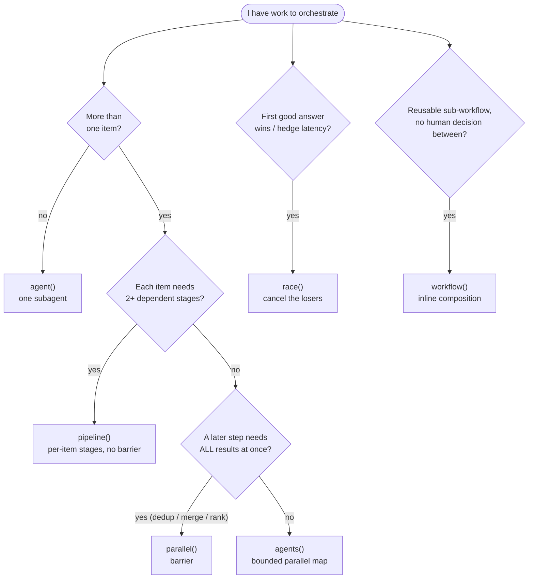
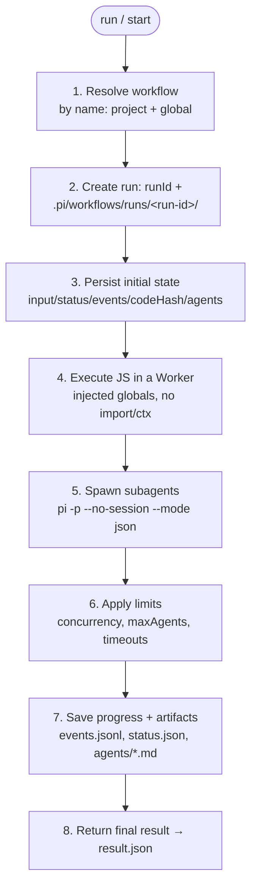

# Dynamic Workflows — the full guide

A Dynamic Workflow is a **trusted JavaScript script** that Pi runs to orchestrate large work across many subagents. Reach for one when a single conversation is not enough — you need to fan work out across parallel `pi -p` agents, cover many independent items, or get adversarial verification before a decision. Think of it as **MapReduce with agents**: `map` runs many subagents in parallel over independent units, `reduce` is a final synthesis that combines results, resolves contradictions, and prioritizes.

This is the deep reference for the `pi-dynamic-workflows` extension. The root [`README.md`](../README.md) has the short overview, and [`extensions/pi-dynamic-workflows/README.md`](../extensions/pi-dynamic-workflows/README.md) documents the installable package.

## Quickstart

A workflow is a JS module whose default export is an `async` function. It reads its input from the `args` global and calls injected helpers (`agent`, `agents`, `log`, `writeArtifact`, …) — never `import`/`require`, never `ctx`.

```js
// .pi/workflows/drafts/review-two-files.js
// The default export must NOT be named `workflow` (that shadows the composition
// global). Use `main` — or a top-level script that ends in `return`.
export default async function main() {
  await log("start", { args });

  const items = [
    { label: "a", prompt: "Review src/a.ts for bugs", tools: ["read", "grep", "find", "ls"], agentType: "reviewer" },
    { label: "b", prompt: "Review src/b.ts for bugs", tools: ["read", "grep", "find", "ls"], agentType: "reviewer" },
  ];

  const reviews = await agents(items, { concurrency: 2, settle: true }); // fan out; failures → null
  const ok = reviews.filter(Boolean);
  await log("done", { total: reviews.length, failed: reviews.length - ok.length });

  await writeArtifact("reviews.json", reviews); // persist outside the chat
  return compact(ok, 20000); // truncated summary → result.json
}
```

Run it (in a persistent TUI/RPC session this launches in **background** and returns a `runId` immediately):

```text
/workflow run review-two-files
/workflow view latest
```

That is the whole loop: **scout → fan out → synthesize → persist artifacts**. The rest of this guide fills in the concepts, the full primitive reference, and the operational details.

## The typical shape

- **Cheap scout**: first discover the real work-list (`git ls-files`, diff, grep, glob, etc.).
- **Controlled fan-out**: spread files, topics, hypotheses, or perspectives across parallel subagents.
- **Mandatory evidence**: every branch must return verifiable data — file/line, URL, observed command, or `NO_FINDINGS` / `INSUFFICIENT_EVIDENCE`.
- **Artifacts outside the chat**: persist intermediate outputs in the run directory instead of relying on conversational context.
- **Synthesis-as-judge**: a final agent deduplicates, drops unsupported claims, preserves uncertainty, and returns a prioritized conclusion.

## When to use them

Use a workflow only when there is a real orchestration reason; a small edit, a simple question, or a few direct tool calls are better single-agent.

| Reason | Use a workflow when… |
| --- | --- |
| **Exhaustiveness** | there are many independent files/items to cover |
| **Confidence** | you need adversarial review, multiple perspectives, or verification before a decision |
| **Scale** | there is more context than a single conversation should carry |
| **Trivial task** | ❌ do it single-agent instead |

## Which primitive do I use?

Everything composes from `agent()` (one unit of model work). Pick the higher-level primitive by the shape of the work:



- **`race` vs a judge**: `race` optimizes *latency* (first accepted answer wins). Picking the *best by quality* is a judge (`tournament`, `judge-escalate`) that must see all candidates.
- **`parallel` vs `pipeline`**: use `parallel` only for a true barrier (global dedup/merge, early-exit on zero total, cross-branch ranking). `parallel → transform-with-no-cross-item-dependency → parallel` should be ONE `pipeline`.
- **`workflow` vs sequenced runs**: if no human/external decision sits between two sub-steps, compose with `workflow()` in a single run; if you must read results and decide the next phase, sequence separate runs (`action=start/run` + `action=view`).

## Execution cycle

When you launch a workflow (`/workflow run`/`start` or `dynamic_workflow action=run`/`start`), the extension runs this cycle:



Details of each step:

1. **Resolves the workflow** by name, searching project and global workflows.
2. **Creates a run** with a `runId` and its own directory under `.pi/workflows/runs/<run-id>/` (or the equivalent global root).
3. **Persists initial state**: `input.json`, `status.json`, `events.jsonl`, `codeHash`, and an `agents/` folder.
4. **Executes the JS in a Worker** with **injected globals** (no `ctx`, no `import`/`require`). The workflow never imports Pi: it calls helpers like `agent`, `agents`, `bash`, `writeArtifact`, and `log`, and reads its input from the `args` global.
5. **Spawns subagents**: each `agent()` runs a `pi -p --no-session --mode json` process with configurable prompt, tools, skills, extensions, keys/env, model, effort, and timeouts.
6. **Applies limits**: `concurrency` caps how many subagents run at once; `maxAgents` caps the total subagents a run may spend; timeouts kill hung agents or workflows.
7. **Saves progress and artifacts**: logs in `events.jsonl`, state in `status.json`, subagent outputs in `agents/*.md`, plus workflow-defined artifacts.
8. **Returns the final result**: the workflow's return value is saved in `result.json` and shown as a summary.

## Injected globals API

These globals are the entire authoring interface. The most important:

| Global | What it does | Returns |
| --- | --- | --- |
| `agent(prompt, opts)` | one subagent (`pi -p --no-session`); the expensive unit, cached by default | unwrapped text; parsed object with `{ schema }`; `null` on failure |
| `agents(items, opts)` | bounded parallel fan-out (map) | `SubagentResult[]` (`.output`/`.data`/`.ok`); `null` per branch under `settle` |
| `pipeline(items, ...stages)` | per-item dependent stages, no barrier | array aligned to items; `null` for a failed item |
| `parallel([thunks])` | explicit barrier with bounded local concurrency | array aligned to thunks; `null` per failed thunk |
| `race(thunks, { accept? })` | first accepted value wins; SIGTERM the losers | `{ winner, index, status }` (`"won"`/`"empty"`) |
| `workflow(name, args)` | inline reusable sub-workflow (depth 1) | the sub-workflow's return value |
| `ask(question, opts?)` | pause a branch to ask a human via Pi's UI | the answer (`string`/`boolean`) |

More on the key ones:

- `agent(prompt, opts)` — **unwraps** the result: plain text without a schema, the parsed object with `{ schema }`, or `null` if the branch fails. Cached by default for resume; opt out per call with `{ cache: false }`.
- `agent(prompt, { schema })` — requests validated JSON and **returns the parsed object directly** (or `null` if it fails or never validates); retries with `schemaRetries` (default `2`). For the full envelope (`output`/`data`/`schemaOk`) use the plural `agents([...])`.
- `agent(prompt, { agentType: "reviewer" })` — applies persona defaults (`explore`, `reviewer`, `planner`, `architect`, `implementer`, `researcher`); explicit options win.
- `agents(items, { concurrency, settle: true })` — one failing branch does not sink the batch; returns `Array<SubagentResult | null>` with `null` for failed branches.
- `pipeline(items, ...stages)` — multi-stage flow per item with no global barrier; each stage receives `(prev, item, index)` and failed items yield `null`.
- `parallel([async () => ...])` — explicit barrier with bounded local concurrency; each failed thunk yields `null`. Use it only when a later step needs all results at once.
- `race(thunks, { accept? })` — opens N branches and, as soon as one produces an accepted value (default `!= null`), **cancels the in-flight losers** (real SIGTERM to the subprocess, via the `AbortSignal` each thunk receives); returns `{ winner, index, status }` (`status: "won" | "empty"`). Typical shape: `race(items.map((s) => (signal) => agent(prompt, { signal })))`.
- `ask(question, opts?)` — pauses a branch to ask a human (`kind: "input" | "confirm" | "select"`, inferred from `choices`/`default`). **Resume-safe**: the answer is journaled and reused on resume without re-asking. In headless mode (`hasUI=false`) it returns `opts.default` or throws a clear error; it never hangs. Cancelable inside `race()` via `{ signal }`.
- `workflow(name, args)` — composes a reusable sub-workflow inline (depth 1) sharing the same run, limits, abort, and cache/journal; emits `workflow` events for auditability. Use it for libraries like `lib/verify-claims`, not for phases that need a human decision in between.

Supporting helpers:

- `bash(command, opts)` — runs shell from the workflow cwd; cacheable only with `{ cache: true }` (deterministic commands only).
- `readFile/writeFile/appendFile/listFiles` — file helpers confined to the workflow cwd.
- `writeArtifact/appendArtifact` — persists run data outside the chat (idempotent; not cached, rewritten on resume).
- `log(message, details)` — records progress visible in the dashboard, status line, and `events.jsonl`.
- `sleep(ms)` — pauses the current branch for `ms` milliseconds, e.g. backoff between polling probes; abortable (resolves early/rejects if the run/branch is aborted) and never cached, so it always re-runs on resume.
- `phase(label)` — sets a lightweight label for the calls that follow, shown in the dashboard as `P<phase> 1/n`, `P<phase> 2/n`, etc. on agents launched by the same `agents(...)` call; call `phase(null)` to clear it.
- `compact(value, maxChars)` — serializes and truncates large results to hand to a synthesis. `json(value, maxChars)` is an alias (same serialization/truncation).
- `args` — the workflow input; `limits` — effective read-only run limits (`concurrency`, `maxAgents`, timeouts).

### Common subagent options

```js
{
  label: "review-auth",
  tools: ["read", "grep", "find", "ls"],
  skills: ["/path/to/skill"],
  extensions: ["/path/to/extension.ts"],
  keys: ["GITHUB_TOKEN"], // values redacted; missing keys stay visible in dashboard/artifacts
  timeoutMs: 300000,
  effort: "high",
  agentType: "reviewer",
  schema: { type: "object", required: ["verdict"], properties: { verdict: { type: "string" } } },
  schemaOnInvalid: "throw"
}
```

### Per-agent access

`tools`/`excludeTools` limit Pi tools; by default explicit allowlists also receive `web_search` when the `pi-codex-web-search` package is available (opt out: `includeExtensions: false` or `excludeTools: ["web_search"]`). `skills: ["path/to/skill"]` loads explicit skills (`includeSkills: true` adds them to discovery, `includeSkills: false` disables discovery); normal discovery keeps `context7-cli` available, and if you pass an explicit skill list, Dynamic Workflows adds `context7-cli` when it finds it (opt out: `includeSkills: false`). `extensions: ["path/to/ext.ts"]` loads explicit extensions (`includeExtensions: true` enables discovery). `keys: ["GITHUB_TOKEN"]` exposes only those environment variables to the agent in an isolated env (values are redacted in artifacts/dashboard). Use `env: { NAME: "value" }` only to inject an explicit value; never write secrets in prompts.

## Concurrency

`concurrency` controls how many subagents run `pi -p` at the same time — not the total amount of work. A 40-file bug hunt with `concurrency: 4` runs in waves of up to 4 simultaneous agents until the list is done.

Related limits:

- `concurrency` = max simultaneous subagents (normalized between `1` and `16`; unset, defaults to `4`).
- `maxAgents` = max total subagents for the run.
- `maxFiles`, `angles`, `rounds`, etc. = workflow-specific limits over the work-list.

### Why the default is 4

`4` is a safe point between speed, cost, and stability: it cuts wall-clock a lot versus serial without aggressively multiplying instantaneous cost, rate limits, or noise; it protects the provider and local machine from too many simultaneous `pi -p` processes saturating CPU/I-O/terminals/logs; it reduces correlated failures (timeouts, rate-limit errors) that grow with fan-out; and it keeps logs/artifacts/dashboard readable. It is a **conservative default, not a fixed recommendation** — long workflows should pass explicit limits per task, model, and budget.

### Choose concurrency dynamically

The default being `4` does **not** mean workflows should hardcode 4. Workflows scout first, discover the real work-list, and only then pick parallelism. The decision is layered:

- **User/agent at launch** may pass explicit `concurrency` when they know budget, provider, or urgency.
- **Runtime** enforces the effective limit (`limits.concurrency`) and the global hard cap.
- **Workflow** picks a local concurrency from item count, risk, cost, and task type, never exceeding `limits.concurrency`.

| Situation | Concurrency |
| --- | --- |
| Expensive models, strict rate limits, debugging, side effects/writes | `1–2` |
| Read-only review/research (safe default) | `4` |
| Many independent branches, provider responds well | `6–8` |
| Large read-only sweeps with explicit `maxAgents` + timeout | `12–16` |
| 1–2 items | `1–2` (match the count) |

```js
function chooseConcurrency(items, opts = {}) {
  if (Number.isFinite(args?.concurrency)) {
    return Math.min(Math.max(Math.floor(args.concurrency), 1), limits.concurrency);
  }
  const count = items.length;
  if (count <= 1) return 1;
  if (opts.sideEffects) return Math.min(2, count, limits.concurrency);
  if (opts.expensiveModel) return Math.min(2, count, limits.concurrency);
  if (opts.readOnlyAudit && count >= 30) return Math.min(8, count, limits.concurrency);
  return Math.min(4, count, limits.concurrency);
}
```

How it applies:

```js
const concurrency = Math.min(args?.concurrency ?? limits.concurrency, limits.concurrency);
const reviews = await agents(items, { concurrency, settle: true });
```

- `limits.concurrency` is the effective run limit and is read-only.
- `agents(..., { concurrency })` clamps again so it never exceeds the run limit; `pipeline()` and `parallel()` also use `limits.concurrency` as their local bound.
- Cached calls on resume (`journal.jsonl` HIT) do not run `pi -p`, so they consume no concurrency slots and do not count against `maxAgents`.

## Background runs

In a persistent TUI/RPC session, all workflows launch in background by default (`run`, `start`, and `resume`):

```text
/workflow start bug-hunt {"maxFiles":40,"concurrency":4,"maxAgents":20}
/workflow runs
/workflow view <runId>
/workflow cancel <runId>
```

From the model tool:

```json
{ "action": "start", "name": "bug-hunt", "input": { "maxFiles": 40 }, "concurrency": 4, "maxAgents": 20 }
```

Notes:

- `run`/`start` return immediately with the `runId`, `status.json`, and the artifacts directory in TUI/RPC.
- On completion or failure, the background workflow wakes the agent with an automatic follow-up to inspect `dynamic_workflow action=view name=<runId>` and continue the task.
- The run only continues while the current Pi session lives; after a restart, an incomplete run shows as `stale`. Resume it with `/workflow resume <runId>` (see "Resumable runs").
- Monitor with `/workflow runs`, `/workflow view <runId>`, or the dashboard's `Monitor` tab; cancel with `/workflow cancel <runId>` or `dynamic_workflow action=cancel` (the dashboard only cancels runs active in this session).
- Background runs keep spending model calls: use explicit limits.
- **Foreground fallback**: in print/json mode there is no persistent session to sustain a background run, so `run` blocks until completion.

## Resumable runs (idempotent)

When a run is interrupted (the Pi session died and it shows `stale`, or it ended `failed`/`cancelled`), you can resume it without re-running the subagents that already completed (each subagent is an expensive `pi -p`):

```text
/workflow resume latest              # background by default in TUI/RPC
/workflow resume <runId>              # background by default in TUI/RPC
/workflow resume <runId> --force       # even if the run is already completed
```

From the model tool:

```json
{ "action": "resume", "name": "<runId>", "force": false }
```

How it works:

- The run resumes **in place**: same `runId`, same directory. Resumable states: `stale`, `failed`, `cancelled`. A `completed` run requires `force:true`.
- Each run keeps a host-side `journal.jsonl` of completed calls. The cache key is **content-addressed**: `sha256(method + normalized args)` with a per-key occurrence counter; it is correct under concurrency (`agents`) because it does not depend on non-deterministic host-side ids.
- `agent()` is cached **by default**; disable per call with `agent(prompt, { cache: false })`.
- To avoid leaking secrets, the cache records only `keys` names and redacted `env` (`[set]`), never values; if a result depends on the exact/rotated value of a credential, use `{ cache: false }`.
- `bash()` is cached only **opt-in** with `bash(cmd, { cache: true })` (deterministic, side-effect-free commands only).
- `writeArtifact`/`writeFile` are not cached: they re-execute, and rewriting is idempotent. `log`/`sleep` are never cached.
- A cached call (HIT) does **not** spend a `pi -p` and does not count against `maxAgents`.
- A call that was **in flight** when the session died has no journal record: it re-executes (cost: one call). A completed call is never duplicated.
- **Determinism**: a call's cache depends exactly on its arguments. If you build the prompt or command with `Date.now()` or `Math.random()`, that call changes arguments on every attempt and re-runs on resume (cache miss). It is a safe degradation: never a wrong result, just a re-run.
- A `codeHash` of the workflow (over the transformed code) is stored in `status.json`/`result.json` and in every journal record. If the workflow code changed since the original run, `/workflow view` and resume warn: calls whose arguments changed re-execute (miss); the rest stay cached.
- `/workflow runs` marks resumable runs with `resumable` and shows `cached:N`; `/workflow view <runId>` adds a `Resume: /workflow resume <runId>` line, the `codeHash`, the cached-call count, and the code-changed warning.
- Atomicity: `status.json`/`result.json` are written with temp+rename so a crash cannot corrupt them.

## Pattern catalog and use cases

The `Patterns` tab and `/workflow patterns` show all registered scaffolds and use cases. Scaffolds are embedded in the extension, so the package does not depend on files under `examples/workflows/`. Catalog keys ARE the scaffold filenames (1:1, no aliases):

- **Scaffolds**: `fan-out-and-synthesize`, `adversarial-verify`, `judge-escalate`, `tournament`, `loop-until-dry`.
- **Compose scaffolds**: `composition-driver`, `verify-claims-lib`, `workflow-factory`.
- **Use-cases**: `repo-bug-hunt`, `large-migration`, `complex-research`, `adversarial-plan-review`, `bug-verify`.

An earlier, Claude-style naming (`classify-and-act`, `adversarial-verification`, `generate-and-filter`, `tournaments`, `loop-until-done`, `compose-verify-claims`, `lib-verify-claims`, `bug-hunt-repo-audit`, `plan-review`, `claim-bug-verification`) was retired by the single-interface refactor and no longer resolves as a pattern alias. The legacy intents `deep-research` and `default` live on as skills that route to `complex-research` and `fan-out-and-synthesize` respectively.

### Research-backed templates

Map common agent papers/frameworks to Pi workflow design:

- **ReAct** -> scout/observe with tools before fan-out; keep reasoning tied to evidence.
- **Self-consistency** -> sample independent branches, then select by consistency/evidence rather than trusting one path.
- **Reflexion / Self-Refine** -> generate -> critique -> refine loops, always bounded by rounds, quiet stops, `maxAgents`, and timeout.
- **Tree of Thoughts** -> branch alternatives, evaluate/prune with a judge, then commit to one path.
- **Multiagent debate** -> adversarial reviewers plus synthesis-as-judge; unsupported claims are dropped.
- **AutoGen / CAMEL / MetaGPT** -> explicit roles, stable artifacts, and clear handoff contracts.
- **SWE-agent / DSPy** -> interface and contracts matter: narrow tools, schemas/fixed formats, and reproducible checks.

Use these as patterns, not ceremony: every branch needs a reason, a contract, and a stop condition.

See detailed notes in [`docs/research/2026-06-25-agentic-patterns-papers-workflows.md`](./research/2026-06-25-agentic-patterns-papers-workflows.md).

### Recommended prompt patterns

Workflows work best when every prompt declares its pattern explicitly:

- **Independent fan-out**: each subagent must produce a useful report even if others fail.
- **Evidence contract**: require file/line, URL, observed command, or `INSUFFICIENT_EVIDENCE` / `NO_FINDINGS`.
- **Fixed format**: prefer `agent(prompt, { schema })` for JSON; otherwise fixed sections such as `Verdict`, `Findings`, `Evidence`, `Risks`, `Fix`, `Verification`.
- **Synthesis-as-judge**: the final agent deduplicates, drops unsupported claims, preserves uncertainty, and picks one concrete path.
- **Adversarial critique**: reviewers with the explicit goal of finding edge cases, cutting scope, and flagging accepted risks.
- **Visible partial failures**: the synthesis must mention failed, empty, cancelled, or timed-out agents.
- **Safe by default**: for audits, prompts with "do not edit files", read-only tools, only the required `skills`/`extensions`, and only the `keys` that branch needs.

## Security and cost

**Workflows are trusted code, not a hard security sandbox.** They can execute JavaScript, use `fetch`, call `bash`, read/write files in the cwd, and fire many model calls through subagents.

Good practices:

- Use explicit limits: `concurrency`, `maxAgents`, `timeoutMs`, `agentTimeoutMs`.
- For audits, restrict subagents to read-only tools: `tools: ["read", "grep", "find", "ls", "web_search"]`.
- By default, subagents try to have web search (`pi-codex-web-search` + `web_search`) and Context7 (`context7-cli`) available; disable with `includeExtensions: false` / `excludeTools: ["web_search"]` and `includeSkills: false`.
- For extra skills/extensions, use per-agent `skills: ["path"]` and `extensions: ["path.ts"]`. Explicit lists disable discovery for that type unless you set `includeSkills: true` or `includeExtensions: true`.
- For credentials, use per-agent `keys: ["ENV_VAR"]`; when `keys` is present, the subagent runs with an isolated env plus those keys. `env: { NAME: "value" }` also exists, but avoid secret literals in code.
- Avoid `bash` unless the workflow really needs it.
- Review workflows before running them, especially third-party ones.

To see the available scaffolds, use `/workflow patterns` or `dynamic_workflow action=scaffold`; real runs should create task-specific workflows dynamically.

## Where workflows and artifacts live

Stable workflows are stored in:

- Project: `.pi/workflows/*.js`
- Global: `~/.pi/agent/workflows/*.js`

Generated task-specific drafts live next to the runs, in `.pi/workflows/drafts/*.js` (or `~/.pi/agent/workflows/drafts/*.js` for global). Promote to `.pi/workflows/` only the workflows you want to keep as stable/reusable.

Results/artifacts are stored in `.pi/workflows/runs/<run-id>/` when the project is trusted. Untrusted projects use a global directory under `~/.pi/agent/workflows/runs/<hash>/`. The PNG/Mermaid files generated by `/workflow graph` land in `.pi/workflows/graphs/` or the equivalent global root. The extension also reads the global `.pi` (`~/.pi/agent/workflows/{drafts,runs,sessions}/`) as a fallback for drafts, runs, and sessions.

## Dashboard and monitor

During active background runs (the default in TUI/RPC), Pi shows the state in the status line (`▶ wf ... /workflows ↓ monitor ← agents Ctrl+Alt+W`) and the dashboard is the control tower. In print/json there is no persistent TUI: `run` blocks as a fallback and you inspect afterwards with `/workflow view`/`dynamic_workflow action=view`.

In interactive mode, `/workflows`, `Ctrl+Alt+W`, or pressing `↓` when the editor cannot go lower opens a TUI dashboard on the `Monitor` tab by default; pressing `←` when the editor cannot move further left opens the same dashboard directly on the `Agents` tab. Tabs: `Monitor`, `Agents`, `Sessions`, `Runs`, `Workflows`, `Patterns`, and `Activity`.

- The `Patterns` tab shows the compact catalog (`fan-out-and-synthesize`, `adversarial-verify`, `judge-escalate`, etc.) with when to use each one, expected input, and primitives; `Enter`/`n` creates a project workflow draft from the selected scaffold to edit before saving.
- The `Monitor` tab prioritizes the active run or, failing that, the latest run; it shows workflow, state, elapsed, active/stale, agents running in parallel (`actual/concurrency`) plus peak, bash, artifacts, last log, and `runDir`. With subagents present, it lists state, duration, exit code, schema, tools, skills, extensions, keys, and prompt availability/preview; agents launched by the same `agents(...)` call are labeled `P<phase> 1/n`, `P<phase> 2/n`, etc. `↑`/`↓` select an agent, `Enter`/`o` opens a live agent view (1s refresh, parsed output, prompt, and access — no raw JSON stdout dump), and `←`/`→` switch tabs.
- The `Agents` tab lists every agent registered across runs, grouped by recent runs, with the current parallel total on top; `↑`/`↓` select any agent and the bottom panel shows state, phase `1/n`, artifact, tools, skills, extensions, keys, prompt preview, and output preview before opening the live detail with `Enter`/`o`.
- The `Sessions` tab shows the live Pi TUI/RPC sessions for the project via heartbeat (pid, mode, idle, session file, and active workflows), marking rows stale when a process died without cleanup; `Enter` switches the current session to the selected one when a session file is available.

Dashboard shortcuts: `v` opens the full run, `g` opens the graph TUI (large inline Mermaid PNG via `mmdc` when the terminal supports images; the diagram groups `agents(...)` fan-outs as `P1 ×items.length` with visible agent/ellipsis/join nodes, plus `pipeline(...)` lanes and `parallel(...)` branches; fallback: width-safe ASCII topology + Mermaid export), `c`/`x` cancels active runs with confirmation, `r` reruns with confirmation using `input.json` (or a JSON editor when missing). On the `Monitor`/`Agents`/`Runs`/`Activity` tabs, `d`/Delete removes the selected run's artifacts/directory when it is no longer active; on the `Workflows` tab, `d`/Delete deletes the selected workflow with confirmation; `q`/`esc` closes. Non-persisted metrics (tokens/cost/model/toolCalls) are not shown. After any run you can use `/workflow view latest`, which also includes `Agents` and `Parallel agents` sections.

## Creating, saving, and promoting workflows

The normal path is to create a workflow dynamically for the concrete task:

```text
/dynamic-workflow audit this repo for concurrency bugs and propose verified fixes
```

Or from the tool:

```json
{ "action": "scaffold" }
{ "action": "write", "name": "audit-concurrency-<slug>", "scope": "project", "code": "...workflow JS generated for this task..." }
{ "action": "start", "name": "audit-concurrency-<slug>", "input": { "maxAgents": 20, "concurrency": 4 } }
```

Reusing an existing workflow is only right when it matches the task **exactly**; otherwise generate a new one under `.pi/workflows/drafts/` as a gitignored, task-specific draft. Treat a generated workflow as a **disposable draft** until it proves its value:

| After running it… | Do this |
| --- | --- |
| It did not help | delete it with `/workflow delete <name>` |
| Helped once, not reusable | leave it in `.pi/workflows/drafts/` as local history |
| Liked it, want to reuse | **promote** it to a stable name (copy its code to another workflow) |

```json
{ "action": "read", "name": "audit-concurrency-<slug>" }
{ "action": "write", "name": "audit-concurrency", "scope": "project", "code": "...same code, optionally cleaned/generalized..." }
```

When promoting, generalize inputs (`maxFiles`, `paths`, `angles`, `concurrency`), document the contract at the top of the file, and drop details that were too specific to the original run.

## Ultracode always-on

The extension enables a Claude Code-style `/effort ultracode` router by default: on every substantive task, Pi weighs solving it normally against creating/running a dynamic workflow. It does not force workflows for simple tasks; it only adds routing judgment to the system prompt when the `dynamic_workflow` tool is available. The always-on router alone does not change the thinking level (to avoid changing cost/model without an explicit decision); `/effort ultracode` does explicitly request `xhigh`.

Ultracode injects a short reminder: decision rules, scaffold keys, and composition. The detailed catalog stays in `dynamic_workflow action=scaffold`; before writing a workflow the agent must inspect it, reuse an existing workflow only on an exact match, or pick the closest scaffold.

It also includes a **Contract Gate** task-contract review: for substantive Ultracode tasks that survive the trivial gate, Pi should launch a small read-only workflow that synthesizes `improvedTask`, success criteria, assumptions, non-goals, and a verification plan before the normal scout/orchestration.

Use it without prefixes: ask for a task and Pi decides. To control the mode during a session:

```text
/effort high          # only changes the thinking level
/effort ultracode     # xhigh thinking + enables the workflow router
/ultracode-mode status
/ultracode-mode off
/ultracode-mode on
```

Model-facing tool: `dynamic_workflow` with actions `list`, `scaffold`, `read`, `write`, `run`, `start`, `resume`, `cancel`, `delete`, `graph`, `runs`, `view`. `scaffold` without `name` lists the pattern catalog; `scaffold` with `name=<key>` returns that pattern's scaffold. In persistent TUI/RPC sessions, `run`, `start`, and `resume` always launch **in background** and return a `runId` immediately; `run` only blocks as a fallback in print/json, where no live session can sustain a background run.

## Command reference

```text
/workflows                              # monitor-first TUI dashboard (Monitor/Agents/Sessions/Runs/Workflows/Patterns/Activity)
↓ at the bottom of the editor / Ctrl+Alt+W   # shortcuts to open the dashboard from the editor
/workflow dashboard                     # alias of the TUI dashboard
/workflow sessions                      # opens the live Pi sessions TUI tab (TUI/RPC)
/workflow patterns                      # opens the TUI pattern/scaffold catalog
/workflow list
/workflow graph bug-hunt                # large Mermaid PNG in TUI; shows fan-out ×N, lanes/branches, Mermaid export
/workflow runs                          # recent runs
/workflow view latest                   # timeline + artifacts of the latest run
/workflow new bug-hunt --pattern=repo-bug-hunt
/workflow edit bug-hunt
/workflow run bug-hunt {"maxFiles":40,"concurrency":6,"maxAgents":16}     # background by default in TUI/RPC
/workflow start bug-hunt {"maxFiles":40,"concurrency":4,"maxAgents":16}   # explicit background alias
/workflow bg bug-hunt {"maxFiles":40}                                      # alias
/workflow resume latest                 # resumes in background by default in TUI/RPC
/workflow resume <runId> --force         # resumes even a completed run
/workflow cancel latest                 # cancels an active background run
/workflow delete-run latest             # deletes artifacts/directory of an inactive run
/workflow delete bug-hunt               # deletes a workflow with confirmation
/ultracode audit the whole repo for concurrency bugs      # alias of /dynamic-workflow
/dynamic-workflow audit the whole repo for concurrency bugs
/deep-research research options to migrate X to Y
```

You can also start a message with `ultracode ...` or `dynamic workflow ...` and the extension turns it into a workflow-oriented request.

## Troubleshooting

If `/dynamic-workflow`, `/workflow`, `/workflows`, or the dashboard are missing:

- Verify the package is loaded for the current cwd:

  ```bash
  pi list
  ```

- Start Pi from the repo root or a temp project; avoid test/fixture subdirectories with their own `.pi/`.
- After installing or changing settings, run `/reload` or restart Pi.
- `dynamic_workflow` must be active. `/ultracode-mode on` tries to enable it for the session.
- The `/workflows` dashboard requires TUI mode. In `pi -p`/print use `/workflow list`, `/workflow runs`, and `/workflow view latest`.
- Background requires a persistent TUI/RPC session. There, `/workflow run`, `/workflow start`, and `dynamic_workflow action=run/start` launch in background; in print/json `run` falls back to foreground.
- The visual graph needs `mmdc` and terminal image support (Kitty/Ghostty/WezTerm/Warp/iTerm2; Pi disables it under tmux). If `mmdc` fails on Chrome/Puppeteer, run `npx puppeteer browsers install chrome-headless-shell`.
