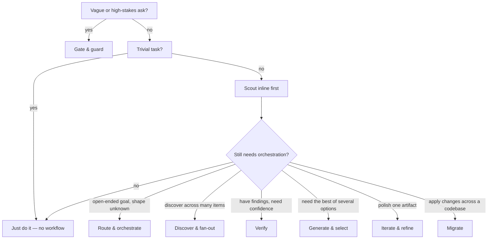

# Workflow catalog (quick reference)

**Date:** 2026-07-01 | **Status:** durable reference | **Scope:** 25 dynamic-workflow scaffolds in `pandi-dynamic-workflows`

Before you write a workflow from scratch, check here: this is the index of every built-in
scaffold, grouped by family, so you can pick a pattern instead of reinventing one. Most tasks
don't need any of this — a single agent call beats a workflow for almost everything; reach for
a scaffold only for scale, exhaustiveness, or independent verification.

```text
dynamic_workflow action=scaffold name=fan-out-and-synthesize
```

runs the default/base scaffold (see its row below) — it's what `dynamic_workflow action=scaffold`
and the Patterns tab serve when you don't pick a pattern — so you can see the shape of a result
before choosing a bigger pattern.

**Source of truth (do not hand-maintain the list against these):**

- Live catalog: `dynamic_workflow action=scaffold` (or `/workflow patterns`); fetch one with `action=scaffold name=<key>`.
- Scaffold code: `extensions/pandi-dynamic-workflows/scaffolds/*.js` (pi) and `.claude/workflows/*.js` (Claude Code) — 25 each.
- Full HTML pages per scaffold: `docs/html/scaffolds/<key>.html`.
- The `ultracode` skill (`.pi/skills/ultracode/SKILL.md`) carries the same catalog by family.

**Completeness check (2026-07-01):** 25 pi scaffolds, 25 Claude workflows, 25 in the skill's bundled reference. The skill's "pattern catalog" section names all 25 with no extras.

## Which family do I need?

Walk the gates first — most tasks stop early:



| Your problem | Family | Example scaffold |
| --- | --- | --- |
| Ask is fuzzy or risky — need ask-vs-proceed decided | Gate & guard | `contract-gate` |
| Don't want to pick the workflow yourself | Route & orchestrate | `router` |
| Goal is open-ended, subtasks unknown up front | Route & orchestrate | `orchestrator-workers` |
| Need broad coverage of a known-ish list of items | Discover & fan-out | `fan-out-and-synthesize` |
| Set to discover is unknown-size | Discover & fan-out | `loop-until-dry` |
| Have findings/claims, want only the ones that survive scrutiny | Verify | `adversarial-verify` |
| Must prove a bug with a failing run, not argue it | Verify | `bug-verify` |
| Want the best of N candidates, absolute scoring unreliable | Generate & select | `tournament` |
| One artifact needs polishing, not a fresh chorus | Iterate & refine | `self-refine` |
| Mutating many files, can't leave one broken | Migrate | `large-migration` |

---

## 🚪 Gate & guard — frame and protect

| Workflow | What it does | Use cases | Use over its neighbor when… |
| --- | --- | --- | --- |
| [`contract-gate`](../scaffolds/contract-gate.md) | Turn a vague ask into an inspectable contract (improved task, success criteria, assumptions, non-goals) and decide *ask-now vs proceed-on-a-recorded-assumption*. | Scope a fuzzy ticket; gate before a costly multi-agent run; rewrite a raw ask into a clean spec. | The problem is *what should we even do*, not *is this output safe* — use `guardrails` for the latter. |
| [`guardrails`](../scaffolds/guardrails.md) | Cheap input/output tripwire that **HALTS** on a clear violation; can wrap any workflow via `protect:{name,args}`. | Scope/safety gate before an agent; PII/secret check on an output; wrap a chosen workflow with tripwires. | You already know the task and just need a hard limit (PII, secrets) enforced around it or its output. |

## 🧭 Route & orchestrate

| Workflow | What it does | Use cases | Use over its neighbor when… |
| --- | --- | --- | --- |
| [`router`](../scaffolds/router.md) | Classify a request and dispatch to the single best catalog workflow (or recommend-only). | A single front door for raw tasks; map a task to the right specialist; preview the pick with `runSelected:false`. | You want the *pattern itself* picked for you — `orchestrator-workers` still needs you to hand it a goal. |
| [`orchestrator-workers`](../scaffolds/orchestrator-workers.md) | A planner decomposes an open goal into a `dependsOn` subtask graph; workers execute level-by-level; an integrator merges. | Multi-part deliverables; research/build goals with interdependencies. | Subtasks and their dependencies aren't known up front — `map-reduce` assumes chunks are already independent. |
| [`map-reduce`](../scaffolds/map-reduce.md) | Hierarchical map-reduce: per-chunk map under an evidence contract, reduce in bounded batches to one summary-of-summaries. | Input bigger than one context window: huge doc/log, hundreds of tickets. | The input is bigger than one context window and chunks are independent, unlike `orchestrator-workers`' dependency graph. |
| [`workflow-factory`](../scaffolds/workflow-factory.md) | Meta-workflow: catalog → plan → generate → review → refine, then write `.pi/workflows/drafts/<slug>.js`. | No existing workflow fits and you want a task-specific one; specialize the closest scaffold. | Nothing in this catalog fits, even after specializing the closest scaffold. |
| [`recursive-compose`](../scaffolds/recursive-compose.md) | Reference (pi, depth ≤ 3): a node re-gates a sub-task via `contract-gate`, then dispatches via `router` — bounded recursion. | Self-similar gate→compose pipelines; carry the gate's resource plan into a deeper run. | You need the gate→dispatch pattern to recurse into sub-tasks, not just run once. |

## 🔍 Discover & fan-out

| Workflow | What it does | Use cases | Use over its neighbor when… |
| --- | --- | --- | --- |
| [`fan-out-and-synthesize`](../scaffolds/fan-out-and-synthesize.md) | Scatter-gather: scout a work-list, one reviewer per item (parallel, settle), synthesize-as-judge with coverage/failure notes. | Broad independent coverage of a known-ish work-list; multi-angle synthesis. | The work-list is known-ish and every item deserves a look — `scout-fanout` skips low-risk items instead. |
| [`scout-fanout`](../scaffolds/scout-fanout.md) | Scout + adaptive-depth pipeline: risk-classify every file cheaply, deep-review only high/medium; low-risk short-circuits. | Triage-then-review a large tree; spend budget only where it pays. | You want coverage but only want to pay for the risky items. |
| [`repo-bug-hunt`](../scaffolds/repo-bug-hunt.md) | Scout files, per-file bug reviewers, judge dedupes + prioritizes with citations. Findings are **leads**, not confirmed bugs. | Repo audit; pre-review sweep (then confirm with `bug-verify`). | You want a prioritized cited bug list — pair with `bug-verify` after, since these leads are unconfirmed. |
| [`loop-until-dry`](../scaffolds/loop-until-dry.md) | Keep fanning out finders until K consecutive quiet rounds or `maxRounds`. | Unknown-size set you want to exhaust: "find all call-sites / edge-cases". | The set is unknown-size and you need exhaustiveness, unlike the capped list in `fan-out-and-synthesize`. |
| [`react-scout`](../scaffolds/react-scout.md) | ReAct reason → act → observe loop: each step grounds a thought in a real read-only observation. | Evidence-grounded investigation before committing or fanning out. | You need evidence *before* committing to a fan-out, not coverage of a list. |
| [`complex-research`](../scaffolds/complex-research.md) | Independent research angles (each runs web search), synthesized as judge with citations and coverage gaps. | Cited answer to an external question: tech comparisons, landscape scans. | The question is external (needs the web), not something answerable by reading this repo. |

## ✅ Verify

| Workflow | What it does | Use cases | Use over its neighbor when… |
| --- | --- | --- | --- |
| [`adversarial-verify`](../scaffolds/adversarial-verify.md) | Per-finding skeptic jury that prunes by majority refutation; default-to-doubt. | Prune a noisy findings list; drop hallucinated findings before acting. | You have many findings/claims to prune by argument, not by running code — use `bug-verify` for the latter. |
| [`bug-verify`](../scaffolds/bug-verify.md) | Confirm suspected bugs by **reproduction**: real only if a run fails on current code; optional FAIL→PASS fix check + minimization. Sequential. | Confirm `repo-bug-hunt` leads; reproduce-and-fix loop. | You must prove it with a failing run (e.g. confirming `repo-bug-hunt` leads), not argue it. |
| [`verify-claims-lib`](../scaffolds/verify-claims-lib.md) | Reusable sub-workflow: verify `{claims, skeptics?}` with skeptic juries; returns verified/dropped/votes/coverage. | A verification building block for a parent workflow. | You're authoring a *parent* workflow (like `composition-driver`) and need verification as a building block. |
| [`adversarial-plan-review`](../scaffolds/adversarial-plan-review.md) | N fixed-angle reviewers (correctness, security, maintainability, scope) synthesize a revised plan. | Design/RFC review; pre-implementation gate. | The artifact under review is a *plan*, not code or claims — use before implementation starts. |

## 🎯 Generate & select

| Workflow | What it does | Use cases | Use over its neighbor when… |
| --- | --- | --- | --- |
| [`judge-escalate`](../scaffolds/judge-escalate.md) | Generate candidates from distinct angles, typed judge, escalate only when confidence is low. | Best-of-N where you'd rather deepen than commit to a weak winner. | There's usually a clear winner and you want adaptive spend, not always-run-everything. |
| [`tournament`](../scaffolds/tournament.md) | Single-elimination bracket: pairwise judge rounds until one candidate survives. | Pick the best of several drafts/designs when absolute scoring is unreliable but pairwise is easy. | Absolute scoring is unreliable but pairwise comparison is easy. |
| [`self-consistency`](../scaffolds/self-consistency.md) | Sample N independent reasoning paths, pick by consensus (vote), tie-broken by an evidence-weighing judge. | High-variance reasoning/math/judgment; report the consensus margin. | It's high-variance reasoning/math and agreement across paths is the signal you trust. |
| [`tree-of-thoughts`](../scaffolds/tree-of-thoughts.md) | Beam search over partial solutions: expand K thoughts, judge-score, prune to top-B, recurse to depth, commit. | Multi-step planning/design search; explore a solution space. | The problem has intermediate steps worth exploring, not just final candidates to compare. |

## 🔁 Iterate & refine

| Workflow | What it does | Use cases | Use over its neighbor when… |
| --- | --- | --- | --- |
| [`self-refine`](../scaffolds/self-refine.md) | Bounded in-place generate → critique → refine with verbal memory; quiet-stop when the critic is satisfied. | Polish one artifact (doc/spec/code) to quality. | One artifact needs polish and the critique can be intrinsic — no external oracle needed. |
| [`reflexion`](../scaffolds/reflexion.md) | Verbal-RL outer trial loop: re-attempt each trial carrying self-reflections; evaluator can be externally grounded (`verifyCmd`). | Code-with-tests; tasks with a pass/fail oracle; reset-and-re-attempt vs edit-in-place. | You have a pass/fail oracle (e.g. tests) and a fresh re-attempt beats editing in place. |

## 🚚 Migrate

| Workflow | What it does | Use cases | Use over its neighbor when… |
| --- | --- | --- | --- |
| [`large-migration`](../scaffolds/large-migration.md) | A real applier: green-baseline gate, per-file apply → verify → bounded-repair, rollback on failure. Sequential. | API/codemod rollouts; framework upgrades; capped, evidence-backed migration. | You're mutating many files and must never leave a broken one behind — not for read-only discovery. |

## 🧩 Compose & meta

| Workflow | What it does | Use cases | Use over its neighbor when… |
| --- | --- | --- | --- |
| [`composition-driver`](../scaffolds/composition-driver.md) | Parent workflow: discover claims, delegate verification to `verify-claims-lib`, then synthesize. | Fact-check a document; the canonical discover→verify composition reference. | You want the canonical worked example of discover→verify composition, not just the library piece alone. |

---

## Next steps

- Keep this in sync when scaffolds are added/removed: re-run `dynamic_workflow action=scaffold` and diff the names against `extensions/pandi-dynamic-workflows/scaffolds/*.js`.
- For per-workflow input shapes and primitives, see the live catalog output (each entry lists a sample `Input` and `Primitives`) or the linked HTML page per scaffold.
