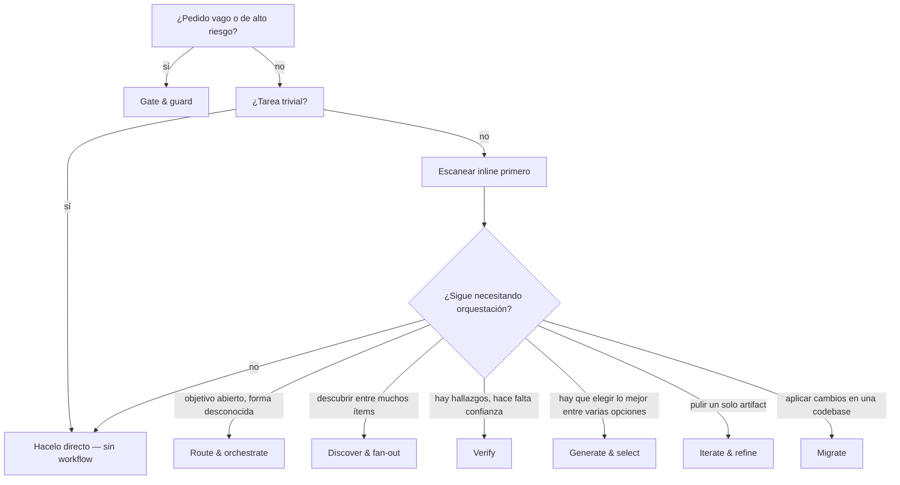

# Catálogo de workflows (referencia rápida)

**Fecha:** 2026-07-01 | **Estado:** referencia durable | **Alcance:** 25 scaffolds de dynamic workflows en `pandi-dynamic-workflows`

Antes de escribir un workflow desde cero, mirá acá: este índice reúne todos los scaffolds integrados, agrupados por familia, para que elijas un patrón en vez de reinventarlo. La mayoría de las tareas no necesita nada de esto: una sola llamada a un agente gana en casi todo; usá un scaffold solo cuando necesites escala, exhaustividad o verificación independiente.

```text
dynamic_workflow action=scaffold name=fan-out-and-synthesize
```

Este comando ejecuta el scaffold base o por defecto (ver su fila más abajo) — es lo que muestra `dynamic_workflow action=scaffold` y la pestaña **Patterns** cuando no elegís un patrón —, así podés ver la forma de una salida antes de subir a un patrón más grande.

**Fuente de verdad (no mantengas esta lista a mano):**

- Catálogo vivo: `dynamic_workflow action=scaffold` (o `/workflow patterns`); para uno puntual, `action=scaffold name=<key>`.
- Código de scaffolds: `extensions/pandi-dynamic-workflows/scaffolds/*.js` (pi) y `.claude/workflows/*.js` (Claude Code) — 25 en cada caso.
- Páginas HTML completas por scaffold: `docs/html/scaffolds/<key>.html`.
- El skill `ultracode` (`.pi/skills/ultracode/SKILL.md`) expone el mismo catálogo por familia.

**Chequeo de completitud (2026-07-01):** 25 scaffolds de pi, 25 workflows de Claude y 25 en la referencia empaquetada del skill. La sección "pattern catalog" del skill nombra los 25 sin extras.

## ¿Qué familia necesito?

Recorré primero las compuertas: la mayoría de las tareas se resuelve antes de llegar al fondo.



| Tu problema | Familia | Scaffold de ejemplo |
| --- | --- | --- |
| El pedido es difuso o riesgoso — hay que decidir si proceder | Gate & guard | `contract-gate` |
| No querés elegir el workflow vos | Route & orchestrate | `router` |
| El objetivo es abierto y las subtareas no se conocen de antemano | Route & orchestrate | `orchestrator-workers` |
| Necesitás cobertura amplia sobre una lista más o menos conocida | Discover & fan-out | `fan-out-and-synthesize` |
| El conjunto a descubrir tiene tamaño desconocido | Discover & fan-out | `loop-until-dry` |
| Tenés hallazgos/afirmaciones y querés solo los que sobreviven al escrutinio | Verify | `adversarial-verify` |
| Hay que probar un bug con una ejecución fallida, no discutirlo | Verify | `bug-verify` |
| Querés el mejor de N candidatos, pero el score absoluto no es confiable | Generate & select | `tournament` |
| Un artifact necesita pulido, no una ronda nueva de generación | Iterate & refine | `self-refine` |
| Vas a mutar muchos archivos y no podés dejar ninguno roto | Migrate | `large-migration` |

---

## 🚪 Gate & guard — encuadrar y proteger

| Workflow | Qué hace | Casos de uso | Usalo en lugar de su vecino cuando… |
| --- | --- | --- | --- |
| [`contract-gate`](../scaffolds/contract-gate.md) | Convierte un pedido vago en un contrato inspeccionable (tarea mejorada, criterios de éxito, supuestos, no-objetivos) y decide *preguntar ahora vs seguir con un supuesto registrado*. | Delimitar un ticket difuso; poner una compuerta antes de una corrida multi-agente costosa; reescribir un pedido crudo en una especificación limpia. | El problema es *qué deberíamos hacer*, no *si esta salida es segura* — para eso usá `guardrails`. |
| [`guardrails`](../scaffolds/guardrails.md) | Tripwire barato de entrada/salida que **se detiene** ante una violación clara; puede envolver cualquier workflow vía `protect:{name,args}`. | Compuerta de alcance/seguridad antes de un agente; chequeo de PII/secretos en una salida; envolver un workflow con tripwires. | Ya sabés la tarea y solo necesitás un límite duro (PII, secretos) aplicado alrededor de ella o de su salida. |

## 🧭 Route & orchestrate

| Workflow | Qué hace | Casos de uso | Usalo en lugar de su vecino cuando… |
| --- | --- | --- | --- |
| [`router`](../scaffolds/router.md) | Clasifica un pedido y lo deriva al workflow del catálogo más adecuado (o devuelve recomendación solamente). | Una puerta de entrada única para tareas crudas; mapear una tarea al especialista correcto; previsualizar la elección con `runSelected:false`. | Querés que te elijan el *patrón mismo* — `orchestrator-workers` todavía necesita que le des un objetivo. |
| [`orchestrator-workers`](../scaffolds/orchestrator-workers.md) | Un planificador descompone un objetivo abierto en un grafo de subtareas `dependsOn`; los workers ejecutan nivel por nivel; un integrador fusiona. | Entregables de varias partes; objetivos de research/build con interdependencias. | Las subtareas y sus dependencias no se conocen de antemano — `map-reduce` asume que los chunks ya son independientes. |
| [`map-reduce`](../scaffolds/map-reduce.md) | Map-reduce jerárquico: map por chunk bajo un contrato de evidencia, reduce en lotes acotados hasta una summary-of-summaries. | Entrada más grande que una ventana de contexto: docs/logs enormes, cientos de tickets. | La entrada supera una ventana de contexto y los chunks son independientes, a diferencia del grafo de dependencias de `orchestrator-workers`. |
| [`workflow-factory`](../scaffolds/workflow-factory.md) | Meta-workflow: catalogar → planificar → generar → revisar → refinar, y después escribir `.pi/workflows/drafts/<slug>.js`. | Ningún workflow existente encaja y querés uno específico para la tarea; especializar el scaffold más cercano. | Nada en este catálogo encaja, incluso después de especializar el scaffold más cercano. |
| [`recursive-compose`](../scaffolds/recursive-compose.md) | Referencia (pi, profundidad ≤ 3): un nodo vuelve a poner una compuerta sobre una sub-tarea vía `contract-gate` y luego deriva con `router` — recursión acotada. | Pipelines autosemejantes de gate→compose; llevar el plan de recursos de la compuerta a una ejecución más profunda. | Necesitás que el patrón gate→dispatch recurra sobre subtareas, no solo correr una vez. |

## 🔍 Discover & fan-out

| Workflow | Qué hace | Casos de uso | Usalo en lugar de su vecino cuando… |
| --- | --- | --- | --- |
| [`fan-out-and-synthesize`](../scaffolds/fan-out-and-synthesize.md) | Scatter-gather: releva una lista de trabajo, un revisor por ítem (parallel, settle), y sintetiza como juez con notas de cobertura/fallas. | Cobertura amplia e independiente de una lista más o menos conocida; síntesis con varios ángulos. | La lista de trabajo es más o menos conocida y cada ítem merece mirarse — `scout-fanout` omite los de bajo riesgo. |
| [`scout-fanout`](../scaffolds/scout-fanout.md) | Pipeline de profundidad adaptativa: clasifica el riesgo de cada archivo barato, revisa en profundidad solo los de riesgo alto/medio; los de bajo riesgo cortan temprano. | Triage y revisión de un árbol grande; gastar presupuesto solo donde rinde. | Querés cobertura pero solo querés pagar por los ítems riesgosos. |
| [`repo-bug-hunt`](../scaffolds/repo-bug-hunt.md) | Escanea archivos, asigna revisores por archivo, y el juez deduplica y prioriza con citas. Los hallazgos son **leads**, no bugs confirmados. | Auditoría del repo; barrido previo a revisión (y después confirmar con `bug-verify`). | Querés una lista priorizada de bugs con citas — emparejalo después con `bug-verify`, porque estos leads no están confirmados. |
| [`loop-until-dry`](../scaffolds/loop-until-dry.md) | Sigue fan-out de buscadores hasta K rondas silenciosas consecutivas o `maxRounds`. | Conjunto de tamaño desconocido que querés agotar: "encontrar todos los call-sites / edge-cases". | El conjunto es de tamaño desconocido y necesitás exhaustividad, a diferencia de la lista acotada en `fan-out-and-synthesize`. |
| [`react-scout`](../scaffolds/react-scout.md) | Loop ReAct reason → act → observe: cada paso ancla un pensamiento en una observación real de solo lectura. | Investigación basada en evidencia antes de comprometerte o hacer fan-out. | Necesitás evidencia *antes* de comprometerte con un fan-out, no cobertura de una lista. |
| [`complex-research`](../scaffolds/complex-research.md) | Ángulos de research independientes (cada uno corre web search), sintetizados como juez con citas y vacíos de cobertura. | Respuesta citada a una pregunta externa: comparaciones técnicas, barridos de panorama. | La pregunta es externa (requiere la web), no algo que pueda responderse leyendo este repo. |

## ✅ Verify

| Workflow | Qué hace | Casos de uso | Usalo en lugar de su vecino cuando… |
| --- | --- | --- | --- |
| [`adversarial-verify`](../scaffolds/adversarial-verify.md) | Jurado escéptico por hallazgo que filtra por refutación mayoritaria; default-to-doubt. | Podar una lista ruidosa de hallazgos; descartar hallazgos alucinados antes de actuar. | Tenés muchos hallazgos/afirmaciones para podar por argumento, no ejecutando código — para eso usá `bug-verify`. |
| [`bug-verify`](../scaffolds/bug-verify.md) | Confirma bugs sospechados por **reproducción**: solo son reales si una corrida falla en el código actual; chequeo opcional FAIL→PASS y minimización. Secuencial. | Confirmar leads de `repo-bug-hunt`; loop reproducir-y-corregir. | Tenés que probarlo con una corrida fallida (por ejemplo, confirmando leads de `repo-bug-hunt`), no argumentarlo. |
| [`verify-claims-lib`](../scaffolds/verify-claims-lib.md) | Subworkflow reutilizable: verifica `{claims, skeptics?}` con jurados escépticos; devuelve verified/dropped/votes/coverage. | Bloque de verificación para un workflow padre. | Estás escribiendo un workflow *padre* (como `composition-driver`) y necesitás verificación como bloque de construcción. |
| [`adversarial-plan-review`](../scaffolds/adversarial-plan-review.md) | N revisores con ángulos fijos (correctness, security, maintainability, scope) sintetizan un plan revisado. | Revisión de diseño/RFC; compuerta pre-implementación. | El artifact bajo revisión es un *plan*, no código ni afirmaciones — usalo antes de empezar a implementar. |

## 🎯 Generate & select

| Workflow | Qué hace | Casos de uso | Usalo en lugar de su vecino cuando… |
| --- | --- | --- | --- |
| [`judge-escalate`](../scaffolds/judge-escalate.md) | Genera candidatos desde ángulos distintos, un juez tipado, y escala solo cuando la confianza es baja. | Best-of-N donde preferís profundizar antes que quedar atado a un ganador débil. | Suele haber un ganador claro y querés gasto adaptativo, no correr siempre todo. |
| [`tournament`](../scaffolds/tournament.md) | Bracket de eliminación simple: rondas de juicio por pares hasta que sobrevive un candidato. | Elegir el mejor de varios borradores/diseños cuando el score absoluto no es confiable pero comparar por pares es fácil. | El score absoluto no es confiable pero la comparación por pares sí. |
| [`self-consistency`](../scaffolds/self-consistency.md) | Muestra N rutas de razonamiento independientes, elige por consenso (vote), con desempate de un juez que pondera evidencia. | Razonamiento/matemática/juicio de alta varianza; reportá el margen de consenso. | El razonamiento/matemática es de alta varianza y la señal que confiás es el acuerdo entre rutas. |
| [`tree-of-thoughts`](../scaffolds/tree-of-thoughts.md) | Beam search sobre soluciones parciales: expande K pensamientos, puntúa con un juez, poda a top-B, recurre por profundidad, commit. | Planificación/diseño de varios pasos; explorar un espacio de soluciones. | El problema tiene pasos intermedios que vale la pena explorar, no solo candidatos finales para comparar. |

## 🔁 Iterate & refine

| Workflow | Qué hace | Casos de uso | Usalo en lugar de su vecino cuando… |
| --- | --- | --- | --- |
| [`self-refine`](../scaffolds/self-refine.md) | Loop acotado in-place de generar → criticar → refinar con memoria verbal; se detiene en silencio cuando el crítico queda conforme. | Pulir un artifact (doc/spec/code) hasta calidad. | Un solo artifact necesita pulido y la crítica puede ser intrínseca — no hace falta un oráculo externo. |
| [`reflexion`](../scaffolds/reflexion.md) | Loop outer trial de verbal-RL: reintenta cada trial llevando auto-reflexiones; el evaluador puede estar anclado externamente (`verifyCmd`). | Code-with-tests; tareas con oráculo pass/fail; reset-and-re-attempt en vez de editar in place. | Tenés un oráculo pass/fail (por ejemplo, tests) y un reintento fresco gana a editar en el lugar. |

## 🚚 Migrate

| Workflow | Qué hace | Casos de uso | Usalo en lugar de su vecino cuando… |
| --- | --- | --- | --- |
| [`large-migration`](../scaffolds/large-migration.md) | Un aplicador real: compuerta de green-baseline, aplicar → verificar → repair acotado por archivo, rollback ante falla. Secuencial. | Rollouts de API/codemod; upgrades de frameworks; migración acotada y respaldada por evidencia. | Vas a mutar muchos archivos y no podés dejar ninguno roto atrás — no sirve para descubrimiento de solo lectura. |

## 🧩 Compose & meta

| Workflow | Qué hace | Casos de uso | Usalo en lugar de su vecino cuando… |
| --- | --- | --- | --- |
| [`composition-driver`](../scaffolds/composition-driver.md) | Workflow padre: descubre afirmaciones, delega la verificación a `verify-claims-lib`, y luego sintetiza. | Fact-check de un documento; la referencia canónica de composición discover→verify. | Querés el ejemplo trabajado canónico de composición discover→verify, no solo la pieza de la biblioteca por separado. |

---

## Próximos pasos

- Mantené esto en sync cuando se agreguen o eliminen scaffolds: reejecutá `dynamic_workflow action=scaffold` y compará los nombres contra `extensions/pandi-dynamic-workflows/scaffolds/*.js`.
- Para las formas de input y las primitives de cada workflow, mirá la salida del catálogo vivo (cada entrada lista un `Input` y `Primitives` de ejemplo) o la página HTML enlazada de cada scaffold.
