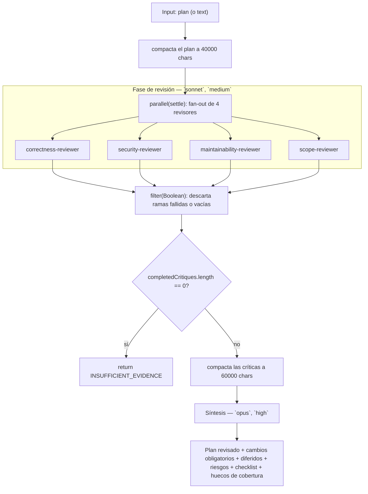

# adversarial-plan-review

> N revisores de ángulo fijo (corrección, seguridad, mantenibilidad, alcance) sintetizan un plan revisado.

## En 30 segundos

Este scaffold toma un plan de implementación y lo somete a cuatro críticas
independientes en paralelo. Sirve como filtro previo a implementar: encuentra
riesgos, huecos y sobrealcance antes de escribir código.

## Cómo lanzarlo

```bash
/workflow new revision-plan --pattern=adversarial-plan-review
```

Input típico (JSON):

```json
{
  "plan": "1. Agregar tabla users_v2...\n2. Migrar lecturas...\n3. Borrar tabla vieja..."
}
```

También acepta `input.text` como alias alternativo de `plan`. Debe venir al
menos uno de los dos: si faltan ambos, el workflow lanza `Pass { plan: "..." } as workflow input.`.

## Diagrama



## Qué hace

El scaffold implementa el patrón "fan-out adversarial + síntesis como juez":
cuatro agentes revisores, cada uno con un ángulo fijo y sin visibilidad de los
otros, critican el mismo plan de forma independiente y en paralelo. Cada
revisor recibe la instrucción explícita de que su crítica debe ser útil
incluso si los demás fallan, reforzando la independencia del ángulo.

Las ejecuciones usan `parallel` con semántica de *settle*: una rama que falla
resuelve a `null` en lugar de rechazar la promesa completa, así un revisor
caído no tira abajo la revisión entera. Después del fan-out se filtran los
`null` (fallos o salidas vacías) y se cuenta cuántos revisores completaron vs.
fallaron; ese conteo de cobertura se inyecta como dato explícito en el prompt
de síntesis para que el juez pueda dar cuenta de las ramas muertas.

Si los cuatro revisores fallan o devuelven vacío, el workflow corta antes de
sintetizar y devuelve `INSUFFICIENT_EVIDENCE` — nunca sintetiza "de la nada".
Con al menos una crítica completada, un único agente de síntesis (modelo
`opus`, effort `high`) fusiona, deduplica, resuelve contradicciones, descarta
afirmaciones no soportadas (salvo que estén marcadas como especulativas) y
produce el plan revisado final en formato prosa/markdown libre.

Tanto el plan de entrada como las críticas se envuelven con `fence(...)`, un
delimitador derivado por hash del contenido mismo: un payload malicioso no
puede falsificar el marcador de cierre porque insertarlo cambiaría el hash.
Esto neutraliza intentos de inyección de instrucciones dentro del plan o las
críticas (cambios de rol, manipulación de veredicto, "ignore previous", etc.),
que se tratan siempre como datos a analizar, nunca como órdenes.

## Cuándo usarlo

- Revisión de diseño/RFC antes de implementar.
- Filtro previo a la implementación de un plan.
- Para buscar activamente razones para NO enviar un plan tal cual está.
- **No usarlo** para revisar código ya escrito (usá un scaffold orientado a
  revisión de diffs/PRs) ni cuando el plan es trivial y no justifica 5
  llamadas a agentes (4 revisores + 1 síntesis).

## Cómo funciona

**Fase de revisión.** Se arma un arreglo fijo de 4 revisores
(`correctness-reviewer`, `security-reviewer`, `maintainability-reviewer`,
`scope-reviewer`), cada uno con su propio ángulo de análisis. Se lanzan con
`parallel(...)`, cada uno como una llamada a `agent(...)` sin schema (salida en
texto libre), modelo `sonnet` y effort `medium` por defecto — overrideables
vía `input.model` / `input.effort` globales o `input.models["reviewer"]` /
`input.efforts["reviewer"]` por rol (ver helper `node()`). Cada revisor recibe
un contrato compartido (`sharedContract`) que exige: no editar archivos, no
asumir que otros revisores cubren huecos, citar archivo/línea cuando el plan
referencia código, separar hallazgos confirmados de riesgos especulativos, y
decir `INSUFFICIENT_EVIDENCE` si falta evidencia. El formato de salida esperado
por revisor es: `Verdict`, `Must-fix issues`, `Should-fix issues`,
`Questions/missing evidence`, `Smallest safe path`. Al terminar cada rama, la
salida se envuelve en `{ name, output }`; salidas `null` o vacías se descartan
con `filter(Boolean)`.

**Fase de síntesis.** Si `completedCritiques.length === 0`, el workflow retorna
inmediatamente el string `INSUFFICIENT_EVIDENCE: ...` sin invocar síntesis. Si
no, arma un único `agent(...)` con modelo `opus` y effort `high`, al que le
pasa las críticas completadas (compactadas a 60000 caracteres) y los números
de cobertura (revisores solicitados, completados, fallados). El prompt instruye
el patrón "synthesis-as-judge": deduplicar, resolver contradicciones,
descartar afirmaciones no soportadas salvo marcadas especulativas, preservar
riesgos aceptados y mencionar explícitamente los revisores fallidos/vacíos. El
formato de salida pedido es: plan revisado en orden, cambios obligatorios,
cambios opcionales/diferidos, riesgos aceptados y por qué, checklist de
validación, huecos de cobertura/revisores fallidos.

No hay caching explícito en el código; el manejo de fallos parciales se
resuelve enteramente vía `parallel` con semántica settle + `filter(Boolean)`.

## Input y output

| Campo | Tipo | Requerido | Notas |
|---|---|---|---|
| `plan` (o `text`) | string | sí | Plan de implementación a revisar. `plan` y `text` son alias alternativos; si faltan ambos, lanza error. |
| `model` / `effort` | string | no | Defaults globales aplicados a cada nodo. |
| `models[role]` / `efforts[role]` | object | no | Overrides por rol (`reviewer`, `plan-synthesis`). |
| `tools` / `toolsByRole`, `skills` / `skillsByRole`, `excludeTools` / `excludeByRole` | array/object | no | Overrides de tools/skills por rol o globales. |

Límites: el plan se trunca (`compact`) a 40000 caracteres antes de revisarlo;
las críticas combinadas se truncan a 60000 caracteres antes de sintetizarlas.
El número de revisores es fijo en 4 (no configurable desde el input).

Salida: string de markdown en texto libre (sin schema) — el plan revisado
final, o `INSUFFICIENT_EVIDENCE: ...` si los 4 revisores fallaron o vinieron
vacíos. No se observan llamadas a `writeArtifact` en el código: el resultado
es el valor de retorno del workflow.

## Fases

1. **Revisión** — fan-out en paralelo de 4 revisores de ángulo fijo (`parallel`
   con semántica settle), cada uno vía `agent(...)` sin schema.
2. **Síntesis** — un único `agent(...)` (`opus`, `high`) fusiona las críticas
   completadas en un plan revisado, dando cuenta de los huecos de cobertura.
