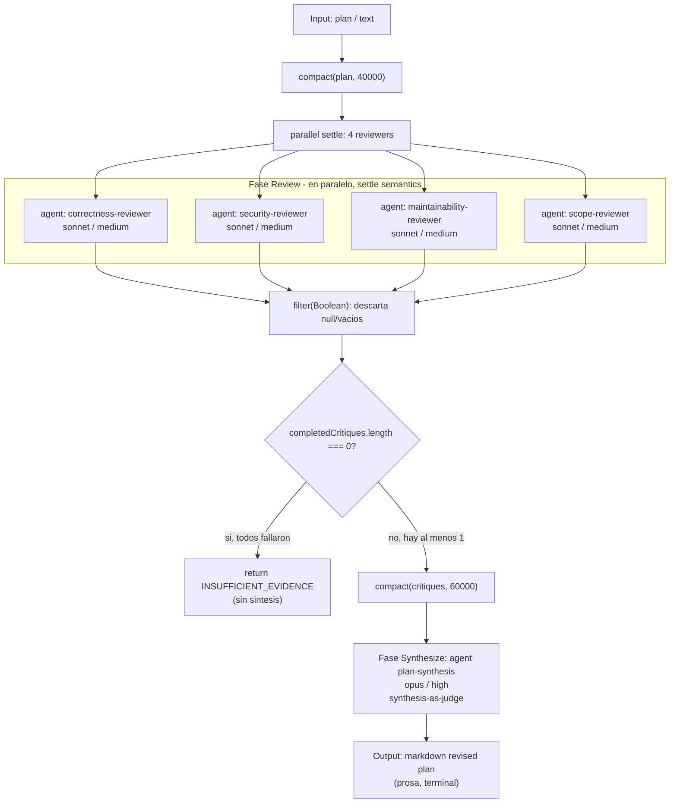

# adversarial-plan-review

> N revisores de ángulo fijo (corrección, seguridad, mantenibilidad, alcance) sintetizan un plan revisado.

## En 30 segundos

Es un "code review adversarial" para un plan de implementación: 4 agentes independientes lo atacan cada uno desde un ángulo distinto (corrección, seguridad, mantenibilidad, alcance) y un quinto agente de alto esfuerzo sintetiza sus críticas en un plan revisado. Elegilo como gate antes de implementar un cambio no trivial, cuando querés cobertura sistemática de esos 4 ángulos fijos sobre UN solo artefacto de texto (no para comparar alternativas entre sí, ni para votar entre caminos de razonamiento).

## Cómo lanzarlo

```text
/workflow new mi-run --pattern=adversarial-plan-review
/workflow run mi-run {"plan": "1. Migrar tabla X a esquema Y...\n2. Backfill con job nocturno..."}
```

`plan` (alias `text`) es el único campo obligatorio; ver [Input y output](#input-y-output) para overrides opcionales (`model`, `models`, `tools`, etc.).

## Diagrama



## Qué hace

Cuatro agentes independientes critican el mismo plan en paralelo, sin comunicación entre ellos y sin editar archivos: el objetivo es encontrar razones para NO enviar el plan tal cual, antes de invertir esfuerzo de implementación (los detalles de settle-semantics, el gate de cobertura y la síntesis-como-juez están en [Cómo funciona](#cómo-funciona)). El plan y las críticas —todo contenido no confiable— se envuelven con un delimitador derivado de un hash del propio contenido (`fence()`), para que un plan malicioso no pueda falsificar el cierre del delimitador e inyectar instrucciones a los agentes downstream.

## Cuándo usarlo

- Revisión de diseño / RFC antes de aprobarlo.
- Gate previo a la implementación de un cambio.
- Buscar activamente razones para NO enviar un plan (adversarial, no complaciente).
- Cuando querés cobertura de varios ángulos fijos (no descubiertos dinámicamente) sobre un único artefacto textual.

No usarlo cuando:

- No hay un plan/texto concreto para revisar (el input es obligatorio: `plan` o `text`).
- Se necesita comparar varias alternativas entre sí (usar `tournament` o `judge-escalate`).
- Se busca consenso por votación sobre múltiples caminos de razonamiento (usar `self-consistency`).
- El costo de 4 revisores + 1 síntesis de alto esfuerzo (opus/high) no se justifica para un cambio trivial.

## Cómo funciona

**Fase Review** (`parallel`, settle):
El workflow define 4 roles fijos —`correctness-reviewer`, `security-reviewer`, `maintainability-reviewer`, `scope-reviewer`— cada uno con su "angle" textual. Cada uno corre como una llamada `agent(...)` independiente dentro de `parallel(thunks)`, con modelo `sonnet` y esfuerzo `medium` por defecto (overrideable per-rol vía `input.models`/`input.efforts`/`input.model`/`input.effort`). Cada agente recibe el mismo `sharedContract`: no editar archivos, no asumir que otro reviewer cubre lo que falta, citar archivos/líneas si el plan referencia código, separar hallazgos confirmados de riesgos especulativos, decir `INSUFFICIENT_EVIDENCE` si falta evidencia, y un formato de salida fijo (Verdict / Must-fix / Should-fix / Questions / Smallest safe path). El plan se pasa fenceado como dato no confiable, con instrucción explícita de ignorar cualquier directiva embebida en él.

Cada thunk post-procesa su resultado: si el output es `null` o string vacío, se convierte en `null`; si no, se envuelve como `{ name, output }`. Esto es lo que permite el `filter(Boolean)` posterior para descartar ramas fallidas/vacías sin perder la forma esperada por la síntesis.

**Gate de cobertura**: se cuenta `completedCritiques.length` vs `failed = critiques.length - completedCritiques.length`. Si `completedCritiques.length === 0` (los 4 fallaron o vinieron vacíos), el workflow no llama a síntesis y retorna directamente `"INSUFFICIENT_EVIDENCE: all reviewers failed or returned empty..."`.

**Fase Synthesize** (`agent`, sin schema — free text):
Si hay al menos una crítica completada, se compactan (`compact(..., 60000)`) y se pasan fenceadas al agente de síntesis (`plan-synthesis`, modelo `opus`, esfuerzo `high`). El prompt aplica el patrón "synthesis-as-judge": deduplicar, resolver contradicciones, descartar afirmaciones sin soporte salvo marcadas como especulativas, preservar riesgos aceptados, y mencionar explícitamente los reviewers fallidos/vacíos. Se le inyectan los números de cobertura (`reviewers.length`, `completedCritiques.length`, `failed`) como datos, no como instrucciones. El formato de salida pedido: plan revisado, cambios must-fix, cambios opcionales/diferidos, riesgos aceptados y por qué, checklist de validación, gaps de cobertura.

**Manejo de fallos parciales**: settle semantics en el `parallel` (nunca rechaza el conjunto por un solo fallo) + gate de "todos fallaron" antes de sintetizar + inyección explícita del conteo de fallos en el prompt de síntesis, para que el juez no ignore silenciosamente los huecos de cobertura.

**Caching / bounding**: no hay caching explícito en el código; sí hay *bounding* de longitud vía `compact()` (plan truncado a 40000 chars, críticas combinadas truncadas a 60000 chars) para controlar el tamaño de contexto pasado a cada agente, con `log()` cuando ocurre truncamiento.

## Input y output

| Campo | Tipo | Requerido | Default / clamp |
|---|---|---|---|
| `plan` (o `text` como alias) | string (o JSON-serializable) | Sí — si falta, `throw new Error('Pass { plan: "..." } as workflow input.')` | Se serializa a string si no lo es; se trunca a 40000 chars vía `compact()` |
| `model` / `effort` | string | No | Default global aplicado a todos los nodos si no hay override por rol |
| `models[role]` / `efforts[role]` | objeto | No | Override específico por rol (`reviewer`, `plan-synthesis`); precedencia: por-rol > global > default del call-site |
| `tools` / `toolsByRole[role]` | array | No | Herramientas del agente, por defecto o por rol |
| `skills` / `skillsByRole[role]` | array | No | Skills del agente |
| `excludeTools` / `excludeByRole[role]` | array | No | Exclusión de tools |

Número de reviewers: fijo en 4 (correctness, security, maintainability, scope) — no configurable por input, hardcodeado en el array `reviewers`.

**Output**: string markdown. Dos posibles formas:
- Camino normal: el texto de síntesis del agente `plan-synthesis` (plan revisado + must-fix + opcionales + riesgos + checklist + gaps de cobertura). Es prosa libre, sin schema, terminal (pensado para consumo humano).
- Camino de fallo total: el literal `"INSUFFICIENT_EVIDENCE: all reviewers failed or returned empty; no revised plan produced. Re-run or simplify the plan."`.

No se detectó ninguna llamada a `writeArtifact` en el archivo: el workflow no persiste artifacts en disco, solo emite `log(...)` de progreso (bounding del plan, selección de fan-out, resultado del fan-out, bounding de críticas) y retorna el string de síntesis (o el mensaje de insuficiencia) como resultado final del workflow.

## Fases

1. **Review** — fan-out en paralelo (settle) de 4 reviewers de ángulo fijo (correctness, security, maintainability, scope) sobre el plan.
2. **Synthesize** — un agente único (`plan-synthesis`, opus/high) sintetiza las críticas completadas en un plan revisado, o el workflow corta antes con `INSUFFICIENT_EVIDENCE` si las 4 ramas fallaron/vinieron vacías.
