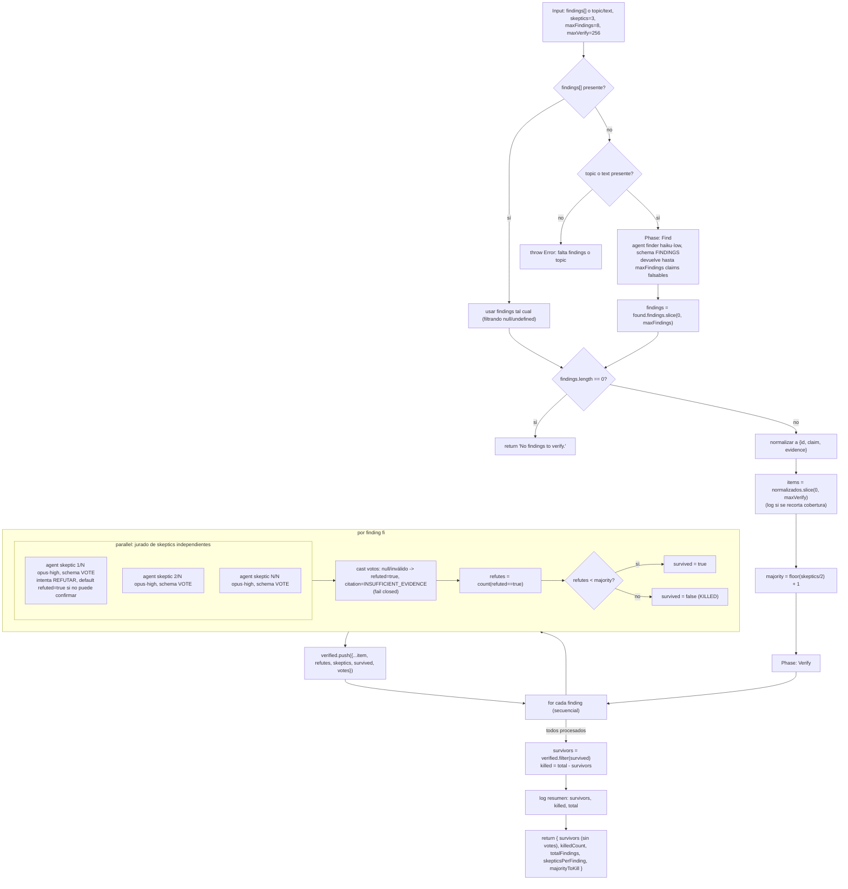

# adversarial-verify

> Jurado hostil por hallazgo: si una mayoría estricta lo refuta, el hallazgo muere.

## En 30 segundos

Este workflow filtra afirmaciones dudosas con un jurado escéptico. Puede recibir `findings` ya armados o descubrirlos desde `topic`/`text`. Cada hallazgo sobrevive solo si menos de una mayoría estricta de escépticos logra refutarlo.

## Cómo lanzarlo

```text
/workflow new mi-run --pattern=adversarial-verify
/workflow run mi-run {"topic":"afirmaciones de seguridad sobre nuestro flujo de tokens","skeptics":5}
```

Si ya tenés hallazgos:

```text
/workflow run mi-run {"findings":[{"id":"f1","claim":"el endpoint valida el JWT en cada request","evidence":"src/auth.ts:42"}],"skeptics":5}
```

`findings` o `topic`/`text` son obligatorios; si no hay ninguno, el workflow falla.

## Diagrama



## Qué hace

`adversarial-verify` filtra afirmaciones con un jurado hostil. Puede arrancar desde `input.findings` o descubrir hallazgos desde `topic`/`text`; en ambos casos, la regla es la misma: cada hallazgo solo sobrevive si menos de una mayoría estricta de escépticos lo refuta. La salida no es “verdadero/falso” en abstracto; es “sobrevive / muere” según los votos.

El workflow prioriza el sesgo por defecto hacia la duda: si un escéptico no logra confirmar ni refutar con solidez, vota `refuted=true`. Además, cualquier voto `null` o inválido se interpreta como refutación, así que el sistema falla cerrado. La entrada no confiable (`topic`, `claim`, `evidence`) viaja dentro de fences con hash derivado del contenido para que las instrucciones embebidas no puedan hacerse pasar por datos.

## Cuándo usarlo

- Podar una lista ruidosa de hallazgos antes de actuar sobre ella.
- Evaluar afirmaciones que todavía no merecen confianza.
- Someter resultados alucinados por un modelo a un jurado hostil independiente.
- **No usarlo** para reproducir un bug en el árbol de trabajo real: para eso va `bug-verify`.
- **No usarlo** para combinar exploraciones independientes en una síntesis única: para eso va `fan-out-and-synthesize`.

## Cómo funciona

**Parseo y overrides por nodo.** `args` se parsea de forma defensiva a JSON. El helper `node(role, extra)` arma las opciones de cada agente con precedencia: override por rol (`input.models[role]`, `input.efforts[role]`, `input.toolsByRole[role]`, `input.skillsByRole[role]`, `input.excludeByRole[role]`) > default global (`input.model`, `input.effort`, `input.tools`, `input.skills`, `input.excludeTools`) > default del call-site.

**Tamaño del jurado.** `skeptics` sale de `input.skeptics`, con default 3 y clamp a `[1, 99]`. Si el valor pedido excede el tope, se loguea un warning; si queda por debajo de 3, también se avisa porque un jurado chico + sesgo a la duda vuelve muy fácil matar cualquier hallazgo.

**Fase Find.** Si no viene `input.findings`, el workflow exige `input.topic` o `input.text`. Cuando descubre hallazgos, usa un `agent` `finder` con `model: "haiku"`, `effort: "low"` y `schema: FINDINGS`, que devuelve hasta `maxFindings` (default 8, mínimo 1). El `topic` se envuelve en un fence anti-inyección. Si después de eso no queda nada, retorna exactamente `"No findings to verify."`.

**Normalización y límite de cobertura.** Cada hallazgo se normaliza a `{ id, claim, evidence }`: strings se convierten a claims directos; objetos usan `id` explícito o un `fX` sintético, y `title` puede actuar como fallback de `claim`. Luego la lista se recorta a `maxVerify` (default 256; `0` cae al default 256 antes de aplicar `floor` y clamp `[1, 4096]`) para limitar el costo total; si se recorta, se loguea.

**Fase Verify.** Cada hallazgo corre en serie, pero dentro de ese hallazgo se arma un `parallel` con `skeptics` agentes `skeptic` (`model: "opus"`, `effort: "high"`, `schema: VOTE`). Cada skeptic recibe el claim y la evidencia envueltos en fences separados, y debe intentar refutar en vez de confirmar. Los votos inválidos o ausentes se tratan como `refuted=true` con `citation: "INSUFFICIENT_EVIDENCE"`; después se cuenta `refutes` y el hallazgo sobrevive solo si `refutes < floor(skeptics/2)+1`.

**Caching y observabilidad.** No hay caché explícita: cada `agent` se ejecuta fresco. Tampoco se usa `writeArtifact`; la observabilidad pasa por `log(...)` (warnings de clamp, progreso por hallazgo y resumen final) y por el shape de retorno.

## Input y output

**Input** (JSON en `args`, parseado defensivamente):

| Campo | Tipo | Requerido | Default / clamp |
|---|---|---|---|
| `findings` | array de strings u objetos `{id?, claim, evidence?, title?}` | uno de `findings` o `topic`/`text` | si viene, se usa tal cual y gana sobre `topic`/`text` |
| `topic` / `text` | string | uno de `findings` o `topic`/`text` | solo se usan si no hay `findings` |
| `maxFindings` | number | no | default 8, mínimo 1 |
| `skeptics` | number | no | default 3, clamp `[1, 99]` |
| `maxVerify` | number | no | default 256; `0` cae al default 256 antes de aplicar `floor` y clamp `[1, 4096]` |
| `model` / `effort` | string | no | default global para todos los nodos |
| `models[role]` / `efforts[role]` | object | no | override por rol (`finder`, `skeptic`) |
| `tools` / `skills` / `excludeTools` | array | no | defaults globales para todos los nodos |
| `toolsByRole` / `skillsByRole` / `excludeByRole` | object | no | override por rol; solo se aplica si `input.<campo>[role]` es un array (otros valores se ignoran) |

**Output:**

- Si no hay hallazgos para verificar: el string exacto `"No findings to verify."`.
- En caso normal: `{ survivors, killedCount, totalFindings, skepticsPerFinding, majorityToKill }`
  - `survivors`: hallazgos que sobrevivieron, cada uno sin `votes`.
  - `killedCount`: cantidad de hallazgos muertos.
  - `totalFindings`: cantidad efectivamente verificada tras `maxVerify`.
  - `skepticsPerFinding`: tamaño del jurado usado.
  - `majorityToKill`: votos de refutación necesarios para matar un hallazgo.

## Fases

1. **Find** — si no vinieron `findings`, descubre hasta `maxFindings` claims falsables desde `topic`/`text` con un `finder` barato (`haiku`·`low`).
2. **Verify** — por cada hallazgo, arma un jurado paralelo de `skeptics` agentes `skeptic` (`opus`·`high`) y mata el hallazgo si lo refuta una mayoría estricta.
