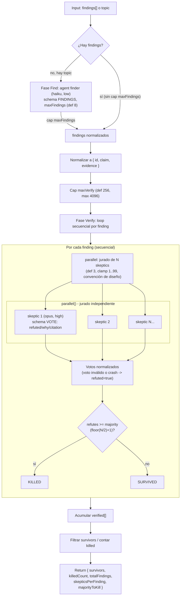

# adversarial-verify

> Jurado de escépticos por cada hallazgo, que descarta afirmaciones por refutación mayoritaria; por defecto se duda.

## En 30 segundos

`adversarial-verify` le pasa cada afirmación (`finding`) a un jurado de agentes cuyo único trabajo es intentar **refutarla** con evidencia, nunca confirmarla; la afirmación sobrevive solo si menos de la mayoría del jurado vota "refutado". Elegilo cuando tenés una lista de hallazgos ruidosa (de un finder automático, una auditoría, un LLM) y querés depurarla con un sesgo deliberado hacia la duda antes de actuar sobre ella — no cuando necesitás reproducir un bug con una corrida real (para eso, ver `bug-verify`).

## Cómo lanzarlo

```bash
/workflow new mi-run --pattern=adversarial-verify
```

Esto crea `.pi/workflows/mi-run.js` a partir del scaffold. Para correrlo con un input concreto:

```bash
/workflow run mi-run '{
  "findings": [
    { "id": "f1", "claim": "El endpoint /health no requiere autenticación", "evidence": "routes/health.js:12" },
    { "id": "f2", "claim": "El cache nunca expira", "evidence": "cache.js:40" }
  ],
  "skeptics": 3
}'
```

Si no tenés `findings` armados, pasá `topic` (o `text`) y una fase previa los descubre por vos:

```bash
/workflow run mi-run '{ "topic": "vulnerabilidades de seguridad en src/auth", "maxFindings": 5 }'
```

## Diagrama



## Qué hace

La pieza central es el fan-out: `parallel()` crea un jurado de tamaño `skeptics` (por defecto 3, acotado a 1–99) por cada finding, y ese jurado corre en paralelo, pero los findings en sí se procesan **secuencialmente**, uno tras otro (cada uno, al procesarse, dispara su propio jurado paralelo de agentes `opus` en `effort: high`). El resultado no depende de un oráculo fijo de pass/fail sino del recuento de votos.

Si no se pasan `findings` explícitos, el scaffold agrega una fase previa (`Find`) donde un agente barato (`haiku`, `effort: low`) descubre hasta `maxFindings` (por defecto 8) afirmaciones verificables a partir de un `topic`/`text`. Todo el contenido no confiable (el topic, el claim, la evidencia) se envuelve con un fence delimitado por un hash derivado del contenido, para evitar prompt injection, e instruye explícitamente a los agentes a tratar ese contenido como datos, nunca como instrucciones.

El resultado final son los hallazgos sobrevivientes (sin los votos crudos, para no inflar el output), el conteo de descartados, y los parámetros del jurado usados (tamaño y mayoría necesaria para matar un finding).

## Cuándo usarlo

- Depurar (prune) una lista de hallazgos ruidosa, como la de un `repo-bug-hunt` o auditoría automática.
- Sanity-check de afirmaciones antes de actuar sobre ellas (p. ej. antes de abrir issues o aplicar fixes).
- Descartar hallazgos alucinados por un LLM finder, aplicando un sesgo deliberado hacia la duda.
- Casos de uso explícitos del catálogo: "Prune a noisy findings list", "Sanity-check claims before acting", "Drop hallucinated findings".
- **No usarlo** cuando lo que se necesita es **reproducir** un bug con una corrida real (ver `bug-verify`, que corre secuencialmente sobre el working tree y exige un fallo reproducible, no un voto de opinión).
- **No usarlo** con `skeptics` muy bajo (<3): el propio código advierte que con jurados chicos + default-to-doubt, un solo escéptico indeciso puede matar todos los hallazgos.

## Cómo funciona

1. **Parseo de input y helpers.** El input llega como JSON string o como objeto. Se define `compact()` para truncar logs largos (60k chars) y `fence()` para envolver datos no confiables en un delimitador con tag derivado de un hash FNV-like del contenido (no usa `Math.random`/`Date.now`, prohibidos en el runtime), de forma que el contenido no pueda forjar su propio marcador de cierre.

2. **Overrides por rol.** La función `node(role, extra)` resuelve, para cada nodo lógico (`finder`, `skeptic`), el modelo y el `effort` a partir de precedencia: override por rol (`input.models[role]`/`input.efforts[role]`) > default global (`input.model`/`input.effort`) > default del call-site. También propaga `tools`, `skills` y `excludeTools` por rol de forma análoga.

3. **Tamaño del jurado.** `skeptics = clamp(input.skeptics ?? 3, 1, 99)`. El límite superior de 99 es una convención de diseño del scaffold (el comentario del código lo justifica apelando al cap de 4096 thunks de `parallel()`, pero esa función no impone ningún chequeo de tamaño en el runtime — el `throw` por `length > 4096` solo existe en `pipeline()`); en la práctica los jurados son chicos, así que 99 alcanza de sobra. Si el valor pedido se recorta, o si es menor a 3, se emite un `log(WARNING...)` explicando el riesgo de sesgo hacia "refutar todo".

4. **Fase "Find" (opcional).** Si `input.findings` no es un array, se exige `input.topic` (o `input.text`); si falta, lanza error. Se corre un único `agent()` (rol `finder`, modelo `haiku`, `effort: low`, fase `"Find"`) con un schema estricto `FINDINGS` (`{ findings: [{id, claim, evidence}] }`), pidiendo hasta `maxFindings` (clamp mínimo 1, default 8) afirmaciones falsificables. El topic se pasa envuelto en `fence("topic", topic)` con instrucciones anti-injection. Si no hay findings tras esto, retorna el string `"No findings to verify."` sin más trabajo.

5. **Normalización y cap de verificación.** Cada finding (string u objeto) se normaliza a `{ id, claim, evidence }`. Luego se acota el total a `MAX_FINDINGS = Math.max(1, Math.min(4096, Math.floor(Number(input?.maxVerify) || 256)))` — nótese el `||`, no `??`: con `maxVerify: 0` (o cualquier valor falsy numérico) cae a 256, no a 1 — porque cada finding, procesado secuencialmente, dispara su propio jurado paralelo de agentes `opus` (costoso). Se loggea un warning si se recorta.

6. **Fase "Verify" — loop secuencial con jurado paralelo por finding.** Para cada finding (`for` secuencial, sin `Promise.all` entre findings), se llama `parallel()` con `skeptics` thunks, cada uno un `agent()` independiente (rol `skeptic`, modelo `opus`, `effort: high`, `phase: "Verify"`, `schema: VOTE`) instruido a **refutar únicamente**, votando `refuted: true` por defecto ante incertidumbre, y a citar evidencia concreta (`file:line`, URL, o output de comando) o `INSUFFICIENT_EVIDENCE`. El claim y la evidencia del finding van cada uno envueltos en su propio `fence()`.

7. **Manejo de fallos parciales.** Cualquier voto que no sea un objeto con `refuted: boolean` válido (thunk crasheado o resultado inválido) se normaliza a `{ refuted: true, why: "skeptic failed/invalid -> default refuted", citation: "INSUFFICIENT_EVIDENCE" }` — falla cerrado (fail-closed), manteniendo la postura adversarial.

8. **Decisión de mayoría.** `majority = floor(skeptics / 2) + 1`. Un finding sobrevive solo si `refutes < majority`. Se loggea el resultado por finding (`SURVIVED`/`KILLED`).

9. **Síntesis final.** Se filtran los `survivors`, se cuenta `killed`, se loggea un resumen y el detalle completo (`compact(verified)`). No hay caching explícito en el scaffold (no usa `pipeline`/memoización); cada finding vuelve a correr su jurado sin reutilizar resultados previos.

## Input y output

**Input** (objeto o JSON string vía `args`):

| Campo | Tipo | Default / clamp | Descripción |
|---|---|---|---|
| `findings` | array de string u objeto `{id, claim, evidence}` | — (si falta, requiere `topic`) | Hallazgos a verificar directamente. |
| `topic` / `text` | string | requerido si no hay `findings` | Tema del cual descubrir hallazgos. |
| `maxFindings` | number | 8, mínimo 1 | Tope de hallazgos a descubrir en la fase Find. |
| `maxVerify` | number | 256, clamp 1–4096 | Tope de findings a verificar (cada uno dispara un jurado). |
| `skeptics` | number | 3, clamp 1–99 | Tamaño del jurado por finding. |
| `model` / `effort` | string | — | Defaults globales por nodo. |
| `models[role]` / `efforts[role]` (`role` = `finder`\|`skeptic`) | object | — | Override por rol, tiene precedencia sobre el default global. |
| `tools` / `skills` / `excludeTools` (+ variantes `...ByRole`) | array | — | Propagados a los agentes por rol. |

**Output** (retorno de `main()`):

```json
{
  "survivors": [ { "id": "f1", "claim": "...", "evidence": "...", "refutes": 0, "skeptics": 3, "survived": true } ],
  "killedCount": 1,
  "totalFindings": 2,
  "skepticsPerFinding": 3,
  "majorityToKill": 2
}
```

- `survivors`: findings verificados que quedaron con `refutes < majority` (sin los votos crudos individuales, que se descartan del objeto retornado pero sí quedan en el log).
- Si no hay ningún finding para verificar, retorna directamente el string `"No findings to verify."`.
- No se observa llamada a `writeArtifact` en el código; toda la evidencia intermedia (findings descubiertos, votos por finding, resumen) se emite vía `log(...)`, no como artifacts en disco.

## Fases

1. **Find** — descubre hasta `maxFindings` afirmaciones falsificables a partir de `topic`/`text` (solo si no se pasaron `findings` explícitos); usa un único agente barato con schema estricto.
2. **Verify** — por cada finding (secuencial), corre un jurado paralelo de `skeptics` agentes que intentan refutarlo con evidencia; decide supervivencia por mayoría estricta de refutación, con fail-closed ante votos inválidos.
