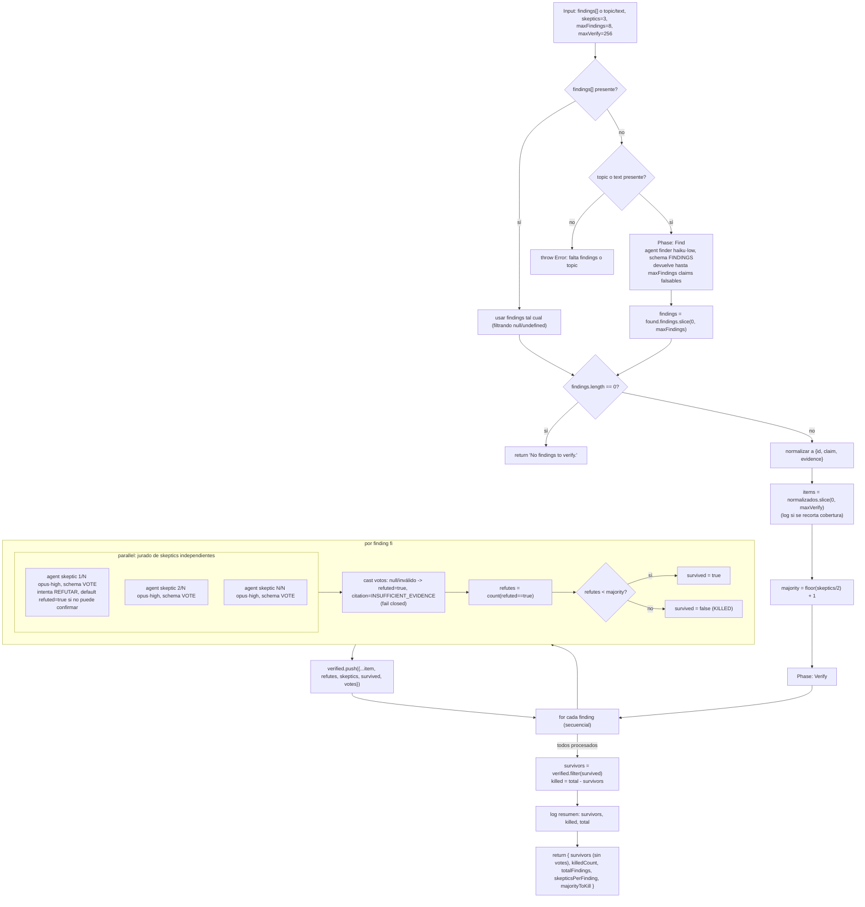

# adversarial-verify

> Jurado de escépticos por hallazgo que poda por mayoría de refutación; por defecto, duda.

## En 30 segundos

Tenés una lista de afirmaciones (o un tema del que hay que sacarlas) y querés quedarte solo con las que resisten un interrogatorio hostil. `adversarial-verify` arma, para CADA hallazgo, un jurado independiente cuyo único trabajo es intentar refutarlo; el hallazgo sobrevive solo si menos de la mayoría del jurado logra tumbarlo. Elegilo para podar listas de hallazgos ruidosas o para desconfiar sistemáticamente de afirmaciones antes de actuar sobre ellas — no para reproducir un bug (usá `bug-verify`) ni para sintetizar resultados independientes (usá `fan-out-and-synthesize`).

## Cómo lanzarlo

```text
/workflow new mi-run --pattern=adversarial-verify
/workflow run mi-run {"topic":"afirmaciones de seguridad sobre nuestro flujo de tokens","skeptics":5}
```

También podés saltear el descubrimiento y pasar los hallazgos directamente:

```text
/workflow run mi-run {"findings":[{"id":"f1","claim":"el endpoint valida el JWT en cada request","evidence":"src/auth.ts:42"}],"skeptics":5}
```

Hay que pasar `findings` **o** `topic`/`text`; si no viene ninguno, el workflow lanza un error.

## Diagrama



## Qué hace

`adversarial-verify` implementa una verificación por votación de jurado: en vez de un único juez que da un veredicto de pasa/no-pasa, cada hallazgo se somete a `N` escépticos independientes cuyo único mandato es intentar refutarlo con evidencia — nunca confirmarlo. El sesgo es deliberadamente adversarial y "default-to-doubt": si un escéptico no encuentra evidencia sólida para tumbar el claim pero tampoco puede confirmarlo de forma independiente, debe votar `refuted=true`. Un hallazgo solo sobrevive si el número de votos de refutación queda **por debajo** de una mayoría estricta (`floor(skeptics/2)+1`).

La dinamicidad del patrón está en que el ancho y la forma del fan-out de verificación se calculan por hallazgo: cada claim arma su propio jurado paralelo (`parallel` de `skeptics` agentes), y la cantidad de jurados corridos en total depende de cuántos hallazgos entraron (ya sea provistos de entrada o descubiertos en runtime por un buscador inline). No hay un oráculo fijo de verdadero/falso: la sobrevivencia la deciden los votos.

Los hallazgos pueden venir dados (`input.findings`) o descubrirse: si no hay `findings`, se lanza un `agent` "finder" barato (haiku, effort bajo) sobre un `topic`/`text` para extraer hasta `maxFindings` claims concretos y falsables. Todo el contenido no confiable (el `topic` del finder, el `claim`/`evidence` de cada hallazgo pasado a los escépticos) se envuelve con un fence anti-inyección derivado de un hash del contenido, con instrucciones explícitas de tratar cualquier directiva embebida como dato sospechoso, no como instrucción.

El manejo de fallos es "fail closed, no throw": un skeptic que crashea o devuelve un voto inválido cuenta automáticamente como refutación, preservando el sesgo adversarial incluso ante fallas de infraestructura.

## Cuándo usarlo

- Podar una lista de hallazgos ruidosa (p. ej. la salida de un `repo-bug-hunt` o de un escaneo automático) antes de actuar sobre ella.
- Chequear la cordura de afirmaciones antes de tomar una decisión basada en ellas.
- Descartar hallazgos alucinados por un modelo, sometiéndolos a un jurado hostil independiente.
- **No usarlo** cuando lo que hace falta es *probar* un bug reproduciéndolo en el código real (usar `bug-verify`, que corre secuencialmente sobre el working tree).
- **No usarlo** cuando el objetivo es sintetizar/combinar resultados de exploraciones independientes en un único informe (usar `fan-out-and-synthesize`).

## Cómo funciona

**Parseo de input y configuración por nodo.** El input llega como JSON en `args` y se parsea de forma defensiva (si falla, `{}`). Existe un helper `node(role, extra)` que resuelve overrides de `model`/`effort`/`tools`/`skills`/`excludeTools` con precedencia: override por-rol (`models[role]`, `efforts[role]`, etc.) > default global (`input.model`, `input.effort`, etc.) > default del call-site.

**Jury size.** `skeptics` se toma de `input.skeptics` (default 3), clampeado a `[1, 99]` (cada finding arma su propio `parallel()` y ese primitivo acepta hasta 4096 thunks, pero los jurados son chicos así que 99 alcanza como techo). Si `skeptics < 3`, se loguea una advertencia explícita: con jurados chicos y sesgo default-to-doubt, un único escéptico indeciso puede matar cualquier hallazgo.

**Fase Find (opcional).** Si no vino `input.findings`, se requiere `input.topic` o `input.text`; si falta, lanza `Error`. Se corre un `agent` con rol `finder` (modelo `haiku`, effort `low`, `schema: FINDINGS`) que debe devolver hasta `maxFindings` (default 8, mínimo 1) claims concretos y falsables, con el `topic` envuelto en el fence anti-inyección. El resultado se recorta a `maxFindings`. Si tras esto la lista queda vacía, retorna el string `"No findings to verify."` sin pasar a la fase Verify.

**Normalización.** Cada hallazgo (string u objeto) se normaliza a `{ id, claim, evidence }`, generando un `id` sintético (`f1`, `f2`, ...) si falta. La lista se recorta a `maxVerify` (default 256, clamp `[1, 4096]`) porque cada finding corre su propio jurado paralelo secuencialmente, así que este cap acota el gasto/spawn total; si recorta, loguea una advertencia.

**Fase Verify.** Para cada finding, en un loop secuencial (jurado por jurado, no todos los jurados a la vez), se lanza un `parallel` de `skeptics` agentes con rol `skeptic` (modelo `opus`, effort `high`, `schema: VOTE`, label individualizado `skeptic-<id>-<n>`). Cada skeptic recibe el claim y la evidencia (o `"(none)"`) envueltos en fences separados, con la instrucción de intentar refutar y de votar `refuted=true` por defecto si no puede confirmar ni refutar con solidez, respaldando su voto con una cita concreta (file:line, URL, o output de comando) o `INSUFFICIENT_EVIDENCE`. Los votos `null` o sin `refuted` boolean válido (skeptic que falló) se normalizan a `refuted=true` con `citation: INSUFFICIENT_EVIDENCE` — no hay `settle` explícito porque `agent()` ya puede devolver `null`/inválido y el código lo cubre inline. Se cuentan los `refuted=true` (`refutes`); el hallazgo sobrevive (`survived=true`) solo si `refutes < majority`. Cada resultado se loguea (`finding <id>: X/N refuted -> SURVIVED|KILLED`) y se acumula en `verified` junto con los votos crudos.

**Caching:** no se observa ningún mecanismo explícito de caché; cada `agent` (finder o skeptic) se invoca fresco.

**Manejo de fallos parciales:** no hay `settle` como primitivo separado — los votos inválidos se reinterpretan inline como refutación (fail-closed), de modo que un skeptic caído nunca hace sobrevivir un hallazgo por omisión.

## Input y output

**Input** (JSON-stringified en `args`, parseado defensivamente):

| Campo | Tipo | Requerido | Default / clamp |
|---|---|---|---|
| `findings` | array (string u objeto `{id?, claim, evidence?}`) | uno de `findings`\|`topic`/`text` | — (si viene, se usa tal cual filtrando nulls; gana sobre `topic`) |
| `topic` / `text` | string | uno de `findings`\|`topic`/`text` | — (si falta y tampoco hay `findings`, `throw Error`) |
| `maxFindings` | number | no | default 8, mínimo 1 (clamp hacia arriba si viene < 1) |
| `skeptics` | number | no | default 3, clamp `[1, 99]` |
| `maxVerify` | number | no | default 256, clamp `[1, 4096]` |
| `model` / `effort` | string | no | override global para todo nodo |
| `models[role]` / `efforts[role]` | object | no | override por rol (`finder`, `skeptic`); precedencia: por-rol > global > default del call-site |
| `tools` / `skills` / `excludeTools` (y variantes `*ByRole`) | array | no | pasados al `agent` si son arrays |

**Output:**

- Si no hay hallazgos que verificar: el string `"No findings to verify."`.
- En caso normal: `{ survivors, killedCount, totalFindings, skepticsPerFinding, majorityToKill }`
  - `survivors`: array de hallazgos sobrevivientes, cada uno `{ id, claim, evidence, refutes, skeptics, survived: true }` (se excluyen los votos individuales del shape de retorno).
  - `killedCount`: cantidad de hallazgos que no sobrevivieron.
  - `totalFindings`: total de hallazgos efectivamente verificados (tras el clamp `maxVerify`).
  - `skepticsPerFinding`: tamaño del jurado usado.
  - `majorityToKill`: cuántos votos de refutación bastan para matar un hallazgo.

No se observan llamadas a `writeArtifact` en este scaffold: toda la observabilidad pasa por `log(...)` (advertencias de clamps, progreso por finding, resumen final con los `verified` completos incluyendo votos) y por el shape de retorno.

## Fases

1. **Find** — si no vinieron `findings`, descubre hasta `maxFindings` claims falsables desde `topic`/`text` con un `agent` finder barato (haiku·low); si vinieron, se usan tal cual.
2. **Verify** — por cada hallazgo, arma un `parallel` de `skeptics` agentes (opus·high) cuyo único mandato es refutar (default a duda); el hallazgo sobrevive solo si menos de la mayoría estricta lo refuta.
