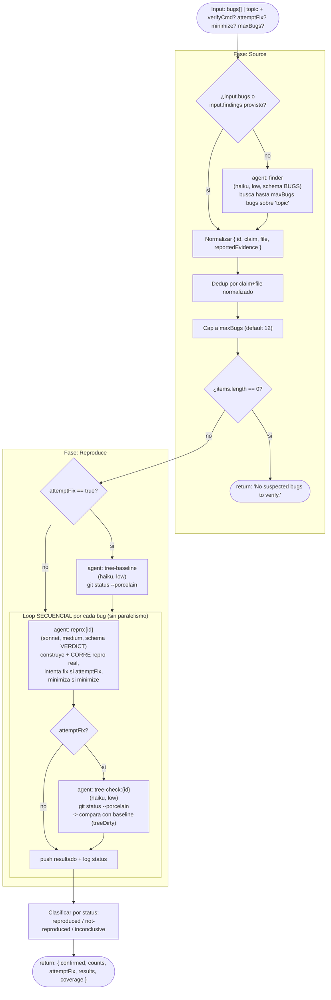

# bug-verify

> Confirma bugs sospechosos por REPRODUCCIÓN: solo son reales si una ejecución falla en el código actual; con verificación opcional FAIL→PASS del fix y minimización.

## En 30 segundos

`bug-verify` toma una lista de bugs sospechosos (o un `topic` para descubrirlos) y los pasa por un agente que debe construir y CORRER una reproducción real: solo cuenta como `reproduced` si el run efectivamente falla contra el código actual, nunca un argumento de "probablemente pasa". Elegilo cuando tenés leads de bugs (por ejemplo de `repo-bug-hunt`) que querés confirmar con evidencia ejecutable antes de reportarlos o arreglarlos, opcionalmente comprobando también que un fix candidato los resuelve (`attemptFix`).

## Cómo lanzarlo

```text
/workflow new mi-run --pattern=bug-verify
```

Input típico (JSON pasado como `args` al workflow):

```json
{
  "bugs": [
    { "id": "b1", "claim": "parseConfig lanza en YAML vacío", "file": "src/config.js" }
  ],
  "verifyCmd": "npm test",
  "attemptFix": false,
  "maxBugs": 12
}
```

Si no tenés una lista armada, alcanza con un `topic` y el `finder` interno descubre candidatos:

```json
{ "topic": "posibles off-by-one en el paginador de resultados", "maxBugs": 8 }
```

## Diagrama



## Qué hace

`bug-verify` es el hermano de `adversarial-verify`, pero para bugs de código: en lugar de podar afirmaciones por citación de un escéptico, poda bugs por **ejecución**. La premisa es simple y estricta: un bug solo se considera confirmado (`reproduced`) si un agente construye una reproducción mínima (test, script o comando) y la CORRE, observando que efectivamente falla contra el código actual. Argumentar que "probablemente" existe el bug no cuenta como prueba.

El workflow itera SECUENCIALMENTE (no en paralelo) sobre cada bug en la fase Reproduce, porque corre contra el mismo working tree con las dependencias ya instaladas: un worktree nuevo no tendría node_modules/build artifacts instalados, así que paralelizar en worktrees separados resultaría incómodo. Si `attemptFix` está activo, el árbol se snapshotea (`git status --porcelain`) una vez antes del loop, y después de cada bug, comparando siempre contra esa misma referencia inicial para detectar si un revert falló y dejó el árbol sucio (`treeDirty`).

## Cuándo usarlo

| Situación | Usá... |
|---|---|
| Bug de código, querés PROBARLO con una corrida real | `bug-verify` |
| Afirmación no ejecutable (diseño, arquitectura, prosa) | `adversarial-verify` (poda por citación/argumento) |
| Leads de `repo-bug-hunt` (u otro hallazgo) a confirmar antes de reportar | `bug-verify` |
| Querés no solo detectar el bug sino confirmar que un fix lo resuelve sin romper nada | `bug-verify` con `attemptFix: true` |
| No hay forma de ejecutar nada contra el código (sin entorno runnable, sin test runner) | No lo fuerces: los agentes devolverán `inconclusive`, no `reproduced` |

Cuidado con `attemptFix` en un working tree con cambios sin commitear: el workflow detecta y advierte si el árbol queda sucio tras un revert fallido (`treeDirty: true`), pero no lo repara automáticamente.

## Cómo funciona

1. **Parseo de input y helpers.** Lee `args` (string JSON o objeto), define `compact` (trunca payloads grandes a 60000 chars para logs/prompts) y `fence` (delimitador anti-inyección basado en hash FNV-like del contenido, sin randomness porque el runtime prohíbe `Math.random`/`Date.now`). Define `node(role, extra)` para aplicar overrides por-rol de `model`/`effort`/`tools`/`skills`/`excludeTools` con precedencia: override por rol > default global (`input.model`/`input.effort`) > default del call site.

2. **Fase Source.** Si `input.bugs` o `input.findings` es un array, se usa tal cual. Si no, requiere `input.topic` (o `input.text`); si falta ambos, lanza error. Con `topic`, corre un `agent()` con rol `finder` (modelo `haiku`, effort `low`, `schema: BUGS`) que devuelve hasta `maxBugs` bugs candidatos en JSON estructurado. Luego normaliza cada item a `{ id, claim, file, reportedEvidence }` (acepta strings sueltos o objetos con `claim`/`title`/`description`), deduplica por clave `claim+file` en minúsculas/trim, y recorta al límite `maxBugs`. Si la lista queda vacía, retorna el string `"No suspected bugs to verify."` sin entrar a Reproduce.

3. **Baseline del árbol (si `attemptFix`).** Antes del loop, un agente `tree-baseline` (`haiku`, `low`) corre `git status --porcelain` y guarda el resultado como referencia para detectar reverts fallidos.

4. **Fase Reproduce (loop secuencial).** Para cada bug, en orden:
   - Construye un prompt con las reglas de reproducción (debe correr algo real y citar la salida FALLIDA; `status="reproduced"` solo si el run falla por la razón alegada; `"not-reproduced"` si el código se comporta bien; `"inconclusive"` si no puede montarse un entorno ejecutable), más instrucciones condicionales de `attemptFix` (arreglar mínimo, confirmar FAIL→PASS sin regresiones, revertir) y `minimize` (delta-debugging).
   - Llama a `agent()` con rol `repro` (modelo `sonnet`, effort `medium`, `schema: VERDICT`, label `repro:{id}`).
   - Si `attemptFix`, corre un segundo agente `tree-check:{id}` (`haiku`, `low`) que repite `git status --porcelain` y compara contra el baseline; si difiere, marca `treeDirty: true` y logea un warning.
   - Empuja el resultado combinado a `results` y logea el status (y `fixVerified` si aplica).

5. **Clasificación final.** Filtra `results` por `status` en `reproduced` / `not-reproduced` / `inconclusive`, cuenta cuántos confirmados tuvieron `fixVerified === true`, y retorna el objeto de salida.

**Manejo de fallos parciales:** si un `agent()` de reproducción no devuelve nada, se sustituye por un registro `{ id, status: "inconclusive", repro: "", evidence: "agent returned no result" }` — el loop nunca se detiene por un fallo individual. No hay caching explícito en el código (cada bug se procesa una sola vez por corrida; no hay memoización entre invocaciones).

## Input y output

**Input** (objeto o string JSON vía `args`):

| Campo | Tipo | Default / clamp | Descripción |
|---|---|---|---|
| `bugs` | `Array` | — | Bugs sospechosos ya conocidos (se usa si está presente; toma precedencia sobre `findings`) |
| `findings` | `Array` | — | Alias de `bugs` si `bugs` no está presente |
| `topic` / `text` | `string` | requerido si no hay `bugs`/`findings` | Tema para que el `finder` descubra bugs inline |
| `verifyCmd` | `string` | `null` (trim vacío → `null`) | Runner del proyecto (ej. `npm test`) sugerido a los agentes de repro |
| `attemptFix` | `boolean` | `false` | Intentar un fix mínimo + confirmar FAIL→PASS sin regresiones + revertir |
| `minimize` | `boolean` | `false` | Minimizar la reproducción (estilo delta-debugging) |
| `maxBugs` | `number` | `12`, clamp `[1, 4096]`, floor | Tope de bugs a verificar |
| `model` / `effort` | — | — | Defaults globales por nodo |
| `models[role]` / `efforts[role]` | — | — | Overrides por rol (`finder`, `tree-baseline`, `repro`, `tree-check`) |
| `tools`/`toolsByRole`, `skills`/`skillsByRole`, `excludeTools`/`excludeByRole` | — | — | Overrides de herramientas/skills por rol |

**Output** (objeto retornado):

```text
{
  confirmed:  [ ...results con status === "reproduced" ],
  counts: { total, reproduced, notReproduced, inconclusive, fixVerified },
  attemptFix: boolean,
  results:    [ { id, claim, file, reportedEvidence, status, repro, evidence, fixVerified?, notes?, treeDirty? }, ... ],
  coverage:   { bugs: <items.length> },
}
```

Caso borde: si no quedan bugs tras dedup/normalización, retorna el string literal `"No suspected bugs to verify."` en lugar del objeto anterior.

El código no invoca `writeArtifact` — no persiste artifacts en disco; toda la evidencia (`repro`, `evidence`, logs) vive en el valor de retorno y en los `log()` emitidos durante la corrida.

## Fases

Declaradas en `meta.phases`:

1. **Source** — obtiene/descubre los bugs sospechados, normaliza, deduplica y aplica el cap `maxBugs`.
2. **Reproduce** — verifica cada bug secuencialmente mediante una reproducción real ejecutada (con fix opcional + chequeo de árbol limpio, y minimización opcional).
