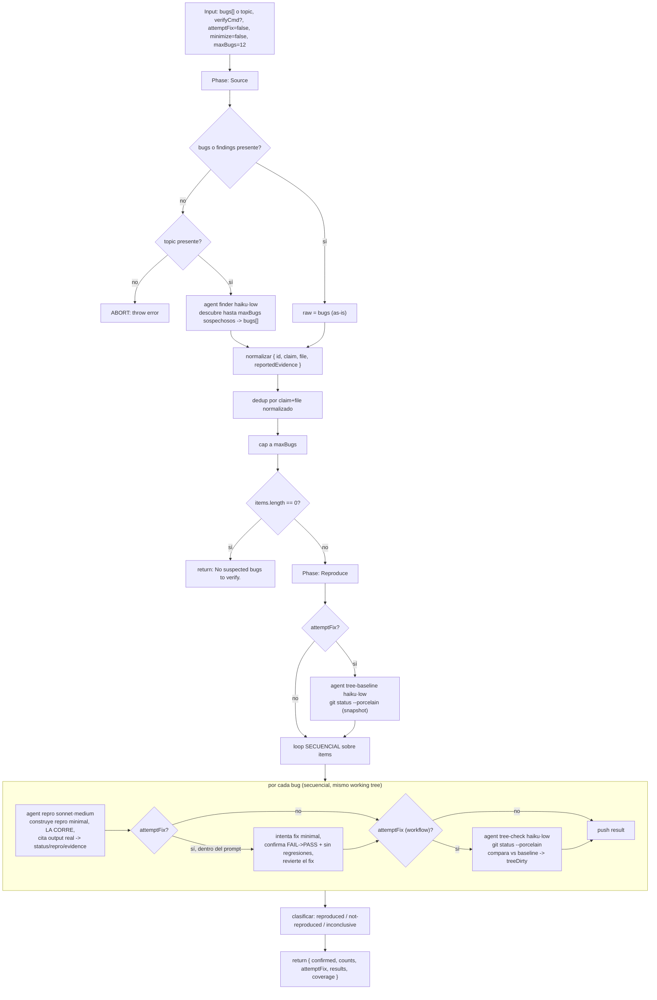

# bug-verify

> Confirma bugs sospechosos por REPRODUCCIÓN: solo es real si una corrida falla contra el código actual; verificación opcional de fix FAIL→PASS + minimización.

## En 30 segundos

Es el hermano de `adversarial-verify`, pero para bugs de código: en vez de podar afirmaciones por cita de un escéptico, poda bugs por ejecución. Toma una lista de bugs sospechosos (o los descubre con un finder inline), y para cada uno exige una corrida real que falle por esa razón — nada de "probablemente" ni argumentación. Elegilo cuando necesitás PROBAR un bug antes de arreglarlo, típicamente como paso siguiente de un `repo-bug-hunt`.

## Cómo lanzarlo

```text
/workflow new mi-run --pattern=bug-verify
/workflow run mi-run {"bugs":[{"id":"b1","claim":"El decoder SSE descarta el último chunk si no termina en \\n\\n","file":"src/sse.ts"}],"verifyCmd":"npm test"}
```

También podés partir de un tema y dejar que un finder inline proponga sospechosos:

```text
/workflow run mi-run {"topic":"SSE decoder drops final chunk","verifyCmd":"npm test"}
```

`bugs` (o `findings`) es un array de `{ id?, claim|title|description, file?, evidence? }`; si no lo pasás, usá `topic` para que un finder los descubra. `verifyCmd` es opcional pero recomendado (el runner del proyecto, p. ej. `npm test`); sin él, el agente improvisa un comando de repro por bug.

## Diagrama



## Qué hace

Corre en dos fases: **Source** junta la lista de bugs sospechosos (tal cual si viene en el input, o descubierta por un finder barato si solo diste un `topic`), los normaliza, deduplica por `claim+file` y los recorta a `maxBugs`. **Reproduce** verifica cada bug uno por uno: un agente construye un test, script o input mínimo que dispare el bug, lo EJECUTA de verdad contra el código actual, y cita el output real. Solo se marca `reproduced` si la corrida falla por la razón alegada; si el código se comporta bien o no se puede reproducir, es `not-reproduced`; si no hay entorno ejecutable, `inconclusive`.

A diferencia de `adversarial-verify` (que poda afirmaciones citando evidencia textual), acá el único oráculo válido es una ejecución observada. Esto refleja prácticas reales de reproducción de bugs: SWE-bench (`FAIL_TO_PASS`), Agentless/BRT, y el replay de sanitizers de OSS-Fuzz. El sesgo por defecto es conservador: sin corrida real que falle, no hay confirmación.

Si pedís `attemptFix`, cada agente de repro además intenta un fix mínimo, confirma que la corrida pasa de FAIL a PASS sin romper el resto de la suite, y luego REVIERTE el fix (el workflow verifica bugs, no los aterriza). Como esto muta el árbol de trabajo real, el workflow toma un snapshot de `git status --porcelain` antes de empezar y otro después de cada bug, para detectar si un revert falló y dejó el árbol sucio (`treeDirty`).

Corre SECUENCIALMENTE, no en paralelo: usa el árbol de trabajo compartido con las dependencias ya instaladas, y un worktree fresco por bug sería incómodo (sin `node_modules`/artifacts de build). Es la razón explícita por la que este scaffold no usa fan-out.

## Cuándo usarlo

- Confirmar los leads que salieron de un `repo-bug-hunt` antes de invertir tiempo en arreglarlos.
- Loop de reproducir-y-arreglar (`attemptFix=true`) cuando querés confirmación FAIL→PASS con regresiones cubiertas.
- Probar un bug con una corrida real en vez de una argumentación o una cita de código.
- **No lo uses** si necesitás verificar afirmaciones no ejecutables (diseño, arquitectura, hechos de texto) — para eso está `adversarial-verify`. Tampoco si necesitás paralelismo masivo sobre muchos bugs independientes: acá el árbol compartido fuerza secuencialidad.

## Cómo funciona

**Fase Source.** Si `input.bugs` o `input.findings` viene como array, se usa tal cual. Si no, requiere `input.topic` (o `input.text`); dispara un `agent` (`finder`, modelo `haiku`, effort `low`, con `schema` JSON) que devuelve hasta `maxBugs` sospechosos falsables. El texto del `topic` se envuelve con `fence()` (marcador delimitador derivado de un hash del contenido, no de aleatoriedad) para blindarlo contra inyección de instrucciones. Cada ítem crudo se normaliza a `{ id, claim, file, reportedEvidence }`, se deduplica por la clave `claim+file` en minúsculas, y se recorta a `maxBugs` (con `log()` de cuántos se descartaron).

**Fase Reproduce.** Si `attemptFix` está activo, un agente `tree-baseline` (`haiku`, `low`) corre `git status --porcelain` para tener una foto del estado inicial. Después, un `for` secuencial (no `parallel`) recorre cada bug: un agente `repro` (`sonnet`, `medium`, `schema` VERDICT, label `repro:<id>`) recibe el claim, file y evidencia reportada (cada uno envuelto en su propio `fence()`), y debe construir y CORRER una reproducción real, citando el output. El prompt instruye explícitamente el intento de fix + revert si `attemptFix`, y la minimización delta-debugging-style si `minimize`. Tras cada bug, si `attemptFix`, otro agente `tree-check` (`haiku`, `low`) vuelve a correr `git status --porcelain` y compara contra el baseline para marcar `treeDirty` (revert fallido).

No hay `parallel`/`settle` en este scaffold — cada resultado se empuja directo al array `results`, y un `agent` que devuelve `null`/vacío se registra como `inconclusive` en vez de abortar el ciclo. No hay caché explícita (sin `writeArtifact` ni memoización entre corridas); cada invocación reproduce desde cero.

## Input y output

| Campo | Tipo / default | Notas |
|---|---|---|
| `bugs` / `findings` | array de `{ id?, claim\|title\|description, file?, evidence? }` | si falta, requiere `topic` |
| `topic` / `text` | string | dispara el finder inline si no hay `bugs` |
| `verifyCmd` | string, opcional | runner del proyecto (p. ej. `"npm test"`); sin él, el agente improvisa |
| `attemptFix` | bool, default `false` | intenta fix minimal + confirma FAIL→PASS + revert |
| `minimize` | bool, default `false` | minimiza la reproducción (delta-debugging) |
| `maxBugs` | number, default `12`, clamp `1..4096` | cap tras dedup |

Retorna:

```text
{
  confirmed: [...],          // bugs con status "reproduced"
  counts: { total, reproduced, notReproduced, inconclusive, fixVerified },
  attemptFix: bool,
  results: [...],             // todos los bugs con su verdict completo
  coverage: { bugs: <items.length> }
}
```

No escribe artifacts (`writeArtifact`) — el resultado viaja completo en el valor de retorno del workflow.

## Fases

1. **Source** — junta o descubre los bugs sospechosos, normaliza, deduplica, recorta a `maxBugs`.
2. **Reproduce** — verifica cada bug secuencialmente por ejecución real (repro + opcional fix/revert + opcional minimización), clasifica en `reproduced` / `not-reproduced` / `inconclusive`.
