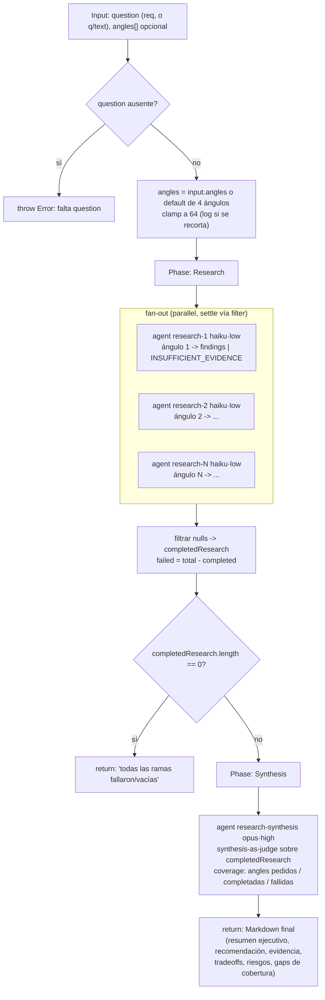

# complex-research

> Ángulos de investigación independientes con búsqueda web, sintetizados como juez con citas y notas de cobertura.

## En 30 segundos

Es el patrón base para responder una pregunta externa con evidencia: varios agentes de investigación corren en paralelo, cada uno enfocado en un ángulo distinto (docs oficiales, tradeoffs, riesgos, recomendación), y un agente juez sintetiza todo en una respuesta final con fuentes. Elegilo cuando necesitás una respuesta citada a una pregunta técnica; si la respuesta es consecuente (decisión de producción, seguridad), encadenalo con un paso de verificación posterior — este scaffold no verifica, solo investiga y sintetiza.

## Cómo lanzarlo

```text
/workflow new mi-run --pattern=complex-research
/workflow run mi-run {"question":"WASM vs NAPI FFI para Node en 2026?"}
```

`question` es el único campo obligatorio. `angles` es opcional (array de strings); si no se pasa, usa 4 ángulos por defecto (ver [Cómo funciona](#cómo-funciona)):

```text
/workflow run mi-run {"question":"...","angles":["adopción en la industria","benchmarks de performance"]}
```

## Diagrama



## Qué hace

`complex-research` hace un scatter-gather en dos fases: primero reparte la pregunta en varios ángulos de investigación independientes y después un agente de síntesis los consolida como juez. Cada ángulo corre su propia búsqueda web, no ve los demás resultados y devuelve un informe estructurado; así se gana cobertura independiente y se evita el anclaje entre agentes.

Es dinámico porque quien llama al workflow define `input.angles` en runtime; el ancho del fan-out sale de ese array, no del scaffold. El contrato de evidencia es estricto: cada research agent puede responder `INSUFFICIENT_EVIDENCE` si no alcanza la evidencia, y la síntesis debe preferir fuentes primarias/oficiales, deduplicar y marcar incertidumbre.

Es un patrón base (`basedOn: fan-out-and-synthesize`): ya incluye síntesis final como juez, pero no agrega una capa extra de verificación adversarial. Para respuestas consecuentes, conviene encadenarlo con un paso posterior de verificación.

## Cuándo usarlo

- Comparaciones de tecnología (p. ej. "WASM vs NAPI FFI para Node").
- Relevamientos de literatura o panorama de un tema (landscape scans).
- Respuestas con fuentes/citas (source-backed answers) — pero emparejalo con un paso de verificación si la respuesta es consecuente.

**No usarlo cuando:**

- Ya tenés hallazgos/afirmaciones concretos que necesitás depurar por refutación — usá `adversarial-verify`.
- El corpus a resumir es un documento/log gigante que no entra en una ventana de contexto (no es investigación web) — usá `map-reduce`.
- Necesitás verificación reproducible de un bug — usá `bug-verify`.

## Cómo funciona

**Validación de entrada.** `question` es obligatorio (acepta alias `q` o `text`); si falta, el workflow lanza una excepción explícita (`throw new Error`) — a diferencia de otros scaffolds que abortan con un resultado de error, este falla duro. `angles` es opcional: si no se pasa un array no vacío, usa 4 ángulos por defecto ("official documentation and primary sources", "implementation options and tradeoffs", "risks, gotchas, and migration concerns", "best current recommendation with evidence"). El array de ángulos (propio o default) se recorta a 64 elementos como máximo, logueando si hubo recorte.

**Fase Research.** Lanza un `agent` por cada ángulo en `parallel`, cada uno bajo el rol lógico `research` (modelo `haiku`, effort `low` — investigación barata y paralela). Cada research agent recibe el ángulo y la pregunta envueltos en un fence anti-inyección (`fence()`, delimitador derivado de un hash de contenido), con instrucciones explícitas de tratar ese contenido como dato a investigar, nunca como instrucciones, y de ignorar cualquier directiva embebida (cambios de rol, manipulación de veredicto, "ignorá lo anterior"). El contrato de salida por ángulo es fijo: Key findings, Evidence/sources, Tradeoffs, Risks/gotchas, Recommendation for this angle; y debe preferir fuentes primarias/oficiales, citar URLs/archivos/comandos solo si fueron realmente usados/observados, separar hechos de interpretación, y declarar `INSUFFICIENT_EVIDENCE` si la evidencia no alcanza. Cada rama retorna `{ name, output }` o `null` si el agente falla.

Tras el fan-out, se filtran los `null` (`completedResearch`) y se calcula `failed = total - completed`, logueando ambos conteos. Si **todas** las ramas fallaron o quedaron vacías, el workflow corta ahí mismo y retorna un mensaje explícito indicando que no hay evidencia para sintetizar (nunca sintetiza desde cero evidencia).

**Fase Synthesis.** Un único `agent` bajo el rol `research-synthesis` (modelo `opus`, effort `high` — el nodo más caro/capaz del workflow, acorde a que es el paso de juicio final) recibe: la pregunta original, los conteos de cobertura (ángulos pedidos, completados, fallidos), y todos los outputs de investigación completados, comprimidos con `compact()` (trunca a 90000 caracteres) y envueltos en el mismo fence anti-inyección. Las instrucciones de síntesis exigen: deduplicar, preferir evidencia primaria, marcar incertidumbre, y mencionar explícitamente las ramas fallidas/vacías. El formato de salida es fijo: resumen ejecutivo, recomendación, evidencia/fuentes, tradeoffs y alternativas, riesgos/preguntas abiertas, y brechas de cobertura con qué verificar a continuación. Ese texto Markdown es el retorno final del workflow.

**Caching:** no hay ningún mecanismo de caché explícito; cada `agent` corre fresco.

**Manejo de fallos parciales:** patrón settle manual (filtrado post-hoc de `null` en vez de propagar excepción) en el fan-out de investigación; si el fallo es total, se corta antes de la síntesis con un mensaje explícito en vez de invocar al sintetizador sobre datos vacíos.

## Input y output

**Input** (JSON-stringified en `args`, parseado defensivamente; si el parseo falla, se usa `{}`):

| Campo | Tipo | Requerido | Default / clamp |
|---|---|---|---|
| `question` (alias `q`, `text`) | string | **sí** | — (si falta, `throw new Error`) |
| `angles` | string[] | no | default: 4 ángulos fijos (docs oficiales, opciones/tradeoffs, riesgos, recomendación); clamp a 64 elementos |
| `model` / `effort` | string | no | override global para todo nodo |
| `models[role]` / `efforts[role]` | object | no | override por rol (`research`, `research-synthesis`); precedencia: por-rol > global > default del punto de llamada |
| `tools` / `skills` / `excludeTools` (y variantes `*ByRole`) | array | no | pasados al `agent` si son arrays |

**Output:** un string Markdown de texto libre (no está validado contra un schema), producido por el agente de síntesis: resumen ejecutivo, recomendación, evidencia/fuentes, tradeoffs, riesgos y brechas de cobertura. En el camino de fallo total, el retorno es en cambio el string literal indicando que todas las ramas fallaron/vacías.

No se observan llamadas a `writeArtifact` en este scaffold: toda la observabilidad pasa por `log(...)` (ángulos usados, conteo de fan-out completado/fallido) y por el string retornado.

## Fases

1. **Research** — fan-out en `parallel` de un `agent` (haiku·low) por ángulo, cada uno investigando de forma independiente con su propia búsqueda web bajo un contrato de evidencia fijo; se filtran los fallos y se corta temprano si todas las ramas fallan.
2. **Synthesis** — un único `agent` (opus·high) actuando como juez: deduplica, prefiere evidencia primaria, marca incertidumbre y reporta explícitamente la cobertura (ángulos completados vs. fallidos).
