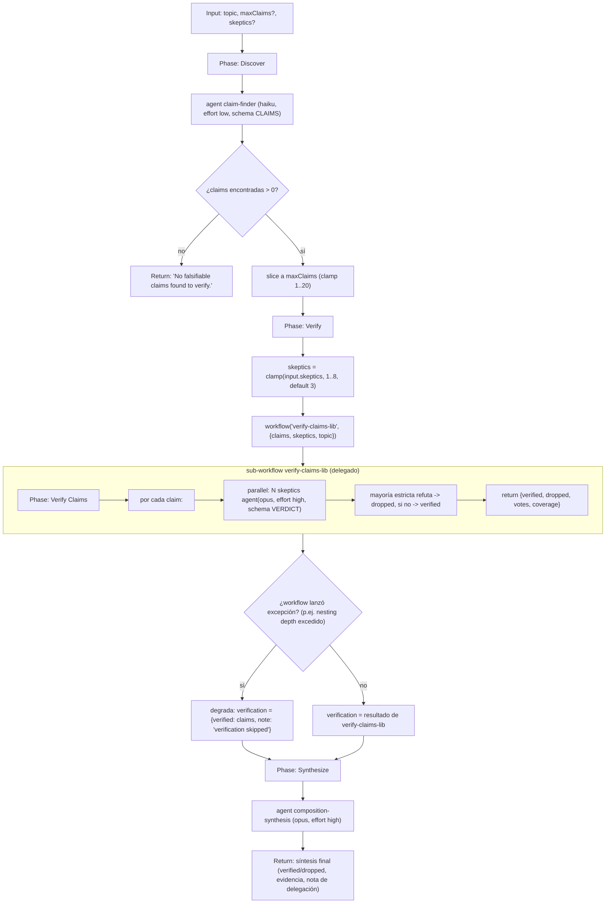

# composition-driver

> Workflow padre: descubre afirmaciones, delega la verificación a verify-claims-lib, luego sintetiza.

## En 30 segundos

`composition-driver` busca afirmaciones falsificables sobre un tema y luego reutiliza otro workflow
(`verify-claims-lib`) para verificarlas con un jurado de escépticos en paralelo, antes de sintetizar
un resultado final. Elegilo cuando quieras separar "encontrar candidatos" (barato, un solo modelo) de
"verificar" (caro, jurado paralelo), o como plantilla para tu propio workflow padre + sub-workflow
(patrón `workflow(name, args)`).

## Cómo lanzarlo

```bash
/workflow new mi-run --pattern=composition-driver
/workflow run mi-run {"topic": "Node.js 22 hizo LTS en octubre 2024", "maxClaims": 5, "skeptics": 3}
```

Requiere que exista (proyecto o global) el workflow hermano `verify-claims-lib`; si no está, el padre
sigue corriendo pero degrada a "todo verificado sin evidencia real" (ver [Cómo funciona](#cómo-funciona)).

## Diagrama



## Qué hace

`composition-driver` es la referencia canónica del patrón de composición de workflows en este repo: un
workflow "padre" que descubre afirmaciones falsificables sobre un tema y luego delega la fase de
verificación completa a un workflow "biblioteca" reutilizable, `verify-claims-lib`, invocado con la
primitiva `workflow(name, args)`. El propio scaffold no implementa jurados de escépticos ni lógica de
veredicto: solo se encarga de encontrar candidatos a verificar, empaquetar el contrato de entrada
(`{claims, skeptics, topic}`) y sintetizar el resultado devuelto por el sub-workflow.

El diseño ilustra tres ideas de composición: (1) separación de responsabilidades entre descubrimiento
y verificación, cada una en su propio workflow independientemente testeable; (2) un contrato explícito
de entrada/salida entre padre e hijo (`{claims:[{id,claim,evidence}], skeptics?, topic?}` →
`{verified, dropped, votes, coverage}`); y (3) degradación controlada cuando la composición no está
disponible (por ejemplo, por límite de profundidad de anidamiento de workflows), en cuyo caso el padre
sigue funcionando tratando todas las claims como "verificadas por defecto" y deja constancia de la
omisión.

Como en el resto de los scaffolds del repo, todo el contenido no confiable (el `topic` de entrada, y
los hallazgos del sub-workflow antes de sintetizarlos) se envuelve con `fence()`, un delimitador
derivado de un hash del contenido (FNV-1a doble) que no puede ser falsificado por texto inyectado, y
los prompts incluyen instrucciones explícitas para que los agentes traten ese contenido como datos,
nunca como instrucciones.

## Cuándo usarlo

| Situación | ¿Usarlo? |
|---|---|
| Fact-checking de un documento: extraer afirmaciones y confirmarlas con evidencia | Sí |
| Separar descubrimiento (barato) de verificación (cara, jurado paralelo) reutilizable en otros workflows | Sí |
| Plantilla para diseñar tu propio padre + sub-workflow (patrón `workflow(name, args)`) | Sí |
| No existe (ni se puede instalar) `verify-claims-lib` en el mismo scope | No — corre por la ruta de degradación, sin verificación real |
| Tema sin afirmaciones fácticas falsificables (opiniones, tareas creativas) | No — el finder puede no devolver claims y el workflow corta temprano |

## Cómo funciona

1. **Parseo de input y helpers.** `args` se parsea como JSON (o se usa tal cual si ya es objeto); si
   falla, cae a `{}`. Se definen `compact()` (trunca strings/objetos largos a 60000 chars) y `fence()`
   (envuelve datos no confiables en un tag `<untrusted-HASH kind="...">`). `node(role, extra)` resuelve
   overrides de `model`/`effort`/`tools`/`skills`/`excludeTools` por rol, con precedencia: override por
   rol (`models[role]`) > default global (`input.model`) > default del call-site.

2. **Validación de input.** Requiere `input.topic` (o `question`/`text` como alias); si falta, lanza
   error. `maxClaims` se calcula desde `input.maxClaims` (default 8), forzado a entero ≥1 y clamped a
   un máximo de 20; si el valor pedido excede el máximo, se loggea el clamp.

3. **Phase "Discover".** Un único `agent()` (rol `claim-finder`, modelo `haiku`, `effort: low`, con
   `schema: CLAIMS` — objeto con array `claims:[{id,claim,evidence}]`) recibe el `topic` envuelto en
   `fence()` y debe encontrar hasta `maxClaims` afirmaciones concretas y falsificables. El resultado se
   filtra (`claim?.claim` truthy) y se recorta a `maxClaims`; si no sobrevive ninguna claim, el
   workflow retorna inmediatamente el string `"No falsifiable claims found to verify."` sin pasar a
   Verify.

4. **Phase "Verify".** `skeptics` se toma de `input.skeptics` (default 3), clamped a `[1,8]` (se
   loggea si se ajustó). Se invoca `await workflow("verify-claims-lib", { claims, skeptics, topic })`,
   delegando toda la verificación (jurados de escépticos en paralelo, votación por mayoría estricta,
   generación de `verified`/`dropped`/`votes`/`coverage` — ver `verify-claims-lib.js`). Si la llamada
   lanza una excepción (por ejemplo, profundidad de anidamiento de workflows excedida), se captura, se
   loggea el motivo, y se degrada asignando
   `verification = { verified: claims, note: "verification skipped (nesting depth exceeded)" }` — es
   decir, todas las claims se tratan como verificadas sin evidencia real de refutación.

5. **Phase "Synthesize".** Un `agent()` final (rol `composition-synthesis`, modelo `opus`,
   `effort: high`) recibe el objeto `verification` compactado (`compact(verification, 50000)`) envuelto
   en `fence("findings", ...)`, y debe sintetizar las claims verificadas/descartadas preservando
   incertidumbre, citando evidencia y mencionando explícitamente que la verificación fue delegada a
   `verify-claims-lib`. El resultado de este agente es el valor final que retorna el workflow.

No hay caché explícito (`memo`/artifacts intermedios) ni `writeArtifact()` en este scaffold: todo el
estado vive en memoria de la ejecución y el único output persistente es lo que el runner del workflow
registre por defecto (logs de fase vía `phase()`/`log()`).

## Input y output

**Input** (`args`, JSON o objeto):

| Campo | Tipo | Default | Notas |
|---|---|---|---|
| `topic` (alias `question`, `text`) | string | — (requerido) | Tema sobre el que se buscan afirmaciones; si falta, lanza `Error`. |
| `maxClaims` | number | `8` | Entero ≥1, clamped a máx. `20`. |
| `skeptics` | number | `3` | Entero, clamped a `[1, 8]` (nota: `verify-claims-lib` internamente permite hasta 64, pero este padre nunca pide más de 8). |
| `model` / `effort` | string | — | Overrides globales aplicados a todos los nodos (`agent`/`node`). |
| `models[role]` / `efforts[role]` | object | `{}` | Overrides por rol (`claim-finder`, `composition-synthesis`); tiene precedencia sobre el global. |
| `tools` / `skills` / `excludeTools` (+ variantes `*ByRole`) | array | — | Se propagan a `node()` si están presentes. |

**Output:** el valor de retorno del `agent()` de síntesis (texto/objeto producido por el modelo
`opus`), o el string temprano `"No falsifiable claims found to verify."` si no se hallaron claims. No
se escriben artifacts en disco (`writeArtifact` no se usa en este scaffold).

## Fases

1. **Discover** — `agent claim-finder` encuentra hasta `maxClaims` afirmaciones falsificables sobre
   `topic`, devueltas con schema `CLAIMS`.
2. **Verify** — delega vía `workflow("verify-claims-lib", {claims, skeptics, topic})`; degrada a "todo
   verificado sin evidencia" si el sub-workflow no está disponible.
3. **Synthesize** — `agent composition-synthesis` (opus, effort high) sintetiza el resultado de
   verificación en la respuesta final.
</content>
