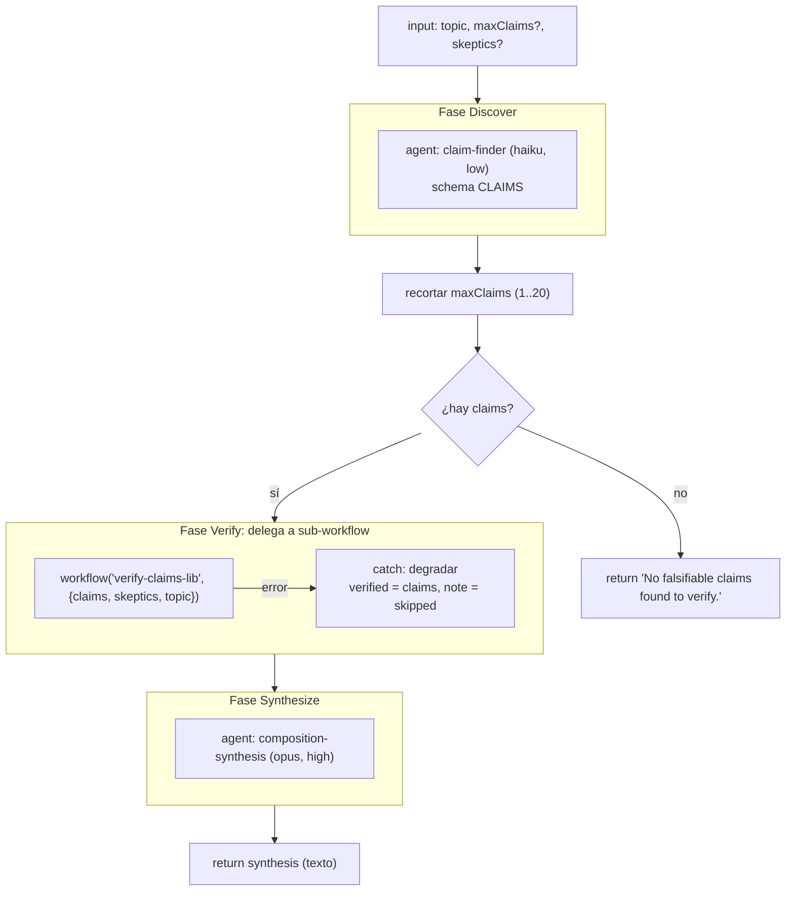

# composition-driver

> Workflow padre: descubre claims, delega la verificación a `verify-claims-lib` y sintetiza.

## En 30 segundos

Este scaffold muestra el patrón de composición más claro: un workflow padre (`composition-driver`) hace su parte,
descubrir claims, y delega la verificación reutilizable a un sub-workflow independiente (`verify-claims-lib`) con
`workflow(name, args)`. Usalo cuando quieras ver el flujo padre + librería de punta a punta, o cuando necesites
exactamente descubrir → verificar → sintetizar sobre un texto.

## Cómo lanzarlo

```sh
/workflow new fact-check-sse --pattern=composition-driver
```

Ejemplo mínimo de input:

```json
{ "topic": "claims en nuestro doc de paridad SSE", "maxClaims": 8, "skeptics": 3 }
```

Requiere que exista, junto a este scaffold, un workflow de proyecto o global llamado `verify-claims-lib` (ver
[verify-claims-lib](./verify-claims-lib.md)). Si no está disponible, el workflow degrada en lugar de fallar.

## Diagrama



## Qué hace

`composition-driver` es un workflow de tres fases que muestra composición real entre workflows: no reimplementa la
verificación de claims, sino que la delega a `verify-claims-lib` con el contrato exacto que ese sub-workflow espera
(`{ claims, skeptics, topic }`). El padre conserva sus dos responsabilidades: identificar claims en el texto de entrada
y sintetizar el resultado final para la persona usuaria.

La fase Discover usa un único agente barato (`haiku`, `effort: low`) con un JSON Schema estricto para que la salida sea
siempre parseable, sin tener que hacer "safe-parse" de prosa libre. La fase Verify no ejecuta agentes directamente:
invoca el sub-workflow con `workflow(...)` y, si esa invocación falla (por ejemplo, por el límite de anidamiento),
degrada en lugar de abortar todo el run. La fase Synthesize usa un modelo más caro (`opus`, `effort: high`) porque ahí
hace falta criterio para preservar incertidumbre y citar evidencia.

Todo el contenido no confiable (el `topic` del usuario y los resultados de verificación) se encierra con `fence(...)`,
un delimitador derivado de un hash del contenido: un payload malicioso no puede falsificar el marcador de cierre porque
cambiar el contenido cambia el hash. Cada prompt de agente le pide explícitamente tratar ese contenido como datos, nunca
como instrucciones.

## Cuándo usarlo

- Fact-checking de un documento: extraer afirmaciones verificables y contrastarlas.
- Separar "descubrimiento" de "verificación reutilizable" en workflows distintos.
- Como referencia canónica de composición cuando vas a escribir tu propio workflow padre que llama a un sub-workflow con
  `workflow(name, args)`.

No lo uses si:

- Solo necesitás verificar claims que ya tenés: usá `verify-claims-lib` directo, sin la fase de descubrimiento.
- No tenés desplegado el sub-workflow `verify-claims-lib`: el resultado sigue siendo válido, pero la verificación queda
  degradada (`note: "verification skipped (nesting depth exceeded)"`).

## Cómo funciona

1. **Parseo de input y overrides.** `args` se parsea a JSON (string u objeto); si falla, cae a `{}`. Soporta overrides
   globales (`input.model`, `input.effort`, `input.tools`, `input.skills`, `input.excludeTools`) y overrides por rol vía
   `input.models[role]`, `input.efforts[role]`, `input.toolsByRole[role]`, `input.skillsByRole[role]`,
   `input.excludeByRole[role]`, con precedencia rol > global > default del call-site.
2. **Discover** (`agent`): un único agente `claim-finder` (`haiku`, `effort: low`) recibe el `topic` encapsulado con
   `fence(...)` y devuelve hasta `maxClaims` claims concretos y falsables como `{ id, claim, evidence }`, forzado por el
   schema `CLAIMS` (objeto, `additionalProperties: false`). Si la respuesta no es un array o los items no tienen
   `.claim`, se descartan silenciosamente; si no queda ningún claim, el workflow retorna temprano el mensaje
   `"No falsifiable claims found to verify."`. Si el finder devolvió más de `maxClaims`, se loguea el recorte.
3. **Verify** (`workflow`): llama a `workflow("verify-claims-lib", { claims, skeptics, topic })`. Ese sub-workflow corre
   su propia fase con `parallel(...)` (jurado de skeptics por claim) y devuelve
   `{ verified, dropped, votes, coverage }`. Si la llamada lanza (por ejemplo, porque se excedió el límite de
   anidamiento), el `catch` loguea el error y arma un resultado degradado:
   `{ verified: claims, note: "verification skipped (nesting depth exceeded)" }`, es decir, todos los claims pasan sin
   contraste adversarial.
4. **Synthesize** (`agent`): un agente `composition-synthesis` (`opus`, `effort: high`) recibe el resultado de
   verificación (compactado a 50 000 caracteres) y lo encierra con `fence(...)` como datos no confiables. Luego redacta
   la síntesis final preservando incertidumbre, citando evidencia y mencionando explícitamente que la verificación fue
   delegada a `verify-claims-lib`. Ese texto es el valor de retorno del workflow.

No hay `writeArtifact` en este scaffold: el único output es el valor de retorno de la fase Synthesize. El caching de
agentes es el del runtime de Dynamic Workflows; no hay lógica de cache explícita en el código.

## Input y output

| Campo                                                                                | Tipo         | Valor por defecto / recorte                                                                                      |
| ------------------------------------------------------------------------------------ | ------------ | ---------------------------------------------------------------------------------------------------------------- |
| `topic` (o `question` / `text`)                                                      | string       | requerido; si falta, lanza error                                                                                 |
| `maxClaims`                                                                          | number       | default `8`; recorte a `[1, 20]` (se loguea si se recorta)                                                       |
| `skeptics`                                                                           | number       | default `3`; recorte a `[1, 8]` antes de pasarlo al sub-workflow (que a su vez lo vuelve a recortar a `[1, 64]`) |
| `model` / `effort`                                                                   | string       | override global aplicado a todos los nodos (`agent`, `claim-finder`, `composition-synthesis`)                    |
| `models[role]` / `efforts[role]`                                                     | object       | override por rol (`claim-finder`, `composition-synthesis`)                                                       |
| `tools` / `toolsByRole`, `skills` / `skillsByRole`, `excludeTools` / `excludeByRole` | array/object | mismo patrón global vs. por rol                                                                                  |

**Salida:** el texto de síntesis devuelto por el agente `composition-synthesis` (sin schema forzado, prosa libre). No
escribe artifacts a disco.

## Fases

1. **Discover** — un agente (`haiku`, low) descubre hasta `maxClaims` claims falsables sobre el `topic`.
2. **Verify** — delega la verificación completa a `workflow("verify-claims-lib", ...)`; degrada a "sin verificación" si
   la invocación falla.
3. **Synthesize** — un agente (`opus`, high) redacta la síntesis final citando evidencia y mencionando la delegación.
