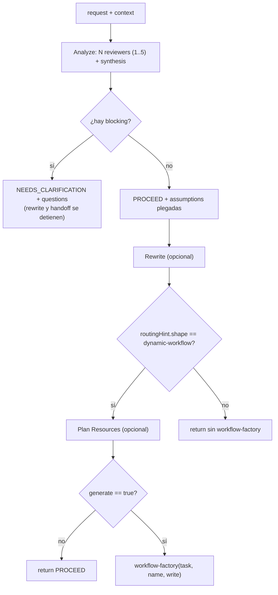

# contract-gate

> Convierte un pedido crudo en un contrato inspeccionable y decide si hay que preguntar ahora o seguir con supuestos
> explícitos antes de rutear o construir nada.

## En 30 segundos

`contract-gate` es el paso cero. Toma un pedido ambiguo, lo normaliza en un `contract` y clasifica cada ambigüedad con
un gate de valor de información: si falta información bloqueante, devuelve `NEEDS_CLARIFICATION`; si no, sigue con
`PROCEED` y puede reescribir el prompt e incluso encadenar `workflow-factory`.

## Cómo lanzarlo

```text
/workflow new mi-gate --pattern=contract-gate
/workflow run mi-gate {"request":"Auditá el decoder SSE y arreglá lo que encuentres","reviewers":3,"generate":true}
```

`request` es obligatorio; también acepta `task`, `text` o `question`. `generate:true` solo intenta el handoff a
`workflow-factory` cuando `routingHint.shape === "dynamic-workflow"`.

## Diagrama



## Qué hace

`contract-gate` sirve para responder dos preguntas antes de gastar una corrida cara: **qué hay que hacer** y **si hace
falta aclarar algo primero**. El contrato que produce separa `improvedTask`, `successCriteria`, `assumptions`,
`nonGoals`, `constraints`, `verificationPlan`, `routingHint` y `ambiguities`.

Una ambigüedad es `blocking` solo cuando el impacto es alto y no existe un default seguro. Todo lo demás se convierte en
un supuesto explícito, con confianza e indicio de qué lo invalidaría. Esa es la diferencia central entre “preguntar
porque sí” y “preguntar solo cuando cambiaría de verdad el resultado”.

Si `improvePrompt` queda activo, `contract-gate` colapsa el contrato en un `rewrittenPrompt` autocontenido. Si
`generate:true` y el ruteo recomendado es `dynamic-workflow`, puede pasarle ese prompt a `workflow-factory`. Si el ruteo
es `trivial` o `single-agent`, no la ejecuta: devuelve la recomendación y deja el handoff afuera.

## Cuándo usarlo

| Situación                                       | Usalo                                                            |
| ----------------------------------------------- | ---------------------------------------------------------------- |
| El pedido es difuso, caro o irreversible        | Sí: primero `contract-gate`                                      |
| El pedido ya es una spec clara y de bajo riesgo | No: andá directo al patrón/agente                                |
| Querés generar un workflow nuevo                | Sí: `generate:true` + `routingHint.shape === "dynamic-workflow"` |

## Cómo funciona

- **Entrada.** `request` es requerido. `context` default `""`. `reviewers` default `3` y se clampa a `1..5`.
  `maxQuestions` default `4` y se clampa a `1..3`. `improvePrompt` default `true`. `planResources` default `true`.
  `name` se deriva como slug de `improvedTask` o `request`. `write` default `true`.
- **Analyze.** Con `reviewers <= 1` corre un solo `agent` (`analyze-contract`, `sonnet` + `medium`). Con más de uno,
  lanza N reviewers en `parallel` con lentes distintas y luego sintetiza con `analyze-synthesis` (`opus` + `high`). Los
  reviewers paralelos usan `cache:false` para mantener independencia.
- **Gate.** Deduplica las preguntas `blocking`, aplica el tope `maxQuestions` y, si hay bloqueantes, devuelve de
  inmediato
  `{ status: "NEEDS_CLARIFICATION", verdict: "BLOCKED", contract, questions, rewrittenPrompt: null, routing }`. En este
  camino no hay rewrite ni handoff.
- **Rewrite.** Si `improvePrompt:true`, `rewrite-prompt` produce un único prompt limpio con este orden estable:
  `improvedTask`, `successCriteria`, `assumptions`, `nonGoals`, `constraints`, `verificationPlan`, `routingHint`. Si
  queda vacío, falla explícitamente. Si `improvePrompt:false`, reenvía `request` + contrato serializado.
- **Plan Resources.** Solo corre cuando `planResources:true`, `routingHint.shape === "dynamic-workflow"` y existe
  `routingHint.pattern`. Devuelve un advisory `resourcePlan` con `{ tier, rationale, pattern, models, efforts }`; si el
  planner no produce algo usable, `resourcePlan` queda `null`.
- **Handoff.** Solo corre si `generate:true`. Si el ruteo no es `dynamic-workflow`, devuelve
  `generated.handed_off:false`. Si sí lo es, llama
  `workflow("workflow-factory", { task: rewrittenPrompt, name, write })`. Si la composición anidada no está disponible
  una capa más adentro, degrada a handoff manual; si `workflow-factory` devuelve `null`, también degrada de forma
  explícita.

## Input y output

| Campo                                                     | Default / nota                              |
| --------------------------------------------------------- | ------------------------------------------- |
| `request` / `task` / `text` / `question`                  | requerido                                   |
| `context`                                                 | `""`                                        |
| `reviewers`                                               | `3` → clamp `1..5`                          |
| `improvePrompt`                                           | `true`                                      |
| `maxQuestions`                                            | `4` → clamp `1..3`                          |
| `generate`                                                | `false`                                     |
| `planResources`                                           | `true`                                      |
| `name`                                                    | slug derivado de `improvedTask` o `request` |
| `write`                                                   | `true`                                      |
| `model` / `effort`                                        | override global por nodo                    |
| `models[role]` / `efforts[role]`                          | override por rol                            |
| `tools` / `skills` / `excludeTools` y variantes `*ByRole` | arrays pasados al `agent`                   |

### BLOCKED

```js
{
  status: "NEEDS_CLARIFICATION",
  verdict: "BLOCKED",
  contract,
  questions: [{ question, rationale }],
  rewrittenPrompt: null,
  routing,
}
```

### PROCEED

```js
{
  status: "PROCEED",
  verdict: "PROCEED",
  contract,
  rewrittenPrompt,
  routing,
  resourcePlan,
  generated,
}
```

Notas de salida:

- `contract` agrega `verdict`.
- `routing` replica `routingHint`; en `PROCEED` suma `note`, y en `BLOCKED` devuelve `contract?.routingHint ?? null` sin
  `note`.
- `generated` queda `undefined` si `generate:false`; con `generate:true` puede ser
  `{ handed_off, reason?, name?, write?, output? }`.

## Fases

1. **Analyze** — N reviewers independientes o uno solo construyen el contrato estructurado.
2. **Gate** — separa ambigüedades bloqueantes de las asumibles; si hay bloqueantes, corta y devuelve preguntas.
3. **Rewrite** — colapsa el contrato en un prompt autocontenido, o adjunta el contrato al request si
   `improvePrompt:false`.
4. **Plan Resources** — solo para rutas `dynamic-workflow`: propone modelo y esfuerzo por rol para la corrida
   downstream.
5. **Handoff** — solo con `generate:true` y ruteo `dynamic-workflow`: compone `workflow-factory` o degrada de forma
   explícita.
