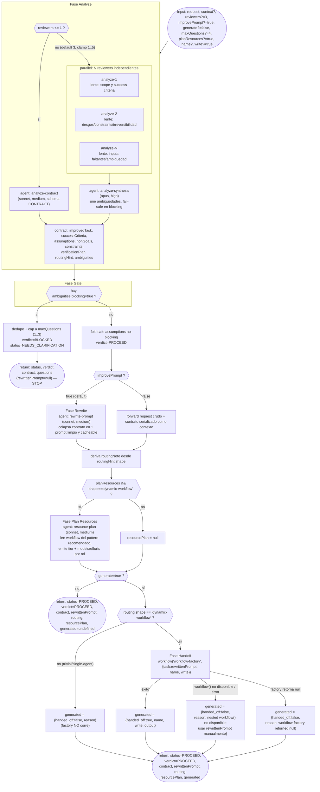

# contract-gate

> Convierte un pedido vago en un contrato inspeccionable y decide si preguntar ahora o proceder sobre una suposición registrada.

## En 30 segundos

`contract-gate` es el paso cero antes de rutear o generar nada: toma un pedido crudo y decide si hace falta preguntar algo primero, o si ya se puede proceder con suposiciones explícitas y registradas. Elegilo cuando el pedido es vago, de alto riesgo, o vas a lanzar un multi-agente costoso y no querés que arranque sobre una ambigüedad sin resolver.

## Cómo lanzarlo

```text
/workflow new mi-run --pattern=contract-gate
/workflow run mi-run {"request": "Migrar el pipeline de facturación a Kafka", "context": "Cliente enterprise, sin downtime permitido", "generate": true}
```

Con el input mínimo (`request`) alcanza: los demás campos (`reviewers`, `maxQuestions`, `improvePrompt`, `planResources`, `generate`, etc., ver la tabla de [Input y output](#input-y-output)) tienen default. Si el veredicto es `BLOCKED`, la respuesta trae solo preguntas (`rewrittenPrompt:null`) y se detiene ahí; si es `PROCEED`, trae el contrato y el `rewrittenPrompt`, y — solo con `generate:true` y ruta `dynamic-workflow` — además compone `workflow-factory` en línea.

## Diagrama



## Qué hace

`contract-gate` es el "paso cero" que corre ANTES de cualquier ruteo, generación o implementación. No decide CÓMO hacer algo, sino QUÉ hay que hacer y SI hay que preguntar antes de empezar: toma un pedido crudo ("hacé X") y lo convierte en un contrato inspeccionable (`improvedTask`, `successCriteria`, `assumptions`, `nonGoals`, `constraints`, `verificationPlan`, `routingHint`) más un veredicto de tipo value-of-information sobre cada ambigüedad detectada. Una ambigüedad solo bloquea (`blocking=true`) cuando su impacto en la decisión es ALTO y no existe un default seguro (ejemplo: sistema destino desconocido para una migración destructiva, bar de aceptación indefinido para una auditoría de alto riesgo, credencial faltante sin la cual la tarea no puede correr, o dos lecturas que producen entregables incompatibles). En cualquier otro caso la ambigüedad se resuelve como suposición explícita, con nivel de confianza y una condición que la invalidaría, y el flujo PROCEDE.

El razonamiento detrás es que un contrato limpio es la mayor palanca sobre la calidad de lo que se genere después: convierte el paso de "Plan" de un generador downstream de adivinar a simplemente cumplir una especificación. Por eso, cuando el veredicto es `PROCEED`, el scaffold colapsa todo el contrato en UN prompt autocontenido (`rewrittenPrompt`) con un prefijo estable (para cacheo) y sin preguntas sin resolver, "depende" ni placeholders: cada ambigüedad previa ya es una suposición o un no-objetivo explícito.

Opcionalmente, y solo cuando el veredicto es `PROCEED` y el caller pidió `generate=true`, el gate compone en línea con el meta-workflow hermano `workflow-factory`, pasándole el `rewrittenPrompt` ya depurado. Si el veredicto es `BLOCKED`, nunca compone: devuelve únicamente las preguntas y se detiene. También honra el `routingHint` más amplio del contrato — si la ruta recomendada es `trivial` o `single-agent`, NO corre la factory aunque `generate=true`, y en su lugar devuelve `{ handed_off:false, reason }`.

`contract-gate` es estrictamente upstream y más amplio que `workflow-factory`: puede detenerse y preguntarle a un humano, emite un contrato + prompt limpio (no código de workflow), y puede rutear a resultados que no son workflow dinámico. Garantiza que la factory nunca reciba una tarea ambigua.

## Cuándo usarlo

- Acotar un ticket confuso o mal especificado.
- Gatear antes de correr un multi-agente costoso (evitar gastar concurrencia/tokens en una tarea mal definida).
- Reescribir un pedido crudo en una especificación limpia y autocontenida.
- El pedido es vago o de alto riesgo y hace falta decidir "preguntar ahora vs proceder con una suposición registrada" antes de rutear o construir.

| Situación | ¿Qué usar? |
|---|---|
| Pedido concreto, bajo riesgo, sin ambigüedad real | Nada de esto — el gate es puro overhead. |
| Pedido vago o de alto riesgo, todavía no sabés qué workflow correr | `contract-gate` (solo, sin `generate`). |
| Ya tenés un contrato/prompt claro y querés el código del workflow | `workflow-factory`, o `contract-gate` con `generate:true`. |
| Ya sabés qué workflow correr y solo hace falta despacharlo | `router`, no `contract-gate`. |

`contract-gate` precede a `workflow-factory` y a `router`; no los sustituye.

## Cómo funciona

1. **Parseo defensivo del input** y helpers: `compact` (trunca blobs grandes a 60000 chars) y `fence` (encierra datos no confiables en un marcador `<untrusted-HASH kind="...">` derivado de un hash de contenido, no de aleatoriedad, para que un payload no pueda forjar su propio cierre). Valida que `request` esté presente (o sus alias `task|text|question`); si no, lanza error.
2. **Clamps con logging explícito**: `reviewers` clamped a 1..5 (default 3); `maxQuestions` clamped a 1..3 (default 4, por lo que el default real efectivo es 3). Cualquier clamp se loguea con `requested`/`clampedTo`/`band`.
3. **Fase Analyze**: define un JSON Schema estricto (`CONTRACT`, `additionalProperties:false`) que fuerza la forma del contrato. Si `reviewers<=1`, un único `agent()` (`analyze-contract`, modelo `sonnet`, effort `medium`) produce el contrato directamente. Si `reviewers>1` (default), usa `parallel()` para lanzar N `agent()` independientes (roles `analyze-1..N`, cada uno con `cache:false` y un "lente" distinto rotando entre `scope & success criteria`, `risks/constraints/irreversibility/security`, `missing inputs & ambiguity`), filtra los drafts nulos (subagentes caídos), y luego sintetiza con un `agent()` de rol `analyze-synthesis` (modelo `opus`, effort `high`) que reconcilia: unión + dedup de ambigüedades, **fail-safe** (si CUALQUIER reviewer marcó blocking con razón sólida, se mantiene blocking), dedup de successCriteria/assumptions/nonGoals/constraints, elige el `routingHint` más cauteloso. Si ningún draft sobrevive o la síntesis no devuelve objeto, lanza error.
4. **Fase Gate**: separa `ambiguities` en `blockingAll` y `nonBlocking`. Si hay al menos una bloqueante: dedup por pregunta (case-insensitive), cap a `maxQuestions` (logueando si recorta), y retorna inmediatamente `{status:"NEEDS_CLARIFICATION", verdict:"BLOCKED", contract, questions, rewrittenPrompt:null, routing}` — **detiene el flujo aquí, no reescribe ni compone nada**. Si no hay bloqueantes, loguea cada suposición no-bloqueante plegada y continúa a PROCEED.
5. **Fase Rewrite** (solo si `improvePrompt!==false`, default true): un `agent()` de rol `rewrite-prompt` (modelo `sonnet`, effort `medium`) colapsa el contrato en un único prompt de texto plano, en orden estable (objetivo → criterios → suposiciones → no-objetivos → constraints → plan de verificación → routing como guía) para maximizar el prefijo cacheable. Si el resultado viene vacío, lanza error (nunca se entrega un prompt vacío a la factory). Si `improvePrompt===false`, se salta el LLM y se reenvía el `request` crudo + el contrato serializado como contexto adjunto.
6. **Fase Plan Resources** (solo si `planResources!==false` (default true) Y `routing.shape==="dynamic-workflow"` Y hay `routing.pattern`): un `agent()` de rol `resource-plan` (modelo `sonnet`, effort `medium`, schema `RESOURCE_PLAN`) le pide al LLM que lea el archivo del workflow recomendado (`.pi/workflows/<pattern>.js` o el global) para extraer sus roles `node('<role>', …)`, y emita un plan de modelo+effort por rol, con un `tier` (economy/balanced/premium) escalado según los riesgos del contrato. El resultado se aplana a `resourcePlan.models` / `resourcePlan.efforts` (mapas rol→valor); si el planner no devuelve nada usable, se loguea y `resourcePlan` queda `null`.
7. **Fase Handoff** (solo si `generate===true`): si `routing.shape !== "dynamic-workflow"` (o sea trivial/single-agent), NO corre la factory — devuelve `{handed_off:false, reason}` explicando por qué. Si sí es dynamic-workflow, llama `workflow("workflow-factory", {task: rewrittenPrompt, name: slug(...), write})`. Maneja tres casos de falla: (a) `workflow()` lanza excepción (p. ej. `workflow()` anidado no disponible un nivel más profundo) → degrada devolviendo `rewrittenPrompt` para handoff manual; (b) la factory retorna `null` (subagente murió o se saltó) → `handed_off:false` con razón explícita (nunca reenvía `"null"` como string como si fuera éxito); (c) éxito → `{handed_off:true, write, name, output: compact(factoryOut,60000)}`.
8. **Caching/fallos parciales**: los reviewers de Analyze corren con `cache:false` explícito (cada draft debe ser independiente, no reusar cache entre reviewers); `parallel()` filtra resultados `Boolean` así que un reviewer caído simplemente no aporta draft (mientras quede al menos uno, sigue). No hay reintentos automáticos; los fallos se propagan como error solo cuando NINGÚN draft sobrevive o el contrato final es inválido.

No escribe artifacts a disco (no usa `writeArtifact`); toda la salida viaja en el `return` del workflow. El único efecto "físico" indirecto es la posible escritura de un draft de workflow por parte de `workflow-factory` cuando `generate=true` y `write!==false` (comportamiento de la factory, no de este scaffold).

## Input y output

**Input** (objeto JSON):

| Campo | Tipo | Default | Notas |
|---|---|---|---|
| `request` (o alias `task`/`text`/`question`) | string | **requerido** | Pedido crudo del usuario; sin él lanza error. |
| `context` | string | `""` | Contexto adicional, se fusiona en el prompt de análisis. |
| `reviewers` | number | `3` | Clamped a `1..5`; `1` colapsa a un único analyze sin síntesis. |
| `improvePrompt` | boolean | `true` | `false` salta la reescritura LLM y reenvía request crudo + contrato. |
| `generate` | boolean | `false` | `true` compone `workflow-factory` si el veredicto es PROCEED y el routing es dynamic-workflow. |
| `maxQuestions` | number | `4` (pedido) | Clamped a `1..3` (banda del gate); el default efectivo termina siendo `3`. |
| `planResources` | boolean | `true` | `false` salta la fase Plan Resources. |
| `name` | string | derivado de `contract.improvedTask` o `request` | Slugificado (`slug()`) para nombrar el draft de la factory. |
| `write` | boolean | `true` | Se pasa a `workflow-factory` como flag de escritura. |
| `model` / `effort` | string | — | Overrides globales aplicados a TODOS los nodos internos. |
| `models[role]` / `efforts[role]` | object | — | Overrides por rol (`analyze-1`, `analyze-synthesis`, `rewrite-prompt`, `resource-plan`, etc.), tienen precedencia sobre el global. |
| `tools`/`toolsByRole`, `skills`/`skillsByRole`, `excludeTools`/`excludeByRole` | array/object | — | Mismo patrón global vs por-rol para tools/skills/exclusiones. |

**Output** (dos formas posibles, discriminadas por `verdict`):

- **BLOCKED**: `{ status:"NEEDS_CLARIFICATION", verdict:"BLOCKED", contract, questions:[{question, rationale}], rewrittenPrompt:null, routing }` — detenido, sin reescritura ni composición.
- **PROCEED**: `{ status:"PROCEED", verdict:"PROCEED", contract, rewrittenPrompt, routing:{...routingHint, note}, resourcePlan:{tier, rationale, pattern, models, efforts}|null, generated?:{handed_off, name?, write?, output?, reason?} }`.

No hay `writeArtifact` en este scaffold; el `rewrittenPrompt` es el artefacto de handoff durable pero viaja solo en el valor de retorno (o dentro de lo que `workflow-factory` decida escribir si `generate=true`).

## Fases

1. **Analyze** — uno o N agentes independientes producen/reconcilian el contrato estructurado (JSON Schema `CONTRACT`).
2. **Gate** — separa ambigüedades bloqueantes vs no-bloqueantes; si hay bloqueantes, emite preguntas y DETIENE el flujo (no llega a las fases siguientes).
3. **Rewrite** — colapsa el contrato en un prompt único, limpio y cacheable (o lo salta si `improvePrompt=false`).
4. **Plan Resources** — (condicional a `planResources` y `routing.shape==="dynamic-workflow"`) recomienda un presupuesto de modelo/effort por rol para el workflow sugerido.
5. **Handoff** — (condicional a `generate=true` y routing dynamic-workflow) compone `workflow("workflow-factory", …)` con el prompt reescrito; degrada con gracia ante fallas o rutas no aptas.
