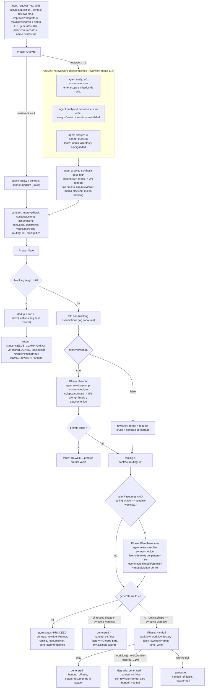

# contract-gate

> Convertí un pedido vago en un contrato inspeccionable y decidí preguntar-ahora vs proceder-sobre-un-supuesto-registrado antes de rutear o construir nada.

## En 30 segundos

`contract-gate` es el "paso cero" que corre ANTES de cualquier ruteo, generación o implementación: toma un pedido crudo ("hacé X") y lo estructura en un contrato (tarea mejorada, criterios de éxito, supuestos, no-objetivos, restricciones, plan de verificación, pista de ruteo), aplicando un gate de valor-de-información sobre cada ambigüedad detectada. Elegilo cuando el pedido es ambiguo o de alto stake y necesitás decidir si preguntar o avanzar con un supuesto explícito, antes de gastar un fan-out completo en el trabajo equivocado.

## Cómo lanzarlo

```text
/workflow new mi-gate --pattern=contract-gate
/workflow run mi-gate {"request":"Auditá el decoder SSE y arreglá lo que encuentres","reviewers":3,"generate":true}
```

`request` es el único campo obligatorio (acepta también los alias `task`/`text`/`question`). Con `generate:true` y verdict `PROCEED` sobre una ruta `dynamic-workflow`, el gate compone `workflow-factory` en línea y devuelve el borrador generado.

## Diagrama



## Qué hace

`contract-gate` interroga el pedido crudo ANTES de decidir cómo resolverlo. En vez de rutear o generar directamente, produce un contrato estructurado (JSON con schema estricto) que separa lo asumible de lo bloqueante: cada ambigüedad se clasifica con un test de valor-de-información — es bloqueante solo cuando el impacto de la decisión es ALTO y no existe un default seguro (sistema objetivo desconocido, criterio de aceptación indefinido para una auditoría de alto stake, credencial faltante sin la cual la tarea no puede correr, dos lecturas que producen entregables incompatibles). Todo lo demás se resuelve con un supuesto explícito, confianza-tageado e inspeccionable, y el flujo PROCEDE.

La razón de ser de este "spec-first effect" es que un contrato limpio es la mayor palanca sobre la calidad downstream: convierte el paso de planificación de un generador de adivinanza en conformidad-con-spec. El gate colapsa todo el contrato en UN solo prompt autocontenido (`rewrittenPrompt`) con un prefijo estable cacheable y sin preguntas sin resolver — cada ambigüedad previa ya es un supuesto o un no-objetivo.

La composición con `workflow-factory` es condicional y unidireccional: solo cuando el verdict es `PROCEED` y el caller pasó `generate:true`, el gate le entrega el prompt reescrito al meta-workflow generador `workflow-factory`. Si el verdict es `BLOCKED`, el gate devuelve las preguntas y nunca compone nada. Además honra el ruteo más amplio: si `routingHint.shape` recomienda `trivial` o `single-agent`, la factory NO corre aunque `generate:true` esté seteado — el gate directamente reporta `handed_off:false` con la razón.

`contract-gate` precede y difiere de `workflow-factory`: la factory (catálogo→plan→generar→revisar→refinar→escribir) corre solo DESPUÉS de que el ruteo concluyó que un dynamic workflow está justificado, no tiene gate de ambigüedad y no puede detenerse a pedir aclaración — generará felizmente contra una tarea sub-especificada, que es exactamente la falla que `contract-gate` previene. `contract-gate` es estrictamente upstream y más amplio: puede parar y preguntarle a un humano, emite un contrato + prompt limpio (no código de workflow), y rutea también a resultados que no son de factory (trivial/single-agent) donde la factory no debería correr en absoluto.

## Cuándo usarlo

- Scopear un ticket difuso antes de invertir en un fan-out costoso.
- Gatear (ask-vs-proceed) antes de una corrida multi-agente cara o irreversible.
- Reescribir un pedido crudo en una spec limpia y autocontenida para consumo downstream.
- Componer con `workflow-factory` cuando ya se sabe que se quiere generar un dynamic workflow y se busca garantizar que la tarea de entrada no sea ambigua.

**Cuándo NO usarlo:** si el pedido ya es una spec clara y de bajo stake, el gate agrega latencia y costo sin aportar valor de información — andá directo al patrón/agente que corresponda. Tampoco es el lugar para generar el código del workflow en sí (eso es `workflow-factory`, al que este scaffold puede componer pero no reemplaza).

## Cómo funciona

**Validación de entrada.** `request` (o sus alias `task`/`text`/`question`) es obligatorio; si falta, lanza un error instructivo de inmediato. `reviewers` se clampa a 1..5 (default 3, con log si el caller pidió otro valor); `maxQuestions` se clampa a la banda de la regla del gate, 1..3 (default 4 → recortado a 3, logueado explícitamente, "no silent caps").

**Fase Analyze.** Con `reviewers <= 1` corre un único `agent` (`analyze-contract`, sonnet·medium) contra el schema `CONTRACT` (objeto estricto con `improvedTask`, `successCriteria`, `assumptions`, `nonGoals`, `constraints`, `verificationPlan`, `routingHint`, `ambiguities`). Con `reviewers > 1` (default) lanza N `agent`s independientes en `parallel`, cada uno enfatizando una lente distinta rotando entre "scope & success criteria", "riesgos/restricciones/irreversibilidad" y "inputs faltantes/ambigüedad oculta" — la robustez viene de que un analizador solo tiene puntos ciegos y el desacuerdo entre reviewers revela ambigüedad real. Los drafts (post-`filter(Boolean)`) se reconcilian con un `agent` de síntesis (`analyze-synthesis`, opus·high) que fusiona en UN contrato, es **fail-safe** sobre el flag `blocking` (si CUALQUIER reviewer marcó un gap como bloqueante con una razón sólida, queda bloqueante) y elige el `routingHint` más cauteloso consistente con los drafts. Si ningún draft se produce, o la síntesis no devuelve un objeto, la fase lanza error (no puede gatear sin contrato).

**Fase Gate.** Filtra `ambiguities` en `blockingAll` (blocking===true) y `nonBlocking`. Si hay bloqueantes: las dedupea por pregunta normalizada, aplica el cap `maxQuestions` (logueando si recorta), y **retorna de inmediato** `{ status: "NEEDS_CLARIFICATION", verdict: "BLOCKED", contract, questions, rewrittenPrompt: null, routing }` — nunca reescribe ni compone la factory en este camino; un humano debe re-correr con las respuestas incorporadas al contexto. Si no hay bloqueantes, cada supuesto no-bloqueante se loguea individualmente ("safe-assumption folded") y el flujo continúa a PROCEED.

**Fase Rewrite (condicional a `improvePrompt`, default true).** Un `agent` (`rewrite-prompt`, sonnet·medium) colapsa el contrato en un único string de prompt, en orden estable (framing estable primero para que el prefijo sea cacheable; specifics volátiles al final): `improvedTask` como objetivo, `successCriteria` como bullets, cada supuesto como línea "Assume: …", `nonGoals` como "Out of scope: …", `constraints`, `verificationPlan` como "Done when verified by: …", y `routingHint` como guía (no mandato). Si el prompt reescrito queda vacío, lanza error explícito — nunca se le entrega un prompt vacío a la factory. Con `improvePrompt:false` se salta el rewrite: se reenvía el `request` crudo más el contrato serializado como contexto adjunto.

**Fase Plan Resources (condicional a `planResources`, default true, y solo si `routingHint.shape === "dynamic-workflow"` con `pattern` definido).** Un `agent` (`resource-plan`, sonnet·medium) lee el archivo del pattern recomendado para extraer sus roles `node('<role>', …)` y emite un plan de modelo+effort por rol, escalado a un tier (`economy`/`balanced`/`premium`) derivado de los stakes/irreversibilidad del contrato — es un output *advisory* para configurar la corrida downstream, no los propios nodos de `contract-gate`. Si el planner no devuelve un plan usable, se loguea y `resourcePlan` queda `null`.

**Fase Handoff (condicional a `generate === true`).** Si `routing.shape !== "dynamic-workflow"`, la factory NO corre; se retorna `generated = { handed_off:false, reason }` honrando el ruteo más amplio. Si sí es `dynamic-workflow`, compone en línea `workflow("workflow-factory", { task: rewrittenPrompt, name, write })` — la composición inline es apropiada porque el único punto de decisión humana (preguntar vs proceder) ya se resolvió, sin gate intermedio entre los pasos. Maneja dos fallos parciales explícitamente: si `workflow()` no está disponible un nivel más adentro (composición anidada, caso "C10"), degrada devolviendo `handed_off:false` con el `rewrittenPrompt` para handoff manual en vez de tirar abajo la corrida; si la factory devuelve `null` (skip o subagent muerto), retorna `handed_off:false` con esa razón en vez de reenviar falsamente `handed_off:true`.

**Caching:** no se observa ningún mecanismo explícito de caché (sin llamadas a una API de cache); los reviewers de Analyze se invocan con `cache:false` explícito para preservar independencia entre drafts.

**Manejo de fallos parciales:** el fan-out de Analyze usa `parallel` + `.filter(Boolean)` (equivalente a settle) sobre los drafts de los reviewers; cada fase de agregación (Gate, Rewrite, Handoff) valida explícitamente que el output previo no sea nulo/vacío antes de continuar, y aborta con error o degrada de forma explícita en vez de fallar en silencio.

## Input y output

| Campo | Tipo | Requerido | Default / clamp |
|---|---|---|---|
| `request` | string | **sí** (alias `task`/`text`/`question`) | — (si falta, throw inmediato) |
| `context` | string | no | `""` |
| `reviewers` | number | no | default 3, clamp 1..5 |
| `improvePrompt` | boolean | no | default `true` |
| `maxQuestions` | number | no | default 4 → clamp 1..3 (banda del gate) |
| `generate` | boolean | no | default `false` |
| `planResources` | boolean | no | default `true` |
| `name` | string | no | derivado (slug) de `improvedTask` o `request` si se omite |
| `write` | boolean | no | default `true` (pasado a la factory en el handoff) |
| `model` / `effort` | string | no | override global por nodo |
| `models[role]` / `efforts[role]` | object | no | override por rol (roles: `analyze`/`analyze-contract`/`analyze-synthesis`/`rewrite-prompt`/`resource-plan`) |
| `tools` / `skills` / `excludeTools` (y variantes `*ByRole`) | array | no | pasados al `agent` si son arrays |

**Output** (camino `BLOCKED`): `{ status: "NEEDS_CLARIFICATION", verdict: "BLOCKED", contract, questions: [{question, rationale}], rewrittenPrompt: null, routing }`.

**Output** (camino `PROCEED`): `{ status: "PROCEED", verdict: "PROCEED", contract, rewrittenPrompt, routing: {shape, pattern, maxAgents, concurrency, rationale, note}, resourcePlan: {tier, rationale, pattern, models, efforts} | null, generated }`, donde `generated` es `undefined` si `generate:false`, o `{ handed_off, reason? , name?, write?, output? }` si `generate:true`.

No se observan llamadas a `writeArtifact`; toda la observabilidad pasa por `log(...)` (verdict, supuestos plegados, caps aplicados, resourcePlan, resultado del handoff) y por el shape de retorno. El `write` que sí escribe a disco es el que hereda `workflow-factory` en el handoff, no este scaffold.

## Fases

1. **Analyze** — N reviewers independientes (o uno solo si `reviewers<=1`) producen un contrato estructurado contra el schema `CONTRACT`; con N>1, una síntesis-como-juez fail-safe los reconcilia en uno.
2. **Gate** — clasifica ambigüedades en bloqueantes vs no-bloqueantes; si hay bloqueantes, dedupea+capa a `maxQuestions` y retorna `BLOCKED` de inmediato (sin rewrite ni handoff); si no, pliega los supuestos no-bloqueantes y sigue.
3. **Rewrite** — colapsa el contrato en un único prompt limpio y autocontenido (o reenvía el request crudo + contrato si `improvePrompt:false`).
4. **Plan Resources** — solo si el ruteo recomienda `dynamic-workflow`: emite un budget advisory de modelo/effort por rol para esa corrida downstream.
5. **Handoff** — solo si `generate:true` y el ruteo es `dynamic-workflow`: compone `workflow-factory` en línea con el prompt reescrito; degrada explícitamente ante composición anidada no disponible o retorno nulo.
