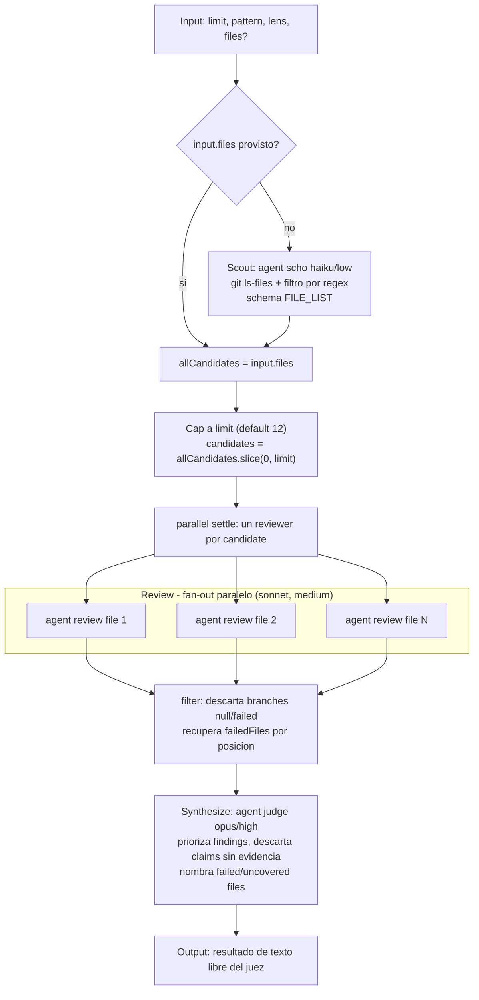

# fan-out-and-synthesize

> Scatter-gather: escanea una lista de trabajo, un revisor por ítem (paralelo, con settle), y sintetiza como juez con notas de cobertura/fallos.

## En 30 segundos

Este es el patrón BASE de scatter-gather: descubrís una lista de trabajo (archivos de un repo, por ejemplo), lanzás un revisor independiente por cada ítem en paralelo, y un único agente-juez sintetiza todos los hallazgos en un veredicto priorizado. Elegilo cuando necesitás cobertura amplia sobre un work-list conocido (o casi conocido en runtime) y cada ítem puede evaluarse sin conocer a los demás — por ejemplo, revisión de código en muchos archivos, auditorías de seguridad, o revisión de prosa/documentación.

## Cómo lanzarlo

```text
/workflow new mi-run --pattern=fan-out-and-synthesize
/workflow run mi-run {"pattern":"security","lens":"security","limit":8}
```

`new` crea el scaffold como archivo editable; `run` (o `start` para correrlo en background) lo ejecuta con el input JSON. Un input típico:

```json
{
  "pattern": "security",
  "lens": "security",
  "limit": 8,
  "files": ["src/auth.ts", "src/session.ts"]
}
```

Si omitís `files`, un scout barato corre `git ls-files` y filtra por `pattern` (default `code`) antes de aplicar el `limit` (default 12). El resto de los campos de input (`model`, `effort`, `models.<role>`, etc.) se detalla en [Input y output](#input-y-output).

## Diagrama



## Qué hace

`fan-out-and-synthesize` es el patrón base de scatter-gather (parallelization / scatter-gather de "Anthropic: Building Effective Agents"): descubre una lista de trabajo en tiempo de ejecución, lanza un revisor independiente por cada ítem en paralelo, y sintetiza los resultados con un agente que actúa como juez, priorizando hallazgos, descartando afirmaciones sin evidencia y nombrando explícitamente qué ramas fallaron o quedaron sin revisar.

El ancho del fan-out no se conoce en tiempo de autoría (depende de cuántos archivos matchean el patrón en el repo), por lo que se deriva de un scout en runtime y se limita con `limit`. El scout, los revisores y el juez son tres agentes con roles y efforts distintos: el scout es barato (haiku/low) porque solo filtra rutas, los revisores son de esfuerzo medio (sonnet/medium) porque hacen lectura línea por línea, y el juez corre con el modelo y esfuerzo más altos (opus/high) porque debe priorizar y descartar entre muchos hallazgos.

El diseño trata explícitamente el fallo parcial como un caso de primera clase: el fan-out usa `parallel` con semántica *settle* (una rama fallida se convierte en `null`, nunca rechaza la promesa combinada), y tanto el conteo de cobertura como la lista de archivos no revisados se pasan al juez para que los mencione en la síntesis en lugar de ocultarlos.

Toda entrada no confiable (el patrón regex del usuario, el contenido de los reviews) se envuelve con `fence()`, un delimitador derivado de un hash del contenido (FNV-like, sin `Math.random`/`Date.now` porque el runtime los prohíbe) para que un payload malicioso no pueda falsificar el marcador de cierre y así inyectar instrucciones al scout o al juez.

## Cuándo usarlo

- Repartir revisión de código sobre muchos archivos (caso de catálogo).
- Síntesis multi-ángulo: muchas perspectivas independientes convergiendo en un solo veredicto (caso de catálogo).
- Correr revisores independientes sobre una lista de trabajo acotada (caso de catálogo).
- Necesitás cobertura amplia e independiente de un work-list conocido o casi conocido (`useWhen` del catálogo).
- Auditorías de seguridad, revisión de prosa/documentación, o cualquier chequeo que se beneficie de "N ojos" sin contaminación entre ramas (cada reviewer ve solo su archivo).

**No usarlo cuando:**
- El work-list es enorme y solo importa la parte riesgosa (usar en su lugar `scout-fanout`, que clasifica riesgo antes de invertir en revisión profunda).
- El output necesita un schema estructurado para composición downstream — el propio código lo advierte: "Output... currently free-form prose — add a schema before composing this workflow downstream."
- Los ítems no son independientes entre sí (por ejemplo si un archivo solo tiene sentido revisado junto con otro): el fan-out asume independencia total por diseño.

## Cómo funciona

1. **Parseo de input.** `args` se parsea como JSON de forma defensiva (try/catch a `{}`). Se derivan `limit` (clamp entre 1 y 4096, default 12), `pattern` (preset o regex libre, default `code`), `lens` (preset o descripción libre de qué buscar, default `code`), y overrides opcionales por rol (`models`, `efforts`, `toolsByRole`, `skillsByRole`, `excludeByRole`) vía el helper `node(role, extra)`.

2. **Fase Scout.** Si `input.files` viene poblado, se usa directamente como `allCandidates` y se salta el scout. Si no, se llama a un `agent()` (rol `scout`, modelo `haiku`, effort `low`, `schema: FILE_LIST`) instruido para correr `git ls-files`, filtrar por el regex (pasado dentro de un `fence("pattern", pattern)` para que el propio patrón no pueda inyectar instrucciones) y devolver `{ files: [...] }`. El resultado se trunca a `limit` con `.slice(0, limit)`; si se descartan candidatos se loguea `candidate cap applied` con conteos.

3. **Fase Review (fan-out paralelo).** Se llama a `parallel()` sobre un array de thunks, uno por candidato, cada uno un `agent()` (rol `review`, modelo `sonnet`, effort `medium`, `label: review-<file>`, `phase: "Review"`) con el prompt "Review <file> for <lens>...", que exige citar evidencia file/line, decir `NO_FINDINGS` si no hay issues creíbles, y `INSUFFICIENT_EVIDENCE`/`FILE_UNREADABLE` en vez de reportar "limpio" si el archivo no se puede leer. `parallel` usa semántica *settle*: una rama que falla se resuelve como `null` en vez de rechazar el `Promise.all`. Tras el fan-out se calcula `completedReviews` (filtrando outputs no nulos) y `failedFiles` (candidatos cuya posición en `reviews` quedó sin output), y se loguea `fan-out complete` con totales.

4. **Fase Synthesize (juez).** Un único `agent()` (rol `synthesis`, modelo `opus`, effort `high`, `phase: "Synthesize"`) recibe: la instrucción de sintetizar como "synthesis-as-judge" (priorizar, descartar claims sin soporte, mencionar caps y ramas fallidas), la cobertura numérica (`candidates.length`/`allCandidates.length`), la lista de `failedFiles`, y los hallazgos completos (`completedReviews`, comprimidos con `compact(..., 50000)` para truncar payloads gigantes) envueltos en `fence("findings", ...)`. El prompt repite la advertencia de tratar todo lo cercado como datos, nunca instrucciones.

5. **Retorno.** La función devuelve directamente el resultado del agente juez (texto libre, sin schema).

No hay caching explícito en el scaffold (no se usa ninguna primitiva de cache); cada corrida vuelve a scoutear y revisar desde cero. Tampoco hay `writeArtifact` — el resultado se retorna como valor del workflow, no se persiste a disco dentro del propio código.

## Input y output

**Input** (JSON parseado defensivamente desde `args`, default `{}`):

| Campo | Tipo | Default | Notas |
|---|---|---|---|
| `limit` | number | `12` | Clamp `[1, 4096]`, truncado con `Math.floor`; si se corrige se loguea. |
| `pattern` | string | `code` | Preset (`code`\|`docs`\|`web`\|`config`) o regex libre. Presets: code=`\.(ts\|tsx\|js\|jsx\|py\|go\|rs)$`, docs=`\.(md\|mdx\|txt\|rst\|adoc)$`, web=`\.(html\|css\|scss\|vue\|svelte)$`, config=`\.(json\|ya?ml\|toml\|ini)$`. |
| `lens` | string | `code` | Preset (`code`\|`security`\|`prose`) o descripción libre de qué buscar. |
| `files` | string[] | — | Opcional; si está presente y no vacío, bypassea el scout de `git ls-files`. |
| `model` / `effort` | string | — | Overrides globales aplicados a todos los nodos. |
| `models.<role>` / `efforts.<role>` | string | — | Overrides por rol (`scout`, `review`, `synthesis`); tienen precedencia sobre el global. |
| `tools` / `skills` / `excludeTools` (globales o `*ByRole`) | array | — | Pasados a cada agente si son arrays. |

**Output:** el retorno de la función es directamente el resultado del `agent()` de síntesis — texto libre (prose) con los hallazgos priorizados, sin schema. No se escriben `artifacts` (no hay llamadas a `writeArtifact` en el código).

## Fases

1. **Scout** — descubre/filtra la lista de trabajo (`git ls-files` + regex) o usa `input.files` si se provee; agente barato con schema `FILE_LIST`.
2. **Review** — fan-out paralelo (`parallel`, settle) de un revisor por archivo candidato, con evidencia file/line obligatoria y manejo explícito de archivos ilegibles.
3. **Synthesize** — agente juez de mayor esfuerzo que prioriza hallazgos, descarta afirmaciones sin evidencia y nombra ramas fallidas/no cubiertas.
