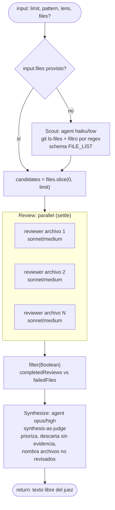

# fan-out-and-synthesize

> Scatter-gather: descubre un work-list, revisa cada ítem en paralelo y deja que una síntesis final actúe como juez, con
> notas de cobertura y fallos.

## En 30 segundos

Este patrón reparte una lista de trabajo entre varios revisores independientes y luego junta todo en una sola conclusión
priorizada. Primero descubre el work-list (por defecto, archivos del repo que matchean un patrón), después lanza un
revisor por ítem en paralelo, y al final un juez sintetiza los hallazgos, descarta lo que no tiene evidencia y marca qué
ramas fallaron.

Elegilo cuando necesitás cobertura amplia e independiente sobre una lista de trabajo conocida o casi conocida (archivos,
docs, config) y querés un único resultado final priorizado.

## Cómo lanzarlo

```bash
/workflow new mi-run --pattern=fan-out-and-synthesize
```

Input JSON típico:

```json
{ "lens": "security", "limit": 20, "pattern": "code" }
```

`files` es opcional para saltear el scout con una lista explícita:

```json
{ "files": ["src/a.ts", "src/b.ts"], "lens": "code" }
```

## Diagrama



## Qué hace

El workflow implementa el patrón scatter-gather con síntesis-como-juez, descrito en "Anthropic: Building Effective
Agents" (parallelization). Primero resuelve un work-list: si `input.files` viene con contenido, lo usa directamente; si
no, corre un agente scout (modelo `haiku`, esfuerzo `low`) que ejecuta `git ls-files` y filtra los paths contra un
patrón regex, devuelto con schema `{ files: string[] }`. El patrón puede ser un preset (`code`, `docs`, `web`, `config`)
o una regex libre.

La lista resultante se recorta a `limit` ítems (default 12), y el exceso se loggea y descarta. Después lanza un
`parallel` con settle semantics: un agente `sonnet`/`medium` por archivo, cada uno revisando según el `lens` elegido
(preset `code`, `security`, `prose` o texto libre), citando evidencia archivo/línea. Una rama fallida (agente que tira
excepción o retorna null) se resuelve a `null` y no rompe las demás; el workflow filtra los resultados válidos y
recupera por posición qué archivos quedaron sin revisar.

Por último, un agente juez (`opus`, esfuerzo `high`) recibe todos los reportes completados más el conteo de cobertura y
la lista de archivos fallidos, y produce una síntesis priorizada: descarta afirmaciones sin sustento y nombra
explícitamente los archivos no revisados. Toda entrada externa (patrón regex, reportes de revisores) viaja envuelta en
un fence `<untrusted-…>` con hash derivado del contenido, para que el agente la trate como datos y no como
instrucciones.

## Cuándo usarlo

- Repartir revisión de código/docs entre muchos archivos.
- Síntesis multi-ángulo: combinar hallazgos de revisores independientes en un solo veredicto priorizado.
- Correr revisores independientes sobre un work-list acotado (`limit`).
- Necesitás cobertura amplia e independiente de un work-list conocido o casi conocido.

No usarlo cuando:

- El work-list es enorme y solo una fracción amerita revisión profunda (ver `scout-fanout`, que clasifica riesgo antes
  de gastar en revisión honda).
- Necesitás un resultado estructurado (schema): la síntesis actual es prosa libre, sin schema — hay que agregarlo antes
  de componer este workflow como paso de otro.

## Cómo funciona

1. **Parseo de input y helpers.** `args` se parsea defensivamente a objeto; `compact()` trunca datos largos a 60000
   caracteres; `fence()` envuelve datos no confiables en un delimitador `<untrusted-HASH kind="...">` derivado del
   contenido (hash FNV-like), no falsificable por el propio contenido. `node(role, extra)` arma las opciones de cada
   agente aplicando overrides por rol (`input.models[role]`, `input.efforts[role]`, `input.toolsByRole[role]`,
   `input.skillsByRole[role]`, `input.excludeByRole[role]`) con fallback a los defaults globales (`input.model`,
   `input.effort`, `input.tools`, `input.skills`, `input.excludeTools`).

2. **Fase Scout.** Si `input.files` es un array no vacío, se usa tal cual como `allCandidates`. Si no, un `agent()` con
   `model: "haiku"`, `effort: "low"` y `schema: FILE_LIST` corre `git ls-files`, filtra por el patrón (preset o regex
   libre) y devuelve `{ files: [...] }`. El patrón se pasa siempre dentro de un `fence()`, con instrucciones explícitas
   al agente de tratarlo como literal inerte e ignorar directivas embebidas.

3. **Fase Review.** `candidates = allCandidates.slice(0, limit)` (con log si se recortó). `parallel()` lanza un
   `agent()` por candidato — `model: "sonnet"`, `effort: "medium"`, `label: review-<file>`, `phase: "Review"` — pidiendo
   evidencia archivo/línea y distinguiendo explícitamente `NO_FINDINGS` de `INSUFFICIENT_EVIDENCE / FILE_UNREADABLE`.
   `parallel` usa semántica _settle_: una rama que falla se resuelve a `null` en vez de rechazar todo el `Promise.all`.
   El workflow filtra `completedReviews` (output no nulo) y recalcula `failedFiles` por posición contra `candidates`.

4. **Fase Synthesize.** Un `agent()` final (`model: "opus"`, `effort: "high"`) recibe, dentro de un
   `fence("findings", …)`, los reportes completados (truncados con `compact(…, 50000)`), más el conteo de cobertura
   (`candidates.length`/`allCandidates.length`) y la lista de `failedFiles`. Se le pide síntesis-como-juez: hallazgos
   priorizados por severidad, descarte de afirmaciones sin evidencia y mención explícita de los archivos no revisados.
   Es la salida final del workflow (`return synthesis`) — no escribe artifacts propios ni usa `writeArtifact`.

No hay caching explícito en el scaffold: cada corrida repite scout, reviews y síntesis desde cero.

## Input y output

| Campo                                                                                | Tipo         | Default                                             | Notas                                                                |
| ------------------------------------------------------------------------------------ | ------------ | --------------------------------------------------- | -------------------------------------------------------------------- |
| `limit`                                                                              | number       | `12`                                                | Clamp a `[1, 4096]`, `Math.floor`; el excedente se loggea y descarta |
| `pattern`                                                                            | string       | `"code"`                                            | Preset `code\|docs\|web\|config` o regex libre para `git ls-files`   |
| `lens`                                                                               | string       | `"code"`                                            | Preset `code\|security\|prose` o descripción libre de qué buscar     |
| `files`                                                                              | string[]     | —                                                   | Si viene con contenido, reemplaza el scout por la lista explícita    |
| `model` / `effort`                                                                   | string       | por rol (`haiku`/low, `sonnet`/medium, `opus`/high) | Overrides globales                                                   |
| `models[role]` / `efforts[role]`                                                     | object       | —                                                   | Overrides por rol: `scout`, `review`, `synthesis`                    |
| `tools` / `toolsByRole`, `skills` / `skillsByRole`, `excludeTools` / `excludeByRole` | array/object | —                                                   | Mismo mecanismo global vs. por rol                                   |

Output: el resultado del agente juez — **texto libre, sin schema** (el propio scaffold lo marca como pendiente de mejora
antes de componerlo downstream). No escribe artifacts con `writeArtifact`; todo el estado relevante (cobertura, archivos
fallidos) se loggea con `log()` durante la corrida.

## Fases

1. **Scout** — descubre y filtra el work-list (`git ls-files` + regex, o `input.files`).
2. **Review** — un revisor independiente por archivo, en paralelo, con semántica `settle`.
3. **Synthesize** — un juez único combina, prioriza y reporta cobertura y fallos.
