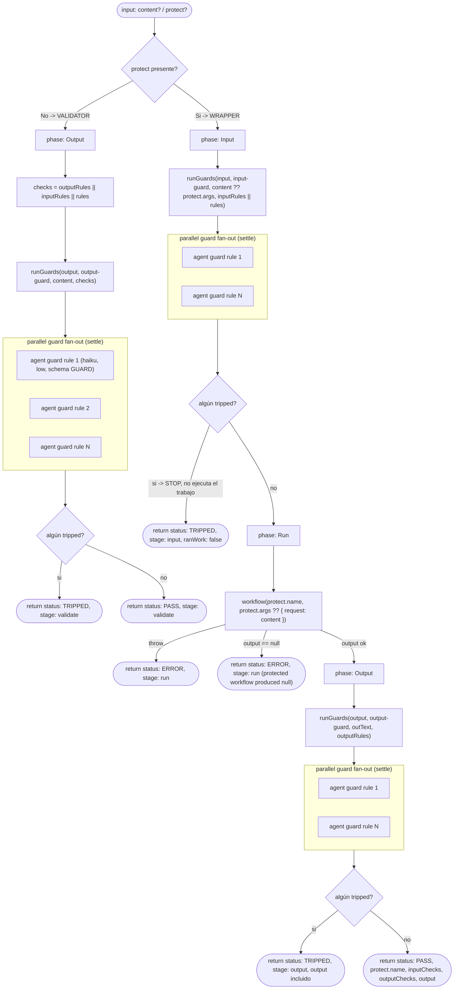

# guardrails

> Tripwire barato de entrada/salida que HALTA ante una violación clara; puede envolver cualquier workflow vía `protect:{name,args}`.

## En 30 segundos

`guardrails` corre chequeos rápidos y baratos (un agente `haiku`/`low` por regla) sobre un texto o sobre la request/respuesta de otro workflow, y HALTA en el momento en que alguna regla se dispara con evidencia clara — en vez de gastar un run completo o entregar un output malo y descubrir el problema después. Elegilo cuando querés poner un límite duro y binario ("esto no puede pasar") delante o detrás de un workflow, o validar un artifact ya generado contra reglas de PII/seguridad/scope, sin escribir ese chequeo a mano.

## Cómo lanzarlo

```bash
/workflow new mi-run --pattern=guardrails
```

Modo **wrapper** (envuelve otro workflow del catálogo con guards de entrada y salida):

```json
{
  "protect": { "name": "complex-research", "args": { "question": "Estado de la migración a Postgres 16" } },
  "inputRules": ["La request no debe pedir credenciales ni secretos"],
  "outputRules": ["El resultado no debe citar PII (emails, teléfonos, DNIs)"]
}
```

```bash
/workflow run mi-run '{"protect":{"name":"complex-research","args":{"question":"Estado de la migración a Postgres 16"}},"inputRules":["La request no debe pedir credenciales ni secretos"],"outputRules":["El resultado no debe citar PII (emails, telefonos, DNIs)"]}'
```

Modo **validador** (sin `protect`, solo evalúa un `content` ya existente contra `rules`):

```json
{
  "content": "El informe final incluye el email juan.perez@empresa.com como contacto",
  "rules": ["El texto no debe contener direcciones de email"]
}
```

## Cuándo usarlo vs. otras opciones

| Necesitás... | Usá |
|---|---|
| Un tripwire binario, barato, en los bordes de un workflow ya elegido | `guardrails` |
| Decidir/scopear una tarea abierta antes de rutear | `contract-gate` |
| Elegir automáticamente qué workflow correr | `router` |
| Reglas de estilo o juicio subjetivo (no violaciones binarias evidenciables) | otro patrón — un guard no dispara ante incertidumbre |

## Diagrama



## Conceptos clave

`guardrails` implementa el patrón de "input/output guardrails" del OpenAI Agents SDK. Cada guard es un agente barato (`haiku`, `effort: low`) que evalúa **una sola regla** contra el contenido y devuelve un veredicto tipado `{ tripped, reason, evidence }`; los guards de una misma etapa corren en paralelo con `settle`, así un guard que crashea no tumba a los demás. El scaffold tiene dos modos que comparten la misma función `runGuards`: **WRAPPER** (envuelve la ejecución de otro workflow con guards de entrada antes y guards de salida después) y **VALIDATOR** (evalúa un `content` ya existente contra reglas y devuelve PASS/TRIPPED, sin ejecutar ningún workflow).

Casos de uso concretos: gate de scope/seguridad antes de correr un agente (guards de entrada sobre la request), chequeo de PII/secretos sobre un output ya generado (modo validador), envolver un workflow del catálogo con tripwires de entrada y salida, o enforcement barato de límites duros sin gastar el presupuesto completo si el input ya es inválido.

**Seguridad — anti prompt-injection.** Todo el contenido a evaluar se envuelve con `fence()`, un delimitador `<untrusted-HASH kind="...">...</untrusted-HASH>` cuyo tag se deriva de un hash FNV-like del propio contenido (sin `Math.random`/`Date.now`, prohibidos en el runtime). Un payload malicioso no puede "escapar" el delimitador insertando su propio cierre falso, porque cualquier cambio en el contenido cambia el hash y por lo tanto el tag esperado. El prompt de cada guard además instruye ignorar cualquier instrucción embebida en esa zona ("ignore previous", cambios de rol o de esquema, etc.), tratándola como contenido sospechoso a reportar, no a obedecer.

**Fallos parciales.** Un guard que crashea (`null` o sin `tripped` boolean) se registra como `failed: true` y, por defecto, se trata como **no disparado** (modo laxo, para que infraestructura inestable no frene trabajo bueno); con `strict:true` el comportamiento se invierte a fail-closed (un guard caído cuenta como disparado). No hay caching — cada corrida re-evalúa todas las reglas.

## Cómo funciona

El scaffold declara tres fases (`Input`, `Run`, `Output`) pero solo recorre las que corresponden al modo activo.

**Preparación (sin fase declarada):** parsea `args` como JSON, define helpers `compact` (trunca texto largo a 60k chars) y `fence` (delimitador anti-injection basado en hash), resuelve overrides de modelo/effort/tools/skills por rol vía `node(role, extra)`, y valida que exista `content` o `protect`, y al menos un set de reglas si no hay `protect`.

**`runGuards(stage, role, text, ruleList)`** es la función compartida por ambos modos:

1. Si `ruleList` está vacía, no corre nada (`{ tripped: [], all: [], ran: 0 }`).
2. Clampa `ruleList` a `MAX_GUARDS = 4096`.
3. Fija `phase("Input")` o `phase("Output")` según `stage`.
4. Lanza `parallel(...)` con un `agent(...)` por regla — schema `GUARD` (`tripped`/`reason`/`evidence` obligatorios), modelo `haiku`, `effort: "low"`, contenido envuelto con `fence("candidate", ...)`.
5. Normaliza veredictos: los que no traen `tripped: boolean` se marcan `failed:true` y se resuelven a `tripped=strict` (por defecto `false`).
6. Loguea cuántos guards fallaron y cuántos se dispararon; devuelve `{ tripped, all, ran }`.

**Modo VALIDATOR (sin `protect`):**

1. `phase("Output")`.
2. `checks = outputRules || inputRules || rules` (primer set no vacío).
3. Corre `runGuards("output", "output-guard", content, checks)`.
4. Si algo se disparó: `{ status: "TRIPPED", stage: "validate", tripped, checks, content: compact(...) }`.
5. Si no: `{ status: "PASS", stage: "validate", checks }`.

**Modo WRAPPER (`protect: { name, args }`):**

1. **Fase Input** — corre `runGuards("input", "input-guard", content ?? protect.args, inputRules || rules)` sobre la request. Si algo dispara: STOP inmediato, `{ status: "TRIPPED", stage: "input", protect: protect.name, tripped, ranWork: false }` — el workflow protegido **nunca se ejecuta**.
2. **Fase Run** — si el input pasó, corre `workflow(protect.name, protect.args ?? { request: content })`. Si lanza excepción: `{ status: "ERROR", stage: "run", error }`. Si devuelve `null`/`undefined`: `{ status: "ERROR", stage: "run", error: "produced null (skipped or died)" }`.
3. **Fase Output** — corre `runGuards("output", "output-guard", outText, outputRules)` sobre el resultado (`outText` es el output tal cual si es string, o `compact(output, 40000)` si es objeto). Si algo dispara: `{ status: "TRIPPED", stage: "output", protect: protect.name, tripped, output }` (el output se devuelve igual, para inspección, pero marcado como no confiable). Si no: `{ status: "PASS", protect: protect.name, inputChecks, outputChecks, output }`.

No hay caching ni artifacts persistidos; todo el estado vive en el valor de retorno del run.

## Input y output

Input (`args`), todo opcional salvo lo indicado:

| Campo | Tipo | Default / Nota |
|---|---|---|
| `content` / `request` / `text` / `output` / `input` | string/objeto | primer valor no-null de esos alias; contenido a validar (modo validador) o dato adicional para input-guards en modo wrapper |
| `protect` | `{ name, args }` | si está presente y `protect.name` es válido, activa modo WRAPPER; si no, modo VALIDATOR |
| `strict` | boolean | `false` — si `true`, un guard que crashea cuenta como disparado (fail-closed) |
| `rules` | `string[]` | fallback de reglas para el validador y para `outputRules` si no se especifica |
| `inputRules` | `string[]` | reglas para guards de entrada (wrapper); si vacío usa `rules` |
| `outputRules` | `string[]` | reglas para guards de salida; si vacío usa `rules` |
| `model` / `effort` | string | overrides globales de modelo/reasoning-effort para todos los nodos |
| `models[role]` / `efforts[role]` | objeto | overrides por rol (`input-guard`, `output-guard`); precedencia: por-rol > global > default de llamada (`haiku`/`low`) |
| `tools` / `toolsByRole`, `skills` / `skillsByRole`, `excludeTools` / `excludeByRole` | array/objeto | overrides de tools/skills por rol o global |

Validaciones que lanzan error:

- Sin `content` y sin `protect` → `"Pass { content } to validate, or { protect: { name, args } } to wrap a workflow."`
- Modo validador sin ninguna regla (`rules`/`inputRules`/`outputRules` todos vacíos) → `'Validator mode needs at least one rule: pass { rules: [...] } (or inputRules/outputRules).'`

Clamp interno: `MAX_GUARDS = 4096` reglas por lista de guards (recorta con log si se excede).

Output — objeto simple según rama alcanzada, sin `writeArtifact` (este scaffold no persiste artifacts, todo va en el valor de retorno):

- Validador: `{ status: "PASS"|"TRIPPED", stage: "validate", checks, tripped?, content? }`.
- Wrapper, tripwire de entrada: `{ status: "TRIPPED", stage: "input", protect, tripped, ranWork: false }`.
- Wrapper, error al correr el workflow protegido: `{ status: "ERROR", stage: "run", protect, error }`.
- Wrapper, éxito: `{ status: "PASS", protect, inputChecks, outputChecks, output }`.
- Wrapper, tripwire de salida: `{ status: "TRIPPED", stage: "output", protect, tripped, output }`.

## Fases

1. **Input** — guards de entrada sobre la request (solo modo wrapper); si dispara, detiene todo antes de gastar presupuesto en el trabajo real.
2. **Run** — ejecución del workflow protegido (`workflow(protect.name, protect.args)`), único lugar donde se gasta presupuesto real (solo modo wrapper).
3. **Output** — guards de salida sobre el resultado (wrapper) o sobre el `content` recibido (validador); si dispara, marca el resultado como no confiable.
