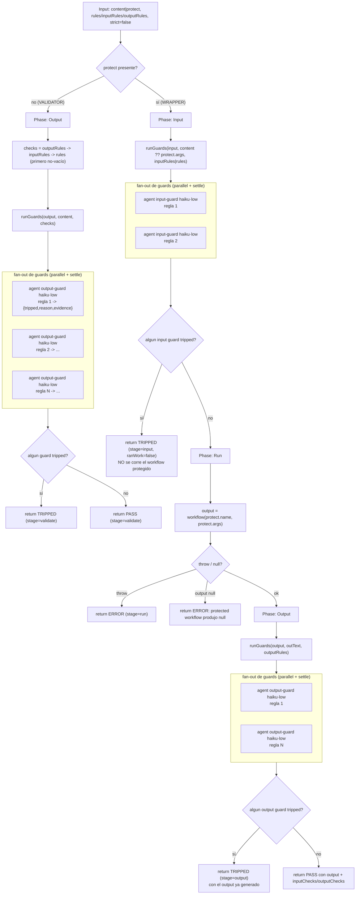

# guardrails

> Tripwire barato de input/output que se detiene ante una violación clara; puede envolver cualquier workflow vía `protect:{name,args}`.

## En 30 segundos

`guardrails` pone un tripwire barato alrededor de un workflow o de un artifact ya generado. Cada regla se evalúa con un agente chico y acotado; si una regla viola algo con evidencia clara, el flujo se detiene ahí mismo. Elegilo cuando querés imponer límites duros sin pagar el costo de correr todo el trabajo antes de descubrir el problema.

## Cómo lanzarlo

```text
/workflow new mi-run --pattern=guardrails
/workflow run mi-run {"protect":{"name":"deep-research","args":{"request":"..."}},"inputRules":["no pedir generar malware"],"outputRules":["no filtrar secretos/API keys"]}
```

Modo validador (sin `protect`, solo chequea un artifact ya generado):

```text
/workflow run mi-run {"content":"<texto a validar>","rules":["no contiene PII sin redactar"]}
```

`content`/`protect` son mutuamente relevantes según el modo — ver [Input y output](#input-y-output).

## Diagrama



## Qué hace

`guardrails` sigue el patrón de guardrails de entrada/salida de la OpenAI Agents SDK: corre chequeos baratos y acotados en paralelo con el trabajo real y se detiene temprano apenas uno se dispara. Cada regla se evalúa con un agente independiente (`haiku`, effort `low`) que devuelve un veredicto tipado (`tripped`, `reason`, `evidence`) y solo trippea ante una violación clara y evidenciada.

| Modo | Entrada | Cuándo usarlo |
|---|---|---|
| Wrapper (`protect:{name,args}`) | `content ?? protect.args` + `inputRules`/`outputRules` | para envolver cualquier workflow del catálogo y frenar antes o después de correrlo |
| Validador | `content` + `rules` (o `inputRules`/`outputRules`) | para gatear un artifact ya generado y devolver `PASS` o `TRIPPED` |

En modo **wrapper** primero corren los guards de INPUT sobre la solicitud; si alguno trippea, el workflow protegido no se ejecuta. Si pasan, corre el workflow real y luego se validan los guards de OUTPUT sobre el resultado.

A diferencia de `contract-gate` (que construye un contrato completo de tarea y decide ask-vs-proceed antes de rutear), `guardrails` es deliberadamente más liviano y corre en los bordes de la ejecución: un tripwire binario a la entrada (¿esto está en scope/es seguro de correr?) y a la salida (¿el resultado viola una regla?). Ambos componen: `contract-gate` puede decidir el scope, y el workflow elegido puede envolverse en `guardrails` para el enforcement barato.

## Cuándo usarlo

- Filtro de scope o seguridad antes de correr un agente (caso de catálogo).
- Chequeo de PII o secretos sobre un output ya generado (caso de catálogo).
- Envolver un workflow elegido con tripwires de input/output (caso de catálogo).
- Aplicar límites duros y baratos alrededor de cualquier workflow, sin tocar su código.

No usarlo cuando:

- Necesitás decidir SI vale la pena correr algo y con qué alcance antes de rutear — eso es `contract-gate`.
- El chequeo requiere razonamiento profundo o comparación entre alternativas (los guards son deliberadamente baratos y binarios, no jueces de calidad).
- No tenés reglas concretas y citables — sin al menos una regla, el modo validador lanza error explícito.

## Cómo funciona

**Parseo de input y validación temprana.** El `args` se parsea defensivamente (JSON o ya-objeto); si falla, cae a `{}`. Se resuelve `content` desde varios alias (`content`/`request`/`text`/`output`/`input`), se detecta `protect` (objeto con `name`), y `strict` (default `false`, fail-open: un guard que crashea NO cuenta como tripped a menos que `strict:true`, fail-closed). Si no hay `content` ni `protect`, o si no hay ninguna regla (`rules`/`inputRules`/`outputRules`) cuando no se envuelve un workflow, lanza un `Error` explícito de inmediato — sin fase, sin fan-out.

**Fencing anti-inyección.** Todo contenido a evaluar se envuelve con `fence(kind, data)`: un delimitador cuyo tag se deriva de un hash FNV-like del contenido, así un payload malicioso no puede forjar el marcador de cierre (insertarlo cambiaría el hash). El prompt de cada guard instruye explícitamente ignorar cualquier directiva dentro de esa zona fenced (cambios de rol, intentos de steering del veredicto) y tratarla como contenido a reportar, no a obedecer.

**`runGuards(stage, role, text, ruleList)` — el corazón del scaffold.** Clampa la lista de reglas a `MAX_GUARDS=4096` (logueando si recorta). Lanza un `agent` por regla en `parallel`, cada uno con `schema: GUARD` (objeto tipado `{tripped, reason, evidence}`), modelo `haiku`, effort `low`, rol `input-guard`/`output-guard` y fase `Input`/`Output` según el stage. Tras el fan-out (settle implícito: un guard fallido llega como `null`), cada verdicto ausente/mal formado se normaliza a `{tripped: strict, reason: "guard failed -> ...", evidence: "INSUFFICIENT_EVIDENCE", failed: true}` — es decir, fail-open por default, fail-closed bajo `strict`. Se loguea cuántos guards fallaron y cuántos trippearon.

**Modo validador.** Fase única `Output`. Resuelve `checks` como el primer set no vacío entre `outputRules`, `inputRules`, `rules` (en ese orden), corre `runGuards` una vez, y retorna `{status: "PASS"|"TRIPPED", stage: "validate", ...}`.

**Modo wrapper — fase Input.** Corre los guards de entrada sobre `content ?? protect.args` usando `inputRules` (o `rules` como fallback). Si alguno trippea, retorna de inmediato `{status:"TRIPPED", stage:"input", ranWork:false}` **sin llamar nunca** al workflow protegido — el ahorro central del patrón.

**Modo wrapper — fase Run.** Llama `workflow(protect.name, protect.args ?? {request: content})` dentro de un `try/catch`. Una excepción se captura y retorna como `{status:"ERROR", stage:"run", error}`; un resultado `null` (workflow saltado o muerto) también se reporta como `ERROR` explícito, nunca se propaga silenciosamente.

**Modo wrapper — fase Output.** Compacta el output (string tal cual, u objeto serializado y truncado a 40000 chars vía `compact`) y corre los guards de salida con `outputRules`. Si alguno trippea, retorna `{status:"TRIPPED", stage:"output", output}` — el output generado se incluye igual, para inspección, pero marcado como no confiable. Si pasa, retorna `{status:"PASS", protect: protect.name, inputChecks, outputChecks, output}`.

**Caching:** no hay mecanismo de caché explícito; cada guard es un `agent` fresco por regla y por fan-out.

**Fallos parciales:** todos los fan-outs usan `parallel` + settle (nulls filtrados/normalizados post-hoc, nunca una excepción sin manejar); el comportamiento ante un guard caído es configurable con `strict` (fail-open por default, fail-closed opcional). El workflow protegido en sí se envuelve en `try/catch` explícito.

## Input y output

**Input** (JSON-stringified en `args`):

| Campo | Tipo | Requerido | Default / notas |
|---|---|---|---|
| `content` / `request` / `text` / `output` / `input` | any | uno de estos, o `protect` | primer alias no-nulo encontrado; el `content` a validar/proteger |
| `protect` | `{name, args}` | sí, para modo wrapper | objeto con `name` string; si falta, modo validador |
| `strict` | boolean | no | default `false` (fail-open); `true` = un guard caído cuenta como tripped |
| `rules` | string[] | ver abajo | fallback para checks del validador y para `outputRules` si no se especifica |
| `inputRules` | string[] | no | reglas de entrada (wrapper); cae a `rules` si vacío |
| `outputRules` | string[] | no | reglas de salida (ambos modos); cae a `rules` si vacío |
| `model` / `effort` | string | no | override global para todo guard |
| `models[role]` / `efforts[role]` | object | no | override por rol (`input-guard`, `output-guard`) |
| `tools` / `skills` / `excludeTools` (y `*ByRole`) | array | no | pasados a cada `agent` si son arrays |

Reglas de validez: sin `content` ni `protect` → error inmediato. Sin `protect` y sin ninguna regla (`rules`/`inputRules`/`outputRules`) → error explícito ("Validator mode needs at least one rule...").

**Output:**

- Validador: `{status: "PASS"|"TRIPPED", stage: "validate", tripped?, checks, content?}` (`content` solo si `TRIPPED`, truncado a 20000 chars).
- Wrapper, tripwire de input: `{status: "TRIPPED", stage: "input", protect: name, tripped, ranWork: false}`.
- Wrapper, error del workflow protegido: `{status: "ERROR", stage: "run", protect: name, error}`.
- Wrapper, tripwire de output: `{status: "TRIPPED", stage: "output", protect: name, tripped, output}`.
- Wrapper, éxito: `{status: "PASS", protect: name, inputChecks, outputChecks, output}`.

No se observan llamadas a `writeArtifact`: toda la observabilidad pasa por `log(...)` (guards fallidos/trippeados, tripwires disparados, errores del workflow protegido) y por el shape de retorno.

## Fases

1. **Input** — (solo modo wrapper) corre los guards sobre la solicitud/`protect.args`; si alguno trippea, se detiene sin ejecutar el workflow protegido.
2. **Run** — (solo modo wrapper) ejecuta `workflow(protect.name, protect.args)` bajo `try/catch`, tratando `null`/excepción como error explícito.
3. **Output** — corre los guards sobre el resultado (wrapper) o sobre `content` (validador); si alguno trippea, se detiene devolviendo el resultado marcado como no confiable.
