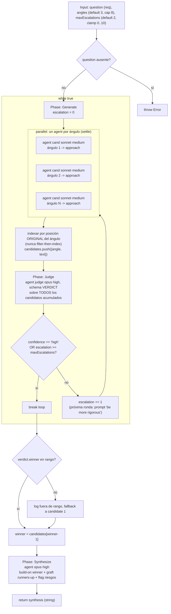

# judge-escalate

> Generá candidatos desde ángulos distintos, juzgalos con un veredicto tipado, y escalá solo cuando la confianza sea baja.

## En 30 segundos

Es un best-of-N que gasta más SOLO cuando hace falta: genera una tanda de candidatos desde ángulos distintos, un juez elige el mejor con un veredicto tipado (`winner`, `confidence`, `why`), y si el juez no está seguro (`confidence != "high"`), se lanza otra ronda más rigurosa de candidatos en vez de conformarse con un ganador débil. Elegilo para decisiones donde casi siempre hay un ganador claro pero de vez en cuando conviene invertir más cómputo antes de comprometerse.

## Cómo lanzarlo

```text
/workflow new mi-run --pattern=judge-escalate
/workflow run mi-run {"question":"Best rollback strategy for the gate?","angles":["risk-first","simplicity-first","user-first"],"maxEscalations":2}
```

`question` es el único campo obligatorio. `angles` y `maxEscalations` tienen defaults razonables — ver la tabla en [Input y output](#input-y-output).

## Diagrama



## Qué hace

`judge-escalate` implementa un generate-and-filter adaptativo: en cada iteración lanza un `agent` por cada ángulo declarado (en `parallel`), acumula esos candidatos junto con los de rondas anteriores, y pide a un juez (`agent` con `schema` tipado) que elija el mejor y declare su confianza (`high`/`medium`/`low`). Si el juez confía, el loop se detiene ahí; si no, se genera otra tanda completa de candidatos —con un prompt más exigente que pide anticipar las objeciones de un crítico escéptico— y se vuelve a juzgar sobre el conjunto acumulado completo (no solo la tanda nueva).

Lo "dinámico" del patrón es justamente ese loop condicionado por el resultado del juez: el número de rondas de generación no está fijado de antemano, sino que depende de si el veredicto llega con confianza alta o no, acotado por `maxEscalations` para no gastar sin límite.

Al terminar el loop, un agente de síntesis final construye la respuesta definitiva a partir del candidato ganador, injertando las mejores ideas de los candidatos que no ganaron y señalando riesgos residuales — no descarta el trabajo de los perdedores, lo aprovecha.

Todo texto no confiable (la pregunta del usuario, los candidatos) viaja envuelto en un `fence()` con delimitador derivado de un hash del contenido, para blindar contra inyección de instrucciones dentro de esos textos.

## Cuándo usarlo

- Decisiones donde casi siempre hay un ganador claro entre alternativas (catálogo).
- Gasto adaptativo: preferís pagar más cómputo solo en los casos difíciles, no siempre.
- Selección de la mejor entre varias opciones ("best-of-N") cuando ya tenés ángulos/criterios distintos para generar candidatos.
- **No usarlo** cuando la comparación es par a par en vez de absoluta (ahí conviene `tournament`, que usa juicio pairwise en vez de un veredicto único sobre todo el conjunto).
- **No usarlo** cuando el objetivo es medir consenso entre muestras independientes de un mismo enfoque (ahí conviene `self-consistency`, votación en vez de escalada por confianza).

## Cómo funciona

**Validación de entrada.** `question` (o sus alias `q`/`text`) es obligatorio; si falta, lanza una excepción (`throw`, no aborta con graceful error). `angles` debe ser un array no vacío de strings; se recorta a `MAX_ANGLES = 8` con log si excede. `maxEscalations` se sanea a entero y se clampea a `[0, MAX_ESCALATIONS=10]`, con log si el valor pedido difiere del normalizado.

**Fase Generate.** Por cada ángulo, un `agent` (rol `cand`, modelo `sonnet`, effort `medium`) recibe la pregunta envuelta en `fence("topic", question)` y produce una propuesta de enfoque bajo ese ángulo. Todos los ángulos de la ronda se lanzan en `parallel`. A partir de la segunda ronda (`escalation > 0`), el prompt agrega la frase "Be more rigorous... pre-empt the weaknesses a skeptical critic would raise", subiendo el listón. El resultado se indexa por la posición ORIGINAL del ángulo (nunca filtrando y reindexando después), así un branch caído no corre las etiquetas de ángulo de los sobrevivientes; los `null` (fallo bajo settle) se descartan con log explícito y NO se agregan a `candidates`.

**Fase Judge.** Un único `agent` (rol `judge`, modelo `opus`, effort `high`, con `schema: VERDICT`) recibe la pregunta y **todos** los candidatos acumulados hasta el momento (de esta ronda y de rondas previas), cada uno truncado a 8000 chars vía `compact()` y envuelto en su propio fence. El veredicto tipado exige `winner` (índice 1-based), `confidence` (`high`|`medium`|`low`) y `why`. El loop se corta (`break`) si `confidence === "high"` o si `escalation >= maxEscalations`; en caso contrario incrementa `escalation` y vuelve a Generate.

**Fase Synthesize.** Tras el loop, se valida que `verdict.winner` caiga dentro del rango de `candidates`; si no, se loguea y se usa el candidato 1 como fallback. Un `agent` final (modelo `opus`, effort `high`) recibe la pregunta, el texto del ganador y el conjunto completo de candidatos (truncado a 40000 chars), y escribe la respuesta final construyendo sobre el ganador, injertando ideas de los runners-up y señalando riesgos residuales. Este agente NO usa `schema`: retorna texto libre, que es lo que el scaffold devuelve como resultado final.

**Manejo de fallos parciales:** cada fan-out de Generate corre bajo `parallel` con settle implícito (se filtran los `null`); un candidato caído se loguea por índice y ángulo, y no bloquea el resto de la ronda ni el veredicto.

**Caching:** no se observa ningún mecanismo explícito de caché; cada `agent` se invoca fresco en cada ronda, y el juez re-evalúa el conjunto completo acumulado (no solo lo nuevo) en cada escalada.

## Input y output

| Campo | Tipo | Requerido | Default / clamp |
|---|---|---|---|
| `question` (alias `q`, `text`) | string | **sí** | — (si falta, `throw Error`) |
| `angles` | string[] | no | default `["risk-first","simplicity-first","user-first"]`, cap 8 (`MAX_ANGLES`) |
| `maxEscalations` | number | no | default 2, clamp `[0, 10]` (`MAX_ESCALATIONS`) |
| `model` / `effort` | string | no | override global para todo nodo |
| `models[role]` / `efforts[role]` | object | no | override por rol (`cand`, `judge`, `synthesis`); precedencia: por-rol > global > default del call-site |
| `tools` / `skills` / `excludeTools` (y variantes `*ByRole`) | array | no | pasados al `agent` si son arrays |

**Output:** el retorno del scaffold es directamente el string producido por el agente de síntesis final (no un objeto con campos separados).

No se observan llamadas a `writeArtifact`: toda la observabilidad pasa por `log(...)` — normalización de `angles`/`maxEscalations`, resultado de cada escalada (`winner`, `confidence`), candidatos descartados por fallo, y el conteo final de candidatos junto al veredicto.

## Fases

1. **Generate** — un `agent` por ángulo (modelo `sonnet`, effort `medium`) en `parallel`, propone un enfoque distinto a la pregunta; desde la segunda ronda pide mayor rigor.
2. **Judge** — un `agent` (modelo `opus`, effort `high`, `schema` tipado) elige el mejor candidato entre TODOS los acumulados y declara su confianza; confianza alta o presupuesto agotado corta el loop, si no se vuelve a Generate.
3. **Synthesize** — un `agent` final (modelo `opus`, effort `high`) escribe la respuesta definitiva construyendo sobre el candidato ganador, injertando ideas de los runners-up y señalando riesgos residuales.
