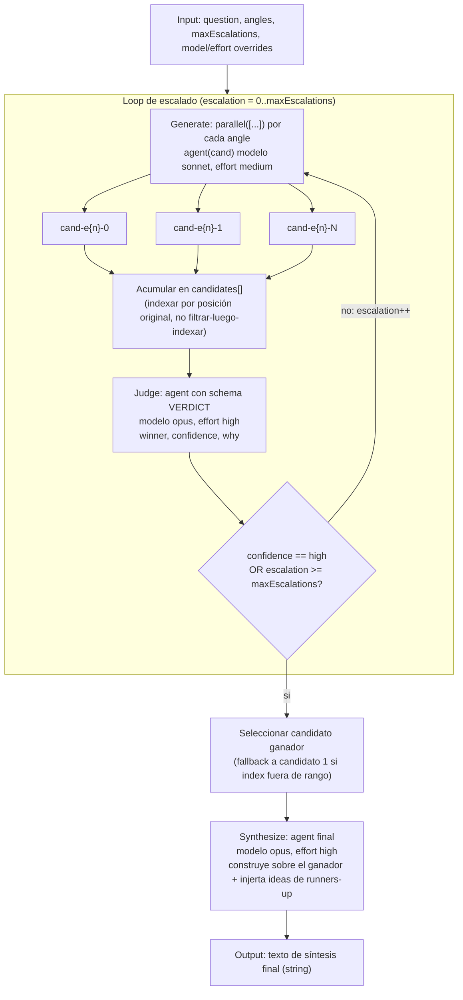

# judge-escalate

> Genera candidatos desde ángulos distintos, un juez con veredicto tipado, y escala solo cuando la confianza es baja.

## En 30 segundos

Es un best-of-N con gasto adaptativo: varios agentes proponen respuestas desde ángulos distintos (risk-first, simplicity-first, user-first, ...), un juez de alto esfuerzo elige un ganador con veredicto tipado (`winner`, `confidence`, `why`), y solo se paga otra ronda de generación —más exigente— si el juez no está seguro. Elegilo cuando querés comparar alternativas con un criterio absoluto (no pairwise) y preferís gastar cómputo extra solo cuando hace falta, en vez de siempre correr N rondas fijas.

## Cómo lanzarlo

```text
/workflow new mi-run --pattern=judge-escalate
/workflow run mi-run {"question": "¿Cuál es la mejor estrategia de rollback para el gate?", "angles": ["risk-first", "simplicity-first", "user-first"], "maxEscalations": 2}
```

`question` (alias `q`/`text`) es el único campo obligatorio; `angles` y `maxEscalations` son opcionales y ya traen los defaults de arriba. Ver [Input y output](#input-y-output) para overrides opcionales (`model`, `models`, `tools`, etc.).

## Diagrama



## Qué hace

`judge-escalate` es un patrón best-of-N con gasto adaptativo: genera candidatos de respuesta a una pregunta desde varios ángulos en paralelo, los hace evaluar por un juez que emite un veredicto tipado (`winner`, `confidence`, `why`), y solo invierte en una segunda ronda de generación (más rigurosa) si el juez no está seguro. Si el juez confía (`confidence: "high"`) o se agota el presupuesto de escalaciones, el loop se detiene inmediatamente en lugar de seguir gastando.

El corazón dinámico del scaffold es el `while (true)` que rodea las fases Generate/Judge: en cada vuelta genera un lote de candidatos (uno por ángulo, en paralelo con `parallel()`), los agrega al acumulado `candidates[]` (nunca reemplaza el lote anterior — se van sumando), y pide veredicto sobre TODOS los candidatos acumulados hasta el momento. Si la confianza no es alta y aún queda presupuesto, aumenta `escalation` y repite con un prompt más exigente ("Be more rigorous... pre-empt the weaknesses a skeptical critic would raise").

Una vez que el loop termina, se selecciona el candidato ganador según el índice devuelto por el juez (con fallback defensivo al candidato 1 si el índice está fuera de rango), y una fase final de síntesis produce la respuesta definitiva, incorporando ideas de los candidatos que no ganaron y señalando riesgos residuales.

Todo el input externo (la pregunta y los textos de los candidatos) se envuelve con un fence de delimitador derivado por hash del contenido (`fence()`), para evitar inyección de instrucciones vía prompt injection, ya que el contenido no puede forjar su propio marcador de cierre.

## Cuándo usarlo

| Situación | ¿Usar `judge-escalate`? |
|---|---|
| Best-of-N con ganador claro casi siempre, pero a veces conviene profundizar | Sí — es el caso de diseño |
| Querés pagar cómputo extra solo si el juez duda, no siempre | Sí — ese es el gasto adaptativo |
| Comparación absoluta (un juez, no pairwise) es razonable | Sí |
| La comparación absoluta es poco confiable pero la pairwise sí | No — usar `tournament` (bracket de eliminación directa) |
| Necesitás consenso/voto entre muestras independientes, sin juez único | No — usar `self-consistency` |
| No hay una pregunta concreta a responder | No — el scaffold falla explícitamente sin `question` |

## Cómo funciona

1. **Parseo de input y helpers.** Se parsea `args` a JSON con fallback a `{}`. Se definen `compact()` (trunca strings largos a 60000 chars para no inundar prompts) y `fence()` (delimitador de contenido no confiable con hash FNV-ish, no basado en `Date.now()`/`Math.random()` porque el runtime los prohíbe). `node(role, extra)` construye las opciones de cada nodo del workflow con overrides por rol (`input.models[role]`, `input.efforts[role]`, `input.toolsByRole[role]`, etc.), con precedencia: override por rol > default global (`input.model`/`input.effort`) > default del call-site.

2. **Validación de input.** `question` es obligatorio (lanza error si falta). `angles` default `["risk-first", "simplicity-first", "user-first"]`, clamp a máximo 8 ángulos (`MAX_ANGLES = 8`), con log si se recorta. `maxEscalations` default `2`, clamp a `[0, MAX_ESCALATIONS=10]` con normalización y log si el valor pedido está fuera de rango.

3. **Schema del veredicto (`VERDICT`).** Objeto JSON estricto (`additionalProperties: false`) con `winner` (entero, índice 1-based), `confidence` (enum `high|medium|low`) y `why` (string). Se pasa como `schema` al `agent()` del juez para forzar salida estructurada.

4. **Fase Generate (dentro del loop).** `parallel(angles.map(...))` lanza un `agent()` por cada ángulo simultáneamente (barrier: espera a que todos terminen). Cada candidato usa `model: "sonnet"`, `effort: "medium"`, label `cand-e{escalation}-{i}`, phase `"Generate"`. El prompt incluye instrucciones anti-inyección explícitas y la pregunta fenced. En rondas de escalación (`escalation > 0`) se añade la frase "Be more rigorous..." al prompt para pedir mayor rigor.

5. **Acumulación de candidatos.** Se itera el batch por índice ORIGINAL (comentario explícito en el código: nunca filtrar-y-luego-indexar, porque una rama caída correría el índice de los sobrevivientes posteriores). Si `r.output` es `null`/`undefined` se descarta con log; si no, se agrega `{ angle, text }` a `candidates[]` (acumulativo entre rondas, no se reinicia).

6. **Fase Judge (dentro del loop).** Un solo `agent()` con `model: "opus"`, `effort: "high"`, `schema: VERDICT`, phase `"Judge"`, label `judge-e{escalation}`. Recibe la pregunta y TODOS los candidatos acumulados (cada uno truncado a 8000 chars vía `compact`), fenced individualmente. Se le pide ser "skeptical" y "demand evidence".

7. **Gate adaptativo.** Se normaliza `confidence` a lowercase. Se loguea `escalation`, `winner`, `confidence`. Condición de salida: `confidence === "high" || escalation >= maxEscalations`. Si no se cumple, `escalation++` y vuelve a Generate (con más rigor). Este es el mecanismo central "generate-and-filter adaptativo": el costo solo crece cuando hace falta.

8. **Selección del ganador.** `winnerIdx = verdict.winner - 1`. Si está fuera de rango `[0, candidates.length)`, se loguea la anomalía y se usa fallback: `candidates[winnerIdx] ?? candidates[0]`.

9. **Fase Synthesize.** Un `agent()` final con `model: "opus"`, `effort: "high"`, phase `"Synthesize"` (sin label explícito, usa el default `"synthesis"` de `node()`). Recibe la pregunta, el candidato ganador (con su ángulo) y TODOS los candidatos (truncados a 40000 chars) fenced. Se le pide construir sobre el ganador, injertar ideas de los runners-up y señalar riesgos residuales. El output de este agente es el retorno final del workflow.

**Manejo de fallos parciales:** una rama de `parallel()` que devuelve `null`/`undefined` se descarta con log explícito sin abortar el resto del batch (best-effort). No hay reintentos automáticos de una rama fallida.

**Caching:** el scaffold no implementa caching explícito propio (no hay `cache()`/persistencia visible en el código); confía en la infraestructura del runtime de agentes para eso, si la hubiera.

## Input y output

**Input** (JSON, vía `args`):

| Campo | Tipo | Default | Notas |
|---|---|---|---|
| `question` / `q` / `text` | string | — (requerido) | Lanza error si no está presente. |
| `angles` | string[] | `["risk-first", "simplicity-first", "user-first"]` | Clamp a máx. 8 elementos (`MAX_ANGLES`); debe ser array no vacío. |
| `maxEscalations` | number | `2` | Clamp a `[0, 10]` (`MAX_ESCALATIONS`); se normaliza con `Math.floor`. |
| `model` | string | — | Default global de modelo para todos los nodos (override por `models[role]`). |
| `effort` | string | — | Default global de reasoning-effort (`low\|medium\|high\|xhigh\|max`), override por `efforts[role]`. |
| `models` | object | `{}` | Override de modelo por rol lógico (`cand`, `judge`, `synthesis`). |
| `efforts` | object | `{}` | Override de effort por rol. |
| `tools` / `toolsByRole` | array/object | — | Herramientas por defecto o por rol. |
| `skills` / `skillsByRole` | array/object | — | Skills por defecto o por rol. |
| `excludeTools` / `excludeByRole` | array/object | — | Exclusión de herramientas por defecto o por rol. |

**Output:** el valor devuelto por el `agent()` de síntesis final — texto (string) con la respuesta final construida sobre el candidato ganador.

**Artifacts:** el código no llama `writeArtifact` en ningún punto; no persiste artifacts propios más allá de lo que la infraestructura del runtime registre automáticamente (logs vía `log()`).

## Fases

1. **Generate** — Generación en paralelo de candidatos, uno por ángulo, repetida en cada escalación.
2. **Judge** — Veredicto tipado (`winner`, `confidence`, `why`) sobre todos los candidatos acumulados; gate de escalado.
3. **Synthesize** — Redacción de la respuesta final a partir del candidato ganador y los runners-up.
