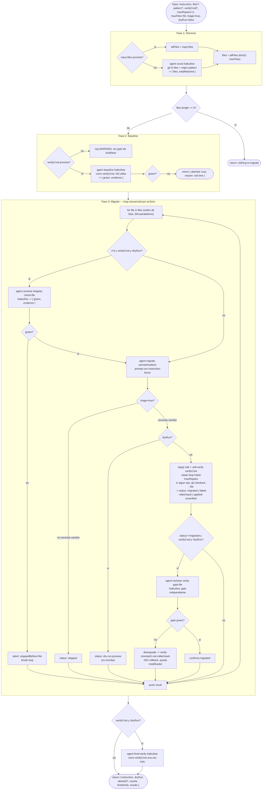

# large-migration

> Un applier real: gate de baseline verde, por archivo apply → verify → repair acotado, rollback en caso de falla. Secuencial.

## En 30 segundos

`large-migration` aplica de verdad una migración de código archivo por archivo — no solo la audita — con barandas tomadas de tooling real (baseline verde antes de tocar nada, verify después de cada archivo, rollback si no se puede reparar). Elegilo cuando tenés que mutar muchos archivos con una instrucción repetible (un codemod, un upgrade de API) y **no podés** dejar la rama rota; para triage/auditoría sin escribir, usá `scout-fanout`.

## Cómo lanzarlo

```text
/workflow new mi-run --pattern=large-migration
/workflow run mi-run {"instruction": "Reemplazar axios.get(url) por fetchJson(url)", "pattern": "code", "verifyCmd": "npm run build && npm test", "maxFiles": 50}
```

Con `instruction` alcanza (es el único campo requerido); sin `files` explícitos, el workflow descubre el work-list vía `git ls-files` + `pattern` (default: extensiones de código). Sin `verifyCmd` migra igual, pero sin gate ni rollback verificado — el log deja constancia con un WARNING. Ver la tabla completa en [Input y output](#input-y-output).

## Diagrama



## Qué hace

`large-migration` es un scaffold **applier**, no un auditor: modifica el árbol de trabajo aplicando una instrucción de migración archivo por archivo, con barandas de seguridad tomadas de tooling de migración real (Google AI-migration, Amazon Q Code Transformation, el libro SWE de Google sobre LSC). A diferencia de `scout-fanout` (que triagea y revisa sin tocar código), este workflow escribe cambios en disco.

El flujo es deliberadamente secuencial: como todos los agentes comparten el mismo árbol de trabajo, paralelizar apply/verify produciría carreras (un archivo en verificación mientras otro se edita). Por eso cada archivo se procesa uno detrás del otro, con un chequeo de integridad del árbol antes de tocar el siguiente y una verificación independiente después de que el agente que migró afirma haber terminado ("migrated" es un self-report, no una garantía — el orquestador vuelve a correr `verifyCmd` para confirmarlo).

El diseño trata las afirmaciones del agente migrador como *claims*, no como hechos: si dice "migrated" pero el re-chequeo del orquestador da rojo, el status se degrada a `verify-mismatch-not-rolled-back` en vez de confiar ciegamente. Del mismo modo, si no hay `verifyCmd`, el workflow migra sin gate y lo advierte explícitamente en el log — no finge seguridad que no tiene.

Explícitamente fuera de alcance (documentado en el propio código, no oculto): no hay secuenciación por orden de dependencias (los archivos se procesan en el orden de la lista descubierta), no hace commits git por archivo, y no hay apply en paralelo sobre worktrees separados. Si la migración lo necesita, hay que agregarlo.

## Cuándo usarlo

| Situación | ¿Usar `large-migration`? |
|---|---|
| API/codemod rollout: reemplazar una llamada, patrón o import en muchos archivos | Sí — es el caso central |
| Upgrade de framework, archivo por archivo, con build/test como gate | Sí |
| Migración acotada donde "no dejar nada roto" pesa más que la velocidad | Sí, sobre todo con `verifyCmd` |
| Solo necesitás triage/auditoría, sin escribir cambios | No — usá `scout-fanout` |
| La migración requiere orden de dependencias entre archivos | No — este scaffold procesa en orden de lista, no lo resuelve |
| Necesitás apply en paralelo sobre worktrees separados para escalar velocidad | No — el diseño es intencionalmente secuencial |
| No hay forma de verificar el cambio (`verifyCmd`) y el riesgo de romper la rama es alto | Puede correr sin gate, pero bajo protesta (WARNING en el log) — evaluá el riesgo antes |

## Cómo funciona

El scaffold parsea `args` como input JSON, define un helper `node(role, extra)` para overrides por rol (`model`/`effort`/`tools`/`skills`/`excludeTools`, con precedencia rol > global > default) y un helper `fence()` que envuelve datos no confiables (la instrucción de migración) en un delimitador derivado de un hash del contenido, para que un payload malicioso no pueda falsificar el marcador de cierre.

**Fase 1 — Discover** (`phase("Discover")`): si `input.files` viene como array no vacío, se usa directamente (se saltea git). Si no, un `agent` con rol `scout` (modelo `haiku`, effort `low`, `schema: FILE_LIST`) corre `git ls-files`, filtra por el regex `pattern` (default: extensiones de código `\.(ts|tsx|js|jsx|py|go|rs)$`, con alias `docs`/`web`/`config` disponibles) y devuelve hasta `maxFiles` rutas más `totalMatched` (el total antes del cap). Se aplica `files.slice(0, maxFiles)`; si no hay archivos, retorna temprano con un mensaje.

**Fase 2 — Baseline** (`phase("Baseline")`): si hay `verifyCmd`, un `agent` de rol `baseline` (haiku/low, `schema: VERIFY`) corre el comando SIN editar nada y reporta `{ green, evidence }`. Si no está verde, el workflow **aborta** devolviendo `{ aborted: true, reason: "baseline is not green..." }` — nunca migra sobre un árbol rojo. Si no se pasó `verifyCmd`, solo loggea una advertencia y continúa sin gate.

**Fase 3 — Migrate** (`phase("Migrate")`): loop `for` secuencial sobre `files`. Antes de cada archivo (salvo el primero, y solo si hay `verifyCmd` y no es `dryRun`) se corre un `recheck` (agent `integrity-check:<file>`, haiku/low) para confirmar que el árbol sigue verde; si no, se aborta el loop entero (`aborted.stoppedBefore`) para no seguir migrando sobre corrupción acumulada.

Para cada archivo se construye un prompt (`agent` rol `migrate`, `sonnet`/`medium`, `schema: RESULT`) que:
- envuelve la instrucción con `fence("plan", ...)` y advierte explícitamente contra prompt injection dentro de los datos no confiables;
- si `triage` (default `true`), pide primero comprobar si el archivo realmente necesita el cambio — si no, status `skipped` sin editar;
- si `dryRun` (default `false`), pide describir el diff sin escribir, status `dry-run-preview`;
- si no, pide aplicar el cambio con Edit/Write, verificar con `verifyCmd`, y si falla, reparar hasta `maxRepairs` intentos (default `2`); si sigue rojo, hacer `git checkout -- <file>` (rollback) y devolver `failed-rolled-back`; si no hay `verifyCmd`, devuelve `applied-unverified`.

Después de recibir el resultado, si `verifyCmd` está presente, no es `dryRun` y el agente reportó `migrated`, el orquestador corre un `recheck` independiente (`verify-gate:<file>`) — si da rojo, degrada el status a `verify-mismatch-not-rolled-back` y **no hace rollback** (deja el archivo modificado en disco), dejando constancia explícita en `notes` de que el self-report no coincidía con la verificación real.

Al final del loop (si hubo `verifyCmd` y no `dryRun`) se corre un `final-verify` (haiku/low) para confirmar que todos los cambios compuestos siguen pasando juntos.

Manejo de fallos parciales: no hay reintentos automáticos a nivel workflow más allá del repair loop por archivo; un archivo que no puede repararse se rollbackea y el loop continúa con el siguiente (salvo que el fallo deje el árbol rojo, en cuyo caso el chequeo de integridad del *próximo* archivo aborta el resto). No hay caching explícito entre corridas — cada fase re-ejecuta sus agentes; el único punto de "memoria" es el estado del propio árbol git (baseline verde, rollback vía `git checkout`).

## Input y output

| Campo | Tipo | Default | Notas |
|---|---|---|---|
| `instruction` (o `task`/`text`) | string | **requerido** | Qué migrar; lanza error si falta. |
| `files` | string[] | — | Si se provee, se usa tal cual (salta git ls-files). |
| `pattern` | string | `code` → `\.(ts\|tsx\|js\|jsx\|py\|go\|rs)$` | Alias válidos: `code`, `docs`, `web`, `config`; o un regex custom. |
| `verifyCmd` | string | `null` | Comando de build/test; sin él, migra sin gate (con warning). |
| `maxRepairs` | number | `2` | Clamp: `max(0, floor(x))`; coerción logueada si difiere. |
| `maxFiles` | number | `50` | Clamp: `max(1, min(4096, floor(x)))`; coerción logueada si difiere. |
| `triage` | bool | `true` | Si `false`, no se salta ningún archivo por "no lo necesita". |
| `dryRun` | bool | `false` | Si `true`, no escribe nada, solo describe el diff. |
| `model` / `effort` / `models{}` / `efforts{}` | — | — | Overrides globales o por rol (`scout`, `baseline`, `migrate`, `recheck`, `final-verify`). |
| `tools`/`skills`/`excludeTools` (+ variantes `*ByRole`) | — | — | Overrides de herramientas/skills por rol. |

**Output** (objeto final):
- `instruction`, `dryRun`
- `aborted` (si aplica): `{ reason, ...}` — por baseline rojo o integridad rota entre archivos.
- `counts`: `{ total, processed, migrated, failedRolledBack, verifyMismatchNotRolledBack, skipped, appliedUnverified, dryRunPreview }`
- `finalVerify`: `{ green, evidence }` o `null` si no aplica.
- `results`: array de `{ file, status, attempts, notes, verified? }`, con `status` uno de `migrated | failed-rolled-back | verify-mismatch-not-rolled-back | skipped | applied-unverified | dry-run-preview`.

El scaffold no llama a `writeArtifact`; el único artefacto es el valor de retorno del workflow (y las líneas de `log(...)` emitidas en cada fase).

## Fases

1. **Discover** — determina la lista de archivos a migrar (input explícito o `git ls-files` + regex, acotado por `maxFiles`).
2. **Baseline** — gate de árbol verde: corre `verifyCmd` antes de tocar nada; aborta si está rojo.
3. **Migrate** — loop secuencial apply → verify → repair (acotado) → rollback por archivo, con chequeo de integridad entre archivos, verificación independiente del self-report, y verificación final de todo el conjunto.
