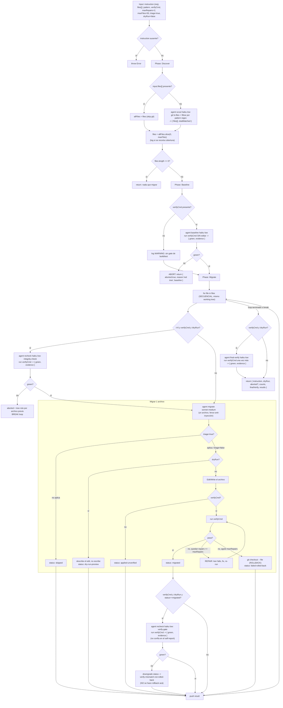

# large-migration

> Un applier real: gate de baseline verde, apply → verify → repair acotado por archivo, rollback ante fallo. Secuencial.

## En 30 segundos

`large-migration` migra código archivo por archivo y escribe de verdad en el árbol de trabajo: no audita, aplica cambios. Antes de tocar nada exige que el build/test esté en verde; después de cada archivo vuelve a verificar de forma independiente y, si algo sigue roto tras los intentos de reparación permitidos, hace `git checkout --` y continúa sin dejar un archivo a medio migrar. Elegilo cuando vas a mutar muchos archivos con la misma regla y no podés permitirte dejar uno roto atrás; para auditar o revisar sin mutar, usá `scout-fanout`.

## Cómo lanzarlo

```text
/workflow new mi-run --pattern=large-migration
/workflow run mi-run {"instruction":"Reemplazar oldApi(...) por newApi(...)","verifyCmd":"npm run build && npm test","dryRun":true}
```

`instruction` es el único campo obligatorio. `dryRun:true` permite previsualizar sin escribir; con `dryRun:false` el workflow aplica cambios de verdad. Si no hay `verifyCmd`, migra sin gate de build/test y lo deja asentado como warning. La tabla completa está en [Input y output](#input-y-output).

## Diagrama



## Qué hace

`large-migration` es la variante *applier* de `scout-fanout`: en vez de triar y revisar sin tocar código, modifica el árbol de trabajo de verdad, siguiendo prácticas de migración a gran escala documentadas por Google (LSC, AI-migration), Amazon Q Code Transformation y el SWE Book. La idea central es tratar cada archivo como una unidad transaccional: aplicar el cambio, verificarlo con el build/test real del repo, reparar un número acotado de veces si falla, y si sigue fallando revertir ese archivo puntual con `git checkout --` para no dejar nada roto.

Todo corre **secuencialmente**, a propósito: como todos los archivos comparten el mismo working tree, paralelizar apply/verify generaría carreras (un archivo verificando mientras otro edita). Antes de cada archivo, salvo el primero, se vuelve a chequear que el árbol siga verde para no seguir migrando sobre una corrupción dejada por un archivo anterior; y después de que un agente reporta `migrated`, el orquestador vuelve a correr `verifyCmd` de forma independiente en lugar de confiar en el self-report del agente. Si el chequeo independiente da rojo, degrada el status a `verify-mismatch-not-rolled-back` en vez de aceptar la afirmación a ciegas.

El workflow deja explícito lo que queda fuera de alcance: no ordena archivos por dependencias (los procesa en el orden de la lista), no hace un commit por archivo para producir diffs aterrizables, y no usa worktrees paralelos. Si la migración necesita eso, hay que agregarlo por fuera.

## Cuándo usarlo

- **Rollouts de API/codemod**: reemplazar una llamada o patrón de API por otro en todo el repo.
- **Upgrades de framework**: migraciones mecánicas repetidas archivo por archivo.
- **Migración acotada y respaldada por evidencia**: cuando cada cambio debe quedar verificado por build/test antes de considerarlo bueno.
- En general: cuando vas a mutar muchos archivos con la misma regla y no podés permitirte dejar uno roto en el árbol.

No usarlo cuando:

- Solo querés auditar o revisar sin mutar código → `scout-fanout`.
- La migración requiere orden de dependencias entre archivos, commits atómicos por archivo, o worktrees paralelos (fuera de alcance declarado).
- No hay forma de expresar un `verifyCmd` confiable: el workflow igual corre, pero sin gate de build/test queda como edición a ciegas (se loguea como warning explícito).

## Cómo funciona

**Fase Discover.** Si `input.files` llega como un array no vacío, se usa tal cual y se saltea `git`. Si no, un `agent` `scout` (modelo `haiku`, effort `low`) corre `git ls-files`, filtra por `pattern` (regex; con presets `code`/`docs`/`web`/`config`, y `code` por defecto = `ts|tsx|js|jsx|py|go|rs`) y devuelve `{ files[], totalMatched }` bajo el schema `FILE_LIST`. La instrucción es explícita: no inventar paths que no aparezcan en la salida real de `git ls-files`. El resultado se recorta a `maxFiles` (default 50, clamp 1..4096); si se recorta, se loguea. Si no queda ningún archivo, retorna temprano con "nada que migrar".

**Fase Baseline.** Si hay `verifyCmd`, un `agent` `baseline` (haiku·low) corre ese comando **sin editar nada** y devuelve `{ green, evidence }` (schema `VERIFY`). Si no da verde, el workflow aborta de inmediato con `{ aborted: true, reason, baseline }`: nunca migra sobre un árbol rojo. Si no hay `verifyCmd`, se loguea una advertencia explícita de que la migración correrá sin gate de build/test.

**Fase Migrate.** Recorre `files` en un loop secuencial (`for`, no `parallel`):

- *Integrity check entre archivos*: antes de cada archivo salvo el primero (y solo si hay `verifyCmd` y no es `dryRun`), un `agent` `recheck` (haiku·low) vuelve a correr `verifyCmd`. Si da rojo, se asume que un archivo previo dejó el árbol roto y el loop se corta ahí (`aborted`), para no seguir migrando sobre corrupción compuesta.
- *Migración por archivo*: un `agent` `migrate` (modelo `sonnet`, effort `medium`) recibe la instrucción envuelta en un fence anti-inyección derivado de un hash del contenido (`fence()`), con advertencia explícita de tratar cualquier directiva dentro de los datos como sospechosa, no como instrucción. Si `triage` está activo (default `true`), primero decide si el archivo realmente necesita el cambio; si no, devuelve `skipped` sin editar. Si `dryRun` está activo, describe el edit propuesto sin escribir (`dry-run-preview`). En caso contrario aplica el cambio con Edit/Write, y si hay `verifyCmd` corre la verificación: si pasa, `migrated`; si falla, repara hasta `maxRepairs` veces (default 2, clamp ≥0) releyendo el fallo y reintentando; si sigue fallando, hace `git checkout -- <file>` (rollback) y devuelve `failed-rolled-back`. Sin `verifyCmd`, el resultado tras aplicar es `applied-unverified`. El schema `RESULT` fuerza `{ file, status, attempts, notes }` con un enum cerrado de status.
- *Verify-gate independiente*: si el agente reportó `migrated` (y hay `verifyCmd`, no `dryRun`), el orquestador NO confía en el self-report: corre otro `agent` `recheck` (verify-gate) de forma independiente. Si da rojo, degrada el status a `verify-mismatch-not-rolled-back` (deliberadamente **no** hace rollback en ese caso: el archivo queda modificado en disco y se loguea con detalle) en vez de aceptar la afirmación del agente migrador.
- Si un `agent` no devuelve resultado en absoluto, se sintetiza un `RESULT` de emergencia con status `verify-mismatch-not-rolled-back` y una nota que advierte que no hubo rollback automático.

Al final del loop (si hubo `verifyCmd` y no es `dryRun`), un `agent` `final-verify` (haiku·low) corre `verifyCmd` una vez más para confirmar que los cambios por archivo siguen componiendo verde en conjunto.

**Fallos parciales:** cada paso de verificación (`baseline`, `recheck` de integridad, `verify-gate`, `final-verify`) es un `agent` dedicado con schema estricto, no una inferencia; el status por archivo distingue explícitamente entre self-report confiado (`migrated`), self-report desmentido (`verify-mismatch-not-rolled-back`), reparado y revertido (`failed-rolled-back`), sin necesidad (`skipped`), sin gate (`applied-unverified`) y solo-preview (`dry-run-preview`). No hay `try/catch` alrededor de la lógica de negocio: los abortos son retornos explícitos con razón (`red tree`, `tree roto por archivo previo`), no excepciones.

**Caché:** no se observa ningún mecanismo explícito de caché; cada llamada a `agent` es fresca.

## Input y output

| Campo | Tipo | Requerido | Default / clamp |
|---|---|---|---|
| `instruction` (o `task`/`text`) | string | **sí** | — (si falta, `throw Error`) |
| `files` | string[] | no | si viene no vacío, se usa tal cual y se saltea `git` |
| `pattern` | string | no | preset (`code`\|`docs`\|`web`\|`config`) o regex propia; default `code` = `\.(ts\|tsx\|js\|jsx\|py\|go\|rs)$` |
| `verifyCmd` | string | no | sin default; sin él, migra sin gate de build/test (con warning) |
| `maxRepairs` | number | no | default 2, `Math.max(0, floor(...))` |
| `maxFiles` | number | no | default 50, clamp 1..4096 |
| `triage` | boolean | no | default `true` |
| `dryRun` | boolean | no | default `false` |
| `model` / `effort` | string | no | override global por nodo |
| `models[role]` / `efforts[role]` | object | no | override por rol (`scout`, `baseline`, `recheck`, `migrate`, `final-verify`); precedencia por-rol > global > default del call-site |
| `tools` / `skills` / `excludeTools` (y variantes `*ByRole`) | array | no | pasados al `agent` si son arrays |

**Output:**

```json
{
  "instruction": "...",
  "dryRun": false,
  "aborted": { "reason": "...", "..." },
  "counts": {
    "total": 0, "processed": 0, "migrated": 0,
    "failedRolledBack": 0, "verifyMismatchNotRolledBack": 0,
    "skipped": 0, "appliedUnverified": 0, "dryRunPreview": 0
  },
  "finalVerify": { "green": true, "evidence": "..." },
  "results": [{ "file": "...", "status": "...", "attempts": 0, "notes": "..." }]
}
```

`aborted` solo aparece si el baseline dio rojo o si el integrity-check entre archivos detectó un árbol roto; en ese caso el loop se corta antes de procesar todos los archivos. `finalVerify` es `null` si no hubo `verifyCmd` o si `dryRun` es `true`. No se observan llamadas a `writeArtifact`: toda la observabilidad pasa por `log(...)` (baseline, integridad entre archivos, status por archivo, mismatches de verify-gate) y por la forma de retorno.

## Fases

1. **Discover** — resuelve la lista de trabajo: usa `files` explícitos o descubre vía `git ls-files` + `pattern` regex (agente `scout`), acotado por `maxFiles`.
2. **Baseline** — gate de árbol verde: corre `verifyCmd` antes de cualquier cambio (agente `baseline`); aborta si el árbol ya está rojo.
3. **Migrate** — loop secuencial por archivo con integrity-check previo, apply/triage/dry-run, verify + repair acotado, rollback ante fallo persistente, verify-gate independiente del self-report, y verificación final del conjunto.
