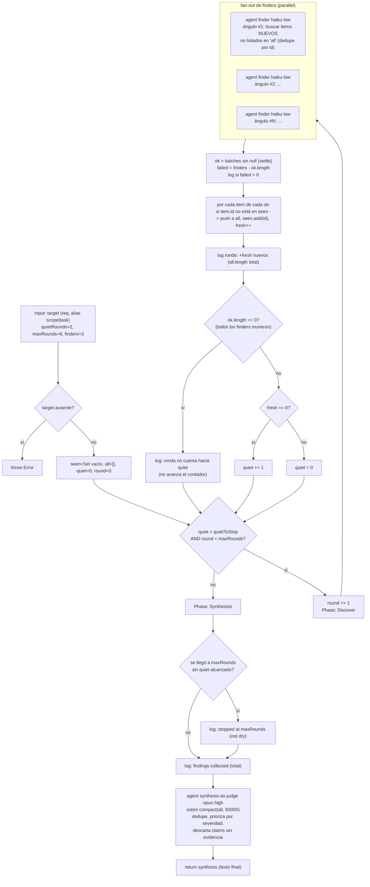

# loop-until-dry

> Descubrimiento loop-until-dry: seguí lanzando finders hasta K rondas quietas consecutivas o hasta `maxRounds`.

## En 30 segundos

Este scaffold sirve para descubrir un conjunto cuyo tamaño no conocés de antemano: un audit, un "encontrá todos los
call-sites de X" o una búsqueda de edge-cases. En cada ronda, varios `finders` corren en paralelo desde ángulos
distintos y solo agregan hallazgos nuevos. El loop termina cuando se acumulan K rondas quietas seguidas (ya se secó) o
cuando llega a `maxRounds` (presupuesto agotado). Si el work-list ya está cerrado, usá `map-reduce` o
`fan-out-and-synthesize` en su lugar.

## Cómo lanzarlo

```text
/workflow new mi-run --pattern=loop-until-dry
/workflow run mi-run {"target":"todos los lugares donde parseamos chunks SSE","quietRounds":2,"maxRounds":8}
```

`target` es el único campo obligatorio (también acepta los alias `scope`/`task`); si falta, el scaffold lanza un error
explícito. El resto de los campos tiene defaults — ver la tabla en [Input y output](#input-y-output).

## Diagrama



## Qué hace

`loop-until-dry` hace descubrimiento dinámico: la profundidad no está fijada de antemano. En cada ronda lanza `finders`
agentes en paralelo; cada uno explora un ángulo distinto y solo reporta hallazgos que no estén ya en la lista acumulada.

El loop sigue hasta una de estas dos paradas:

- `quietRounds` rondas seguidas sin hallazgos nuevos (`fresh === 0`), que significa que el conjunto está "seco".
- `maxRounds` rondas totales, que corta por presupuesto y deja un log explícito de que no se llegó por sequedad.

Cada finder devuelve JSON validado por schema (`{ items: [{ id, title, evidence }] }`), así que el dedupe por `id` vive
en un `Set` global (`seen`) y no depende de texto libre. Al final, un único agente de síntesis-como-juez (`opus`,
`high`) recibe todos los hallazgos acumulados y devuelve el resultado final: deduplicado, priorizado por severidad y sin
claims sin sustento.

El diseño es "robustness-first": el fan-out de cada ronda usa el patrón settle (un finder que crashea se vuelve `null` y
no tumba la ronda), y se distingue explícitamente una ronda "quieta de verdad" (todos los finders corrieron y no
encontraron nada nuevo) de una ronda donde TODOS los finders fallaron (esa no cuenta para el contador de sequedad, para
no confundir infraestructura caída con "ya no hay más para encontrar"). El código solo emite un log explícito al salir
por `maxRounds` (`stopped at maxRounds...`); al terminar por sequedad (`quietRounds`) no hay un log equivalente, así que
no toda decisión de parada queda observada.

## Cuándo usarlo

| Usalo                                                                                     | No lo uses                                                                                                                                     |
| ----------------------------------------------------------------------------------------- | ---------------------------------------------------------------------------------------------------------------------------------------------- |
| Para enumerar todos los call-sites o edge-cases de una base grande.                       | Cuando ya conocés el work-list completo de antemano.                                                                                           |
| Para preguntas del tipo "encontrá todo lo que…" y el tamaño del resultado es desconocido. | Cuando necesitás comparar alternativas fijas o rankear opciones cerradas.                                                                      |
| Para auditorías donde importa parar solo cuando ya no aparece nada nuevo.                 | Cuando el descubrimiento abierto no aporta valor: usá `map-reduce` si el conjunto es grande, o `fan-out-and-synthesize` si entra en un prompt. |

## Cómo funciona

**Validación de entrada.** `target` (o sus alias `scope`/`task`) es obligatorio: describe qué buscar o auditar. Si
falta, el scaffold hace `throw` de inmediato. Los números se sanan con `Number(...) || default` y luego con `clamp`
manual: `quietRounds` por defecto 2 (1..100), `maxRounds` por defecto 8 (1..1000) y `finders` por defecto 3 (1..6). Si
el valor pedido se corrige, eso queda logueado.

**Fase Discover.** En cada iteración del loop se incrementa `round`, se marca `phase("Discover")` y se lanzan `finders`
agentes en `parallel`. Cada finder corre con rol `finder`, modelo `haiku` y `effort` `low`; recibe fences anti-inyección
para `target` y para lo ya acumulado (truncado a 4000 caracteres con `compact`), además de la instrucción de usar un
ángulo de búsqueda distinto y devolver JSON que cumpla `ITEMS`. Después del fan-out, los `null` se filtran (`settle`);
si alguno falló, se loguea cuántos. Los ítems nuevos se agregan a `all` solo si su `id` no está en `seen`.

**Contador de sequedad.** Si `ok.length === 0`, la ronda no cuenta hacia `quiet`: una caída total de la infraestructura
no debe parecerse a "ya no hay más para encontrar". Si hubo al menos un finder vivo, `quiet` vuelve a 0 cuando aparece
algo nuevo, o sube en 1 cuando la ronda no aporta nada.

**Fase Synthesize.** Al salir del loop, si se llegó a `maxRounds` sin completar `quietRounds`, se loguea que la parada
fue por presupuesto y no por sequedad. Después se marca `phase("Synthesize")` y se lanza un único agente juez (`opus`,
`high`) sobre todo lo acumulado (truncado a 60000 caracteres), con la consigna de deduplicar, descartar claims sin
sustento y ordenar por severidad. El retorno final es directamente lo que produce ese agente.

**Caching**: no hay caché explícita; cada agente se invoca fresco.

**Fallos parciales**: el patrón settle evita que un finder caído tumbe la ronda y permite distinguir ese caso del
verdadero stop por sequedad.

## Input y output

**Input** (JSON-stringified en `args`, parseado de forma defensiva):

| Campo                                                                                  | Tipo   | Requerido | Default / clamp                                                                                     |
| -------------------------------------------------------------------------------------- | ------ | --------- | --------------------------------------------------------------------------------------------------- |
| `target` (alias `scope`, `task`)                                                       | string | **sí**    | — (si falta, `throw Error`)                                                                         |
| `quietRounds`                                                                          | number | no        | default 2, clamp 1..100                                                                             |
| `maxRounds`                                                                            | number | no        | default 8, clamp 1..1000                                                                            |
| `finders`                                                                              | number | no        | default 3, clamp 1..6                                                                               |
| `model` / `effort`                                                                     | string | no        | sobrescriben globalmente a todos los nodos                                                          |
| `models[role]` / `efforts[role]`                                                       | object | no        | sobrescriben por rol (`finder`, `synthesis`); precedencia: por rol > global > default del call-site |
| `tools` / `skills` / `excludeTools` / `toolsByRole` / `skillsByRole` / `excludeByRole` | array  | no        | se pasan al `agent` si son arrays                                                                   |

**Output:** el resultado devuelto directamente por el agente de síntesis (texto, no un objeto envuelto) — los hallazgos
deduplicados, priorizados por severidad, con evidencia.

No se observan llamadas a `writeArtifact` en este scaffold: toda la observabilidad pasa por `log(...)` (parámetros
efectivos, hallazgos nuevos por ronda, finders fallidos, motivo de parada) y por el valor de retorno final.

## Fases

1. **Discover** — se repite ronda tras ronda: fan-out de `finders` agentes en paralelo (haiku·low, cada uno con un
   ángulo de búsqueda distinto), dedupe por `id` contra lo ya encontrado, y actualización del contador de rondas quietas
   hasta cumplir `quietRounds` consecutivas sin novedades o agotar `maxRounds`.
2. **Synthesize** — un único agente juez (opus·high) sobre todos los hallazgos acumulados de todas las rondas:
   deduplica, descarta claims sin evidencia, prioriza por severidad y produce el resultado final.
