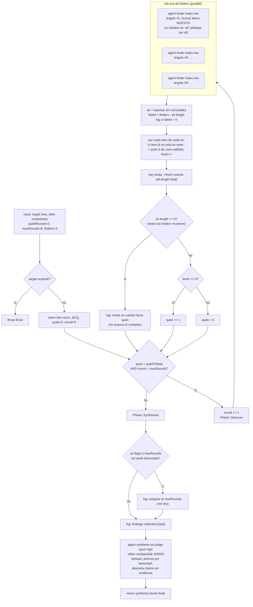

# loop-until-dry

> Descubrimiento loop-until-dry: seguí lanzando finders hasta K rondas quietas consecutivas o hasta `maxRounds`.

## En 30 segundos

Es el patrón para cuando no sabés de antemano cuántos hallazgos hay — un audit, un "encontrá todos los call-sites de X" — y querés exhaustividad, no una cantidad fija de resultados. En cada ronda, varios finders en paralelo buscan hallazgos NUEVOS con ángulos distintos; si una ronda no aporta nada nuevo, cuenta como "quieta". El loop para cuando se acumulan K rondas quietas seguidas (ya está seco) o al llegar a `maxRounds` (presupuesto agotado). Elegilo cuando el tamaño del conjunto a descubrir es desconocido; si ya sabés el work-list completo, usá `map-reduce` o `fan-out-and-synthesize` en su lugar.

## Cómo lanzarlo

```text
/workflow new mi-run --pattern=loop-until-dry
/workflow run mi-run {"target":"todos los lugares donde parseamos chunks SSE","quietRounds":2,"maxRounds":8}
```

`target` es el único campo obligatorio (también acepta los alias `scope`/`task`); si falta, el scaffold lanza un error explícito. El resto de los campos tiene defaults — ver la tabla en [Input y output](#input-y-output).

## Diagrama



## Qué hace

`loop-until-dry` implementa un descubrimiento dinámico donde la profundidad NO está fijada de antemano: en cada ronda se lanzan `finders` agentes en paralelo, cada uno con una instrucción de buscar desde un "ángulo" distinto (una estrategia de búsqueda distinta de la de sus pares) y de reportar solo hallazgos que no estén ya en la lista acumulada. El loop sigue rondas tras ronda hasta que se cumple una de dos condiciones de parada: `quietRounds` rondas consecutivas sin ningún hallazgo nuevo (el conjunto está "seco"), o `maxRounds` rondas totales (presupuesto agotado, se loguea explícitamente que la parada fue por cap y no por sequedad).

Cada finder devuelve JSON validado por schema (`{ items: [{ id, title, evidence }] }`), lo que permite deduplicar de forma confiable por `id` en un `Set` global (`seen`) en vez de depender de comparación de texto libre. Al final, una fase de síntesis-como-juez (un solo agente, modelo `opus`, effort `high`) recibe TODOS los hallazgos acumulados de todas las rondas y produce el resultado final: deduplicado, priorizado por severidad, con evidencia, descartando cualquier claim sin sustento.

El diseño es "robustness-first": el fan-out de cada ronda usa el patrón settle (un finder que crashea se vuelve `null` y no tumba la ronda), y se distingue explícitamente una ronda "quieta de verdad" (todos los finders corrieron y no encontraron nada nuevo) de una ronda donde TODOS los finders fallaron (esa no cuenta para el contador de sequedad, para no confundir infraestructura caída con "ya no hay más para encontrar"). Todos los caps y decisiones de parada se loguean, nunca de forma silenciosa.

## Cuándo usarlo

- Enumerar todos los call-sites o edge-cases de algo en un código/base grande.
- Preguntas del tipo "encontrá todo lo que…" donde el tamaño del resultado es desconocido.
- Auditorías donde importa la exhaustividad y parar quieto (no por un número arbitrario de resultados).
- **No usarlo** cuando ya conocés el work-list completo de antemano (usá `map-reduce` si es grande, o `fan-out-and-synthesize` si entra en un prompt): pagar rondas de descubrimiento no aporta nada si no hay nada que descubrir.
- **No usarlo** cuando necesitás un ranking/comparación entre alternativas fijas, no un descubrimiento abierto.

## Cómo funciona

**Validación de entrada.** `target` (o sus alias `scope`/`task`) es obligatorio: describe qué buscar/auditar. Si no está presente, el scaffold lanza una excepción inmediatamente (a diferencia de otros scaffolds que abortan devolviendo un shape de error, acá se propaga el `throw`). Los parámetros numéricos se sanean con `Number(...) || default` y luego un `clamp` manual: `quietRounds` default 2 (clamp 1..100), `maxRounds` default 8 (clamp 1..1000), `finders` default 3 (clamp 1..6). Cada clamp aplicado se loguea si el valor pedido difiere del efectivo.

**Fase Discover (se repite por ronda).** En cada iteración del loop principal se incrementa `round`, se marca `phase("Discover")`, y se lanzan `finders` agentes en `parallel`. Cada finder corre en el rol `finder` (modelo `haiku`, effort `low` — barato, apto para volumen) y recibe: un fence anti-inyección envolviendo el `target` y otro envolviendo los hallazgos ya acumulados (truncados a 4000 chars con `compact`), instrucción explícita de usar un ángulo de búsqueda distinto de los otros finders del mismo round, y el pedido de devolver JSON validado contra el schema `ITEMS` (array vacío si no hay nada nuevo). Tras el fan-out, se filtran los `null` (settle) para obtener `ok`; si algún finder falló se loguea cuántos. Por cada item de cada resultado `ok`, si su `id` no está en el `Set seen`, se agrega a `all` y se cuenta como `fresh`.

**Contador de sequedad.** Si `ok.length === 0` (TODOS los finders de la ronda fallaron), esa ronda NO cuenta hacia el contador `quiet` — evita confundir una caída de infraestructura con "ya no hay más para encontrar". En caso contrario, `quiet` se resetea a 0 si hubo algún hallazgo `fresh`, o se incrementa en 1 si la ronda no aportó nada nuevo. El loop principal continúa mientras `quiet < quietToStop` y `round < maxRounds`.

**Fase Synthesize.** Al salir del loop (por sequedad o por cap), si se llegó a `maxRounds` sin haber alcanzado `quietToStop` rondas quietas, se loguea explícitamente que la parada fue por presupuesto de rondas y no porque el conjunto esté seco (no-silent-caps). Luego se marca `phase("Synthesize")` y se lanza un único `agent` de síntesis-como-juez (modelo `opus`, effort `high`) sobre TODOS los hallazgos acumulados (truncados a 60000 chars), envueltos en el mismo fence anti-inyección. Su instrucción: deduplicar, descartar claims sin sustento, priorizar por severidad (más severo primero), preservando evidencia. El resultado de este agente es el retorno final del scaffold.

**Caching:** no se observa ningún mecanismo explícito de caché; cada `agent` de cada ronda y la síntesis se invocan frescos.

**Manejo de fallos parciales:** el fan-out de finders usa el patrón settle (un finder caído se convierte en `null` y se filtra); se distingue y loguea el caso extremo de que TODA una ronda falle, para no dejar que un problema de infraestructura sea indistinguible de "ya no hay más hallazgos".

## Input y output

**Input** (JSON-stringified en `args`, parseado defensivamente):

| Campo | Tipo | Requerido | Default / clamp |
|---|---|---|---|
| `target` (alias `scope`, `task`) | string | **sí** | — (si falta, `throw Error`) |
| `quietRounds` | number | no | default 2, clamp 1..100 |
| `maxRounds` | number | no | default 8, clamp 1..1000 |
| `finders` | number | no | default 3, clamp 1..6 |
| `model` / `effort` | string | no | override global para todo nodo |
| `models[role]` / `efforts[role]` | object | no | override por rol (`finder`, `synthesis`); precedencia: por-rol > global > default del call-site |
| `tools` / `skills` / `excludeTools` (y variantes `*ByRole`) | array | no | pasados al `agent` si son arrays |

**Output:** el resultado devuelto directamente por el agente de síntesis (texto, no un objeto envuelto) — los hallazgos deduplicados, priorizados por severidad, con evidencia.

No se observan llamadas a `writeArtifact` en este scaffold: toda la observabilidad pasa por `log(...)` (parámetros efectivos, hallazgos nuevos por ronda, finders fallidos, motivo de parada) y por el valor de retorno final.

## Fases

1. **Discover** — se repite ronda tras ronda: fan-out de `finders` agentes en paralelo (haiku·low, cada uno con un ángulo de búsqueda distinto), dedupe por `id` contra lo ya encontrado, y actualización del contador de rondas quietas hasta cumplir `quietRounds` consecutivas sin novedades o agotar `maxRounds`.
2. **Synthesize** — un único agente juez (opus·high) sobre todos los hallazgos acumulados de todas las rondas: deduplica, descarta claims sin evidencia, prioriza por severidad y produce el resultado final.
