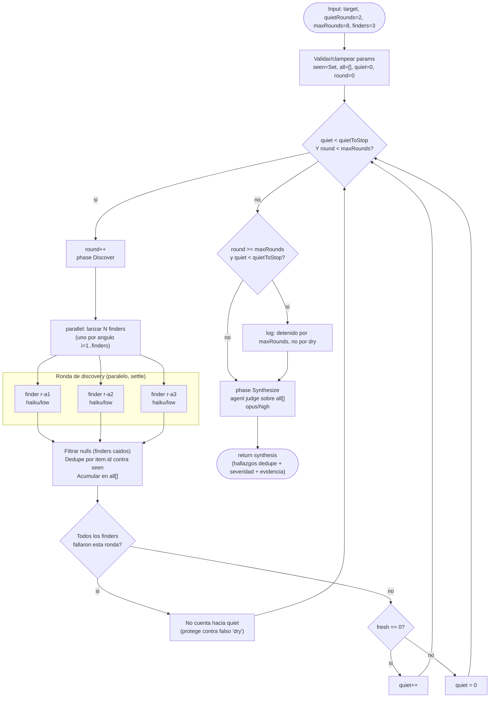

# loop-until-dry

> Sigue lanzando finders en paralelo hasta que hay K rondas consecutivas sin novedad, o se alcanza `maxRounds`.

## En 30 segundos

Es un descubrimiento en bucle: en vez de fijar de antemano cuántas rondas de búsqueda hacer, lanza `finders` agentes en paralelo ronda tras ronda hasta que `quietRounds` rondas consecutivas no traen nada nuevo (o se llega al tope `maxRounds`), y al final un agente sintetiza todo lo acumulado. Elegilo cuando el conjunto a descubrir es de tamaño desconocido y querés exhaustividad — "encontrar todo lo que…" — no para un alcance ya acotado (ahí alcanza un fan-out estático).

## Cómo lanzarlo

```text
/workflow new mi-run --pattern=loop-until-dry
/workflow run mi-run {"target": "todas las validaciones de input faltantes en src/api/", "quietRounds": 2, "maxRounds": 8, "finders": 3}
```

`target` (alias `scope`/`task`) es el único campo obligatorio; el resto son overrides opcionales con sus defaults — ver [Input y output](#input-y-output).

## Diagrama



## Qué hace

`loop-until-dry` es un scaffold de descubrimiento dinámico: en lugar de fijar de antemano cuántas rondas de búsqueda hacer, mantiene un pool de `finders` corriendo en paralelo, ronda tras ronda, hasta que **K rondas consecutivas** (`quietRounds`, default 2) no aportan ningún hallazgo nuevo, o se alcanza un tope duro de rondas (`maxRounds`, default 8). Esta es la propiedad que lo hace "dinámico" en el sentido estricto del catálogo: la profundidad de la exploración se adapta a lo que efectivamente se encuentra, no a un número fijo elegido por el usuario.

Cada ronda lanza `finders` (default 3, clamp 1-6) agentes en paralelo con el primitivo `parallel`, cada uno instruido a atacar el `target` desde un "ángulo" distinto (`#i`) y a evitar repetir lo ya encontrado (se le pasa la lista acumulada `all` truncada a 4000 chars como contexto). Los agentes devuelven JSON validado por schema (`{ items: [{ id, title, evidence }] }`), y el resultado de cada finder puede ser `null` si el agente falla — el scaffold trata eso como "cero items", nunca como excepción que tumbe la ronda completa.

La deduplicación es por `id` estable contra un `Set` global (`seen`), acumulando los items nuevos en `all`. Hay una salvaguarda explícita: si **todos** los finders de una ronda fallan (batches vacío), esa ronda no cuenta hacia el contador `quiet` — de lo contrario un fallo de infraestructura (p. ej. rate limit) sería indistinguible de una ronda genuinamente "seca" y detendría el loop prematuramente y en falso. El scaffold también loggea explícitamente si el corte final fue por el cap de rondas y no por agotamiento real, evitando "caps silenciosos".

Al terminar el loop, una fase de síntesis pasa todos los hallazgos acumulados (hasta 60000 chars) a un único agente `opus`/`high` que actúa como juez: deduplica, descarta afirmaciones sin evidencia, ordena por severidad y devuelve el resultado final con evidencia. Todo el contenido no confiable (el `target` del usuario y los hallazgos acumulados que se re-inyectan a los finders) se envuelve con un fence delimitado por un hash del propio contenido, para blindar contra prompt injection sin mutar el payload.

## Cuándo usarlo

- El conjunto a descubrir es de tamaño desconocido y se busca exhaustividad (catálogo: *"The set you're discovering is unknown-size and you want exhaustiveness"*).
- Enumerar todos los call-sites o edge-cases de algo en un repo.
- Preguntas del tipo "encontrar todo lo que…" (todas las validaciones faltantes, todos los lugares que parsean un formato, etc.).
- Se quiere que el propio proceso decida cuándo parar (por rondas sin novedad) en vez de fijar a mano una cantidad de pasadas.

Cuándo NO usarlo:

- El alcance ya es conocido y acotado (usar un fan-out estático simple en su lugar; este scaffold paga el costo de múltiples rondas para ganar exhaustividad, que no hace falta si ya se sabe cuántos ítems hay).
- Se necesita razonamiento paso a paso grounded en observaciones reales de herramientas (usar `react-scout`).
- El presupuesto de rondas/finders es tan ajustado que nunca podría detectar 2 rondas quietas reales — en ese caso el resultado dependerá más del cap que de la exhaustividad real.

## Cómo funciona

**Setup de parámetros.** El input se parsea (string JSON o objeto), y se derivan `models`/`efforts`/`toolsByRole`/`skillsByRole`/`excludeByRole` para permitir overrides por rol vía el helper `node(role, extra)` (precedencia: override por rol > default global `input.model`/`input.effort` > default del call-site). `quietRounds` se clampea a 1-100, `maxRounds` a 1-1000, `finders` a 1-6, logueando si hubo clamp. `target` (alias `scope`/`task`) es obligatorio; si falta, lanza error.

**Fase Discover (loop).** Mientras `quiet < quietToStop` y `round < maxRounds`:
1. Se llama `phase("Discover")` y se incrementa `round`.
2. `parallel(...)` lanza `finders` agentes (rol lógico `"finder"`, modelo `haiku`, effort `low`), cada uno con un prompt que fija el ángulo de búsqueda (`#i`), pasa el `target` y la lista `all` ya encontrada (ambos dentro de fences anti-injection), y exige salida validada por el schema `ITEMS`.
3. Los resultados `null` (fallos de agente) se filtran; se cuenta cuántos finders fallaron y se loguea. Cada item nuevo (por `id` no visto) se agrega a `all` y a `seen`; se cuenta `fresh`.
4. Si **ningún** finder tuvo éxito esa ronda, se loguea y **no** se actualiza `quiet` (evita falso "dry" por fallo infra). Si hubo al menos un éxito: `quiet = fresh === 0 ? quiet + 1 : 0`.

**Salida del loop.** Si se llegó a `maxRounds` sin haber alcanzado `quietToStop`, se loguea explícitamente que el corte fue por presupuesto de rondas, no por agotamiento real.

**Fase Synthesize.** Un único `agent` (modelo `opus`, effort `high`) recibe todos los hallazgos acumulados (fenced, hasta 60000 chars) con instrucción de actuar como "synthesis-as-judge": deduplicar, descartar afirmaciones no soportadas, priorizar por severidad manteniendo evidencia. Su salida es el `return` del scaffold.

**Manejo de fallos parciales:** `parallel` no aborta el resto de la ronda si un finder crashea; ese branch se resuelve a `null` y se descuenta explícitamente del conteo de éxitos, sin afectar el contador de rondas quietas salvo en el caso extremo de fallo total de la ronda.

**Caching / modelos:** no hay caching explícito de resultados entre rondas más allá de la deduplicación por `id`; cada ronda vuelve a pasar el estado acumulado (truncado) a los finders para minimizar redundancia. Los finders usan un modelo económico (`haiku`, `low`) por diseño — son baratos y se ejecutan muchas veces; la síntesis usa el modelo más caro (`opus`, `high`) una sola vez al final.

## Input y output

| Campo | Tipo | Default | Notas |
|---|---|---|---|
| `target` / `scope` / `task` | string | — (requerido) | Qué buscar/auditar; lanza error si falta. |
| `quietRounds` | number | 2 | Clamp 1..100. Rondas consecutivas sin hallazgos nuevos para detener el loop. |
| `maxRounds` | number | 8 | Clamp 1..1000. Tope duro de rondas aunque no esté "seco". |
| `finders` | number | 3 | Clamp 1..6. Agentes en paralelo por ronda. |
| `model` / `effort` | string | — | Default global aplicado a todos los nodos (finder y synthesis). |
| `models[role]` / `efforts[role]` | object | — | Override por rol (`finder`, `synthesis`), precedencia sobre el default global. |
| `tools` / `toolsByRole[role]` | array | — | Tools por rol o global. |
| `skills` / `skillsByRole[role]` | array | — | Skills por rol o global. |
| `excludeTools` / `excludeByRole[role]` | array | — | Exclusión de tools por rol o global. |

**Output:** el `return` del scaffold es directamente la respuesta de texto/estructura del agente de síntesis (`opus`/`high`): hallazgos deduplicados, ordenados por severidad, con evidencia, descartando lo no soportado. No hay `writeArtifact` en el código — el scaffold no persiste artifacts propios, solo devuelve el resultado de síntesis como valor de retorno del workflow.

## Fases

1. **Discover** — ronda(s) de fan-out en paralelo de finders (rol `finder`) hasta agotar novedad (quiet rounds) o alcanzar `maxRounds`.
2. **Synthesize** — un agente único (rol `synthesis`) actúa como juez sobre todos los hallazgos acumulados: dedupe, descarta lo no soportado, ordena por severidad y devuelve el resultado final.
