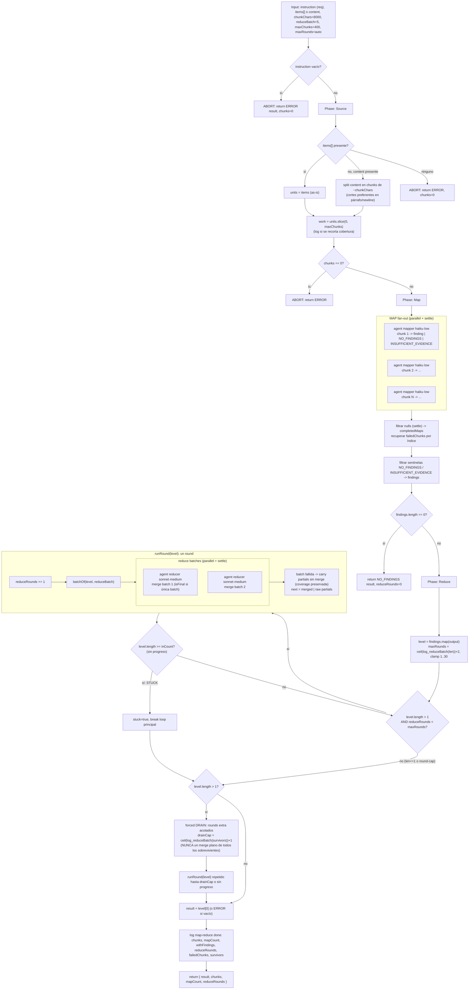

# map-reduce

> Map-reduce jerárquico: mapeo por chunk bajo un contrato de evidencia, reduce en lotes acotados hasta un único resumen-de-resúmenes.

## En 30 segundos

Es el patrón para cuando tu corpus (un log gigante, cientos de tickets, un documento enorme) no entra en una sola ventana de contexto. Un extractor barato lee cada chunk por separado (MAP) y después una serie de reducers va fusionando esos resultados de a lotes, ronda tras ronda, hasta que queda un único resumen (REDUCE jerárquico). Elegilo cuando el tamaño del input es el problema; si el work-list es chico, `fan-out-and-synthesize` alcanza y sale más barato.

## Cómo lanzarlo

```text
/workflow new mi-run --pattern=map-reduce
/workflow run mi-run {"instruction":"Extraé cada incidente reportado y su causa raíz","content":"<texto completo del log>","chunkChars":6000,"reduceBatch":4}
```

`instruction` es el único campo obligatorio; `content` (string grande, se parte en chunks) o `items` (array ya pre-cortado) aportan el corpus. El resto de los campos de `input` tiene defaults razonables — ver la tabla en [Input y output](#input-y-output).

## Diagrama



## Qué hace

`map-reduce` implementa el patrón MapReduce clásico (Dean & Ghemawat) con un reduce **jerárquico/recursivo** en lugar de una síntesis plana. Divide un corpus (una lista de `items` o un `content` string grande) en un work-list, lanza un extractor barato en paralelo por cada chunk/item bajo un contrato de evidencia (citar la fuente, o declarar explícitamente `NO_FINDINGS`/`INSUFFICIENT_EVIDENCE` en vez de inventar), y luego fusiona los outputs del map en rondas: cada ronda agrupa los resultados en lotes de tamaño `reduceBatch` y llama a un reducer por lote, repitiendo hasta que sobrevive exactamente **un** resultado (el resumen-de-resúmenes).

La razón de ser "dinámico" es que el tamaño del corpus (cantidad de items, o de chunks derivados de partir un string grande en runtime) no se conoce en tiempo de autoría: tanto el ancho del fan-out de MAP como el número de rondas de REDUCE (~`ceil(log_reduceBatch(N))`) se calculan en runtime y están acotados con clamps duros.

El diseño es "robustness-first, nunca throw": usa `settle` en cada fan-out, un cap de rondas adaptativo, un detector de estancamiento (una ronda que no reduce el conteo de sobrevivientes), y una guardia de ronda estrictamente creciente. Cuando se ve forzado a detenerse antes de llegar a un único resultado (por cap o por estancamiento), NO colapsa todo en una llamada plana: sigue fusionando en pasadas de "drenaje" acotadas en lotes de `reduceBatch`, preservando así la invariante de fan-in jerárquico incluso en el peor caso.

## Cuándo usarlo

| Situación | Patrón recomendado |
|---|---|
| El corpus es más grande que una sola ventana de contexto (razón declarada en `useWhen` del catálogo) | `map-reduce` |
| Work-list chico que cabe entero en un solo prompt de síntesis | `fan-out-and-synthesize` (síntesis plana como juez; más simple y barato) |
| Se necesita un juicio comparativo/de ranking entre alternativas | otro patrón (no map-reduce) |

Casos típicos de `map-reduce`: resumir un documento o log enorme, consolidar cientos de tickets ("roll up"), o extraer información a través de un corpus grande (p. ej. "extraer todos los cambios de API que rompen compatibilidad"). Usar `fan-out-and-synthesize` cuando no hay problema de tamaño de contexto: `map-reduce` paga el costo de rondas de reduce adicionales que no aportan valor si el work-list ya cabe en un prompt.

## Cómo funciona

**Validación de entrada.** `instruction` es el único parámetro requerido (qué extraer/producir de cada chunk y llevar a través del merge). Si falta, aborta de forma graciosa devolviendo el shape de salida declarado con `chunks=0` (nunca lanza excepción). Los demás parámetros numéricos se sanean con una función `clamp` (parsea a entero, aplica límites).

**Fase Source.** Si `input.items` es un array no vacío, se usa tal cual (un map por item, `items` gana si ambos están presentes). Si no, y hay `input.content` (string), se divide en chunks de ~`chunkChars` caracteres, preferiendo cortar en un salto de párrafo (`\n\n`) o de línea (`\n`) cercano al límite objetivo, para no partir a mitad de oración. Si no hay ni `items` ni `content`, aborta con error. El work-list resultante se recorta a `maxChunks` (default 400, clamp 1..2000); si se recorta, se loguea cuánta cobertura se pierde explícitamente ("no silent caps"). Si el resultado final tiene 0 chunks, aborta con error.

**Fase Map.** Lanza un `agent` por cada chunk/item en `parallel` (con `settle` implícito vía el filtrado post-hoc de nulls). Cada mapper corre en el rol `mapper` (modelo `haiku`, effort `low` — extracción mecánica barata) y recibe: la instrucción, contexto opcional, y el chunk envuelto en un fence anti-inyección (`fence()`, delimitador derivado de un hash del contenido para que datos maliciosos no puedan forjar el marcador de cierre). El contrato de salida exige citar el span fuente exacto para cada hallazgo, o responder exactamente `NO_FINDINGS` (nada relevante) o `INSUFFICIENT_EVIDENCE` (chunk vacío/ilegible) — nunca inventar contenido. Tras el fan-out, se filtran los branches fallidos (null bajo settle) recuperando sus índices como `failedChunks`, y se filtran ambas clases de sentinela para que no contaminen el reduce, quedando `findings` (solo outputs con contenido relevante). Si `findings` queda vacío, retorna inmediatamente `NO_FINDINGS` con `reduceRounds=0`.

**Fase Reduce.** El nivel inicial (`level`) es la lista de outputs de `findings`. El cap de rondas (`maxRounds`) por defecto es `ceil(log_reduceBatch(N)) + 2` (clamp 1..30), escalando con el tamaño del corpus; es overridable vía `input.maxRounds`. Cada ronda (`runRound`) agrupa `level` en lotes de `reduceBatch` (default 5, clamp 2..20) y lanza un `agent` reducer (modelo `sonnet`, effort `medium`) por lote en `parallel`. Si el lote colapsa a una sola batch, ese reducer recibe el framing de "reduce FINAL" (más fidelidad que el framing genérico intermedio de "esto se va a volver a fusionar"). Cada reducer debe deduplicar, preservar todas las citas distintas, resolver contradicciones señalándolas, y nunca inventar. Si una batch de reduce falla (settle → null), sus partials crudos se llevan sin fusionar al siguiente nivel (cobertura preservada, se loguea). El loop principal se repite mientras `level.length > 1` y no se alcance `maxRounds`; si una ronda no reduce el conteo de sobrevivientes (`level.length >= inCount`), se marca `stuck` y se sale del loop. Si tras el loop principal quedan >1 sobrevivientes (por cap o por stuck), se ejecuta un "drenaje forzado": rondas extra acotadas por `drainCap = ceil(log_reduceBatch(survivors)) + 1`, cada una contando como ronda ejecutada — nunca se hace un merge plano de todos los sobrevivientes de una vez. El resultado final es `level[0]`, o un mensaje de error si el nivel queda vacío.

**Caching:** no se observa ningún mecanismo explícito de caché en el código (no hay llamadas a una API de cache); cada `agent` se invoca fresco.

**Manejo de fallos parciales:** en ambos fan-outs (MAP y cada ronda de REDUCE) se usa el patrón "settle" (nulls filtrados post-hoc en vez de propagar la excepción), y todo fallo se loguea con nombres/índices específicos (`failedChunks`, `failedBatches`) en vez de fallar silenciosamente.

## Input y output

**Input** (JSON-stringified en `args`, parseado defensivamente):

| Campo | Tipo | Requerido | Default / clamp |
|---|---|---|---|
| `instruction` | string | **sí** | — (si falta o vacío tras `trim()`, aborta con error) |
| `items` | any[] | uno de `items`\|`content` (gana `items`) | — (usado tal cual, un map por item) |
| `content` | string | uno de `items`\|`content` | — (se parte en chunks si `items` está ausente) |
| `chunkChars` | number | no | default 8000, clamp 500..200000 |
| `reduceBatch` | number | no | default 5, clamp 2..20 |
| `maxChunks` | number | no | default 400, clamp 1..2000 |
| `maxRounds` | number | no | default `ceil(log_reduceBatch(findings)) + 2`, clamp 1..30 |
| `context` | string | no | opcional, framing extra para todos los nodos (truncado a 4000 chars) |
| `model` / `effort` | string | no | override global para todo nodo |
| `models[role]` / `efforts[role]` | object | no | override por rol (`mapper`, `reducer`); precedencia: por-rol > global > default del call-site |
| `tools` / `skills` / `excludeTools` (y variantes `*ByRole`) | array | no | pasados al `agent` si son arrays |

**Output:** `{ result, chunks, mapCount, reduceRounds }`

- `result`: string final (resumen-de-resúmenes), o un mensaje `ERROR:`/`NO_FINDINGS:` en los caminos de aborto.
- `chunks`: número de chunks/items del work-list realmente mapeados (después de aplicar `maxChunks`).
- `mapCount`: número de operaciones MAP completadas (settle: nulls excluidos); el conteo de hallazgos reales se reporta solo por log, no en el shape de retorno.
- `reduceRounds`: número de rondas de reducer ejecutadas (cada pasada de drenaje forzado también cuenta como ronda, por lo que puede exceder `maxRounds` hasta `drainCap`).

No se observan llamadas a `writeArtifact` en este scaffold: toda la observabilidad pasa por `log(...)` (mensajes de progreso, caps aplicados, fallos, estancamiento) y por el shape de retorno.

## Fases

1. **Source** — resuelve el work-list: usa `items` tal cual, o parte `content` en chunks (~`chunkChars`, corte boundary-aware); aplica el cap `maxChunks` y loguea cobertura recortada.
2. **Map** — un `agent` mapper (haiku·low) por chunk/item, en `parallel` con settle, bajo contrato de evidencia (citar o declarar `NO_FINDINGS`/`INSUFFICIENT_EVIDENCE`); filtra fallos y sentinelas.
3. **Reduce** — merge jerárquico en rondas: agrupa en lotes de `reduceBatch`, un `agent` reducer (sonnet·medium) por lote en `parallel` con settle, repite hasta 1 sobreviviente o hasta el cap/estancamiento, con drenaje forzado acotado como último recurso.
