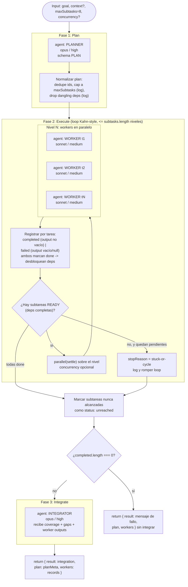

# orchestrator-workers

> Un planificador descompone un objetivo abierto en un grafo de subtareas con dependencias (`dependsOn`); los workers lo ejecutan nivel por nivel; un integrador combina los resultados.

## En 30 segundos

Usalo cuando tenés un objetivo abierto cuyas subtareas y dependencias NO conocés de antemano: un planificador LLM las descubre y arma el grafo (`dependsOn`) al vuelo, los workers lo ejecutan nivel por nivel (cada nivel en paralelo), y un integrador combina todo en un entregable único. Elegilo para entregables de varias partes con interdependencias reales; si la lista de trabajo ya es plana y conocida, un fan-out estático (`scout-fanout`) alcanza y es más simple.

## Cómo lanzarlo

```text
/workflow new mi-run --pattern=orchestrator-workers
/workflow run mi-run {"goal": "Investigar y redactar una propuesta de migración de X a Y, cubriendo riesgos, plan de rollout y costos", "maxSubtasks": 6, "context": "stack actual: Node 18, Postgres 14"}
```

`goal` (alias `task`/`text`) es el único campo obligatorio; el resto son overrides opcionales con sus defaults — ver [Input y output](#input-y-output).

## Diagrama



## Qué hace

`orchestrator-workers` implementa el patrón Orchestrator–Workers de Anthropic ("Building Effective Agents"): un LLM planificador descompone un objetivo abierto (`goal`) en un conjunto de subtareas con dependencias explícitas (`dependsOn`), sin que la forma del grafo se conozca en tiempo de autoría. Ese grafo se ejecuta luego en niveles (scheduling estilo Kahn): en cada nivel corren en paralelo todas las subtareas cuyas dependencias ya completaron, hasta que no queda ninguna pendiente. Finalmente un integrador combina los resultados de los workers en un único entregable.

El diseño está pensado como "robustness-first": el scheduling está acotado a como máximo `subtasks.length` niveles (una cota que nunca debería alcanzarse si el grafo es válido, porque cada iteración no-break marca al menos una tarea como `done`), detecta ciclos o dependencias colgantes (ningún subtask queda "ready" mientras quedan pendientes) y lo registra en el log en vez de colgarse. Un fallo de un worker (output vacío o `null`) se registra explícitamente como `failed`, no se disfraza de éxito, y no bloquea a las tareas dependientes: éstas se ejecutan igual, informadas de que esa dependencia falló.

El contrato de salida es estable en todos los caminos de salida sin excepción (incluso plan vacío o fallo total): siempre `{ result, plan, workers }`. Esto permite que otro workflow que componga este scaffold via `workflow()` nunca tenga que distinguir entre un string suelto y un objeto estructurado.

Todas las entradas no confiables (goal, context, descripciones de subtareas, outputs de dependencias) se envuelven con `fence()`, un delimitador derivado de un hash del propio contenido, para blindar contra prompt injection sin depender de escaping mutante.

## Cuándo usarlo

- Entregables de múltiples partes.
- Objetivos de investigación/construcción con interdependencias entre sub-partes.
- Descomponer un objetivo abierto en un grafo de subtareas (cuando el número y la forma de las subtareas no se conocen de antemano).
- **No usarlo cuando:**
  - La lista de trabajo ya es conocida y plana, sin dependencias entre ítems — usar `scout-fanout` o `fan-out-and-synthesize` (una sola pasada, sin grafo).
  - Se necesita iterar el mismo finder hasta que no aparezca nada nuevo — usar `loop-until-dry`.
  - El objetivo es generar un archivo `.js` de workflow, no ejecutar subtareas — usar `workflow-factory`.

## Cómo funciona

**Fase "Plan":** un único `agent()` (rol `planner`, modelo `opus`, `effort: high`) recibe el `goal` (y `context` opcional) envueltos en `fence()`, con instrucciones explícitas de: ids cortos y únicos, usar `dependsOn` solo cuando hay una necesidad real de output ajeno (para maximizar paralelismo), que `dependsOn` forme un DAG sin ciclos ni auto-referencias, y respetar el tope `maxSubtasks`. La llamada está atada a un JSON Schema (`PLAN`, `type: object`, `additionalProperties: false`) con `maxItems: maxSubtasks` en el array de subtareas. Tras recibir el plan, el código aplica normalización defensiva: descarta subtareas sin `id`/`description`, deduplica ids repetidos (logueado), si no hay ninguna subtarea usable trata todo el `goal` como una única subtarea `t1`, recorta a `maxSubtasks` si el planner devolvió más (logueado, sin caps silenciosos), y filtra `dependsOn` para quedarse solo con ids que sobrevivieron el recorte/dedupe (dependencias colgantes también logueadas).

**Fase "Execute":** loop while `done.size < subtasks.length`, acotado a `maxLevels = subtasks.length`. En cada iteración calcula `ready` = subtareas no completadas cuyas dependencias están todas en `done`. Si `ready` está vacío pero quedan tareas sin completar, es ciclo o dependencia bloqueada: se loguea `stuck-or-cycle` y se sale del loop. Si hay `ready`, se lanzan en paralelo con `parallel(..., { settle: true })` (via `.then` sobre `agent()`, no aparece `settle` explícito en la llamada pero el comentario indica que un worker fallido resuelve a `null` sin abortar el resto — modo settle), cada worker (rol `worker`, `sonnet`, `effort: medium`, label `worker-<id>`) recibe la descripción de su subtarea, el goal general, el contexto compartido y — para cada dependencia — el output de esa dependencia si existe, o una nota explícita de que la dependencia falló/no produjo output. Tras el nivel, cada resultado se evalúa con un test estricto de éxito (string no vacío tras `trim()`); si falla, se registra `status: failed` con `output: null`; si tiene éxito, se guarda en el mapa `outputs` y se registra `status: completed`. En ambos casos la tarea se marca `done` (un fallo también desbloquea a sus dependientes, que verán la nota de "dependencia falló"). Tras salir del loop (por completar todo o por `stuck-or-cycle`/`level-cap`), toda subtarea que no llegó a `done` se registra como `status: unreached`.

**Fase "Integrate":** si `completed.length === 0` se retorna inmediatamente sin llamar al integrador, con un mensaje explicando el `stopReason` y las tareas failed/unreached — cumpliendo el contrato estable `{ result, plan, workers }` sin invocar un LLM innecesario. Si hay al menos un worker completado, se construye un resumen de cobertura (`coverage`, `gaps`) y se llama a un único `agent()` (rol `integrator`, `opus`, `effort: high`) con el goal, el contexto, y los outputs de los workers completados (envueltos en `fence("findings", ...)`, truncados a 60000 chars via `compact`). Se le instruye explícitamente a no inventar resultados para subtareas failed/unreached y a incluir una nota de "Coverage & gaps".

**Manejo de fallos parciales:** no hay reintentos ni caching explícito en este scaffold; el manejo de fallos es puramente de "hacer visible, nunca ocultar": workers fallidos (`failed`) y tareas nunca alcanzadas (`unreached`) se distinguen y se pasan tanto al integrador como al output final.

## Input y output

**Input** (`args` parseado como JSON, con fallback a `{}` si falla el parseo):

| Campo | Tipo | Default / clamp | Notas |
|---|---|---|---|
| `goal` (alias `task`, `text`) | string | **requerido** | Lanza error si falta o está vacío tras trim. |
| `context` | string | `""` | Contexto compartido para planner y workers. |
| `maxSubtasks` | number | `8`, clamp `1..30` | Tope duro sobre subtareas planificadas; recorte logueado. |
| `concurrency` | number | `undefined` (auto) | Si se define y es `> 0`, se pasa como `{ concurrency }` a `parallel()`. |
| `model` / `effort` | string | — | Overrides globales aplicados a todos los nodos. |
| `models[role]` / `efforts[role]` | object | — | Override por rol (`planner`, `worker`, `integrator`) sobre el global. |
| `tools` / `toolsByRole`, `skills` / `skillsByRole`, `excludeTools` / `excludeByRole` | array/object | — | Igual patrón global vs. por-rol. |

**Output** — siempre `{ result, plan, workers }`:

- `result`: string — el entregable integrado, o (si nada completó) un mensaje de fallo con `stopReason` y las tareas failed/unreached.
- `plan`: `{ goal, rationale, subtasks, maxSubtasks, schedule, stopReason, unreached }` — el plan normalizado, el `rationale` del planner, el trace de niveles ejecutados (`schedule`), la razón de parada (`completed` | `stuck-or-cycle` | `level-cap`) y los ids nunca alcanzados.
- `workers`: array de registros `{ id, description, dependsOn, status, output }` con `status` en `completed | failed | unreached`.

No se detecta ninguna llamada a `writeArtifact` en este archivo — el scaffold no escribe artifacts a disco; su output es puramente el valor de retorno.

## Fases

1. **Plan** — el orquestador (planner) descompone el `goal` en subtareas con `dependsOn`.
2. **Execute** — ejecución leveled (Kahn-style) de los workers, con detección de ciclos/bloqueos.
3. **Integrate** — el integrador combina los resultados de los workers completados en un entregable único, señalando gaps.
