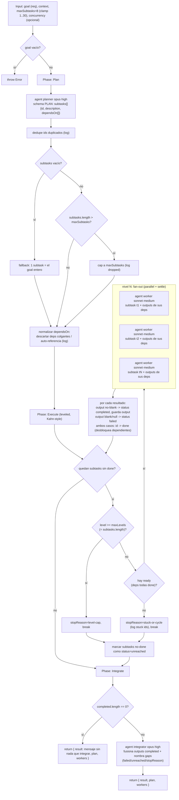

# orchestrator-workers

> Un planner decompone un objetivo abierto en un grafo de subtareas con `dependsOn`; los workers lo ejecutan nivel por nivel; un integrator fusiona los resultados.

## En 30 segundos

Es el patrón para cuando tenés un objetivo abierto ("construí X", "investigá Y") y no sabés de antemano en qué subtareas se descompone ni qué depende de qué. Un orquestador (LLM) decide en runtime el plan — subtareas más un grafo de dependencias — y luego los workers lo ejecutan en niveles: primero las subtareas sin dependencias pendientes, en paralelo, y así sucesivamente hasta drenar el grafo. Un integrator final fusiona todo en un único entregable. Elegilo cuando el *shape* del trabajo (cuántas partes, cómo se relacionan) es parte de lo que hay que descubrir, no algo que vos ya conocés de antemano.

## Cómo lanzarlo

```text
/workflow new mi-run --pattern=orchestrator-workers
/workflow run mi-run {"goal":"Diseñar e implementar un sistema de notificaciones por email","maxSubtasks":6,"concurrency":3}
```

`goal` es el único campo obligatorio (aliases: `task`, `text`). `context` agrega trasfondo compartido para planner y workers; `maxSubtasks` y `concurrency` acotan el ancho del plan y del fan-out por nivel — ver la tabla en [Input y output](#input-y-output).

## Diagrama



## Qué hace

`orchestrator-workers` implementa el patrón homónimo de Anthropic ("Building Effective Agents"): un orquestador LLM descompone un objetivo abierto en subtareas con dependencias explícitas, workers las ejecutan respetando ese orden, y un integrator combina los resultados en un único entregable. A diferencia de un fan-out plano, el número y la forma de las subtareas — y las aristas de dependencia entre ellas — no se conocen en tiempo de autoría: el planner las produce por objetivo, en runtime, y el motor las ejecuta como un DAG.

El ángulo de diseño del archivo es "robustness-first": la ejecución es por niveles al estilo Kahn (cada iteración corre en paralelo todas las subtareas cuyas dependencias ya terminaron), acotada a como máximo `subtasks.length` niveles para que un grafo mal formado nunca pueda loopear infinitamente. Si un nivel no produce ninguna subtarea lista mientras quedan pendientes (ciclo de dependencias, o una dependencia que apunta a una tarea fallida/inexistente), se loguea y la ejecución se detiene en vez de girar en vacío.

Los fallos parciales son visibles, no silenciosos: un worker que devuelve `null` (settle) o una salida en blanco se registra como `status:'failed'`, pero sus dependientes igual corren (con esa dependencia marcada como fallida explícitamente en el prompt) y el gap se traslada al integrator. Las subtareas que el scheduler nunca alcanzó (por ciclo, stuck o cap de nivel) se registran aparte como `status:'unreached'`. No hay caps silenciosos: el cap del planner (`maxSubtasks`) y cada condición de parada se loguean cuando recortan cobertura.

El contrato de salida es estable en toda salida sin excepción: `{ result, plan, workers }` se devuelve incluso cuando el plan queda vacío o todas las subtareas fallan, para que la composición vía `workflow()` nunca tenga que tratar un caso especial de "string pelado".

## Cuándo usarlo

- Entregables de múltiples partes cuyo desglose no es obvio de antemano.
- Objetivos de research/build con interdependencias reales entre sub-partes (una necesita el output de otra).
- Descomponer un objetivo abierto en un grafo de subtareas (no una lista plana).

**No usarlo cuando:**

- El work-list ya es conocido y plano, sin dependencias entre ítems — `fan-out-and-synthesize` o `scout-fanout` son más simples y baratos.
- El corpus es grande pero homogéneo (mismo procesamiento repetido) — `map-reduce` evita el costo de planificar un DAG que no existe.
- Se necesita iterar el mismo finder hasta agotar hallazgos — `loop-until-dry` itera, esto ejecuta un DAG una sola vez.

## Cómo funciona

**Validación de entrada y overrides.** `goal` es requerido (aliases `task`/`text`); si falta, lanza una excepción con mensaje explícito. `context` es opcional. `maxSubtasks` se sanea a entero con clamp 1..30 (default 8). `concurrency` es opcional (si no se especifica, `parallel` autogestiona el paralelismo del nivel). Cada rol (`planner`, `worker`, `integrator`) admite overrides de `model`/`effort`/`tools`/`skills`/`excludeTools` vía `input.models[role]` etc., con precedencia por-rol > global > default del call-site.

**Fase Plan.** Un único `agent` planner (`opus`, effort `high`) recibe el goal y el contexto (envueltos en `fence()`, un delimitador anti-inyección derivado de un hash del contenido) y debe devolver JSON contra un schema `PLAN`: un array `subtasks` de `{ id, description, dependsOn[] }`, más una `rationale` opcional. El prompt exige ids únicos, descripciones autocontenidas, `dependsOn` solo cuando hay una necesidad real de output ajeno (para maximizar paralelismo), y que el grafo sea un DAG sin ciclos. Tras la respuesta: se descartan subtareas sin `id`/`description`; se eliminan ids duplicados (logueado); si el resultado queda vacío, se usa un fallback de una sola subtarea = el goal completo; si excede `maxSubtasks`, se recorta y se loguea cuánto se perdió; y se normalizan las `dependsOn` descartando referencias colgantes o auto-referencias (logueado).

**Fase Execute.** Bucle leveled Kahn-style acotado a `maxLevels = subtasks.length`. En cada iteración se calculan las subtareas "ready" (no done, con todas sus deps en `done`). Si no hay ninguna ready mientras quedan pendientes, se detecta ciclo/stuck, se loguean los ids atascados y se detiene (`stopReason = 'stuck-or-cycle'`); si se alcanzara el cap de niveles (inalcanzable bajo la invariante de progreso monótono, pero mantenido como seguro barato) se detiene con `stopReason = 'level-cap'`. Cada nivel ready se ejecuta con `parallel` (settle implícito): cada `agent` worker (`sonnet`, effort `medium`, label `worker-<id>`) recibe su subtarea, el goal, el contexto opcional, y los outputs de sus dependencias ya completadas (o una nota explícita si esa dependencia falló/no produjo output). Un output no-string o vacío tras `trim()` se trata como fallo estricto (`status:'failed'`), nunca como éxito silencioso; en ambos casos (éxito o fallo) el id se marca `done` para que sus dependientes se desbloqueen. Al terminar el bucle, toda subtarea que nunca llegó a `done` se registra como `status:'unreached'`.

**Fase Integrate.** Si ninguna subtarea completó, se retorna de inmediato el contrato estable con un `result` que explica el `stopReason` y lista fallidas/no-alcanzadas — sin invocar al integrator. Si hay al menos una completada, un único `agent` integrator (`opus`, effort `high`) recibe: una nota de cobertura (`planned/completed/failed/unreached` + `stopReason`), el detalle de subtareas fallidas y no-alcanzadas, el goal, el contexto, y los outputs de todas las subtareas `completed` (fenced). Debe fusionar overlaps/contradicciones, preservar evidencia citada, nunca inventar resultados para lo fallido/no-alcanzado, y cerrar con una nota explícita de "Coverage & gaps".

**Manejo de fallos parciales:** ambos fan-outs (ninguno hay salvo el de Execute) usan `parallel` con settle; un worker fallido no aborta el nivel ni el resto del DAG, solo se registra y se comunica a sus dependientes y al integrator. **Caching:** no se observa ningún mecanismo explícito de caché; cada `agent` se invoca fresco.

## Input y output

**Input** (JSON-stringified en `args`, parseado defensivamente):

| Campo | Tipo | Requerido | Default / clamp |
|---|---|---|---|
| `goal` (alias `task`, `text`) | string | **sí** | — (si falta o vacío tras `trim()`, lanza excepción) |
| `context` | string | no | `""` — trasfondo compartido para planner y workers |
| `maxSubtasks` | number | no | default 8, clamp 1..30 |
| `concurrency` | number | no | sin límite explícito (`parallel` autogestiona si se omite) |
| `model` / `effort` | string | no | override global para todo nodo |
| `models[role]` / `efforts[role]` | object | no | override por rol (`planner`, `worker`, `integrator`); precedencia: por-rol > global > default del call-site |
| `tools` / `skills` / `excludeTools` (y variantes `*ByRole`) | array | no | pasados al `agent` si son arrays |

**Output:** `{ result, plan, workers }` — siempre este shape, en toda salida sin excepción.

- `result`: el entregable fusionado por el integrator, o un mensaje explicativo si nada completó.
- `plan`: `{ goal, rationale, subtasks, maxSubtasks, schedule, stopReason, unreached }` — el plan normalizado, la traza de niveles ejecutados (`schedule`, array de arrays de ids), la razón de parada (`completed` | `level-cap` | `stuck-or-cycle`), y los ids nunca alcanzados.
- `workers`: array de registros por subtarea `{ id, description, dependsOn, status, output }` con `status` en `completed` | `failed` | `unreached`.

No se observan llamadas a `writeArtifact` en este scaffold: toda la observabilidad pasa por `log(...)` (progreso por nivel, caps aplicados, deps colgantes, stuck/ciclo, resumen final) y por el shape de retorno.

## Fases

1. **Plan** — un `agent` planner (opus·high) descompone el goal en subtareas con `dependsOn`, contra un schema; se dedupean ids, se aplica el cap `maxSubtasks` (logueado), y se normalizan dependencias colgantes.
2. **Execute** — bucle leveled Kahn-style: en cada nivel, un `agent` worker (sonnet·medium) por subtarea ready, en `parallel` con settle; detecta y detiene ante ciclos/stuck; marca fallos y no-alcanzadas explícitamente.
3. **Integrate** — un `agent` integrator (opus·high) fusiona los outputs de las subtareas completadas en un único entregable, señalando cobertura y gaps (fallidas/no-alcanzadas).
