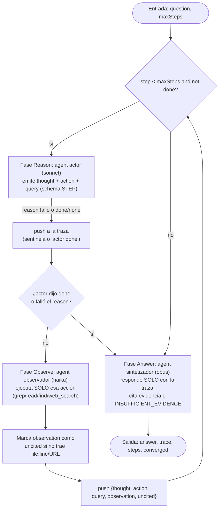

# react-scout

> Bucle ReAct de reason → act → observe: cada paso apoya el siguiente pensamiento en una observación real de solo lectura.

## En 30 segundos

En vez de dejar que un solo agente improvise una respuesta, `react-scout`
alterna explícitamente razonamiento y acción: un "actor" propone un
PENSAMIENTO y una única ACCIÓN de solo lectura, un "observador" independiente
la ejecuta y devuelve evidencia citada, y esa evidencia se agrega a una traza
que el siguiente pensamiento debe usar. Elegilo cuando necesitás una
investigación fundada en evidencia real (no en prosa suelta) antes de
comprometerte a una respuesta o de lanzar un fan-out más caro.

## Cómo lanzarlo

```bash
/workflow new mi-scout --pattern=react-scout
```

Entrada típica:

```json
{
  "question": "¿Dónde el decodificador WASM recibe los bytes de entrada?",
  "maxSteps": 6
}
```

## Diagrama



## Qué hace

`react-scout` implementa el patrón ReAct (arXiv:2210.03629): en lugar de que
un modelo genere una respuesta de una sola vez, el workflow fuerza un ciclo
explícito de razonar → actuar → observar. En cada paso, un agente "actor"
(rol `reason`) mira la pregunta y la traza acumulada, y decide UNA sola
acción de solo lectura a ejecutar a continuación (grep, read, find o
web_search), o declara que ya tiene evidencia suficiente (`done: true`).

Un segundo agente, el "observador" (rol `observe`), es independiente del
actor y ejecuta exclusivamente esa acción solicitada — nada más — devolviendo
hallazgos citados (file:line, ruta o URL) o `NO_FINDINGS`. Esta separación
evita que el actor alucine evidencia: solo puede razonar sobre lo que el
observador realmente encontró.

El ciclo se repite hasta que el actor declara `done` o se agota el
presupuesto de pasos (`maxSteps`). Al final, un tercer agente sintetizador
(rol `answer`) redacta la respuesta usando ÚNICAMENTE la traza acumulada,
citando evidencia por cada afirmación, o declarando `INSUFFICIENT_EVIDENCE`
si la traza no alcanza.

Es explícitamente la interfaz canónica para un fan-out: se puede correr
primero para fundamentar una hipótesis o lista de trabajo, y luego pasar
`result.trace` a `scout-fanout` o `fan-out-and-synthesize`.

## Cuándo usarlo

- Investigación fundada en evidencia real antes de comprometerse a una
  respuesta o acción.
- Producir una traza (`trace`) para entregarle a un fan-out posterior.
- Fundar cada paso de razonamiento en una observación concreta del repo o la
  web, en vez de dejar que el modelo "recuerde" o infiera.
- **No usarlo** para preguntas triviales que un solo agente con tools ya
  resuelve en un paso, ni cuando se necesita escritura/mutación (el loop es
  deliberadamente de solo lectura).

## Cómo funciona

El flujo parsea la entrada, valida `question` (obligatorio) y limita
`maxSteps` entre 1 y 50 (predeterminado 6, registrando si hubo ajuste). Las
observaciones/acciones permitidas por defecto son
`["read", "grep", "find", "ls", "web_search"]` (todas de solo lectura),
configurables vía `input.tools`.

Soporta overrides por rol vía `input.model`/`input.effort` (default global) o
`input.models[role]`/`input.efforts[role]` (override por rol: `reason`,
`observe`, `answer`), igual que `toolsByRole`, `skillsByRole` y
`excludeByRole`.

Cada iteración del `while` tiene dos fases:

1. **Reason** — llama `agent(...)` con un schema tipado (`STEP`: `thought`,
   `done`, `action`, `query`) usando `model: "sonnet"`, `effort: "medium"`
   por defecto. El prompt pone la pregunta y la traza (truncada a los últimos
   12000 caracteres si es muy larga, preservando lo más reciente) dentro de
   fences con delimitador derivado por hash del contenido (`fence(...)`),
   para blindar contra inyección de instrucciones en datos no confiables. Si
   el reason falla o devuelve vacío, se registra un sentinela en la traza y
   se corta el loop (no cuenta como convergencia).
2. **Observe** — si el actor no dijo `done`/`none`/query vacía, se llama a un
   segundo `agent(...)` (rol `observe`, `model: "haiku"`, `effort: "low"`,
   con las `tools` configuradas) que ejecuta EXACTAMENTE la acción y query
   pedidas, y debe citar evidencia (`file:line`, ruta o URL) o responder
   `NO_FINDINGS`. Si falla, se registra un sentinela textual y el loop
   continúa (no se pierde la traza). Cada observación se marca `uncited` si
   no trae ninguna cita reconocible, para que los pasos siguientes puedan
   descontarla.

Cuando el actor declara `done` (o se acaba `maxSteps`), corre la fase
**Answer**: un tercer `agent(...)` (`model: "opus"`, `effort: "high"`)
sintetiza la respuesta usando solo la traza, citando evidencia, o devolviendo
`INSUFFICIENT_EVIDENCE` si no alcanza. Si el agente de respuesta devuelve
`null` (subagente caído o el usuario lo saltó), se sustituye por un mensaje
explícito de insuficiencia en vez de propagar `null` en silencio.

No hay caché explícita ni artefactos escritos por este scaffold; el
resultado se devuelve directamente al llamador.

## Entrada y salida

| Campo | Tipo | Predeterminado | Notas |
|---|---|---|---|
| `question` / `q` / `text` / `topic` | string | — | Obligatorio; lanza error si falta. |
| `maxSteps` | number | `6` | Clampeado a `[1, 50]`; se loguea si hubo clamp. |
| `tools` | string[] | `["read","grep","find","ls","web_search"]` | Acciones de solo lectura permitidas para el observador y para `toolsByRole` como fallback. |
| `model` / `effort` | string | — | Overrides globales aplicados a los tres roles. |
| `models[role]` / `efforts[role]` | object | — | Override por rol (`reason`, `observe`, `answer`); precede al default global. |
| `toolsByRole` / `skillsByRole` / `excludeByRole` | object | — | Igual mecanismo, por rol, para tools/skills/excludeTools. |

Salida (objeto devuelto, sin artifacts):

- `answer`: string — respuesta final citada, o `INSUFFICIENT_EVIDENCE (...)`.
- `trace`: array de `{ step, thought, action, query, observation, uncited }`.
- `steps`: number de pasos ejecutados.
- `converged`: boolean — `true` si el actor declaró `done` antes de agotar `maxSteps`.

## Fases

1. **Reason** — el actor emite THOUGHT + ACTION sobre la traza acumulada.
2. **Observe** — el observador ejecuta solo esa acción y reporta evidencia citada.
3. **Answer** — síntesis final estrictamente basada en la traza.
