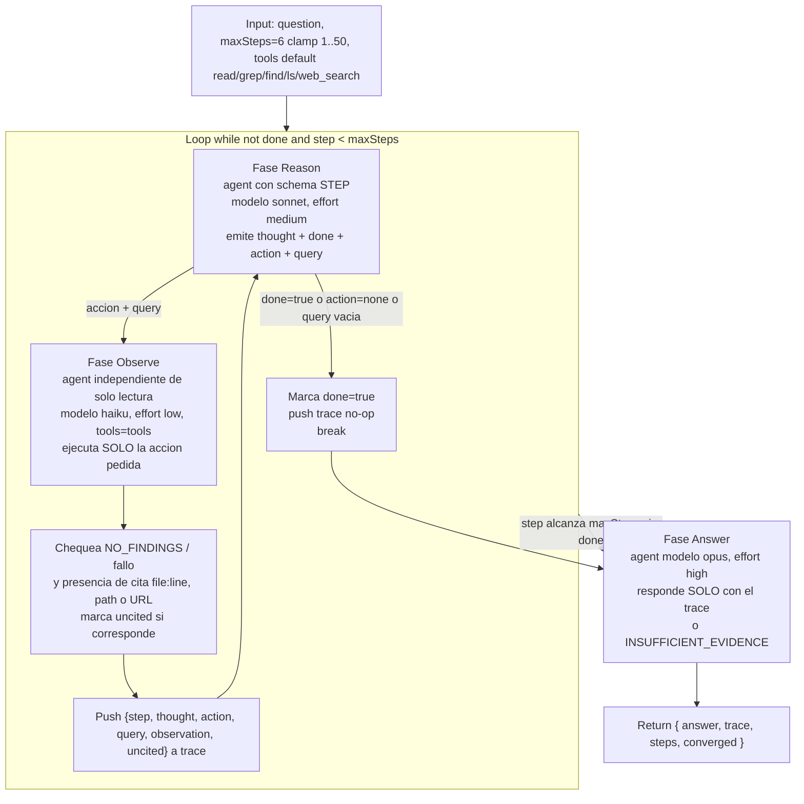

# react-scout

> Loop ReAct de razonar → actuar → observar: cada paso fundamenta un pensamiento en una observación real de solo lectura antes de dar el siguiente.

## En 30 segundos

Es el patrón ReAct (arXiv:2210.03629): en vez de que un solo agente conteste "de una", un actor propone un THOUGHT + una ACTION de solo lectura por paso, un observador independiente la ejecuta y reporta evidencia citada, y esa evidencia alimenta el próximo pensamiento — hasta que el actor declara `done` o se agota `maxSteps`. Elegilo cuando cada afirmación debe estar anclada en una observación real (no en el prior del modelo) y cuando la próxima acción depende de lo que se acaba de observar; NO lo uses para preguntas triviales de una pasada ni cuando necesitás paralelismo amplio (para eso, `complex-research` u otro fan-out).

## Cómo lanzarlo

```text
/workflow new mi-run --pattern=react-scout
/workflow run mi-run {"question": "¿Dónde el decoder WASM recibe los bytes de entrada?", "maxSteps": 8}
```

`question` (alias `q`/`text`/`topic`) es el único campo obligatorio; `maxSteps` (default `6`, clamp `1..50`) y `tools` (default `["read","grep","find","ls","web_search"]`) son opcionales. Ver [Input y output](#input-y-output) para overrides por rol (`models`, `efforts`, `toolsByRole`, etc.).

## Diagrama



## Qué hace

En cada paso, el rol `reason` emite un THOUGHT y una única ACTION de solo lectura (schema tipado `STEP`), y el rol `observe` —un agente independiente— ejecuta ÚNICAMENTE esa acción y reporta evidencia citada o `NO_FINDINGS`; esa evidencia se agrega al trace que el próximo THOUGHT usa como base. El loop termina cuando el actor declara `done=true` (ya tiene evidencia suficiente) o cuando se agota el presupuesto de pasos (`maxSteps`). Al final, una fase `Answer` separada sintetiza la respuesta usando ESTRICTAMENTE el trace acumulado (rol `answer`, modelo opus, effort high), citando evidencia o declarando `INSUFFICIENT_EVIDENCE` si el trace no alcanza.

El diseño prioriza que cada afirmación esté anclada en una observación real (no en el prior del modelo): el prompt del observer exige citar `file:line` / path / URL, y el código marca explícitamente como `uncited` cualquier observación sin cita detectable, para que las fases posteriores puedan descontarla. También hay defensas contra prompt injection (fences con hash del contenido, instrucción de tratar el contenido delimitado como datos, nunca como instrucciones) y manejo explícito de fallos parciales (reason falla, observe falla, resultado null) sin perder el trace.

El propio código lo documenta como el "front-end canónico" de un fan-out: se pensó para correr primero y luego pasar `result.trace` a `scout-fanout` o `fan-out-and-synthesize`, generalizando el scout de un solo paso que esos workflows usan al inicio.

## Cuándo usarlo

| Situación | ¿Usar `react-scout`? | Por qué |
|---|---|---|
| Cada afirmación debe estar respaldada por una observación real, no por el prior del modelo | Sí | El observer cita `file:line`/path/URL y marca `uncited` lo que no lo hace |
| Necesitás un trace estructurado para alimentar un fan-out (`scout-fanout`, `fan-out-and-synthesize`) | Sí | Es el "front-end canónico" para eso; `result.trace` se pasa directo |
| La siguiente acción depende de lo que se acaba de observar (exploración adaptativa) | Sí | Cada THOUGHT se construye sobre el trace acumulado del paso anterior |
| Querés auditar el razonamiento paso a paso | Sí | El trace queda como evidencia inspeccionable (thought/action/query/observation/uncited) |
| Pregunta trivial que un solo agente con tools resuelve en una pasada | No | El overhead de loop + dos agentes por paso no se justifica |
| Necesitás paralelismo amplio o comparar ángulos independientes | No | `react-scout` es secuencial, un paso a la vez; usá `complex-research` u otro fan-out |
| Necesitás acciones de escritura/mutación | No | El scaffold es explícitamente de solo lectura ("ReAct's 'act' here is observation, not mutation") |

## Cómo funciona

1. **Parseo de input y defaults.** Lee `args` (string JSON o objeto), extrae `question`/`q`/`text`/`topic` (obligatorio, si falta lanza error), `maxSteps` (default 6, clamp 1–50, loggea si se clampeó), y `tools` (default `["read","grep","find","ls","web_search"]`). Soporta overrides por rol vía `input.models[role]`, `input.efforts[role]`, `input.toolsByRole[role]`, `input.skillsByRole[role]`, `input.excludeByRole[role]`, con fallback a `input.model`/`input.effort`/`input.tools`/etc. globales (helper `node(role, extra)`).

2. **Utilidades de seguridad de datos.** `compact(d, n=60000)` trunca strings largos con marcador `…[truncated]`. `fence(kind, d)` envuelve datos no confiables en un delimitador `<untrusted-HASH kind="...">…</untrusted-HASH>` derivado de un hash FNV-like del propio contenido (no aleatorio, porque el runtime prohíbe `Math.random`/`Date.now`), para que un payload malicioso no pueda forjar el marcador de cierre.

3. **Fase `Reason` (dentro del loop, primitiva `agent` con `schema`).** Cada iteración (`step` incrementa hasta `maxSteps`): se llama `phase("Reason")` y se invoca `agent(...)` con schema `STEP` (`thought`, `done`, `action`, `query`), modelo `sonnet`, effort `medium`, label `reason-{step}`. El prompt incluye la pregunta y el trace acumulado (truncado por `traceForPrompt`, que conserva la COLA/más reciente si excede 12000 chars, con log de truncamiento). Manejo de fallos:
   - Si `agent()` lanza excepción: se pushea un registro sentinel al trace (`observation: "(reason failed: ...)"`) y se hace `break` (no converge).
   - Si `decided` es `null`/falsy: mismo tratamiento con `"(reason failed: empty result)"` y `break`.
   - Si `decided.done` es true, o `action==="none"`, o no hay `query`: se marca `done=true`, se pushea un registro `"(actor declared done)"` y se sale del loop (convergencia real).

4. **Fase `Observe` (primitiva `agent` sin schema, con `tools`).** Solo se ejecuta si el actor pidió una acción concreta. `phase("Observe")` + `agent(...)` con modelo `haiku`, effort `low`, label `observe-{step}`, `tools` (las de input o default). El prompt obliga a ejecutar EXACTAMENTE la acción/query pedida y citar `file:line`/path/URL por cada hecho, o responder `NO_FINDINGS` si no hay hallazgos. Manejo de fallos: excepción → sentinel `"(observation failed: ...)"` con log, sin detener el loop (se sigue para no perder el trace); resultado `null` (agente saltado por el usuario) → sentinel `"(observation skipped/failed: empty result)"`.

5. **Clasificación de la observación.** `nothing` = matchea `NO_FINDINGS` o los sentinels de fallo/skip. `uncited` = no es `nothing` y no matchea `hasCitation` (regex de `file:line`, URL, o extensión de archivo). Se pushea `{step, thought, action, query, observation, uncited}` al trace y se loggea el resultado (`nothing` / `evidence (UNCITED)` / `evidence`).

6. **Corte del loop.** Si se sale sin `done=true` (agotó `maxSteps`), se loggea `"stopped at step budget (not converged)"`. En cualquier caso se loggea el tamaño final del trace.

7. **Fase `Answer` (primitiva `agent`, sin schema).** `phase("Answer")` + `agent(...)` con modelo `opus`, effort `high`. El prompt exige responder usando ÚNICAMENTE el trace (comprimido con `compact(trace, 60000)`), citar evidencia por cada afirmación, y decir `INSUFFICIENT_EVIDENCE` + qué falta si el trace no alcanza. Si el resultado es `null` (agente caído o saltado), se sustituye por `"INSUFFICIENT_EVIDENCE (answer step produced no output)"` en vez de propagar `null`.

No hay `parallel`/`pipeline`/fan-out real en este scaffold: es puramente secuencial (`agent` tras `agent`, en un loop `while`). No escribe artifacts (`writeArtifact`) ni usa caching explícito más allá de mantener el prefijo estable del prompt de Reason (rol + pregunta antes del trace volátil) para reutilizar el prompt cache.

## Input y output

**Input** (JSON, vía `args`):

| Campo | Tipo | Default | Notas |
|---|---|---|---|
| `question` / `q` / `text` / `topic` | string | — (obligatorio) | Lanza error si ninguno está presente |
| `maxSteps` | number | `6` | Clamp `[1, 50]`; loggea si se ajustó |
| `tools` | string[] | `["read","grep","find","ls","web_search"]` | Solo lectura por diseño |
| `model` / `effort` | string | — | Aplican a TODOS los nodos si no hay override por rol |
| `models[role]` / `efforts[role]` | object | — | Override por rol (`reason`, `observe`, `answer`), precedencia sobre el global |
| `toolsByRole[role]` / `skillsByRole[role]` / `excludeByRole[role]` | object | — | Override por rol para tools/skills/excludeTools |

**Output** (retorno de `main()`):

```json
{ "answer": "string (o INSUFFICIENT_EVIDENCE ...)", "trace": [ { "step": 1, "thought": "...", "action": "grep|read|find|web_search|none", "query": "...", "observation": "...", "uncited": false } ], "steps": 3, "converged": true }
```

- `answer`: respuesta final de la fase Answer (o sentinel de fallo).
- `trace`: array completo de pasos, pensado para reutilizarse como input de otro workflow (`scout-fanout`, `fan-out-and-synthesize`).
- `steps`: cantidad de entradas en el trace.
- `converged`: `true` solo si el actor declaró `done` explícitamente antes de agotar `maxSteps`.

No se llama `writeArtifact` en ningún punto del scaffold; el único artefacto es el objeto retornado.

## Fases

1. **Reason** — el actor emite THOUGHT + ACTION/QUERY (o declara `done`), guiado por schema tipado.
2. **Observe** — un observador independiente ejecuta solo esa acción de lectura y reporta evidencia citada o `NO_FINDINGS`.
3. **Answer** — síntesis final estrictamente basada en el trace acumulado, citando evidencia o declarando `INSUFFICIENT_EVIDENCE`.
