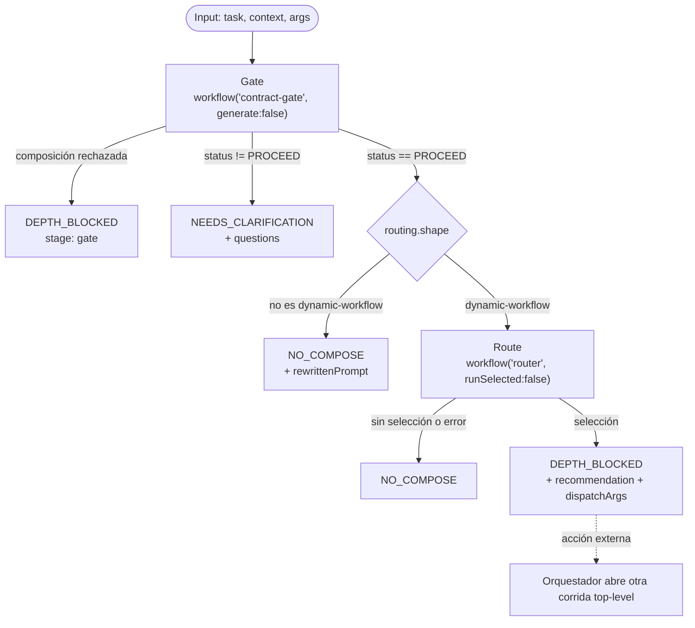

# recursive-compose

> Referencia de frontera depth-1: re-gatea una tarea, consulta `router` sin dispatch y devuelve la próxima corrida
> top-level recomendada.

## En 30 segundos

`recursive-compose` hace visible una restricción del runtime: tanto pi como la Workflow tool de Claude Code permiten
que el workflow top-level componga hijos, pero esos hijos no pueden volver a llamar `workflow()`.

El scaffold usa sus dos lugares válidos como hermanos: llama a `contract-gate` para re-acotar la tarea y a `router` con
`runSelected:false` para obtener una recomendación. Si hay una selección, devuelve `DEPTH_BLOCKED`, la recomendación y
los argumentos preparados. El orquestador puede abrir el workflow elegido como otra corrida top-level.

## Cómo lanzarlo

```text
/workflow new mi-run --pattern=recursive-compose
```

Input típico:

```json
{
  "task": "audit + fix the SSE decoder",
  "context": "opcional, texto libre",
  "args": { "limit": 20 }
}
```

`task` es obligatorio (alias: `request`, `text`). `args` agrega overrides sobre los `suggestedArgs` de router; el
scaffold no ejecuta el workflow elegido.

**Runtime:** la composition depth de `workflow()` es 1 en pi y Claude Code. `PI_DYNAMIC_WORKFLOWS_MAX_DEPTH` limita
nuevas corridas top-level iniciadas desde subagentes; no amplía la composición dentro de una corrida.

## Diagrama



La flecha punteada no forma parte de esta corrida: representa la continuación que debe coordinar el orquestador.

## Qué hace

El scaffold no define `agent()` propios. Compone `contract-gate` y `router` como dos hijos depth-1 del workflow
top-level. `contract-gate` corre con `generate:false` para no intentar otra composición. Si pide aclaraciones o decide
que no hace falta un dynamic workflow, la ejecución termina ahí.

Cuando el gate recomienda un dynamic workflow, `router` corre con `runSelected:false`. Por eso puede seleccionar un
scaffold sin intentar el salto inválido `router → selected`. Después construye `dispatchArgs`: empieza por
`recommendation.suggestedArgs`, aplica encima los `args` explícitos y, por último, el `resourcePlan` del gate. Así la
continuación conserva tanto el input obligatorio sugerido por router como los overrides del caller.

## Cuándo usarlo

- Querés probar o explicar la frontera de composición depth-1.
- Estás diseñando un workflow y necesitás decidir entre aplanar hijos o separar corridas.
- Querés re-acotar y rutear una tarea antes de que un orquestador abra la corrida recomendada.

**No lo uses si:**

- Ya sabés qué scaffold necesitás: ejecutalo directamente como top-level.
- Esperás que el scaffold elegido se ejecute dentro de esta misma corrida.
- Solo necesitás secuenciar pasos locales: mantenelos en un único workflow sin composición recursiva.

## Cómo funciona

**Fase Gate** — llama a `workflow("contract-gate", { request, context, generate: false })`. Si el propio
`recursive-compose` fue invocado como hijo, esa llamada supera depth 1 y retorna
`{ status: "DEPTH_BLOCKED", stage: "gate", error, note }`. Un gate sin `PROCEED` retorna preguntas; una ruta que no es
`dynamic-workflow` retorna `NO_COMPOSE` y el prompt reescrito.

**Fase Route** — llama a
`workflow("router", { request: compact(gate.rewrittenPrompt), runSelected: false, args: dispatchOverrides })`. Una
selección válida combina `recommendation.suggestedArgs` con esos overrides y retorna `DEPTH_BLOCKED` con
`recommendation` y `dispatchArgs`: el status marca la frontera previa al dispatch, no un dispatch fallido. Si router
falla o no encuentra selección, retorna `NO_COMPOSE`.

## Input y output

**Input:**

| Campo                            | Requerido         | Descripción                                                                                       |
| -------------------------------- | ----------------- | ------------------------------------------------------------------------------------------------- |
| `task` (alias `request`, `text`) | sí                | Tarea que `contract-gate` vuelve a acotar.                                                        |
| `context`                        | no                | Contexto libre reenviado a `contract-gate`.                                                       |
| `args`                           | no (default `{}`) | Overrides sobre `suggestedArgs`; el `resourcePlan` del gate aporta `models` y `efforts` finales. |

**Output** (uno de estos `status`):

| status                | Cuándo                                                   | Payload principal                                      |
| --------------------- | -------------------------------------------------------- | ------------------------------------------------------ |
| `NEEDS_CLARIFICATION` | `contract-gate` no dio `PROCEED`                         | `{ questions, gate }`                                  |
| `NO_COMPOSE`          | no hace falta otro workflow o router no puede recomendar | `{ reason?, error?, recommendation?, gate }`           |
| `DEPTH_BLOCKED`       | se alcanzó la frontera antes de Gate o del dispatch      | `{ stage, note, recommendation?, dispatchArgs?, gate? }` |

No existe un status `DONE`: esta referencia nunca ejecuta el workflow recomendado. Tampoco escribe artifacts propios.

## Fases

1. **Gate** — re-scope de Fase 0 vía `workflow('contract-gate', { generate: false })`.
2. **Route** — recomendación vía `workflow('router', { runSelected: false })`.
