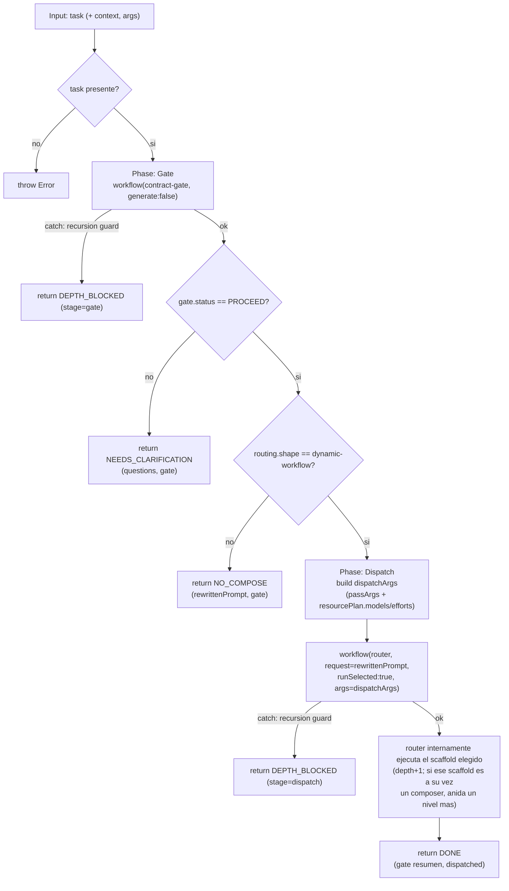

# recursive-compose

> Referencia (pi, profundidad ≤ 3): un nodo re-escanea una sub-tarea vía `contract-gate` y luego la despacha vía `router` — recursión acotada.

## En 30 segundos

`recursive-compose` no ejecuta agentes: re-evalúa una tarea con `contract-gate` (Phase-0) y, si el gate recomienda un `dynamic-workflow`, despacha ese patrón vía `router`, propagando el presupuesto de modelos/esfuerzo sugerido por el gate. Elegilo cuando quieras un ejemplo de referencia de "Phase-0 desde adentro + despacho recursivo" acotado en profundidad — típicamente para probar o ejemplificar composición, no para trabajo de producción sobre Claude Code (ahí se topa con el guard de profundidad, ver más abajo).

## Cómo lanzarlo

```text
/workflow new mi-run --pattern=recursive-compose
/workflow run mi-run {"task": "Investigar y resumir el estado de X"}
```

El input es un objeto (o JSON string) con `task` (alias `request`/`text`, requerido), y opcionalmente `context` y `args` — ver la tabla de [Input y output](#input-y-output) más abajo.

## Diagrama



## Qué hace

`recursive-compose` es un ejemplo de referencia de **composición recursiva acotada**: no contiene agentes propios (`agent()`), solo orquesta dos scaffolds ya existentes vía `workflow(...)`. Primero re-escanea (re-gatea) la tarea de entrada con el contrato Phase-0 (`contract-gate`) para decidir si vale la pena orquestar algo más profundo o si basta con una respuesta directa. Si el gate recomienda un patrón de tipo `dynamic-workflow`, despacha ese patrón a través de `router` (con `runSelected: true`), pasando además el presupuesto de recursos (`resourcePlan.models` / `resourcePlan.efforts`) sugerido por el gate hacia la ejecución despachada.

El archivo documenta explícitamente su "ledger" de profundidad: depth 0 es este mismo scaffold; depth 1 es la llamada a `contract-gate` (con `generate:false`, para que el gate no anide más); depth 1 también es la llamada a `router`; depth 2 es cuando `router` ejecuta internamente el scaffold elegido; y depth 3 es el tope si ese scaffold elegido es a su vez un composer (p. ej. `composition-driver` llamando a `verify-claims-lib`). El límite de profundidad está gobernado por la variable de entorno `PI_DYNAMIC_WORKFLOWS_MAX_DEPTH`.

Es importante notar la diferencia de comportamiento entre runtimes: en `pi`, con `PI_DYNAMIC_WORKFLOWS_MAX_DEPTH >= 2` (idealmente `<= 3`, que es el cap previsto de esta cadena), el flujo completo funciona. En la herramienta Workflow de Claude Code, que solo soporta profundidad 1, el salto router→scaffold-elegido ya es depth 2 y el runtime lanza un "recursion guard" (error). El scaffold captura ese error con try/catch en cada llamada anidada y degrada de forma controlada retornando `status: "DEPTH_BLOCKED"` en lugar de propagar la excepción.

A diferencia de `router` (que despacha UN workflow) y de `contract-gate` (que solo delimita el alcance sin ejecutar nada), `recursive-compose` encadena gate → dispatch, de modo que la decisión Phase-0 efectivamente dispara una ejecución (potencialmente más profunda).

## Cuándo usarlo

- Querés el patrón de referencia funcional para "Phase-0 desde adentro" + despacho recursivo (Self-similar gate→compose pipelines).
- Necesitás propagar el presupuesto de recursos sugerido por el gate (`resourcePlan`) hacia una ejecución más profunda.
- Querés ejemplificar/probar despacho recursivo acotado dentro de un límite de profundidad conocido.
- **No usarlo** si corrés sobre Claude Code Workflow tool y esperás que la cadena completa funcione: se va a topar con el guard de profundidad y devolver `DEPTH_BLOCKED` en el primer salto anidado relevante. Para verlo funcionar completo hace falta `pi` con `PI_DYNAMIC_WORKFLOWS_MAX_DEPTH >= 2`.
- No usarlo si la tarea ya está bien delimitada y solo necesitás ejecutar un scaffold conocido directamente: en ese caso `router` (sin la re-gate) es más directo.
- No usarlo si solo necesitás el paso de scoping sin ejecutar nada: usá `contract-gate` solo.

## Cómo funciona

**Fase "Gate" (depth 1):** parsea el input (`args` como JSON o el objeto ya inyectado por el runtime) y extrae `task` (alias `request`/`text`), lanzando error si falta. Llama a `workflow("contract-gate", { request: task, context, generate: false })`. El flag `generate: false` es deliberado: evita que `contract-gate` anide otra llamada interna, preservando presupuesto de profundidad para el despacho real. Si esta llamada lanza excepción (guard de recursión del runtime), la captura y retorna `DEPTH_BLOCKED` con `stage: "gate"`. Si el gate no devuelve `status: "PROCEED"`, retorna `NEEDS_CLARIFICATION` con las `questions` del gate. Si `routing.shape` no es `"dynamic-workflow"` (p. ej. es trivial o single-agent), no hay nada que componer más profundo: retorna `NO_COMPOSE` con el `rewrittenPrompt` scopeado.

**Fase "Dispatch" (depth 1 → 2 → posible 3):** si el gate recomendó un `dynamic-workflow`, construye `dispatchArgs` fusionando los `args` recibidos en el input con `models`/`efforts` extraídos de `gate.resourcePlan` (si existen), para que la ejecución profunda corra con el presupuesto sugerido por el gate. Llama a `workflow("router", { request: compact(gate.rewrittenPrompt), runSelected: true, args: dispatchArgs })`, donde `compact()` trunca strings a 60.000 caracteres para evitar payloads gigantes. Igual que en la fase anterior, envuelve la llamada en try/catch: si el runtime rechaza la recursión, retorna `DEPTH_BLOCKED` con `stage: "dispatch"`, incluyendo `improvedTask` y `routing` del gate como contexto. Si todo sale bien, registra un log y retorna `status: "DONE"` con un resumen del gate (`improvedTask`, `routing`, `resourcePlan`) y el resultado completo de `dispatched` (lo que devolvió `router`, incluyendo qué scaffold seleccionó y su propio resultado).

El scaffold no usa `agent()`, `agents()` ni `parallel()` directamente — es pura composición: todos los knobs de modelo/esfuerzo/tools fluyen a través de las llamadas anidadas a `contract-gate` y `router`. No hay caching propio ni manejo de fallos parciales más allá de los dos bloques try/catch descritos (uno por cada punto de anidación).

## Input y output

**Input** (objeto, parseado desde `args` como JSON string u objeto):

| Campo | Requerido | Default | Notas |
|---|---|---|---|
| `task` (alias `request`, `text`) | Sí | — | Si falta, lanza `Error('Pass { task: "..." } ...')` |
| `context` | No | `undefined` | Forwardeado tal cual a `contract-gate` |
| `args` | No | `{}` | Objeto forwardeado al workflow despachado; se fusiona con `models`/`efforts` del `resourcePlan` del gate |

**Output** — siempre incluye `status`, que puede ser:

| `status` | Cuándo | Campos adicionales |
|---|---|---|
| `DEPTH_BLOCKED` | Guard de recursión del runtime en gate o dispatch | `stage` (`"gate"` \| `"dispatch"`), `error`, `note`, (en dispatch también) `gate: { improvedTask, routing }` |
| `NEEDS_CLARIFICATION` | El gate no devolvió `PROCEED` | `questions`, `gate` |
| `NO_COMPOSE` | `routing.shape` no es `dynamic-workflow` | `reason`, `rewrittenPrompt`, `gate` |
| `DONE` | Gate PROCEED + dispatch exitoso | `gate: { improvedTask, routing, resourcePlan }`, `dispatched` (resultado completo del `router`) |

No se observan llamadas a `writeArtifact` en el código: el scaffold no escribe artifacts propios, solo retorna el objeto de resultado (los artifacts, si los hay, serían los que generen internamente `contract-gate` o el scaffold despachado por `router`).

## Fases

1. **Gate** — re-escanea la tarea vía `contract-gate` (Phase-0, `generate:false`); corta temprano en `DEPTH_BLOCKED`, `NEEDS_CLARIFICATION` o `NO_COMPOSE`.
2. **Dispatch** — despacha el scaffold recomendado vía `router` (`runSelected:true`), propagando el `resourcePlan` del gate; retorna `DONE` o `DEPTH_BLOCKED`.
