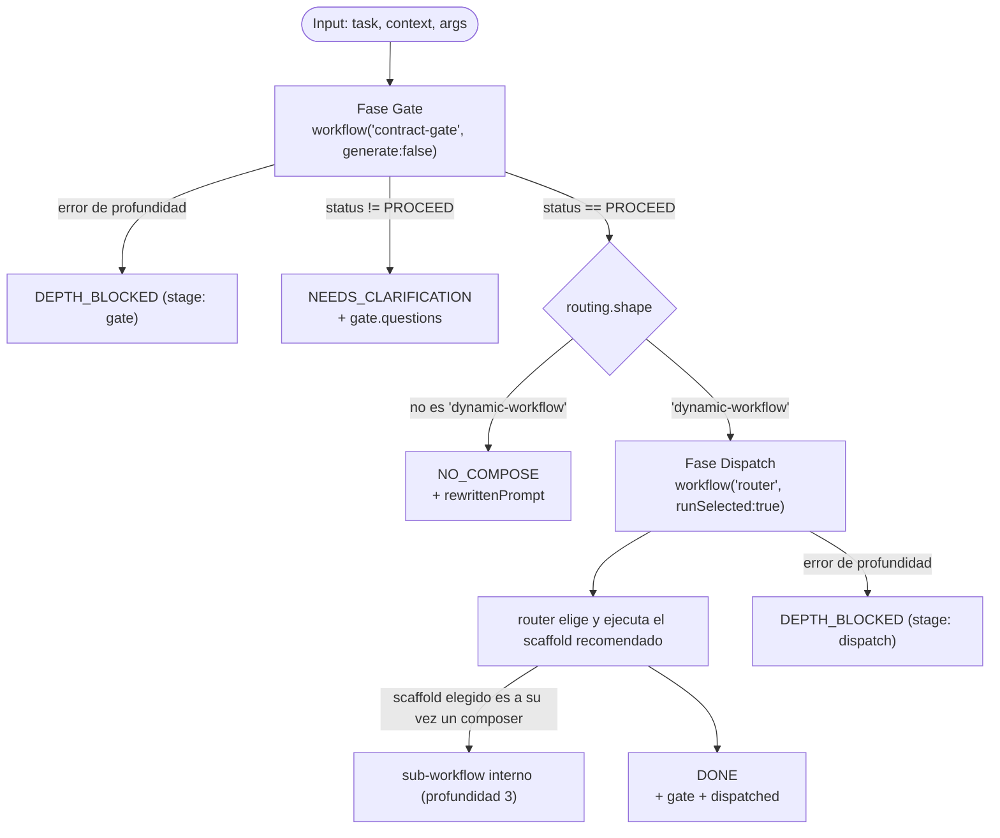

# recursive-compose

> Referencia (pi, profundidad ≤ 3): un nodo vuelve a gatear una sub-tarea con `contract-gate` y luego despacha vía `router`.

## En 30 segundos

`recursive-compose` no hace trabajo de dominio: encadena workflows existentes. Primero vuelve a pasar la tarea por el gate de Fase-0 (`contract-gate`) para re-scopearla; si el gate concluye que hace falta un dynamic workflow, despacha el scaffold recomendado con `router`.

Elegilo cuando quieras ver o reutilizar el patrón “gate → compone recursivamente”. Es útil como referencia de profundidad acotada y de cómo propagar el `resourcePlan` del gate hacia una ejecución más profunda.

## Cómo lanzarlo

```text
/workflow new mi-run --pattern=recursive-compose
```

Input típico:

```json
{
  "task": "audit + fix the SSE decoder",
  "context": "opcional, texto libre",
  "args": { "limit": 20 }
}
```

`task` es obligatorio (alias: `request`, `text`). `args` se reenvía al workflow que termine despachado.

**Runtime:** este scaffold anida `workflow(...)`, así que necesita un runtime que permita profundidad ≥ 3 si se cuenta el nodo raíz como profundidad 1. En pi funciona con `PI_DYNAMIC_WORKFLOWS_MAX_DEPTH >= 3`; la cadena llega a profundidad 3. En la Workflow tool de Claude Code (profundidad 1), el segundo salto (`router` → scaffold elegido) dispara el guard de recursión; el código lo captura y devuelve `status: "DEPTH_BLOCKED"`.

## Diagrama



## Qué hace

`recursive-compose` es composición pura: no define ningún `agent()` propio y solo orquesta dos workflows ya existentes del catálogo. Primero llama a `contract-gate` con `generate:false` para que el gate re-scopee la tarea sin volver a anidar y reserve profundidad para el siguiente paso. Si el gate no responde `PROCEED`, el scaffold se corta ahí y devuelve sus preguntas de clarificación.

Si el gate responde `PROCEED` y `routing.shape === "dynamic-workflow"`, el scaffold pasa `gate.rewrittenPrompt` a `router` con `runSelected:true`, para que `router` elija el scaffold adecuado y lo ejecute. El presupuesto sugerido por el gate (`resourcePlan.models` / `resourcePlan.efforts`) se reenvía dentro de `args` al workflow despachado.

Cada llamada anidada está protegida con `try/catch`: si el runtime rechaza la profundidad, el error se traduce a `status: "DEPTH_BLOCKED"` con una nota de acción. No usa `agent`, `agents`, `parallel` ni `pipeline` directamente; tampoco tiene caché propio ni maneja fallos parciales más allá de esas capturas.

## Cuándo usarlo

- Querés un ejemplo de “gate → compose → gate → compose...” con profundidad acotada.
- Querés llevar el `resourcePlan` sugerido por el gate hasta una corrida más profunda, sin recalcularlo.
- Buscás ver cómo `contract-gate` y `router` se encadenan en un nodo recursivo.

**No lo uses si:**

- Ya sabés qué scaffold necesitás: llamalo directo.
- Necesitás que el dispatch se ejecute completo bajo la Workflow tool de Claude Code; ahí el segundo salto topa el guard de profundidad y devuelve `DEPTH_BLOCKED`.

## Cómo funciona

**Fase Gate** — llama a `workflow("contract-gate", { request: task, context, generate: false })`.
`generate:false` evita que `contract-gate` anide otro nivel. Si la llamada lanza una excepción por profundidad, retorna `{ status: "DEPTH_BLOCKED", stage: "gate", error, note }`. Si el gate responde pero `status !== "PROCEED"`, retorna `{ status: "NEEDS_CLARIFICATION", questions, gate }`. Si `routing.shape !== "dynamic-workflow"`, retorna `{ status: "NO_COMPOSE", reason, rewrittenPrompt, gate }`.

**Fase Dispatch** — solo ocurre cuando el gate dio `PROCEED` y `routing.shape === "dynamic-workflow"`. Construye `dispatchArgs` uniendo `args` de entrada con `resourcePlan.models` y `resourcePlan.efforts` si existen, y llama a `workflow("router", { request: compact(gate.rewrittenPrompt), runSelected: true, args: dispatchArgs })`. `compact()` recorta el prompt a 60000 caracteres. Si esta llamada falla por profundidad, retorna `{ status: "DEPTH_BLOCKED", stage: "dispatch", error, note, gate }`. Si sale bien, retorna `{ status: "DONE", gate, dispatched }`.

## Input y output

**Input:**

| Campo | Requerido | Descripción |
|---|---|---|
| `task` (alias `request`, `text`) | sí | Tarea a re-gatear y, si corresponde, despachar. |
| `context` | no | Contexto libre reenviado a `contract-gate`. |
| `args` | no (default `{}`) | Objeto reenviado al workflow finalmente despachado; se le suman `models`/`efforts` de `resourcePlan` si existen. |

**Output** (uno de estos `status`):

| status | Cuándo | Payload |
|---|---|---|
| `DONE` | `router` despachó con éxito | `{ gate: { improvedTask, routing, resourcePlan }, dispatched }` |
| `NEEDS_CLARIFICATION` | `contract-gate` no dio `PROCEED` | `{ questions, gate }` |
| `NO_COMPOSE` | no hacía falta un dynamic workflow | `{ reason, rewrittenPrompt, gate }` |
| `DEPTH_BLOCKED` | el runtime rechazó una llamada anidada | `{ stage: "gate"\|"dispatch", error, note, gate? }` |

No escribe artifacts propios (`writeArtifact`); cualquier artifact lo genera el workflow despachado.

## Fases

1. **Gate** — re-scope de Fase-0 vía `workflow('contract-gate', { generate: false })`.
2. **Dispatch** — despacho del scaffold recomendado vía `workflow('router', { runSelected: true })`.
