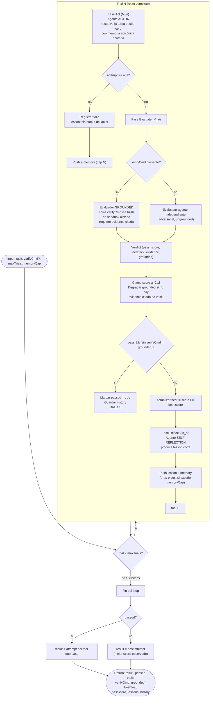

# reflexion

> Bucle de "RL verbal" (verbal reinforcement learning): reintenta la tarea completa en cada trial cargando reflexiones previas; el evaluador puede estar externamente fundamentado (`verifyCmd`).

## En 30 segundos

`reflexion` resuelve una tarea completa una y otra vez: en cada trial la reintenta desde cero, un evaluador separado le pone pass/fail + score (idealmente corriendo un comando real), y un tercer agente convierte cada fallo en una lección corta que el próximo intento tiene en cuenta. Elegilo cuando tenés una tarea con señal de éxito objetiva — tests, build, un `verifyCmd` ejecutable — y preferís reintentar toda la solución de nuevo en vez de parchearla en el lugar (para eso último existe `self-refine`).

## Cómo lanzarlo

```text
/workflow new mi-run --pattern=reflexion
```

Input típico (JSON pasado como `args` al workflow):

```json
{
  "task": "Implementar parseConfig(str) en src/config.js: debe tolerar YAML vacío",
  "verifyCmd": "npm test -- config.test.js",
  "maxTrials": 3,
  "memoryCap": 3
}
```

Sin `verifyCmd` igual funciona, pero el evaluador cae a un agente ungrounded (señal más débil): alcanza con `{ "task": "..." }`.

## Diagrama



## Qué hace

`reflexion` implementa el paper *Reflexion: Language Agents with Verbal Reinforcement Learning* (arXiv:2303.11366). A diferencia de un refinamiento in-place, este scaffold es un **bucle de trials externo**: en cada iteración resetea el problema y hace que un agente Actor resuelva la tarea completa desde cero, condicionado únicamente por un buffer acotado de lecciones textuales acumuladas en trials anteriores (memoria episódica).

Separa explícitamente tres roles del paper: el **Actor** (M_a) genera el intento completo; el **Evaluador** (M_e) emite una señal objetiva de pass/fail + score, y puede estar *fundamentado* (grounded) ejecutando un comando real (`verifyCmd`) vía la tool de bash, o caer a un agente evaluador independiente y adversarial si no hay comando; y el **Self-Reflection** (M_sr) convierte la señal de fallo (sparse) en una lección verbal corta para el siguiente trial. Estos tres roles usan agentes/instancias distintas, no el mismo modelo autoevaluándose.

El diseño es deliberadamente "falsificable": un veredicto solo se considera `grounded` si (a) se pidió `verifyCmd`, (b) el evaluador no marcó `grounded=false`, y (c) citó output no vacío en `evidence`; si falta cualquiera de estas condiciones se degrada a ungrounded, para que un modelo no pueda reclamar una ejecución que nunca hizo. Un "pass" reclamado sin evidencia real bajo `verifyCmd` NO se acepta como éxito — el loop sigue intentando.

El bucle está acotado en ambos extremos: se detiene apenas el Evaluador da pass aceptable, o cuando se agota el presupuesto de `maxTrials`; en ese caso devuelve el mejor intento observado (por score), no el último a secas.

## Cuándo usarlo

| Situación | Elegí |
|---|---|
| Tarea con test suite / build / comando de verificación objetivo (`verifyCmd`) | `reflexion` — reintenta toda la tarea, evaluador grounded |
| Señal de pass/fail clara pero sin comando ejecutable ("Tasks with a pass/fail signal") | `reflexion` sin `verifyCmd` — evaluador cae a agente ungrounded, señal más débil (per arXiv:2310.01798) |
| Refinar UN artefacto existente en el lugar, sin resetear | `self-refine` (una sola cadena, un solo modelo con todos los sombreros) |
| Tarea puramente subjetiva/abierta, sin ninguna señal de éxito expresable | ninguno de los dos — no hay oráculo, ni siquiera un evaluador agente, para anclar el loop |

Otra señal a considerar: si el runtime no aplica aislamiento de tools por agente (p. ej. Claude Code Workflow no fuerza `actorTools`), el Actor puede leer el propio `verifyCmd`/grader y converger en el trial 1, sin ejercitar realmente el loop reflect→retry.

## Cómo funciona

El scaffold parsea `input` (JSON o string) y valida que exista `task` (alias `question`/`text`), lanzando error si falta. Define un helper `node(role, extra)` para resolver overrides por rol de modelo/effort/tools/skills/excludeTools con precedencia per-role > global (`input.model`/`input.effort`/etc.) > default del call-site. Define también `fence()`, que envuelve contenido no confiable en un delimitador derivado de un hash del propio contenido (no determinista por azar — el runtime prohíbe `Math.random`/`Date.now` — sino por FNV-ish hash), para que un payload malicioso no pueda forjar el marcador de cierre.

Fases (declaradas en `meta.phases`, ejecutadas dentro del `while` con `phase(...)`):

1. **Act** — El agente `actor` (modelo `sonnet`, effort `medium` por defecto, override vía `actorModel`/`models.actor`) recibe la tarea completa más el bloque de memoria episódica (o "sin lecciones previas" en el trial 1) y produce un intento self-contained desde cero. Si `actorTools` está seteado, se restringe el toolset del Actor (para que no pueda leer el oráculo/grader). Si el agente devuelve `null` (murió/fue skippeado), se registra como fallo, se agrega una lección genérica ("actor produjo output vacío") a memoria y se continúa al siguiente trial sin llamar al Evaluador.

2. **Evaluate** — El agente `evaluator` (modelo `opus`, effort `high`, con `schema: VERDICT`) recibe un prompt distinto según haya `verifyCmd`:
   - **Grounded**: se le indica ejecutar el comando real en un directorio scratch aislado (`mktemp -d`), materializar ahí el intento, correr `verifyCmd` con la tool de bash, y devolver `evidence` con el output real citado; debe limpiar el scratch dir al final.
   - **Ungrounded** (sin `verifyCmd`): agente evaluador independiente y adversarial, `grounded=false` forzado, sin `evidence`.
   Ambas ramas usan `fence()` para envolver `task` y el intento como datos no confiables (con instrucciones anti-inyección explícitas). El código clampa `score` a `[0,1]` y descarta NaN; recalcula `grounded` de forma defensiva exigiendo `evidence` no vacía; y calcula `acceptablePass = pass && (!verifyCmd || grounded)` — es decir, un pass solo cuenta si no se pidió grounding o si el grounding fue real. Actualiza `best` con tie-break hacia el trial más reciente en empates de score.

3. **Reflect** — Solo si el trial no fue un pass aceptable. El agente `reflection` (modelo `opus`, effort `high`, `schema: REFLECTION`) recibe el veredicto objetivo (pass/score/grounded), el intento, el feedback y (si existe) la evidencia citada, y debe producir UNA o dos frases: por qué falló y qué cambiar la próxima vez — sin reescribir la solución. Si el agente no devuelve una `lesson` válida, se genera una lección fallback con el score y feedback truncados. La lección se agrega al buffer `memory`, que se recorta (`shift()`, FIFO) cuando excede `memoryCap` (default 3).

**Manejo de fallos parciales**: actor null → fallo registrado sin evaluar; evaluador null/crash → veredicto sintético fail-closed (`pass:false, score:0`); reflexión null/inválida → lección fallback determinística. Nunca hay un pass silencioso ni una "reflexión" vacía que rompa el ciclo.

**Caching**: el scaffold no usa `writeArtifact` ni caching explícito; el estado vive en memoria del proceso (`memory`, `history`, `best`) durante la ejecución del workflow. No persiste artifacts en disco.

## Input y output

**Input** (objeto JSON pasado como `args`):

| Campo | Tipo | Default | Notas |
|---|---|---|---|
| `task` (o `question`/`text`) | string | — | **requerido**; lanza error si falta |
| `verifyCmd` | string | `null` | si se define y no es vacío tras `trim()`, activa el evaluador grounded |
| `maxTrials` | number | `3` | clamp a `[1, 50]`; loguea si el valor se ajustó |
| `memoryCap` | number | `3` | mínimo `1`; tamaño del buffer FIFO de lecciones |
| `actorModel` | string | inherit | atajo que setea `models.actor` si no está ya seteado |
| `evaluatorModel` | string | inherit | atajo que setea `models.evaluator` si no está ya seteado |
| `actorTools` | array | `null` (inherit) | restringe las tools del Actor (p. ej. `[]` para que no pueda ver el oráculo) |
| `model` / `effort` | string | — | defaults globales aplicados a todos los nodos |
| `models[role]` / `efforts[role]` | object | `{}` | overrides por rol (`actor`, `evaluator`, `reflection`) |
| `tools` / `toolsByRole[role]` | array | — | scoping de tools global o por rol |
| `skills` / `skillsByRole[role]` | array | — | scoping de skills global o por rol |
| `excludeTools` / `excludeByRole[role]` | array | — | exclusión de tools global o por rol |

**Output** (objeto retornado por `main`):

- `result`: el intento ganador (si `passed`, el del trial que pasó; si no, el de mejor `score` observado — `best.attempt`).
- `passed`: boolean, si algún trial fue un pass aceptable.
- `trials`: número de trials ejecutados.
- `maxTrials`: presupuesto configurado.
- `verifyCmd`: boolean — si se PIDIÓ grounding (no si se logró).
- `grounded`: boolean — si ALGÚN trial logró grounding real, evidence-backed (`groundedAny`).
- `bestTrial` / `bestScore`: trial y score del mejor intento observado.
- `lessons`: snapshot final del buffer de memoria episódica (copia, `memory.slice()`).
- `history`: array por-trial con `{ trial, attempt, pass, score, feedback, evidence, grounded, lesson }`.

No se escriben `writeArtifact`; todo el resultado va en el valor de retorno.

## Fases

1. **Act** — el Actor (M_a) resuelve la tarea completa desde cero, condicionado por la memoria episódica acotada.
2. **Evaluate** — el Evaluador (M_e) emite un veredicto objetivo pass/fail + score, grounded (ejecuta `verifyCmd` vía bash con evidencia citada) o ungrounded (agente adversarial independiente).
3. **Reflect** — el Self-Reflection (M_sr) convierte la señal de fallo en una lección verbal corta, agregada al buffer de memoria para el próximo trial.
