# reflexion

> Loop de reintentos verbal-RL: reintenta la tarea completa en cada trial cargando auto-reflexiones; el evaluador puede estar externamente grounded (`verifyCmd`).

## En 30 segundos

`reflexion` implementa Reflexion (arXiv:2303.11366): en vez de editar un borrador in-place, resetea y re-resuelve la tarea ENTERA desde cero en cada trial, cargando solo un buffer acotado de lecciones en lenguaje natural de los trials fallidos anteriores. Elegilo cuando tenés una tarea con oráculo objetivo (tests, build, comando de verificación) y creés que "empezar de nuevo con una lección aprendida" va a rendir mejor que parchear el mismo intento repetidamente.

## Cómo lanzarlo

```text
/workflow new mi-run --pattern=reflexion
/workflow run mi-run {"task":"Hacer pasar el test del decoder que está fallando","verifyCmd":"npm test -- decoder","maxTrials":3}
```

`task` es el único campo obligatorio (acepta también `question` o `text` como alias). `verifyCmd` es opcional pero recomendado: sin él, el Evaluador cae a un juicio intrínseco (más débil, per arXiv:2310.01798). Ver el resto de los campos en [Input y output](#input-y-output).

## Diagrama

```mermaid
flowchart TD
    A["Input: task (req), verifyCmd?, maxTrials=3 (clamp 1..50), memoryCap=3, actorModel?, evaluatorModel?, actorTools?"] --> B{"task ausente?"}
    B -->|"sí"| B1["throw Error"]
    B -->|"no"| C["memory = [] (buffer acotado de lecciones)\nhistory = [], trial = 0, passed = false"]

    C --> D{"trial < maxTrials?"}
    D -->|"no"| Z
    D -->|"sí"| E["trial += 1"]

    E --> F["Phase: Act"]
    F --> G["agent ACTOR sonnet·medium\nresuelve la tarea COMPLETA desde cero\ncondicionado SOLO en memory (lecciones previas)"]
    G --> H{"attempt == null?"}
    H -->|"sí"| H1["registra fallo 'actor sin output'\nmemory.push lección genérica -> continue"]
    H1 --> D
    H -->|"no"| I["Phase: Evaluate"]

    I --> J{"verifyCmd presente?"}
    J -->|"sí"| K["agent EVALUATOR opus·high (GROUNDED)\ncrea scratch dir, materializa el attempt,\nCORRE verifyCmd via bash tool,\ncita output real en 'evidence'"]
    J -->|"no"| L["agent EVALUATOR opus·high (independiente)\njuicio adversarial intrínseco,\ngrounded=false, evidence=''"]
    K --> M["VERDICT schema: {pass, score, feedback, evidence, grounded}"]
    L --> M

    M --> N{"verdictRaw == null?"}
    N -->|"sí"| N1["verdict fail-closed: pass=false, score=0"]
    N -->|"no"| N2["usa verdict tal cual"]
    N1 --> O
    N2 --> O["score = clamp(verdict.score, 0..1), guard NaN"]

    O --> P{"grounded real?\n(verifyCmd AND grounded!=false AND evidence no vacío)"}
    P -->|"sí"| P1["grounded=true, groundedAny=true"]
    P -->|"no"| P2["grounded=false (downgrade defensivo si se pidió verifyCmd)"]
    P1 --> Q
    P2 --> Q["acceptablePass = pass AND (!verifyCmd OR grounded)"]

    Q --> R["actualiza best si score >= best.score (tie-break al más reciente)"]
    R --> S{"acceptablePass?"}
    S -->|"sí"| S1["history.push(pass=true)\npassed=true -> BREAK loop"]
    S -->|"no"| T["Phase: Reflect"]

    T --> U["agent SELF-REFLECTION opus·high\nNO reescribe la solución;\ndiagnostica POR QUÉ falló +\nestrategia concreta para el próximo trial"]
    U --> V["REFLECTION schema: {lesson}"]
    V --> W["history.push(pass=false, lesson)\nmemory.push(lesson)"]
    W --> X{"memory.length > memoryCap?"}
    X -->|"sí"| X1["memory.shift() (descarta la más vieja)"]
    X -->|"no"| Y
    X1 --> Y["log memoria N/memoryCap"]
    Y --> D

    S1 --> Z["fin del loop: passed (break) o budget agotado"]
    Z --> AA["finalAttempt = passed ? último history.attempt : best.attempt"]
    AA --> AB["return { result, passed, trials, maxTrials,\nverifyCmd, grounded: groundedAny, bestTrial, bestScore,\nlessons: memory, history }"]
```



## Qué hace

`reflexion` implementa el patrón "verbal reinforcement learning" del paper original: un loop EXTERNO de trials que reintenta la tarea completa desde cero, en lugar de refinar un mismo artefacto in-place. Separa explícitamente tres roles fieles al paper — Actor (M_a), Evaluador (M_e) y Auto-Reflexión (M_sr) — cada uno como una llamada a `agent` distinta, en vez de un único modelo cumpliendo todos los papeles.

El punto fuerte del diseño es la falsabilidad del grounding: cuando se pasa `verifyCmd`, el Evaluador debe CORRER ese comando de verdad vía la tool de bash en un directorio scratch aislado, y citar el output real en el campo `evidence`. El código no confía en la palabra del modelo: si `verifyCmd` fue pedido pero el Evaluador no citó output no-vacío, el grounding se degrada defensivamente a `false` y un "pass" reclamado sin evidencia NO se acepta como éxito — el trial sigue reintentando. Esto imita la regla de "no reproduced sin output citado" de `bug-verify.js`.

La memoria episódica es un buffer acotado (`memoryCap`, default 3, siguiendo el paper que usa 1-3 lecciones para caber en la ventana de contexto): cada lección de un trial fallido se agrega al final y, si se excede el cap, se descarta la más vieja. El loop está acotado en ambos extremos: para en el primer `pass` aceptable, o cuando se agota `maxTrials` — nunca reintenta indefinidamente. Si se agota el presupuesto sin pasar, el resultado devuelto es el mejor intento observado (`best`, por score, con desempate al más reciente).

## Cuándo usarlo

| Situación | Patrón recomendado |
|---|---|
| Tenés un oráculo objetivo (tests/build) y "empezar de nuevo" > "parchear el mismo borrador" | `reflexion` |
| Preferís editar UN borrador in-place con crítica/refinamiento sobre el mismo artefacto | `self-refine` (una sola cadena, sin reset, sin evaluador separado) |
| No tenés forma de verificar objetivamente el resultado ni un criterio claro de éxito/fracaso | reconsiderar: el Evaluador ungrounded es intrínsecamente más débil (arXiv:2310.01798) |

Casos de uso listados en el catálogo: código con tests ("Code-with-tests"), tareas con señal binaria de pass/fail ("Tasks with a pass/fail signal"), y decisiones de reset-y-reintentar vs. editar-en-el-lugar ("Reset-and-re-attempt vs edit-in-place"). **Caveat documentado en el código:** en runtimes que NO aíslan las tools por agente (p. ej. el runtime de Claude Code Workflow), el Actor conserva acceso completo a archivos/bash, puede leer el propio verificador y correr `verifyCmd` él mismo, convergiendo en el trial 1 — para ejercitar el loop reflect→retry ahí hace falta una tarea cuyo primer intento falle genuinamente, o un harness de test que stubee `agent`.

## Cómo funciona

**Validación de entrada.** `task` (o sus alias `question`/`text`) es obligatorio; si falta, lanza `Error` directamente (no hay retorno de error graceful como en otros scaffolds). `maxTrials` se sanea a entero con clamp 1..50 (default 3, logueando si se recortó). `memoryCap` se sanea a entero >= 1 (default 3). Los overrides `actorModel`/`evaluatorModel` se enrutan al canal `models[role]` para que ganen sobre el default global `input.model`, respetando la precedencia por-rol > global > default del call-site. `actorTools`, si es un array, restringe las tools del Actor (para que no pueda espiar al oráculo/Evaluador).

**Fase Act (M_a).** Un `agent` en el rol `actor` (modelo `sonnet`, effort `medium`) recibe la tarea completa más un bloque de "lecciones de trials pasados" (o el mensaje de que es el primer trial si `memory` está vacía) y produce un intento fresco y autocontenido — nunca asume que existe un intento previo. Si el Actor retorna `null` (agente saltado/muerto), el trial se registra como fallido con una lección genérica ("el actor no produjo output") y continúa al siguiente trial sin llamar al Evaluador.

**Fase Evaluate (M_e).** Rama dual según si hay `verifyCmd`: (a) **grounded** — el Evaluador (`opus`, effort `high`, con schema `VERDICT`) crea un directorio scratch aislado, materializa ahí los archivos del intento, corre `verifyCmd` con la tool de bash, y debe citar el output real (exit code + stdout/stderr relevante) en `evidence`; al terminar limpia el scratch dir. (b) **ungrounded** — sin `verifyCmd`, un Evaluador independiente y adversarial juzga contra los criterios explícitos de la tarea, sin correr nada, con `grounded=false` forzado y `evidence` vacío. Ambas ramas envuelven la tarea y el intento en un fence anti-inyección (`fence()`, delimitador derivado de un hash del contenido) con instrucciones explícitas de tratar el contenido como dato, nunca como instrucción. Si el Evaluador retorna `null`, se usa un verdict fail-closed (`pass=false, score=0`) — nunca un pass silencioso.

**Downgrade de grounding y aceptación de pass.** El `score` se clampea a [0,1] con guardia de `NaN`. El flag `grounded` real solo es `true` si (`verifyCmd` presente) AND (`verdict.grounded !== false`) AND (`evidence` citado no vacío) — si alguna falla, se degrada a `false` aunque el modelo haya dicho `grounded=true`. Un `pass` solo se acepta (`acceptablePass`) si no se pidió `verifyCmd`, o si se pidió Y el resultado está efectivamente grounded — un "pass" auto-reportado sin evidencia bajo `verifyCmd` NO termina el loop.

**Fase Reflect (M_sr), solo en fallo.** Un `agent` en el rol `reflection` (`opus`, effort `high`, schema `REFLECTION`) recibe el intento fallido, el feedback del Evaluador y (si existe) el output citado, y produce UNA o dos oraciones: por qué falló y qué estrategia concreta cambiar — explícitamente NO una reescritura de la solución. La lección se agrega al buffer `memory`; si excede `memoryCap`, se descarta la más vieja (FIFO). Si el Evaluador o el parseo de la lección fallan, se usa una lección de fallback derivada del score y el feedback truncado.

**Manejo de fallos parciales:** un Actor nulo no aborta el run, se contabiliza como trial fallido con lección genérica. Un Evaluador nulo se trata como fail-closed. Un `pass` reclamado sin evidencia bajo `verifyCmd` se rechaza explícitamente en vez de aceptarse. **Caching:** no se observa ningún mecanismo de caché; cada llamada a `agent` es fresca.

## Input y output

**Input** (JSON-stringified en `args`, parseado defensivamente):

| Campo | Tipo | Requerido | Default / clamp |
|---|---|---|---|
| `task` (o `question`/`text`) | string | **sí** | — (si falta, `throw Error`) |
| `verifyCmd` | string | no | `null`; si se da, activa el Evaluador grounded |
| `maxTrials` | number | no | default 3, clamp 1..50 |
| `memoryCap` | number | no | default 3 (tamaño del buffer episódico) |
| `actorModel` | string | no | override de modelo solo para el Actor (rutea a `models.actor`) |
| `evaluatorModel` | string | no | override de modelo solo para el Evaluador (rutea a `models.evaluator`) |
| `actorTools` | any[] | no | si es array, reemplaza las tools del Actor (p. ej. `[]` para que no espíe el oráculo) |
| `model` / `effort` | string | no | override global para todo nodo |
| `models[role]` / `efforts[role]` | object | no | override por rol (`actor`, `evaluator`, `reflection`); precedencia por-rol > global > default del call-site |
| `tools` / `skills` / `excludeTools` (y variantes `*ByRole`) | array | no | pasados al `agent` si son arrays |

**Output:**

- `result`: el intento ganador (si `passed`) o el de mejor score observado (`best.attempt`) si se agotó el presupuesto.
- `passed`: booleano — ¿algún trial fue aceptado como pass?
- `trials`: número de trials efectivamente ejecutados.
- `maxTrials`: el límite configurado (tras clamp).
- `verifyCmd`: booleano — ¿se PIDIÓ grounding (se pasó `verifyCmd`)? (distinto de si se logró).
- `grounded`: booleano — ¿algún trial logró un grounding real, evidence-backed (`groundedAny`)?
- `bestTrial` / `bestScore`: número de trial y score del mejor intento observado.
- `lessons`: copia del buffer de memoria episódica al finalizar.
- `history`: array con un registro estructurado por trial (`trial, attempt, pass, score, feedback, evidence, grounded, lesson`).

No se observan llamadas a `writeArtifact`: toda la observabilidad pasa por `log(...)` (inicio, resultado de cada trial, downgrades de grounding, estado de la memoria) y por el shape de retorno.

## Fases

1. **Act** — el Actor (sonnet·medium) resuelve la tarea completa desde cero, condicionado solo en las lecciones acumuladas de trials previos.
2. **Evaluate** — el Evaluador (opus·high) emite un veredicto objetivo pass/fail + score; grounded (corre `verifyCmd` de verdad y cita evidencia) si se pasó `verifyCmd`, o un juicio independiente adversarial si no.
3. **Reflect** — solo si el trial falló: la Auto-Reflexión (opus·high) convierte la señal dispersa del Evaluador en una lección verbal corta, que se agrega al buffer acotado de memoria episódica para el próximo trial.
