# reflexion

> Loop de reintentos con RL verbal: en cada trial reintenta la tarea completa con lecciones acumuladas; el evaluador puede estar fundamentado externamente (`verifyCmd`).

## En 30 segundos

`reflexion` implementa Reflexion (arXiv:2303.11366): un agente resuelve la tarea completa desde cero en cada trial, un evaluador separado le asigna `pass/fail` + `score`, y un tercer agente convierte cada fallo en una lección corta para el siguiente intento. Elegilo cuando tenés un oráculo objetivo — tests, build o un comando `verifyCmd` — y empezar de nuevo rinde mejor que parchear el mismo borrador.

## Cómo lanzarlo

```text
/workflow new mi-run --pattern=reflexion
/workflow run mi-run {"task":"Hacer pasar el test del decoder que está fallando","verifyCmd":"npm test -- decoder","maxTrials":3}
```

`task` es obligatorio; también acepta `question` o `text`. `verifyCmd` es opcional, pero recomendable: si no lo pasás, el Evaluador cae a un juicio intrínseco, más débil (arXiv:2310.01798). Mirá [Input y output](#input-y-output) para el resto de los campos.

## Diagrama

```mermaid
flowchart TD
    A["Input: task, verifyCmd?, maxTrials=3, memoryCap=3, actorModel?, evaluatorModel?, actorTools?"] --> B{"¿task falta?"}
    B -->|"sí"| B1["throw Error"]
    B -->|"no"| C["Init: memory=[], history=[], trial=0, passed=false"]
    C --> D{"trial < maxTrials?"}
    D -->|"no"| Z
    D -->|"sí"| E["trial += 1"]
    E --> F["Act"]
    F --> G["Actor: resuelve desde cero con memory"]
    G --> H{"attempt == null?"}
    H -->|"sí"| H1["Registrar fallo y seguir"]
    H1 --> D
    H -->|"no"| I["Evaluate"]
    I --> J{"¿verifyCmd presente?"}
    J -->|"sí"| K["Evaluator grounded: corre verifyCmd en scratch y cita evidence"]
    J -->|"no"| L["Evaluator independiente: grounded=false, evidence=''"]
    K --> M["VERDICT {pass, score, feedback, evidence, grounded}"]
    L --> M
    M --> N{"verdictRaw == null?"}
    N -->|"sí"| N1["fail-closed: pass=false, score=0"]
    N -->|"no"| N2["usar verdict"]
    N1 --> O
    N2 --> O["score = clamp(verdict.score, 0..1)"]
    O --> P{"grounded real?"}
    P -->|"sí"| P1["grounded=true, groundedAny=true"]
    P -->|"no"| P2["grounded=false"]
    P1 --> Q
    P2 --> Q["acceptablePass = pass AND (!verifyCmd OR grounded)"]
    Q --> R["Actualizar best si score >= best.score"]
    R --> S{"acceptablePass?"}
    S -->|"sí"| S1["history.push(pass=true); break"]
    S -->|"no"| T["Reflect"]
    T --> U["SELF-REFLECTION: por qué falló y qué cambiar"]
    U --> V["REFLECTION schema: {lesson}"]
    V --> W["history.push(pass=false, lesson); memory.push(lesson)"]
    W --> X{"memory.length > memoryCap?"}
    X -->|"sí"| X1["memory.shift()"]
    X -->|"no"| Y
    X1 --> Y["log memoria"]
    Y --> D
    S1 --> Z["Fin del loop"]
    Z --> AA["finalAttempt = passed ? último history.attempt : best.attempt"]
    AA --> AB["return { result, passed, trials, maxTrials, verifyCmd, grounded, bestTrial, bestScore, lessons, history }"]
```



## Qué hace

`reflexion` implementa el patrón de *verbal reinforcement learning* del paper original: un loop externo de trials que reintenta la tarea completa desde cero, en lugar de refinar el mismo artifact in-place. Separa explícitamente tres roles fieles al paper — Actor (M_a), Evaluador (M_e) y Auto-Reflexión (M_sr) — y cada uno corre como una llamada distinta a `agent`, no como un único modelo que se evalúa a sí mismo.

La fortaleza del diseño es que el grounding se puede falsar. Cuando se pasa `verifyCmd`, el Evaluador debe correr ese comando de verdad con la tool de bash en un directorio scratch aislado, y citar el output real en `evidence`. El código no confía en lo que el modelo diga: si `verifyCmd` fue pedido pero el Evaluador no citó output no vacío, `grounded` se degrada a `false` y un `pass` reclamado sin evidencia NO se acepta como éxito. Eso imita la regla de *no reproduced without quoted output* de `bug-verify.js`.

La memoria episódica es un buffer acotado (`memoryCap`, default 3, siguiendo el paper que usa 1-3 lecciones para entrar en contexto): cada lección de un trial fallido se agrega al final y, si se excede el cap, se descarta la más vieja. El loop está acotado en ambos extremos: se detiene en el primer `pass` aceptable, o cuando se agota `maxTrials`. Si se agota el presupuesto sin pasar, devuelve el mejor intento observado (`best`, por `score`, con desempate hacia el más reciente).

## Cuándo usarlo

| Situación | Patrón recomendado |
|---|---|
| Tenés un oráculo objetivo (`tests`, `build`, `verifyCmd`) y "empezar de nuevo" rinde más que parchear | `reflexion` |
| Preferís editar UN borrador in-place con crítica y refinamiento sobre el mismo artifact | `self-refine` (una sola cadena, sin reset, sin evaluador separado) |
| No tenés forma de verificar objetivamente el resultado ni un criterio claro de éxito/fracaso | reconsiderar: el Evaluador ungrounded es intrínsecamente más débil (arXiv:2310.01798) |

Casos de uso listados en el catálogo: código con tests, tareas con señal binaria de pass/fail y decisiones de reset-y-reintentar vs. editar-en-el-lugar. **Caveat del código:** en runtimes que no aíslan las tools por agente (por ejemplo, el runtime de Claude Code Workflow), el Actor conserva acceso completo a archivos y bash, puede leer el propio verificador y correr `verifyCmd` él mismo, y entonces converge en el trial 1. Para ejercitar el loop reflect→retry ahí hace falta una tarea cuyo primer intento falle de verdad, o un harness de test que stubee `agent`.

## Cómo funciona

**Validación de entrada.** `task` (o sus alias `question`/`text`) es obligatorio; si falta, lanza `Error` directamente. `maxTrials` se normaliza a entero con clamp 1..50 (default 3, con log si se recortó). `memoryCap` se normaliza a entero >= 1 (default 3). Los overrides `actorModel`/`evaluatorModel` se enrutan a `models.actor`/`models.evaluator`, así ganan sobre el default global `input.model`, respetando la precedencia por rol > global > default del call-site. `actorTools`, si es un array, restringe las tools del Actor.

**Fase Act (M_a).** Un `agent` en el rol `actor` (modelo `sonnet`, effort `medium`) recibe la tarea completa más un bloque de lecciones de trials previos (o el mensaje de que es el primer trial si `memory` está vacía) y produce un intento fresco y autocontenido. Si el Actor retorna `null`, el trial se registra como fallido con una lección genérica y continúa al siguiente trial sin llamar al Evaluador.

**Fase Evaluate (M_e).** Hay dos ramas según `verifyCmd`: (a) **grounded** — el Evaluador (`opus`, effort `high`, `schema: VERDICT`) crea un directorio scratch aislado, materializa ahí los archivos del intento, corre `verifyCmd` con la tool de bash y debe citar el output real en `evidence`; al terminar limpia el scratch dir. (b) **ungrounded** — sin `verifyCmd`, un Evaluador independiente y adversarial juzga contra los criterios explícitos de la tarea, con `grounded=false` forzado y `evidence` vacío. Ambas ramas envuelven la tarea y el intento en un fence anti-inyección (`fence()`, con delimitador derivado de un hash del contenido) y le dicen al modelo que trate ese contenido como dato, nunca como instrucción. Si el Evaluador retorna `null`, se usa un veredicto fail-closed (`pass=false`, `score=0`).

**Downgrade de grounding y aceptación de pass.** El `score` se clampa a `[0,1]` y se protege contra `NaN`. `grounded` solo queda en `true` si hay `verifyCmd`, el veredicto no marcó `grounded=false` y `evidence` cita output no vacío. Si alguna de esas condiciones falla, se degrada a `false`, aunque el modelo haya dicho lo contrario. Un `pass` solo se acepta (`acceptablePass`) si no se pidió `verifyCmd`, o si se pidió y el resultado está efectivamente grounded.

**Fase Reflect (M_sr), solo en fallo.** Un `agent` en el rol `reflection` (`opus`, effort `high`, `schema: REFLECTION`) recibe el intento fallido, el feedback del Evaluador y, si existe, el output citado, y produce una o dos oraciones: por qué falló y qué estrategia concreta cambiar para el próximo trial. La lección se agrega al buffer `memory`; si excede `memoryCap`, se descarta la más vieja (FIFO). Si el Evaluador o el parseo de la lección fallan, se usa una lección de fallback derivada del `score` y del feedback truncado.

**Fallos parciales.** Un Actor nulo no aborta el run: cuenta como trial fallido con lección genérica. Un Evaluador nulo se trata como fail-closed. Un `pass` reclamado sin evidencia bajo `verifyCmd` se rechaza explícitamente en vez de aceptarse. **Caché:** no se observa ningún mecanismo de caché; cada llamada a `agent` es fresca.

## Input y output

**Input** (JSON-stringified en `args`, parseado defensivamente):

| Campo | Tipo | Requerido | Default / clamp |
|---|---|---|---|
| `task` (o `question`/`text`) | string | **sí** | — (si falta, `throw Error`) |
| `verifyCmd` | string | no | `null`; si se da, activa el Evaluador grounded |
| `maxTrials` | number | no | default 3, clamp 1..50 |
| `memoryCap` | number | no | default 3 (tamaño del buffer episódico) |
| `actorModel` | string | no | override de modelo solo para el Actor (`models.actor`) |
| `evaluatorModel` | string | no | override de modelo solo para el Evaluador (`models.evaluator`) |
| `actorTools` | any[] | no | si es array, reemplaza las tools del Actor (por ejemplo `[]` para que no espíe el oráculo) |
| `model` / `effort` | string | no | override global para todos los nodos |
| `models[role]` / `efforts[role]` | object | no | override por rol (`actor`, `evaluator`, `reflection`); precedencia por rol > global > default del call-site |
| `tools` / `skills` / `excludeTools` (y variantes `*ByRole`) | array | no | se pasan al `agent` si son arrays |

**Output:**

- `result`: el intento ganador (si `passed`) o el de mejor `score` observado (`best.attempt`) si se agotó el presupuesto.
- `passed`: booleano — ¿algún trial fue aceptado como `pass`?
- `trials`: número de trials efectivamente ejecutados.
- `maxTrials`: el límite configurado (tras clamp).
- `verifyCmd`: booleano — ¿se pidió grounding? (distinto de si se logró).
- `grounded`: booleano — ¿algún trial logró grounding real, evidence-backed (`groundedAny`)?
- `bestTrial` / `bestScore`: número de trial y score del mejor intento observado.
- `lessons`: copia del buffer de memoria episódica al finalizar.
- `history`: array con un registro por trial (`trial, attempt, pass, score, feedback, evidence, grounded, lesson`).

No se observa `writeArtifact`: toda la observabilidad pasa por `log(...)` y por el shape de retorno.

## Fases

1. **Act** — el Actor (sonnet·medium) resuelve la tarea completa desde cero, condicionado solo por las lecciones acumuladas de trials previos.
2. **Evaluate** — el Evaluador (opus·high) emite un veredicto objetivo `pass/fail` + `score`; grounded si corre `verifyCmd` de verdad y cita evidencia, o ungrounded si no hay comando.
3. **Reflect** — solo si el trial falló: la Auto-Reflexión (opus·high) convierte la señal dispersa del Evaluador en una lección verbal corta que se agrega al buffer acotado de memoria episódica para el próximo trial.
