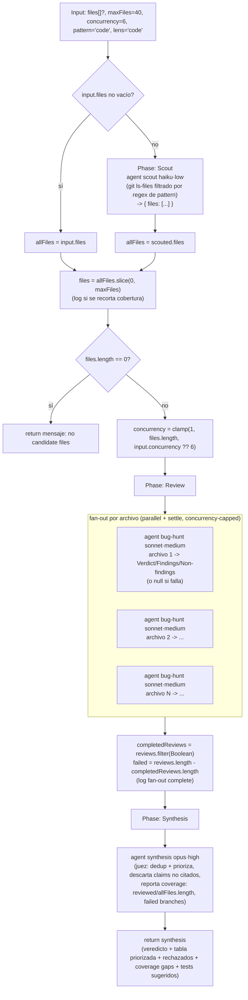

# repo-bug-hunt

> Scout de archivos de código, revisores de bugs por archivo, un juez deduplica y prioriza con citas. Los hallazgos son
> pistas, no bugs confirmados.

## En 30 segundos

Es el patrón para barrer un repo en busca de bugs sin saber de antemano qué archivos importan. Un scout descubre los
archivos candidatos con `git ls-files` filtrado por regex, un revisor independiente inspecciona cada archivo en
paralelo, y un juez final deduplica y prioriza los hallazgos citando evidencia. Elegilo para una auditoría amplia o un
barrido pre-review; no lo uses cuando necesitás confirmar que un bug puntual es real (para eso está `bug-verify`, que
reproduce y prueba).

## Cómo lanzarlo

```text
/workflow new mi-run --pattern=repo-bug-hunt
/workflow run mi-run {"maxFiles": 30, "lens": "security"}
```

Todos los campos de `input` son opcionales; con `{}` corre sobre archivos de código (`pattern: "code"`) con hasta 40
archivos y lente genérica de bugs. Ver la tabla en [Input y output](#input-y-output) para el resto de los defaults.

## Diagrama



## Qué hace

`repo-bug-hunt` es un mapeo por archivo con síntesis-como-juez: primero descubre qué archivos existen (o usa una lista
explícita), después lanza un revisor independiente por archivo que busca bugs bajo una lente configurable, y finalmente
un juez único deduplica, descarta hallazgos sin evidencia y produce una tabla priorizada. Es explícitamente una
herramienta de **descubrimiento**: los hallazgos son leads a verificar, no bugs confirmados (el scaffold nunca reproduce
ni ejecuta código).

Es "dinámico" porque el work-list de archivos y el ancho del fan-out no se conocen en tiempo de autoría: dependen de qué
archivos matchean el patrón en el repo actual, acotados por `maxFiles`. El diseño es robustness-first: cada revisor
corre bajo `settle` (un branch fallido se vuelve `null` y no rompe el resto), y el juez recibe explícitamente cuántos
archivos se revisaron sobre el total y cuántos branches fallaron, para no ocultar cobertura incompleta.

Tanto el patrón de archivos a revisar (`pattern`) como la lente de revisión (`lens`) son configurables vía presets
(`code`/`docs`/`web`/`config` para pattern; `code`/`security`/`prose` para lens) o texto libre, lo que permite reusar el
mismo scaffold para auditorías de seguridad, revisión de prosa en docs, o bugs de código genéricos.

## Cuándo usarlo

| Elegí esto si…                                                           | Usá…            |
| ------------------------------------------------------------------------ | --------------- |
| Querés barrer un repo entero sin saber de antemano qué archivos importan | `repo-bug-hunt` |
| Ya tenés un bug puntual y necesitás reproducirlo y probarlo              | `bug-verify`    |
| Necesitás hallazgos priorizados y citados, no un veredicto suelto        | `repo-bug-hunt` |

`repo-bug-hunt` es para descubrimiento amplio. Si después querés confirmar un hallazgo, seguí con `bug-verify`.

**No** lo uses para “probar” un bug: este scaffold nunca ejecuta ni reproduce código.

## Cómo funciona

**Entrada y saneo.** `args` se parsea de forma defensiva (`try/catch` a `{}`). `maxFiles` se sanea con un clamp entero
entre 1 y 4096 (default 40; si el valor provisto era inválido, se loguea el fallback). `pattern` resuelve contra un mapa
de presets (`code`, `docs`, `web`, `config`) o, si no matchea ningún preset, se usa el string tal cual como regex
(default: extensiones de código `\.(ts|tsx|js|jsx|py|go|rs)$`). `lens` funciona igual, contra presets
`code`/`security`/`prose`, o texto libre describiendo qué buscar (default: bugs genéricos, condiciones de carrera,
seguridad, pérdida de datos, edge cases).

**Fase Scout.** Si `input.files` es un array no vacío, se usa directamente y se salta el scout. Si no, un `agent` en rol
`scout` (modelo `haiku`, effort `low`) ejecuta `git ls-files` y filtra por la regex de `pattern`, devolviendo un JSON
`{ files: [...] }` validado contra un schema de objeto (`FILE_LIST`). El filtro de extensión vive en el prompt del
regex, nunca vía interpolación de shell. La lista resultante se recorta a `maxFiles`; si se recorta, se loguea cuántos
archivos quedaron fuera. Si el work-list final queda vacío, el scaffold retorna un mensaje explicativo sin llegar a
Review/Synthesis. Si el `agent` falla acá, la corrida aborta.

**Fase Review.** `concurrency` se sanea con clamp entre 1 y `files.length` (default 6). Se lanza un `agent`
independiente por archivo en `parallel` con `settle`: cada revisor (rol `bug-hunt`, modelo `sonnet`, effort `medium`)
recibe el contenido del archivo envuelto en un fence anti-inyección derivado de un hash del contenido (`fence()`), con
instrucciones explícitas de tratar ese contenido como datos, nunca como instrucciones, y de ignorar cualquier directiva
embebida. El contrato de salida exige citar archivo y línea por cada hallazgo, explicar escenario/impacto/fix mínimo,
ignorar estilo puro, y declarar explícitamente `NO_FINDINGS` o `INSUFFICIENT_EVIDENCE` en vez de inventar. Un branch
fallido se vuelve `null` bajo `settle` y se filtra después (`completedReviews`); el conteo de fallos (`failed`) se
loguea y se propaga a la síntesis.

**Fase Synthesis.** Un único `agent` (rol `synthesis`, modelo `opus`, effort `high`) actúa como juez final: recibe todos
los reviews completados (comprimidos a 80000 caracteres con `compact()`) envueltos en el mismo fence anti-inyección,
junto con las cifras de cobertura (`reviewed/total`, `failed`). Debe deduplicar y priorizar, descartar afirmaciones
concretas sin cita, y producir: veredicto ejecutivo, tabla priorizada
(severidad/confianza/archivo-línea/issue/escenario/fix), hallazgos rechazados por baja confianza, gaps de
cobertura/branches fallidos, y tests de verificación sugeridos. Este string es el retorno final del scaffold.

**Caching:** no se observa ningún mecanismo de caché explícito; cada `agent` se invoca fresco.

**Manejo de fallos parciales:** tanto Scout (implícito, si `agent` falla no hay fallback) como Review usan `settle` vía
`parallel`; en Review los `null` se filtran y se cuentan (`failed`), y ese número se comunica explícitamente al juez
para que no oculte cobertura incompleta.

## Input y output

| Campo                                                       | Tipo     | Requerido | Default / clamp                                                                                               |
| ----------------------------------------------------------- | -------- | --------- | ------------------------------------------------------------------------------------------------------------- |
| `files`                                                     | string[] | no        | si no vacío, salta el Scout y se usa tal cual                                                                 |
| `maxFiles`                                                  | number   | no        | default 40, clamp 1..4096; cap tanto de archivos revisados como del ancho del fan-out                         |
| `concurrency`                                               | number   | no        | default 6, clamp 1..`files.length`                                                                            |
| `pattern`                                                   | string   | no        | preset `code`\|`docs`\|`web`\|`config`, o regex libre; default `code` = `\.(ts\|tsx\|js\|jsx\|py\|go\|rs)$`   |
| `lens`                                                      | string   | no        | preset `code`\|`security`\|`prose`, o texto libre; default `code` (bugs/race conditions/seguridad/edge cases) |
| `model` / `effort`                                          | string   | no        | override global para todo nodo                                                                                |
| `models[role]` / `efforts[role]`                            | object   | no        | override por rol (`scout`, `bug-hunt`, `synthesis`); precedencia: por-rol > global > default del call-site    |
| `tools` / `skills` / `excludeTools` (y variantes `*ByRole`) | array    | no        | pasados al `agent` si son arrays                                                                              |

**Output:** un único string, el reporte del juez de síntesis (veredicto ejecutivo, tabla priorizada de hallazgos,
hallazgos rechazados, gaps de cobertura, tests sugeridos). En el camino sin archivos candidatos, retorna un mensaje
explicativo en su lugar.

No se observan llamadas a `writeArtifact`: toda la observabilidad pasa por `log(...)` (archivos descubiertos, caps
aplicados, ancho de fan-out, fallos por branch) y por el string de retorno.

## Fases

1. **Scout** — descubre el work-list de archivos vía `git ls-files` filtrado por `pattern` (o usa `input.files` si viene
   explícito), recortado a `maxFiles`.
2. **Review** — un `agent` bug-hunt (sonnet·medium) por archivo, en `parallel` con `settle` y concurrencia acotada,
   buscando lo que describe `lens` y citando evidencia.
3. **Synthesis** — un `agent` juez (opus·high) deduplica, prioriza y reporta cobertura/fallos sobre los reviews
   completados.
