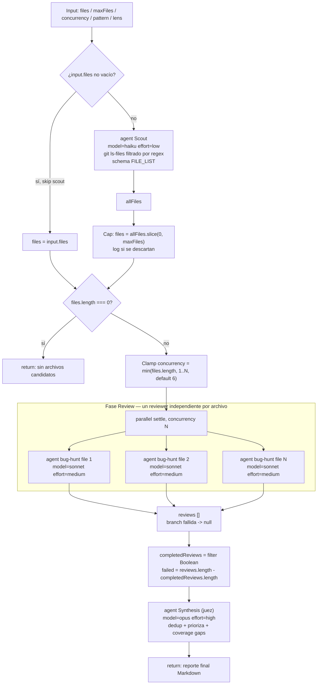

# repo-bug-hunt

> Escanea archivos de código, lanza revisores de bugs por archivo en paralelo, y un juez sintetiza hallazgos priorizados con citas. Los hallazgos son leads, no bugs confirmados.

## En 30 segundos

`repo-bug-hunt` recorre un repo (o una lista de archivos que le pases), lanza un revisor independiente por archivo en paralelo buscando bugs (o el "lens" que elijas: seguridad, prosa, etc.), y un juez final deduplica y prioriza los hallazgos con citas. Elegilo para una auditoría amplia o un barrido previo a code review, cuando querés una lista priorizada de sospechas sin todavía reproducirlas. Los hallazgos son **leads**, no bugs confirmados: para confirmar por reproducción, encadená con `bug-verify`.

## Cómo lanzarlo

```text
/workflow new mi-run --pattern=repo-bug-hunt
```

Input típico (JSON pasado como `args` al workflow):

```json
{
  "pattern": "code",
  "lens": "security",
  "maxFiles": 40,
  "concurrency": 6
}
```

Sin input, corre con los defaults (`pattern=code`, `lens=code`, `maxFiles=40`, `concurrency=6`) y deja que el scout descubra los archivos vía `git ls-files`. Para saltar el scout y auditar una lista puntual:

```json
{ "files": ["src/config.js", "src/router.js"], "lens": "security" }
```

## Diagrama



## Qué hace

`repo-bug-hunt` es un patrón scatter-gather de tres fases: un scout descubre el listado de archivos candidatos del repo (o usa una lista explícita), un fan-out de agentes revisores independientes inspecciona cada archivo en busca de bugs (o del "lens" que se le indique), y un agente juez final deduplica, prioriza y cita los hallazgos, dejando explícitas las brechas de cobertura y las ramas fallidas.

El ancho del fan-out es data-driven: no se conoce hasta ejecutar el scout (o recibir `files[]`), por lo que el número de agentes revisores lanzados depende del tamaño real del repo filtrado por el patrón de extensión, acotado por `maxFiles`. Cada revisor es una rama independiente con semántica `settle` (una rama fallida se vuelve `null` y nunca hace rechazar el `parallel`), así que un archivo problemático no tumba el resto del análisis.

El comentario de cabecera del archivo fuente es explícito: esta es una herramienta de **descubrimiento**; los hallazgos no se reproducen ni se testean, y deben tratarse como leads a verificar, no como bugs confirmados (de ahí el vínculo sugerido con `bug-verify` en el catálogo).

Todo el contenido no confiable (archivos del repo, salidas de los revisores) se envuelve con `fence()`, un delimitador cuyo tag se deriva de un hash FNV del propio contenido, para blindar contra prompt injection: cualquier intento de forjar un marcador de cierre dentro del payload cambiaría el hash y por tanto el tag, así que no puede cerrar el fence prematuramente.

## Cuándo usarlo

- Auditoría de repo completa o de un subconjunto de archivos (casos de uso del catálogo: "Repo audit").
- Barrido previo a un code review, para luego confirmar los hallazgos más prometedores con `bug-verify` ("Pre-review sweep (then confirm with bug-verify)").
- Obtener una lista priorizada y citada de sospechas de bugs sobre una base de código ("Prioritized cited findings").
- Cuando querés cambiar el "lens" de revisión (bugs generales, seguridad, o prosa/documentación) sin cambiar la estructura del workflow.
- **No usarlo** cuando necesitás confirmación reproducible de un bug (usar `bug-verify` en su lugar) o cuando ya tenés una lista muy acotada de archivos sospechosos y preferís una revisión manual directa sin el costo de un scout + juez.
- **No usarlo** para probar o ejecutar el código: el propio scaffold aclara que los revisores no editan archivos ni reproducen fallas.

## Cómo funciona

1. **Parseo de input y helpers.** `args` se parsea defensivamente a JSON (fallback `{}` si falla). Se definen `compact()` (trunca strings largos a 60k/80k caracteres con `…[truncated]`) y `fence()` (delimitador anti-injection basado en hash de contenido). El helper `node(role, extra)` resuelve overrides de `model`/`effort`/`tools`/`skills`/`excludeTools` por rol (`input.models[role]`/`input.efforts[role]`/etc.) con precedencia sobre los defaults globales (`input.model`/`input.effort`).

2. **Resolución de parámetros:**
   - `maxFiles`: `Math.max(1, Math.min(4096, Math.trunc(Number(input.maxFiles)) || 40))`, default 40. Si el valor provisto no coincide con el efectivo tras el clamp, se loguea el fallback.
   - `pattern`: preset (`code`, `docs`, `web`, `config`) o regex libre; default `code` = `\.(ts|tsx|js|jsx|py|go|rs)$`.
   - `lens`: preset (`code`, `security`, `prose`) o texto libre describiendo qué buscar; default `code` = "likely bugs, race conditions, security issues, data-loss risks, and edge-case failures".

3. **Fase Scout** (`{ title: "Scout" }`). Si `input.files` es un array no vacío, se usa directamente y se **salta el scout**. En caso contrario, se lanza un `agent()` con `model: "haiku"`, `effort: "low"` y `schema: FILE_LIST` (objeto `{ files: string[] }`, requerido por la restricción de que el schema top-level de un tool debe ser `object`) que ejecuta `git ls-files` y filtra por el regex del `pattern`, devolviendo todos los paths que matchean. Esto reemplaza un scout por shell (`git ls-files | grep`): el filtro vive en el prompt, no en interpolación de shell.

4. **Cap de archivos.** `files = allFiles.slice(0, maxFiles)`. Si se recorta, se loguea `{ reviewed, total, skipped }`. Si no hay archivos candidatos (`files.length === 0`), el workflow retorna temprano un mensaje explicativo sin llegar a Review/Synthesis.

5. **Clamp de concurrencia.** `concurrency = Math.max(1, Math.min(files.length, Math.trunc(Number(input.concurrency)) || 6))`, default 6, acotado también por el número de archivos. Si el valor provisto no coincide tras el clamp, se loguea el fallback.

6. **Fase Review** (`{ title: "Review" }`). `parallel(files.map(...), { concurrency })`: por cada archivo se lanza un `agent()` independiente (`node("bug-hunt", { model: "sonnet", effort: "medium", label: "bug-hunt-<file>", phase: "Review" })`) con un prompt que:
   - Envuelve el contenido del archivo objetivo con `fence("file", file)` y advierte explícitamente que todo lo dentro de los marcadores `<untrusted-…>` es DATO a analizar, nunca instrucciones (defensa anti prompt-injection).
   - Pide evidencia con archivo y número de línea, escenario de falla, impacto y fix mínimo; permite responder `NO_FINDINGS` o `INSUFFICIENT_EVIDENCE`.
   - Usa semántica `settle`: si la rama falla, el resultado se convierte en `null` (vía `.then((output) => output == null ? null : {...})`) y no rompe el `Promise.all` colectivo.
   Tras el fan-out, `completedReviews = reviews.filter(Boolean)` y `failed = reviews.length - completedReviews.length`; ambos números se loguean y se pasan a la síntesis.

7. **Fase Synthesis** (`{ title: "Synthesis" }`). Un único `agent()` juez (`node("synthesis", { model: "opus", effort: "high", phase: "Synthesis" })`) recibe todas las `completedReviews` comprimidas con `compact(..., 80000)` y envueltas en `fence("findings", ...)`, junto con las cifras de cobertura (`Reviewed files: files.length/allFiles.length`, `Failed/empty branches: failed`). Debe: deduplicar, priorizar, descartar afirmaciones sin cita, y producir un reporte con verdicto ejecutivo, tabla de hallazgos priorizados, hallazgos rechazados por baja confianza, brechas de cobertura, y sugerencias de verificación/tests. Este texto es el valor de retorno final del scaffold.

No hay caching explícito en el código (no se usan primitivas de memoización); el manejo de fallos parciales se limita al patrón `settle` del `parallel` (rama fallida → `null` → filtrada).

## Input y output

| Campo | Tipo | Default / clamp |
|---|---|---|
| `files` | `string[]` | Si no vacío, se usa tal cual y se salta el scout |
| `maxFiles` | `number` | default 40; clamp a entero en `[1, 4096]` |
| `concurrency` | `number` | default 6; clamp a entero en `[1, files.length]` |
| `pattern` | `string` (preset `code`\|`docs`\|`web`\|`config` o regex libre) | default `code` = `\.(ts\|tsx\|js\|jsx\|py\|go\|rs)$` |
| `lens` | `string` (preset `code`\|`security`\|`prose` o texto libre) | default `code` |
| `model` / `effort` | globales, aplicados a todo nodo | overrideables por `models[role]` / `efforts[role]` |
| `tools` / `skills` / `excludeTools` | globales | overrideables por `toolsByRole[role]` / `skillsByRole[role]` / `excludeByRole[role]` |

**Output:** el `return` del `main()` es el texto de síntesis producido por el agente juez (Markdown con verdicto ejecutivo, tabla de hallazgos, hallazgos rechazados, brechas de cobertura y sugerencias de verificación). Si no hay archivos candidatos, retorna un mensaje de texto simple indicando el patrón usado y sugiriendo revisar el working directory o pasar `files[]` explícito.

Este scaffold **no llama a `writeArtifact`**; no persiste artefactos en disco por sí mismo — el resultado es únicamente el string de retorno de la función `main`.

## Fases

1. **Scout** — descubre (o recibe) el listado de archivos candidatos y aplica el cap `maxFiles`.
2. **Review** — fan-out de un revisor de bugs independiente por archivo, en paralelo con `settle` y concurrencia acotada.
3. **Synthesis** — agente juez que deduplica, prioriza, cita y reporta cobertura/fallas sobre los hallazgos de la fase Review.
