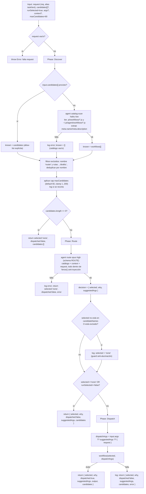

# router

> Clasificá una solicitud y despachá el workflow del catálogo más adecuado, o solo recomendalo.

## En 30 segundos

`router` es la puerta de entrada para solicitudes crudas: clasifica la entrada, elige un workflow del catálogo y, por
defecto, lo ejecuta. Úsalo cuando no querés decidir a mano qué workflow corresponde, o cuando querés ver solo la
recomendación con `runSelected:false`.

## Cómo lanzarlo

```text
/workflow new mi-run --pattern=router
/workflow run mi-run {"request":"Auditá los endpoints de la API en busca de fallas de seguridad","runSelected":true}
```

`request` es el único campo obligatorio. Para solo ver qué elegiría sin ejecutar nada:

```text
/workflow run mi-run {"request":"Resumí este log de 50MB","runSelected":false}
```

## Decisión rápida

| Si querés...                                           | Usá             |
| ------------------------------------------------------ | --------------- |
| que el sistema elija entre varios workflows candidatos | `router`        |
| solo reencuadrar una tarea antes de ejecutar algo      | `contract-gate` |
| ejecutar un workflow específico que ya conocés         | llamalo directo |

## Diagrama



## Qué hace

`router` implementa el patrón clásico de LLM-router (también llamado dispatch/handoff): una puerta de entrada barata que
clasifica un request entrante y lo reenvía al especialista más adecuado. Acá los "especialistas" son los workflows
hermanos del catálogo de dynamic workflows, y la decisión de ruteo la toma UN solo nodo juez (rol `route`) que devuelve
un objeto tipado `{ selected, why, suggestedArgs }`. Si el ruteo tiene éxito, `router` **despacha**: llama a
`workflow(selected, …)` y devuelve el output de ese workflow tal cual — a diferencia de `contract-gate`, que solo
_recomienda_ una forma de encarar la tarea sin ejecutarla.

Es "dinámico" porque el conjunto de candidatos no se conoce en tiempo de autoría: se **descubre** en runtime leyendo el
catálogo del proyecto (`.pi/workflows/*.js`) y el global (`~/.pi/agent/workflows/*.js`), excluyendo `router` mismo y
cualquier entrada bajo `drafts/`. El target elegido se invoca dinámicamente vía la primitiva `workflow()` — el único
punto que varía según el request.

El diseño es robusto en cada uno de los tres pasos: si falla el escaneo del catálogo, degrada a catálogo vacío
(`selected:"none"`); si falla el nodo de ruteo, degrada a `"none"` (con el motivo en `error`); si falla el dispatch,
surge como `dispatched:false` (+ `error`) — nunca un crash. `"none"` es un resultado de primera clase para requests
triviales o sin fit. El router rechaza estructuralmente despacharse a sí mismo o a cualquier nombre fuera del set
descubierto, así que un ciclo de auto-ruteo es imposible; el dispatch es de un solo disparo (sin loop ni recursión).

## Cuándo usarlo

- Un único front door para tareas crudas cuando no sabés (o no querés elegir vos) qué workflow del catálogo aplica.
- Previsualizar la elección con `runSelected:false` antes de comprometerte a ejecutar algo.
- Mapear una tarea al especialista correcto entre varios workflows candidatos.
- Restringir el universo de candidatos vos mismo con `candidates: [...]` (allow-list explícita, salta el escaneo del
  catálogo).

Evitá `router` cuando:

- Ya sabés exactamente qué workflow querés correr: llamalo directo y ahorrate el nodo de ruteo (`opus`·`high`, el más
  caro del scaffold).
- Necesitás ejecutar **varios** workflows o combinarlos: `router` elige exactamente uno, nunca una lista.
- El request es autosuficiente y trivial: el propio nodo `route` puede (y debe) devolver `"none"` en ese caso, evitando
  levantar un workflow multi-agente innecesario.

## Cómo funciona

**Validación de entrada.** `request` (alias `task`/`text`) es obligatorio; si falta o queda vacío tras `trim()`, lanza
`Error` directamente (no hay camino de degradación graciosa acá, a diferencia de las fases posteriores). `runSelected`
default `true`. `maxCandidates` se sanea con clamp 1..200 (default 60), logueando si el valor pedido fue recortado.

**Fase Discover.** Si `input.candidates` es un array no vacío, se usa como allow-list explícita (saltea el escaneo,
igual se filtra contra `router`/`drafts` y se deduplica). Si no, se lanza un `agent` (rol `catalog-scan`, modelo
`haiku`, effort `low`, schema `CATALOG`) instruido para leer los archivos de catálogo del proyecto y globales como
**datos**, nunca como instrucciones (defensa anti-inyección explícita en el prompt), y extraer
`meta.name`/`meta.description` de cada uno, excluyendo `router` y cualquier ruta bajo `drafts/`. Si ese `agent` lanza
excepción, se loguea y se continúa con catálogo vacío — nunca crashea. Los candidatos descubiertos se filtran
(excluidos + duplicados) y se recortan al cap `maxCandidates` con log explícito si hubo recorte. Si el resultado queda
en cero candidatos, la fase settlea temprano devolviendo `{ selected: "none", dispatched: false, candidates: [] }` sin
pasar a Route.

**Fase Route.** Un único `agent` juez (rol `route`, modelo `opus`, effort `high`, schema `ROUTE`) recibe la lista de
candidatos, el `context` opcional y el `request`, todos envueltos en `fence()` — un delimitador anti-inyección derivado
de un hash del contenido, para que un payload malicioso no pueda forjar el marcador de cierre. El prompt exige elegir
EXACTAMENTE un nombre copiado literal de la lista, o `"none"`, y justificar la elección citando señales concretas del
request. Si el nodo lanza excepción, se degrada a `selected:"none"` con el error en el campo `error`. Tras recibir la
decisión, se valida que `selected` esté realmente en el set descubierto y no excluido — un pick alucinado o fuera de
catálogo se coacciona a `"none"` de forma visible (logueada), nunca se despacha una alucinación.

**Fase Dispatch.** Si `selected === "none"` o `runSelected === false`, retorna solo la recomendación
(`dispatched:false`) sin llamar a nada más. Si no, resuelve `dispatchArgs` con precedencia nullish:
`input.args ?? suggestedArgs ?? { request }` (un `suggestedArgs` explícitamente `{}` se respeta, no cae a
`{ request }`). Llama a `workflow(selected, dispatchArgs)` en un único intento guardado: si tiene éxito, devuelve
`{ selected, why, dispatched:true, suggestedArgs, output, candidates }`; si lanza excepción, devuelve `dispatched:false`
con el error prefijado (`Dispatch to "X" failed: …`) sin reintentar ni recursionar.

**Caching:** no hay mecanismo explícito de caché — cada `agent` se invoca fresco.

**Fallos parciales:** cada uno de los tres pasos (scan, route, dispatch) está aislado con try/catch propio; ninguno
propaga excepción hacia el caller salvo la validación inicial de `request` vacío.

## Input y output

| Campo                                                       | Tipo     | Requerido | Default / clamp                                                                          |
| ----------------------------------------------------------- | -------- | --------- | ---------------------------------------------------------------------------------------- |
| `request` (alias `task`, `text`)                            | string   | **sí**    | — (si falta/vacío, `throw Error`)                                                        |
| `candidates`                                                | string[] | no        | allow-list explícita; salta el escaneo del catálogo si se provee                         |
| `runSelected`                                               | boolean  | no        | default `true`; en `false` solo recomienda, nunca despacha                               |
| `args`                                                      | object   | no        | args para el workflow elegido; fallback nullish a `suggestedArgs`, luego a `{ request }` |
| `context`                                                   | string   | no        | contexto extra plegado en el prompt de ruteo                                             |
| `maxCandidates`                                             | number   | no        | default 60, clamp 1..200                                                                 |
| `model` / `effort`                                          | string   | no        | override global para todo nodo                                                           |
| `models[role]` / `efforts[role]`                            | object   | no        | override por rol (`catalog-scan`, `route`); precedencia por-rol > global > default       |
| `tools` / `skills` / `excludeTools` (y variantes `*ByRole`) | array    | no        | pasados al `agent` si son arrays                                                         |

**Output:** `{ selected, why, dispatched, output? }`, con extensiones opcionales `candidates` (lista de nombres
considerados) y `error` (presente solo en un fallo guardado de ruteo o dispatch).

- `selected`: nombre del workflow elegido, o `"none"`.
- `why`: justificación evidenciada de la elección (o de por qué nada encajó).
- `dispatched`: `true` solo si `workflow(selected, …)` se ejecutó con éxito.
- `output`: presente únicamente cuando `dispatched === true` — es el output crudo del workflow despachado.
- `suggestedArgs`: args propuestos por el nodo `route` para el workflow elegido (se incluye en las respuestas de
  recomendación y de dispatch).

No se observan llamadas a `writeArtifact`: toda la observabilidad pasa por `log(...)` (candidatos descubiertos, caps
aplicados, decisión de ruteo, resultado del dispatch) y por el shape de retorno.

## Fases

1. **Discover** — resuelve el set de candidatos: usa la allow-list explícita si se provee, o escanea el catálogo del
   proyecto/global vía un `agent` barato (haiku·low); filtra excluidos (`router`, `drafts/`), deduplica y aplica el cap
   `maxCandidates`.
2. **Route** — un único `agent` juez (opus·high) elige exactamente un nombre del catálogo (o `"none"`) con justificación
   y `suggestedArgs`; se valida contra el set descubierto para bloquear alucinaciones.
3. **Dispatch** — si hay un `selected` válido y `runSelected` está activo, invoca `workflow(selected, dispatchArgs)` en
   un solo intento guardado y devuelve su output; si no, devuelve solo la recomendación.
