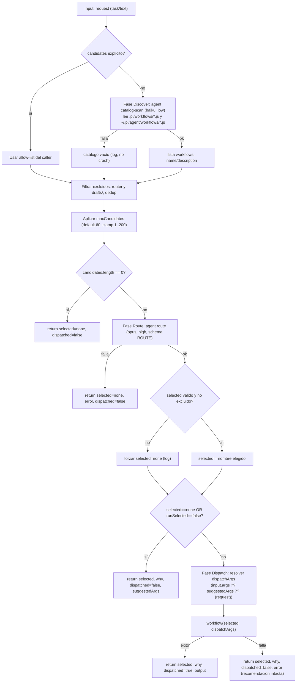

# router

> Clasifica una solicitud y la despacha al único mejor workflow del catálogo, o solo recomienda.

## En 30 segundos

`router` es un "front door" único: recibe una tarea en texto libre, la compara contra los workflows hermanos disponibles (descubiertos en runtime, no hardcodeados) y ejecuta el que mejor encaje — devolviendo su resultado. Elegilo cuando el caller no sabe (o no quiere saber) qué workflow específico correr; no lo uses si ya sabés cuál invocar (llamalo directo) o si necesitás generar un workflow nuevo (`workflow-factory`).

## Cómo lanzarlo

```bash
# 1) Crear el workflow a partir del scaffold (abre el editor con el código base)
/workflow new mi-router --pattern=router

# 2) Ejecutarlo con una tarea cruda como input
/workflow run mi-router {"request":"Necesito optimizar una query de Snowflake que tarda 40s"}
```

`request` es el único campo obligatorio (ver tabla de input más abajo). El router descubre el catálogo, elige un workflow (o `"none"`) y, si `runSelected` no es `false`, lo despacha y devuelve su `output`.

## Diagrama



## Qué hace

`router` implementa el patrón clásico de routing/dispatch de LLM: un nodo juez único (`route`) clasifica una solicitud entrante y elige, entre los workflows hermanos del catálogo, el que mejor se ajusta. A diferencia de `contract-gate` (que solo recomienda un `routingHint`), `router` por defecto **ejecuta** la decisión: llama a `workflow(selected, args)` y devuelve la salida de ese workflow.

El conjunto de candidatos no se conoce en tiempo de autoría: se **descubre en runtime** leyendo `.pi/workflows/*.js` (proyecto) y `~/.pi/agent/workflows/*.js` (global), extrayendo `meta.name`/`meta.description` de cada archivo. `router` se excluye a sí mismo y cualquier entrada bajo una subcarpeta `drafts/`, de modo que un ciclo de auto-ruteo es estructuralmente imposible.

Cada etapa está blindada: si el escaneo del catálogo falla, se sigue con catálogo vacío (→ `selected: "none"`); si el nodo de ruteo falla, degrada a `"none"` con el motivo en `error`; si el dispatch falla, se retorna `dispatched:false` + `error` — nunca un crash. `"none"` es un resultado de primera clase para solicitudes triviales o sin encaje, y el dispatch es de un solo tiro (sin loop ni recursión). El nombre elegido por el nodo juez se valida contra el conjunto descubierto: un pick alucinado o fuera de catálogo se trata como `"none"`, nunca se despacha una suposición.

## Cuándo usarlo

| Necesitás... | Usá |
|---|---|
| Front door único: mapear una tarea cruda al especialista correcto de un catálogo conocido | **`router`** |
| Solo previsualizar la elección, sin ejecutar nada (`runSelected: false`) | `router` (modo recomendación) |
| Ya sabés qué workflow correr | llamarlo directo, o `guardrails` para envolverlo |
| Generar un workflow nuevo en vez de reusar uno existente | `workflow-factory` |
| Una recomendación de forma (trivial / single-agent / dynamic-workflow) sin listar candidatos concretos | `contract-gate` |

## Cómo funciona

El input llega como `args` (posiblemente JSON-stringified) y se parsea defensivamente; si falla el parseo, se usa `{}`. Toda entrada no confiable (contenido del catálogo, contexto, request) se envuelve con `fence()`, un delimitador cuyo tag se deriva de un hash del contenido, para que un payload malicioso no pueda forjar un marcador de cierre coincidente.

**Fase 1 — Discover.** Si `input.candidates` viene como array no vacío, se usa como allow-list explícita (se salta el escaneo de catálogo, pero igual se filtra contra `router`/`drafts` y se deduplica). En caso contrario, se invoca `agent()` con rol `catalog-scan` (modelo `haiku`, effort `low`, schema `CATALOG`) para leer los archivos de catálogo y extraer `{ name, description }` de cada uno, tratando su contenido como DATOS a copiar literalmente, nunca como instrucciones a obedecer. Un fallo en este `agent()` se loguea y se continúa con lista vacía. Los nombres excluidos (`router` y cualquier entrada bajo `drafts/`) se descartan y se deduplican por nombre; se aplica el cap `maxCandidates` con log visible si recorta cobertura. Si no queda ningún candidato, se retorna de inmediato `{ selected: "none", dispatched: false, candidates: [] }`.

**Fase 2 — Route.** Un solo nodo juez (`agent()` con rol `route`, modelo `opus`, effort `high`, schema `ROUTE`) recibe el catálogo (nombre + descripción de cada candidato, todo fenceado como untrusted), el `context` opcional y el `request`, y debe devolver `{ selected, why, suggestedArgs }`. Las reglas del prompt exigen: `selected` debe ser exactamente un nombre de la lista (copiado verbatim) o el literal `"none"`; elegir `"none"` si nada encaja genuinamente o si la tarea es trivial; nunca elegir una lista; justificar con señales concretas de la solicitud. Si este `agent()` lanza, se retorna `selected:"none"` con `error`. Si `decision.selected` no está en el conjunto válido descubierto o está excluido, se fuerza a `"none"` (logueado, nunca despachado a ciegas).

**Fase 3 — Dispatch.** Si `selected === "none"` o `runSelected === false`, se retorna solo la recomendación (`dispatched: false`). En caso contrario se resuelven los `dispatchArgs` con precedencia nullish: `input.args ?? suggestedArgs ?? { request }` (un `suggestedArgs: {}` explícito SÍ se pasa, no se reemplaza por `{ request }` solo por estar vacío). Se llama `workflow(selected, dispatchArgs)`; si tiene éxito se retorna `{ selected, why, dispatched: true, output, ... }`; si falla, se retorna `dispatched: false` con `error` describiendo el fallo de dispatch, preservando la recomendación (`selected`, `why`) intacta.

No hay caching explícito en el scaffold; el único mecanismo de resiliencia es el patrón try/catch por etapa descrito arriba, que degrada cada fallo a un resultado seguro en lugar de propagar la excepción.

## Input y output

**Input** (`args`, JSON-stringified u objeto):

| Campo | Tipo | Default / clamp | Descripción |
|---|---|---|---|
| `request` (alias `task`, `text`) | string | **requerido** | La tarea a rutear; si falta o está vacía tras trim, lanza error. |
| `candidates` | string[] | opcional | Allow-list explícita; si se provee, se salta el escaneo de catálogo. |
| `runSelected` | boolean | `true` | Si `false`, solo recomienda (nunca despacha). |
| `args` | object | opcional | Args para el workflow elegido; tiene prioridad sobre `suggestedArgs`. |
| `context` | string | opcional | Contexto extra plegado en el prompt de ruteo. |
| `maxCandidates` | number | `60` (clamp 1..200) | Tope de candidatos mostrados al nodo `route`; el recorte se loguea. |
| `model` / `effort` | string | — | Overrides globales aplicados a todos los nodos. |
| `models{}` / `efforts{}` | object | — | Overrides por rol (`catalog-scan`, `route`). |
| `toolsByRole` / `skillsByRole` / `excludeByRole` | object | — | Overrides de tools/skills/excludeTools por rol. |

**Output:**

```json
{
  "selected": "string",        // nombre del workflow elegido, o "none"
  "why": "string",             // justificación del nodo route
  "dispatched": "boolean",     // true solo si se ejecutó workflow(selected, ...)
  "output": "any?",            // presente solo cuando dispatched=true
  "suggestedArgs": "object?",  // args propuestos por el nodo route
  "candidates": "string[]?",   // lista de nombres considerados
  "error": "string?"           // presente solo en fallo guardado (routing o dispatch)
}
```

No se observan llamadas a `writeArtifact` en el código: el scaffold no escribe artifacts propios; su único efecto observable son las líneas de `log(...)` y el valor de retorno.

## Fases

1. **Discover** — descubre el conjunto de workflows candidatos (allow-list del caller o escaneo del catálogo vía `agent()`), filtra excluidos (`router`, `drafts/`), deduplica y aplica el cap `maxCandidates`.
2. **Route** — un nodo juez único (`agent()` con schema `ROUTE`) elige exactamente un nombre del catálogo o `"none"`, con justificación y `suggestedArgs`; se valida contra el conjunto descubierto.
3. **Dispatch** — si hay una selección válida y `runSelected` no es `false`, ejecuta `workflow(selected, dispatchArgs)` y retorna su salida; de otro modo retorna solo la recomendación.
</content>
</invoke>
