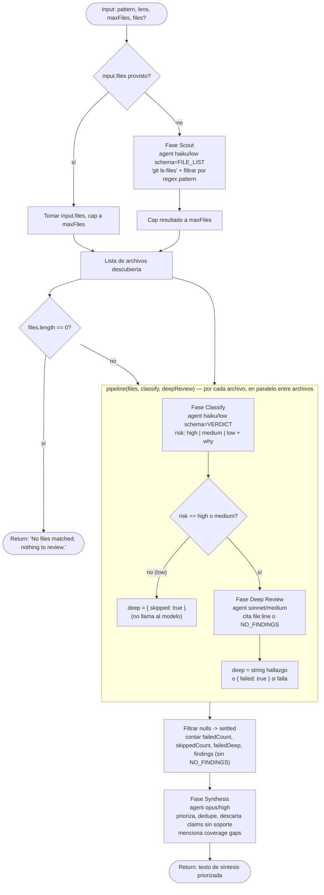

# scout-fanout

> Scout y luego fan-out adaptativo: clasifica el riesgo de cada archivo de forma barata, hace deep-review solo en los de riesgo alto/medio; los de bajo riesgo cortocircuitan.

## En 30 segundos

`scout-fanout` primero **descubre** qué archivos existen (`git ls-files` filtrado por un patrón, o una lista que le pases) y después gasta cómputo de forma desigual: clasifica el riesgo de cada archivo con un modelo barato, y solo hace deep-review en los que salen `high` o `medium`. Elegilo cuando tenés un árbol grande y revisar todo con el mismo esfuerzo sería caro, pero igual querés cobertura total (todo archivo se clasifica, aunque no todos se revisen a fondo).

## Cómo lanzarlo

```text
/workflow new mi-run --pattern=scout-fanout
```

Input típico (JSON pasado como `args` al workflow):

```json
{
  "pattern": "code",
  "lens": "security",
  "maxFiles": 40
}
```

Sin input, corre con los defaults (`pattern=code`, `lens=code`, `maxFiles=40`) y deja que el scout descubra los archivos vía `git ls-files`. Para saltar el scout y clasificar una lista puntual:

```json
{ "files": ["src/config.js", "src/router.js"], "lens": "security" }
```

## Diagrama



## Qué hace

`scout-fanout` es un workflow de "descubrir primero, gastar cómputo después" para revisar archivos de un repositorio. En vez de asumir de antemano qué archivos importan, primero **scoutea** el árbol (o usa una lista explícita provista por el usuario) para determinar el work-list real y su tamaño antes de comprometerse a nada costoso.

Cada archivo descubierto pasa por un `pipeline` de dos etapas con **profundidad adaptativa por ítem**: una clasificación de riesgo barata y rápida (modelo `haiku`, esfuerzo `low`) decide si el archivo vale una revisión profunda. Solo los archivos marcados `high` o `medium` avanzan a un deep-review real (modelo `sonnet`, esfuerzo `medium`) que cita hallazgos por `file:line`; los de riesgo `low` cortocircuitan sin gastar una llamada adicional. Esto es el patrón central: no todo el trabajo recibe el mismo presupuesto, el presupuesto se asigna donde el clasificador indica que hay señal.

Al final, una fase de síntesis (modelo `opus`, esfuerzo `high`) recibe todos los hallazgos deep-reviewed junto con métricas explícitas de cobertura (cuántos archivos totales, cuántos con hallazgos, cuántos se saltearon por bajo riesgo, cuántas ramas fallaron) y produce una lista priorizada, deduplicada, que además reporta los gaps de cobertura — nunca trata lo saltado/fallido como "limpio".

El scaffold está construido explícitamente como base para variantes de casos de uso (`repo-bug-hunt` está listado en el catálogo como derivado del mismo patrón scatter-gather con profundidad de pipeline añadida) y para reutilización con distintos "lens" (qué buscar) y "patterns" (qué archivos mirar).

## Cuándo usarlo

- Triage-y-luego-review de un árbol grande, donde revisar todo con el mismo esfuerzo sería caro.
- Pasadas de "clasificar y actuar" (classify-and-act): decidir rápido, actuar en profundidad solo donde corresponde.
- Migraciones grandes (large-migration) donde hay que cubrir muchos archivos pero solo unos pocos necesitan atención cara.
- Cuando se quiere **cobertura** (todo archivo es al menos clasificado) pero **gastar presupuesto solo donde paga** (deep-review solo en high/medium).
- Cuando el work-list no se conoce de antemano y hay que descubrirlo (`git ls-files` + regex) en vez de asumirlo.

**No usarlo cuando:**
- Ya se sabe exactamente qué se quiere revisar y en qué profundidad (no hace falta el paso de clasificación barata; un `agent` o `parallel` directo es más simple).
- Se necesita verificación adversarial/confirmación de bugs concretos (el catálogo sugiere `bug-verify` para eso; este scaffold produce "leads", no bugs confirmados).
- El conjunto es de tamaño desconocido y se necesita exhaustividad garantizada mediante rounds (ver `loop-until-dry`), no solo un pase único.

## Cómo funciona

**Setup (antes de las fases):**
- Parsea `args` a `input` (con fallback a `{}` si falla el JSON).
- Define helpers: `compact` (trunca datos largos a 60000 chars para prompts), `fence` (envuelve datos no confiables en un delimitador `<untrusted-HASH>` derivado de un hash FNV-like del contenido — no de `Math.random`/`Date.now`, que están prohibidos en el runtime — para que un payload malicioso no pueda falsificar el cierre), y `node(role, extra)` que resuelve overrides por rol (`model`, `effort`, `tools`, `skills`, `excludeTools`) con precedencia: override por rol > default global (`input.model`/`input.effort`/etc.) > default del call-site.
- Resuelve `pattern` (regex de qué archivos mirar) desde presets `PATTERNS` (`code`, `docs`, `web`, `config`, default `code`) o un string libre.
- Resuelve `lens` (qué buscar) desde presets `LENSES` (`code`, `security`, `prose`, default `code`) o un string libre.
- Clampa `maxFiles` a `[1, 200]`, default `40`.

**Fase 1 — Scout:** si `input.files` viene con contenido, se usa directamente (cortado a `maxFiles`, con log si se descartó exceso). Si no, se lanza un `agent()` con `schema: FILE_LIST` (modelo `haiku`, esfuerzo `low`) que corre `git ls-files`, filtra por el regex `pattern` **dentro del prompt** (nunca por interpolación de shell, para que `input.pattern` no pueda inyectar comandos) y devuelve hasta `maxFiles` paths como `{ files: [...] }`. El patrón se envuelve con `fence("topic", pattern)` y el prompt incluye instrucciones explícitas de tratar ese contenido como dato, no como instrucción (mitigación de prompt injection). Si `files.length === 0` tras el scout, el workflow retorna temprano: `"No files matched; nothing to review."`.

**Fase 2 — Classify (dentro de `pipeline`):** por cada archivo, un `agent()` con `schema: VERDICT` (modelo `haiku`, esfuerzo `low`, label `classify-{i}`) clasifica el riesgo de que ese archivo contenga lo que dicta `lens`, devolviendo `{ risk: "high"|"medium"|"low", why: "..." }`. El contenido del archivo (path) va fenced como dato no confiable.

**Fase 3 — Deep Review (segundo stage del mismo `pipeline`):** el gate de decisión mira `verdict.risk`. Si es `low`, no se llama a ningún modelo: se asigna `deep: { skipped: true }` (el cortocircuito que ahorra costo). Si es `high` o `medium`, se lanza un `agent()` (modelo `sonnet`, esfuerzo `medium`, label `deep-{i}`) que hace la revisión profunda citando `file:line`, o devuelve `NO_FINDINGS` si no hay hallazgos. Si el agente falla (`output == null`), se marca `deep: { failed: true }` en vez de perder el ítem.

**Post-pipeline:** se filtran nulls (`settled`), se cuentan `failedCount` (ítems totalmente perdidos), `skippedCount` (bajo riesgo), `failedDeep` (deep-review falló) y `findings` (deep-reviews que no dijeron `NO_FINDINGS`). Se construye una línea de `coverage` con estos números.

**Fase 4 — Synthesis:** un `agent()` final (modelo `opus`, esfuerzo `high`) recibe la línea de coverage, los `findings` (compactados a 60000 chars con `compact()`) fenced como dato, y la instrucción explícita de no tratar los archivos saltados/fallidos como limpios. Produce el texto final: hallazgos priorizados, deduplicados, sin claims sin soporte, con mención de gaps de cobertura.

**Manejo de fallos parciales:** cada etapa del pipeline maneja `null`/error explícitamente (`.then((v) => v == null ? null : ...)` en classify; `{ failed: true }` en deep-review) en vez de dejar que un fallo tumbe todo el fan-out; esos fallos se cuentan y reportan en la síntesis, no se ocultan.

**Caching:** el scaffold no implementa caching explícito (no hay `readArtifact`/hash de reuso visible); cada corrida re-scoutea y re-clasifica.

## Input y output

| Campo | Tipo | Default | Notas |
|---|---|---|---|
| `files` | `string[]` | — | Si viene con contenido, salta el scout; se corta a `maxFiles`. |
| `pattern` | `string` | `PATTERNS.code` = `\.(ts\|tsx\|js\|jsx\|py\|go\|rs)$` | Preset (`code`\|`docs`\|`web`\|`config`) o regex libre. |
| `lens` | `string` | `LENSES.code` | Preset (`code`\|`security`\|`prose`) o texto libre describiendo qué buscar. |
| `maxFiles` | `number` | `40` | Clamp `[1, 200]`. |
| `model` / `effort` | `string` | — | Defaults globales aplicados a todo nodo sin override específico. |
| `models[role]` / `efforts[role]` | `object` | — | Override por rol (`scout`, `classify`, `deep`, `synthesis`). |
| `tools` / `toolsByRole[role]` | `array` | — | Igual patrón de precedencia. |
| `skills` / `skillsByRole[role]` | `array` | — | Igual patrón de precedencia. |
| `excludeTools` / `excludeByRole[role]` | `array` | — | Igual patrón de precedencia. |

**Output:** el `return` del workflow es el texto de síntesis (string) del `agent` final de la fase Synthesis, o el string temprano `"No files matched; nothing to review."` si el scout no encontró nada.

**Artifacts:** el código no llama a `writeArtifact` en ningún punto; no persiste artifacts propios más allá del valor de retorno y los `log()` intermedios (conteo de archivos scouteados, files deep-reviewed con hallazgos, caps aplicados).

## Fases

1. **Scout** — descubre el work-list real (vía `git ls-files` filtrado por `pattern`, o usa `input.files`), capado a `maxFiles`.
2. **Classify** — clasificación barata de riesgo (`high`/`medium`/`low` + motivo) por archivo, dentro del `pipeline`.
3. **Deep Review** — revisión profunda solo para archivos `high`/`medium`; los `low` cortocircuitan sin costo adicional.
4. **Synthesis** — deduplica y prioriza los hallazgos, descarta claims sin soporte, y reporta explícitamente los gaps de cobertura (skipped/failed).
