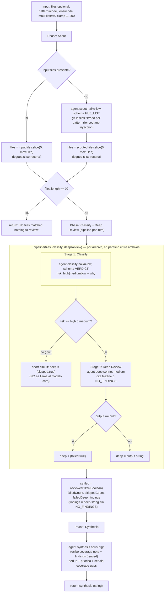

# scout-fanout

> Scout y luego fan-out dinámico vía pipeline: clasifica el riesgo de cada archivo (barato), y solo hace deep-review de los de riesgo alto/medio; low-risk corta camino.

## En 30 segundos

Es el patrón para cuando querés cubrir un árbol de archivos entero pero no querés pagar una revisión profunda por cada uno. Un agente scout descubre el work-list real (no lo asumís vos), y después cada archivo pasa por un pipeline de dos pasos: una clasificación de riesgo barata y rápida, y solo si esa clasificación sale `high` o `medium`, una revisión profunda. Los archivos `low` cortan camino sin gastar el modelo caro. Elegilo cuando el volumen es grande pero solo una fracción va a resultar interesante.

## Cómo lanzarlo

```text
/workflow new mi-run --pattern=scout-fanout
/workflow run mi-run {"pattern":"config","lens":"security","maxFiles":40}
```

Todos los campos de `input` son opcionales. Sin `input.files`, el scout descubre los archivos vía `git ls-files` filtrado por `pattern`; si pasás `input.files` (array de paths), se usa directamente y el scout se salta. Ver la tabla completa en [Input y output](#input-y-output).

## Diagrama



## Qué hace

`scout-fanout` combina descubrimiento dinámico del work-list con profundidad adaptativa por item: en vez de asumir de antemano qué archivos importan, un scout los descubre en runtime (`git ls-files` filtrado por un patrón), y en vez de aplicar la misma revisión cara a todos, cada archivo pasa primero por una clasificación de riesgo barata que decide si vale la pena el paso caro. Los archivos de riesgo `low` cortan camino inmediatamente después de la clasificación, sin invocar el modelo de deep-review.

El componente dinámico central es el `pipeline(files, classifyStage, deepReviewStage)`: cada archivo fluye por sus propias dos etapas de forma independiente, y la segunda etapa (deep review) es condicional al resultado de la primera — es branching por item, no un fan-out uniforme. Esto es lo que el propio código llama "adaptive depth": gastar más solo donde paga.

Al final, una fase de síntesis toma todos los hallazgos de deep-review (descartando los `skipped`/`failed`), los deduplica y prioriza, y explícitamente advierte sobre cobertura parcial: los archivos saltados o fallidos NO se tratan como "limpios", se reportan como gaps de cobertura.

## Cuándo usarlo

- Triage-then-review de un árbol grande de archivos (catálogo: "Triage-then-review a large tree").
- Pasadas de clasificar-y-actuar donde la acción cara solo aplica a un subconjunto (catálogo: "classify-and-act").
- Migraciones grandes donde interesa gastar presupuesto solo donde paga (catálogo: "large-migration", "Spend budget only where it pays").
- **No usarlo** si ya sabés que TODOS los archivos necesitan revisión profunda (no hay ahorro por el corte de riesgo bajo) — ahí conviene un fan-out uniforme como `fan-out-and-synthesize` o `repo-bug-hunt`.
- **No usarlo** si el corpus es tan grande que ni siquiera cabe describir cada archivo en un prompt de síntesis — ahí conviene `map-reduce` (reduce jerárquico) en vez de una síntesis plana al final.

## Cómo funciona

**Fase Scout.** Si `input.files` viene como array no vacío, se usa directamente (recortado a `maxFiles`, logueando el descarte si excede). Si no, se lanza un `agent` en rol `scout` (modelo `haiku`, effort `low`, `schema: FILE_LIST`) que corre `git ls-files` y filtra por el regex de `pattern` (uno de los presets `code`/`docs`/`web`/`config`, o un regex libre) — el filtrado ocurre DENTRO del prompt del agente, nunca por interpolación de shell, así `input.pattern` no puede inyectar comandos. El patrón/tema se envuelve en `fence()` (delimitador derivado de un hash del contenido, anti-inyección) con instrucciones explícitas de tratar el contenido como dato, nunca como instrucción. El resultado se recorta a `maxFiles` (loguea si recorta). Si el work-list queda vacío, retorna inmediatamente `"No files matched; nothing to review."`.

**Fase Classify + Deep Review (pipeline).** Se llama `pipeline(files, classifyStage, deepReviewStage)`, que corre cada archivo por sus dos stages, en paralelo entre archivos.
- Stage 1 (`classify`, rol `classify`, modelo `haiku`, effort `low`, `schema: VERDICT`): pide un veredicto rápido `{ risk: high|medium|low, why }` sobre si el archivo probablemente contiene lo que busca `lens` (presets `code`/`security`/`prose`, o texto libre). El contenido del archivo (path) va fenced anti-inyección.
- Stage 2 (`deepReview`, condicional): si `risk` no es `high` ni `medium`, corta camino con `{ skipped: true }` — no llama al modelo caro. Si es `high`/`medium`, lanza un `agent` en rol `deep` (modelo `sonnet`, effort `medium`) que pide citar `file:line` por cada hallazgo o responder `NO_FINDINGS`, pasando también el `why` de la clasificación como contexto (`trace`), ambos fenced.
Si el output del deep-review es `null` (fallo del agente), se marca `{ failed: true }` en vez de propagar la excepción — el fallo de un archivo no aborta el pipeline entero.

**Post-pipeline.** `settled = reviewed.filter(Boolean)` descarta entradas nulas del `pipeline` mismo. Se calculan `failedCount` (diferencia entre lo devuelto y lo settled), `skippedCount` (deep.skipped), `failedDeep` (deep.failed), y `findings` (solo strings de deep-review que NO contienen `NO_FINDINGS`).

**Fase Synthesis.** Un `agent` en rol `synthesis` (modelo `opus`, effort `high`) recibe una nota de cobertura explícita (`coverage`: total de archivos, cuántos con hallazgos, cuántos low-risk/limpios saltados, cuántos branches fallidos) más los `findings` compactados (`compact()`, cap de 60000 chars) dentro de un fence anti-inyección. Se le pide deduplicar, descartar afirmaciones sin soporte, priorizar por severidad, y mencionar explícitamente cualquier gap de cobertura (saltados o fallidos NO son "limpios"). El resultado de esta síntesis es el retorno final del workflow.

**Manejo de fallos parciales:** cada etapa del `agent` puede devolver `null` (por ejemplo por error interno); el código lo convierte en `{ skipped: true }` o `{ failed: true }` en vez de propagar la excepción, y los conteos correspondientes se loguean y se pasan a la síntesis como contexto de cobertura explícito.

**Caching:** no se observa ningún mecanismo explícito de caché en el código; cada llamada a `agent` es fresca.

## Input y output

| Campo | Tipo | Requerido | Default / clamp |
|---|---|---|---|
| `files` | string[] | no | si se omite, se descubre vía scout (`git ls-files` + `pattern`) |
| `pattern` | string | no | preset `code`\|`docs`\|`web`\|`config`, o regex libre; default `code` (`\.(ts\|tsx\|js\|jsx\|py\|go\|rs)$`) |
| `lens` | string | no | preset `code`\|`security`\|`prose`, o texto libre; default `code` |
| `maxFiles` | number | no | default 40, clamp 1..200 |
| `model` / `effort` | string | no | override global para todo nodo |
| `models[role]` / `efforts[role]` | object | no | override por rol (`scout`, `classify`, `deep`, `synthesis`); precedencia: por-rol > global > default del call-site |
| `tools` / `skills` / `excludeTools` (y variantes `*ByRole`) | array | no | pasados al `agent` si son arrays |

**Output:** un string (el texto de la síntesis final), o el mensaje literal `"No files matched; nothing to review."` si el work-list quedó vacío tras el scout.

No se observan llamadas a `writeArtifact` en este scaffold: toda la observabilidad pasa por `log(...)` (archivos scouteados, recortes por `maxFiles`, conteo deep-reviewed vs. total) y por el string de retorno.

## Fases

1. **Scout** — descubre el work-list: usa `input.files` tal cual, o lanza un agente que corre `git ls-files` filtrado por `pattern`; aplica el cap `maxFiles` y loguea recortes.
2. **Classify** — un `agent` clasificador (haiku·low) por archivo, dentro del pipeline, que asigna `risk: high|medium|low` según `lens`.
3. **Deep Review** — solo para archivos `high`/`medium`: un `agent` revisor (sonnet·medium) que cita hallazgos `file:line` o responde `NO_FINDINGS`; los `low` cortan camino sin este paso.
4. **Synthesis** — un `agent` (opus·high) deduplica y prioriza los hallazgos, señalando explícitamente cualquier gap de cobertura (saltados o fallidos).
