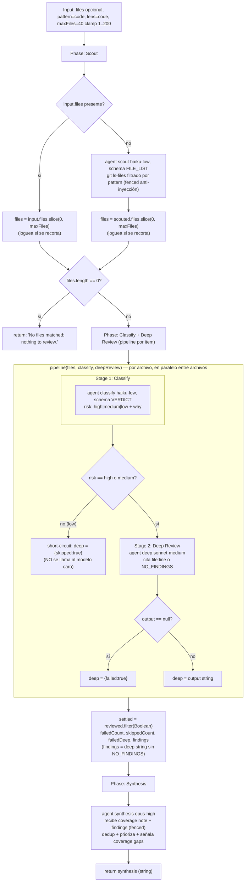

# scout-fanout

> Scout y luego fan-out dinámico vía pipeline: clasifica el riesgo de cada archivo (barato), y solo hace deep-review de
> los de riesgo alto/medio; low-risk corta camino.

## En 30 segundos

Sirve para auditar árboles grandes de archivos sin pagar revisión profunda por cada uno. Primero un scout descubre el
work-list real; después cada archivo pasa por dos pasos: una clasificación barata y, solo si el riesgo sale `high` o
`medium`, una deep review. Los archivos `low` cortan camino. Elegilo cuando querés cobertura amplia pero el presupuesto
caro debe ir solo a los casos prometedores.

## Cómo lanzarlo

```text
/workflow new mi-run --pattern=scout-fanout
/workflow run mi-run {"pattern":"config","lens":"security","maxFiles":40}
```

Todos los campos de `input` son opcionales. Sin `input.files`, el scout descubre los archivos vía `git ls-files`
filtrado por `pattern`; si pasás `input.files` (array de paths), se usa directamente y el scout se salta. Ver la tabla
completa en [Input y output](#input-y-output).

## Diagrama



## Qué hace

`scout-fanout` combina descubrimiento dinámico del work-list con profundidad adaptativa por archivo. No asume de
antemano qué paths importan: el scout los descubre en runtime con `git ls-files` filtrado por `pattern`. Después, cada
archivo recibe una clasificación barata; solo los de riesgo `high` o `medium` pagan deep review. Los archivos `low` se
resuelven sin gastar el modelo caro.

El branching es por item, no uniforme: cada archivo sigue su propia rama dentro de
`pipeline(files, classifyStage, deepReviewStage)`. Eso es la profundidad adaptativa que implementa el scaffold: gastar
más solo donde hay señal.

Al final, una fase de síntesis reúne los hallazgos de deep review, los deduplica y prioriza, y marca explícitamente
cualquier gap de cobertura. Los archivos saltados o con fallo NO se tratan como "limpios".

## Cuándo usarlo

| Situación                                                  | Elegirlo | Motivo                                                             |
| ---------------------------------------------------------- | -------- | ------------------------------------------------------------------ |
| Querés revisar un árbol grande de archivos                 | Sí       | el scout descubre el work-list real en runtime                     |
| La acción cara solo aplica a una parte del corpus          | Sí       | la clasificación barata corta camino en `low`                      |
| Ya sabés que TODOS los archivos requieren deep review      | No       | no hay ahorro; conviene `fan-out-and-synthesize` o `repo-bug-hunt` |
| El corpus es tan grande que no entra en una síntesis plana | No       | conviene `map-reduce`                                              |

- Triage-then-review de un árbol grande de archivos (catálogo: "Triage-then-review a large tree").
- Pasadas de clasificar-y-actuar donde la acción cara solo aplica a un subconjunto (catálogo: "classify-and-act").
- Migraciones grandes donde interesa gastar presupuesto solo donde paga (catálogo: "large-migration", "Spend budget only
  where it pays").

## Cómo funciona

**Fase Scout.** Si `input.files` viene como array no vacío, se usa directamente y se recorta a `maxFiles` si hace falta,
logueando el descarte. Si no, se lanza un `agent` en rol `scout` (modelo `haiku`, effort `low`, `schema: FILE_LIST`) que
corre `git ls-files` y filtra por el regex de `pattern` (preset `code`/`docs`/`web`/`config`, o regex libre). Ese
filtrado vive dentro del prompt del agente, no en una interpolación de shell, así `input.pattern` no puede inyectar
comandos. El patrón se envuelve en `fence()` con tratamiento explícito de datos no confiables. Si el work-list queda
vacío, retorna de una vez `"No files matched; nothing to review."`.

**Fase Classify + Deep Review (pipeline).** Se llama `pipeline(files, classifyStage, deepReviewStage)`, que procesa cada
archivo por sus dos stages, en paralelo entre archivos.

- **Stage 1 (`classify`)**: rol `classify`, modelo `haiku`, effort `low`, `schema: VERDICT`. Devuelve un veredicto
  rápido `{ risk: high|medium|low, why }` sobre si el archivo probablemente contiene lo que busca `lens` (preset
  `code`/`security`/`prose`, o texto libre). El path va fenced anti-inyección.
- **Stage 2 (`deepReview`)**: si `risk` no es `high` ni `medium`, corta camino con `{ skipped: true }` y no llama al
  modelo caro. Si es `high` o `medium`, lanza un `agent` en rol `deep` (modelo `sonnet`, effort `medium`) que pide citar
  `file:line` por hallazgo o responder `NO_FINDINGS`, usando también el `why` de la clasificación como contexto
  (`trace`), ambos fenced. Si el output del deep review es `null`, se marca `{ failed: true }` en vez de propagar la
  excepción. El fallo de un archivo no aborta el pipeline entero.

**Post-pipeline.** `settled = reviewed.filter(Boolean)` descarta entradas nulas. Después se calculan `failedCount`,
`skippedCount`, `failedDeep` y `findings` (solo strings de deep review que no contienen `NO_FINDINGS`).

**Fase Synthesis.** Un `agent` en rol `synthesis` (modelo `opus`, effort `high`) recibe una nota de cobertura explícita
(`coverage`: total de archivos, cuántos con hallazgos, cuántos low-risk/limpios saltados, cuántos branches fallidos) más
los `findings` compactados (`compact()`, cap de 60000 chars) dentro de un fence anti-inyección. Se le pide deduplicar,
descartar afirmaciones sin soporte, priorizar por severidad y mencionar cualquier gap de cobertura. Los archivos
saltados o fallidos NO son "limpios".

**Manejo de fallos parciales.** Cada etapa del `agent` puede devolver `null` por error interno; el código lo convierte
en `{ skipped: true }` o `{ failed: true }`, y los conteos se loguean y se pasan a la síntesis como cobertura explícita.

**Caching.** No se observa ningún mecanismo explícito de caché en el código; cada llamada a `agent` es fresca.

## Input y output

| Campo                                            | Tipo     | Requerido | Default / clamp                                                                                                    |
| ------------------------------------------------ | -------- | --------- | ------------------------------------------------------------------------------------------------------------------ |
| `files`                                          | string[] | no        | si se omite, se descubre vía scout (`git ls-files` + `pattern`)                                                    |
| `pattern`                                        | string   | no        | preset `code`\|`docs`\|`web`\|`config`, o regex libre; default `code` (`\.(ts\|tsx\|js\|jsx\|py\|go\|rs)$`)        |
| `lens`                                           | string   | no        | preset `code`\|`security`\|`prose`, o texto libre; default `code`                                                  |
| `maxFiles`                                       | number   | no        | default 40, clamp 1..200                                                                                           |
| `model` / `effort`                               | string   | no        | override global para todo nodo                                                                                     |
| `models[role]` / `efforts[role]`                 | object   | no        | override por rol (`scout`, `classify`, `deep`, `synthesis`); precedencia: por-rol > global > default del call-site |
| `tools` / `skills` / `excludeTools`              | array    | no        | pasados al `agent` si son arrays                                                                                   |
| `toolsByRole` / `skillsByRole` / `excludeByRole` | object   | no        | overrides por rol (`role → array`)                                                                                 |

**Output:** un string (el texto de la síntesis final), o el mensaje literal `"No files matched; nothing to review."` si
el work-list quedó vacío tras el scout.

No se observan llamadas a `writeArtifact` en este scaffold: toda la observabilidad pasa por `log(...)` (archivos
scouteados, recortes por `maxFiles`, conteo deep-reviewed vs. total) y por el string de retorno.

## Fases

1. **Scout** — descubre el work-list: usa `input.files` tal cual, o lanza un agente que corre `git ls-files` filtrado
   por `pattern`; aplica el cap `maxFiles` y loguea recortes.
2. **Classify** — un `agent` clasificador (haiku·low) por archivo, dentro del pipeline, que asigna
   `risk: high|medium|low` según `lens`.
3. **Deep Review** — solo para archivos `high`/`medium`: un `agent` revisor (sonnet·medium) que cita hallazgos
   `file:line` o responde `NO_FINDINGS`; los `low` cortan camino sin este paso.
4. **Synthesis** — un `agent` (opus·high) deduplica y prioriza los hallazgos, señalando explícitamente cualquier gap de
   cobertura (saltados o fallidos).
