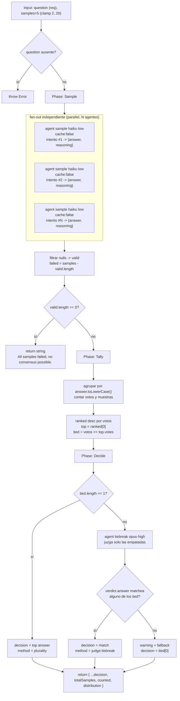

# self-consistency

> Muestrea N caminos de razonamiento independientes y decide por consenso, no por una sola ruta (arXiv:2203.11171).

## En 30 segundos

Este patrón sirve cuando una sola cadena de pensamiento puede fallar, sobre todo en lógica, matemática y juicio. Lanza
varias muestras independientes sobre la misma pregunta, cuenta votos sobre la respuesta normalizada y, si hay empate,
usa un juez más capaz para desempatar. Elegilo cuando te importa medir el margen de consenso, no solo obtener una
respuesta.

## Cómo lanzarlo

```text
/workflow new mi-run --pattern=self-consistency
/workflow run mi-run {"question":"Does this code path leak the handle?","samples":7}
```

`question` (alias `q`/`text`) es el único campo obligatorio. `samples` es opcional y se ajusta a `2..20` (default: `5`).

## Diagrama



## Qué hace

`self-consistency` implementa el patrón del paper homónimo (Wang et al., arXiv:2203.11171): en vez de confiar en un
único chain-of-thought, dispara `samples` intentos de razonamiento totalmente independientes sobre la misma pregunta.
Cada muestra devuelve una respuesta final normalizada a una forma canónica corta más su razonamiento.

La diferencia frente a `fan-out-and-synthesize` es que acá no se arma un resumen mezclado: se **cuentan votos** sobre un
campo de respuesta estructurado y se reporta el margen de consenso. Así, un 5/5 y un 2/2/1 quedan distinguibles. Si hay
empate, no se resuelve a dedo: se delega a un juez de mayor capacidad que pesa evidencia solo entre las respuestas
empatadas.

Es el contraparte de consenso de `adversarial-verify` (que poda una afirmación por mayoría de refutación):
`self-consistency` se usa para **acordar** una respuesta; `adversarial-verify`, para **refutar** una afirmación puntual.

## Cuándo usarlo

| Situación                                                                         | Patrón                   |
| --------------------------------------------------------------------------------- | ------------------------ |
| La respuesta corta puede variar mucho entre intentos (lógica, matemática, juicio) | `self-consistency`       |
| La salida es larga o no se puede normalizar a una cadena corta                    | `fan-out-and-synthesize` |
| Quieres refutar una afirmación concreta                                           | `adversarial-verify`     |

Úsalo cuando te importe medir cuánta coincidencia hay entre varios razonamientos independientes. No lo uses si la tarea
no tiene una respuesta canónica corta: ahí el voto deja de ser una señal útil.

## Cómo funciona

**Validación de entrada.** `question` (o `q`/`text`) es obligatorio; si falta, el workflow lanza `Error`. `samples` se
convierte a entero y se clampa a `[2, 20]`; si el valor pedido se recorta, se registra con `log(...)`.

**Sample.** Lanza `samples` llamadas a `agent` en `parallel`, todas en el rol `sample` (`haiku`, `low`) y con
`cache: false`. Cada prompt pide razonar paso a paso, normalizar la respuesta final y trata el contenido de la pregunta
como datos dentro de `fence("topic", ...)`.

**Tally.** Filtra los `null` de las muestras fallidas, cuenta votos por `answer.toLowerCase()`, ordena por cantidad de
votos y registra un resumen con líder, votos y empate.

**Decide.** Si hay un único líder, gana por `plurality`. Si hay empate, un `agent` `tiebreak` (`opus`, `high`) elige
entre las respuestas empatadas; si devuelve una respuesta fuera de la lista, se usa `tied[0]` como fallback seguro.

**Observabilidad.** No hay `writeArtifact`: la trazabilidad vive en `log(...)` y en el shape de retorno.

## Input y output

| Campo                                            | Tipo   | Requerido | Default / clamp                                                                                |
| ------------------------------------------------ | ------ | --------- | ---------------------------------------------------------------------------------------------- |
| `question` (alias `q`, `text`)                   | string | sí        | —; si falta, `throw new Error`                                                                 |
| `samples`                                        | number | no        | default `5`, clamp `2..20`                                                                     |
| `model` / `effort`                               | string | no        | override global para todos los nodos                                                           |
| `models[role]` / `efforts[role]`                 | object | no        | override por rol (`sample`, `tiebreak`); precedencia: por rol > global > default del call-site |
| `tools` / `skills` / `excludeTools`              | array  | no        | arrays globales pasados a `agent`                                                              |
| `toolsByRole` / `skillsByRole` / `excludeByRole` | object | no        | mapas por rol; cada valor útil debe ser un array                                               |

**Salida normal:** `{ answer, votes, method, totalSamples, counted, distribution, tiedAmong? }`

- `answer`: respuesta consensuada final.
- `votes`: votos del líder original; si hubo empate y el juez eligió otra respuesta, este número sigue siendo el del
  líder.
- `method`: `"plurality"` o `"judge-tiebreak"`.
- `tiedAmong`: solo aparece si hubo empate.
- `distribution`: `[{ answer, votes, samples }]`, con los índices de muestra que votaron cada respuesta.

**Salida de fallo total:** la cadena `"All samples failed; no consensus possible."`.

## Fases

1. **Sample** — `samples` agentes independientes (`haiku·low`, `cache:false`) razonan la misma pregunta por separado y
   devuelven `{ answer, reasoning }`.
2. **Tally** — agrupa respuestas equivalentes por clave en minúsculas y cuenta votos y muestras asociadas.
3. **Decide** — gana por pluralidad si no hay empate; si lo hay, un juez (`opus·high`) elige entre las empatadas con
   fallback seguro si responde fuera de lista.
